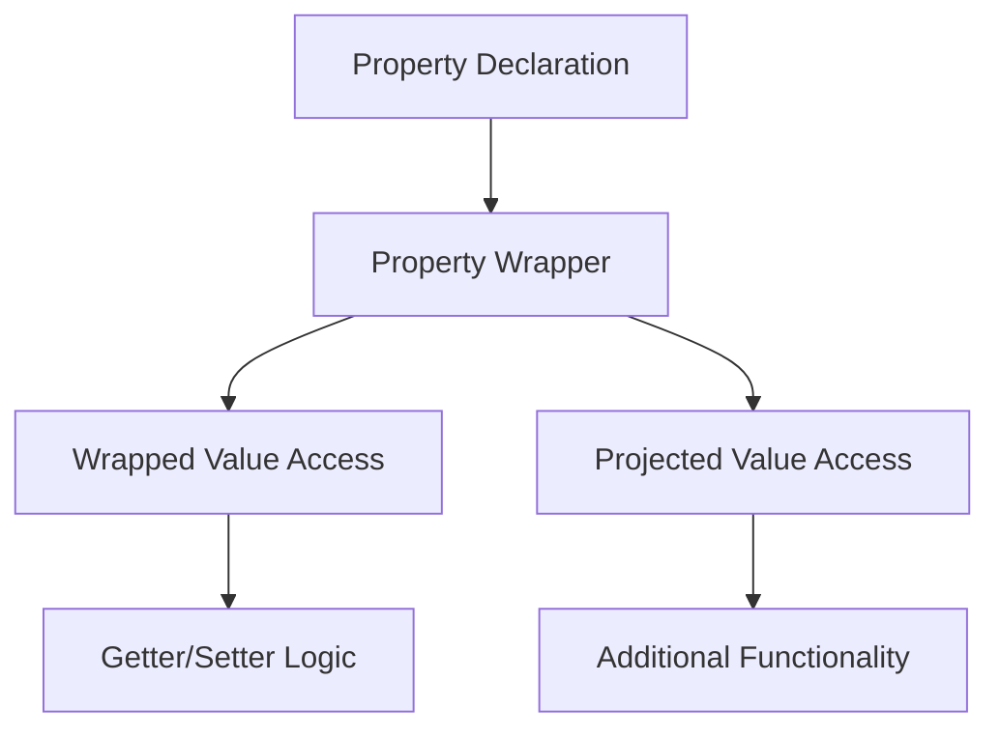

## 8.8 Property Wrappers for Reusable Logic

### Intent

Property wrappers in Swift are a powerful feature designed to encapsulate common property logic, such as validation, synchronization, or transformation, thereby reducing boilerplate and improving code reuse. By using property wrappers, developers can abstract repetitive logic into reusable components, making code cleaner and more maintainable.

### Implementing Property Wrappers in Swift

Property wrappers in Swift allow you to define a custom behavior for a property. They are defined using the `@propertyWrapper` attribute and can be applied to any property in your code.

#### Creating a Wrapper

To create a property wrapper, you start by defining a struct, class, or enum with the `@propertyWrapper` attribute. The core requirement is to implement a `wrappedValue` property, which represents the actual value being wrapped.

```swift
@propertyWrapper
struct Capitalized {
    private var value: String = ""
    
    var wrappedValue: String {
        get { value }
        set { value = newValue.capitalized }
    }
}
```

In this example, the `Capitalized` property wrapper ensures that any string assigned to it is automatically capitalized.

#### Wrapped Value

The `wrappedValue` property is the centerpiece of a property wrapper. It defines how the value is stored and accessed. You can implement custom logic in the getter and setter to modify the behavior of the property.

```swift
@propertyWrapper
struct Clamped {
    private var value: Int
    private let range: ClosedRange<Int>
    
    var wrappedValue: Int {
        get { value }
        set { value = min(max(newValue, range.lowerBound), range.upperBound) }
    }
    
    init(wrappedValue: Int, range: ClosedRange<Int>) {
        self.range = range
        self.value = min(max(wrappedValue, range.lowerBound), range.upperBound)
    }
}
```

The `Clamped` property wrapper restricts an integer value to a specified range, ensuring it never exceeds the bounds.

#### Projecting Values

Sometimes, you might want to expose additional functionality or state beyond the `wrappedValue`. This is where `projectedValue` comes into play. By defining a `projectedValue`, you can provide extra capabilities to the users of your property wrapper.

```swift
@propertyWrapper
struct Logged<T> {
    private var value: T
    private(set) var projectedValue: [T] = []
    
    var wrappedValue: T {
        get { value }
        set {
            projectedValue.append(newValue)
            value = newValue
        }
    }
    
    init(wrappedValue: T) {
        self.value = wrappedValue
    }
}
```

In this `Logged` wrapper, every time the value changes, the change is logged in the `projectedValue` array.

#### Using Wrappers

To use a property wrapper, simply apply it to a property with the `@` syntax. Here's how you might use the `Capitalized` and `Clamped` wrappers:

```swift
struct User {
    @Capitalized var name: String
    @Clamped(range: 0...100) var age: Int
}

var user = User(name: "john doe", age: 105)
print(user.name) // Outputs: "John Doe"
print(user.age)  // Outputs: 100
```

### Use Cases and Examples

Property wrappers can be applied in a variety of scenarios to simplify and enhance your codebase.

#### Data Validation

One common use case for property wrappers is data validation. You can ensure that values meet certain criteria before they are accepted.

```swift
@propertyWrapper
struct ValidatedEmail {
    private var email: String = ""
    
    var wrappedValue: String {
        get { email }
        set {
            if isValidEmail(newValue) {
                email = newValue
            } else {
                print("Invalid email address")
            }
        }
    }
    
    private func isValidEmail(_ email: String) -> Bool {
        // Simple regex for demonstration purposes
        let regex = "[A-Z0-9a-z._%+-]+@[A-Za-z0-9.-]+\\.[A-Za-z]{2,}"
        return NSPredicate(format: "SELF MATCHES %@", regex).evaluate(with: email)
    }
}
```

This `ValidatedEmail` wrapper ensures that only valid email addresses are stored.

#### Lazy Initialization

Property wrappers can also be used to implement lazy initialization, delaying the creation of expensive resources until they are actually needed.

```swift
@propertyWrapper
struct Lazy<Value> {
    private var storage: (() -> Value)?
    private var value: Value?
    
    var wrappedValue: Value {
        mutating get {
            if let value = value {
                return value
            } else if let storage = storage {
                let value = storage()
                self.value = value
                self.storage = nil
                return value
            }
            fatalError("Lazy value not initialized")
        }
    }
    
    init(initializer: @escaping () -> Value) {
        self.storage = initializer
    }
}
```

With the `Lazy` wrapper, you can defer the initialization of a property until it is first accessed.

#### Thread Safety

For properties that require synchronized access in a multithreaded environment, property wrappers can provide a neat solution.

```swift
@propertyWrapper
class Synchronized<Value> {
    private var value: Value
    private let queue = DispatchQueue(label: "synchronized.queue")
    
    var wrappedValue: Value {
        get {
            return queue.sync { value }
        }
        set {
            queue.sync { value = newValue }
        }
    }
    
    init(wrappedValue: Value) {
        self.value = wrappedValue
    }
}
```

The `Synchronized` wrapper ensures that access to the property is thread-safe.

### Visualizing Property Wrappers

To better understand how property wrappers work, let's visualize the flow of data using a simple diagram.



**Diagram Description**: This flowchart illustrates the process of using a property wrapper. The property declaration is linked to the property wrapper, which manages both the wrapped value and any projected values. The wrapped value is accessed through getter/setter logic, while the projected value provides additional functionality.

### References and Links

- [Swift.org: Property Wrappers](https://swift.org/blog/property-wrappers/)
- [Apple Developer Documentation: Property Wrappers](https://developer.apple.com/documentation/swift/property_wrappers)

### Knowledge Check

To reinforce your understanding of property wrappers, consider these questions:

- How would you implement a property wrapper that automatically logs changes to a property?
- What are the benefits of using property wrappers for data validation?
- How can property wrappers improve thread safety in a Swift application?

### Try It Yourself

Experiment with the provided examples by modifying the wrappers to add new features or constraints. For instance, try creating a property wrapper that limits a string's length or one that encrypts and decrypts data on the fly.

### Embrace the Journey

Remember, mastering property wrappers is just one step in your journey to becoming a proficient Swift developer. Keep exploring, experimenting, and learning new patterns to enhance your development skills.

## Quiz Time!



### What is the primary purpose of property wrappers in Swift?

- [x] To encapsulate common property logic and reduce boilerplate.
- [ ] To replace classes and structs.
- [ ] To provide a new syntax for defining properties.
- [ ] To improve the performance of Swift applications.

> **Explanation:** Property wrappers encapsulate common logic, reducing boilerplate and enhancing code reuse.

### How do you define a property wrapper in Swift?

- [x] By using the `@propertyWrapper` attribute.
- [ ] By using the `@wrapper` attribute.
- [ ] By subclassing `PropertyWrapper`.
- [ ] By implementing the `WrapperProtocol`.

> **Explanation:** The `@propertyWrapper` attribute is used to define a property wrapper in Swift.

### What is the role of the `wrappedValue` in a property wrapper?

- [x] It represents the actual value being wrapped.
- [ ] It stores metadata about the property.
- [ ] It initializes the property wrapper.
- [ ] It projects additional values.

> **Explanation:** The `wrappedValue` property is the core of a property wrapper, representing the value being managed.

### How can you expose additional functionality in a property wrapper?

- [x] By using the `projectedValue`.
- [ ] By defining a `supplementaryValue`.
- [ ] By implementing the `extraValue` method.
- [ ] By subclassing the wrapper.

> **Explanation:** The `projectedValue` allows you to expose additional functionality or state in a property wrapper.

### Which of the following is a valid use case for property wrappers?

- [x] Data validation
- [x] Lazy initialization
- [x] Thread safety
- [ ] Replacing inheritance

> **Explanation:** Property wrappers are useful for data validation, lazy initialization, and ensuring thread safety.

### What does the `Lazy` property wrapper do?

- [x] Delays the creation of a resource until it is needed.
- [ ] Automatically capitalizes strings.
- [ ] Validates email addresses.
- [ ] Synchronizes access to a property.

> **Explanation:** The `Lazy` property wrapper defers the initialization of a property until it is accessed.

### How does the `Synchronized` property wrapper ensure thread safety?

- [x] By using a `DispatchQueue` to synchronize access.
- [ ] By locking the entire class.
- [ ] By using atomic properties.
- [ ] By duplicating the data.

> **Explanation:** The `Synchronized` wrapper uses a `DispatchQueue` to manage thread-safe access to a property.

### Can property wrappers be used with classes, structs, and enums?

- [x] True
- [ ] False

> **Explanation:** Property wrappers can be applied to properties in classes, structs, and enums.

### What attribute is used to define a property wrapper?

- [x] `@propertyWrapper`
- [ ] `@wrapper`
- [ ] `@property`
- [ ] `@wrap`

> **Explanation:** The `@propertyWrapper` attribute is used to define a property wrapper.

### Which property wrapper would you use to ensure a value stays within a specific range?

- [x] `Clamped`
- [ ] `Lazy`
- [ ] `Capitalized`
- [ ] `Synchronized`

> **Explanation:** The `Clamped` property wrapper restricts a value to a specified range.


