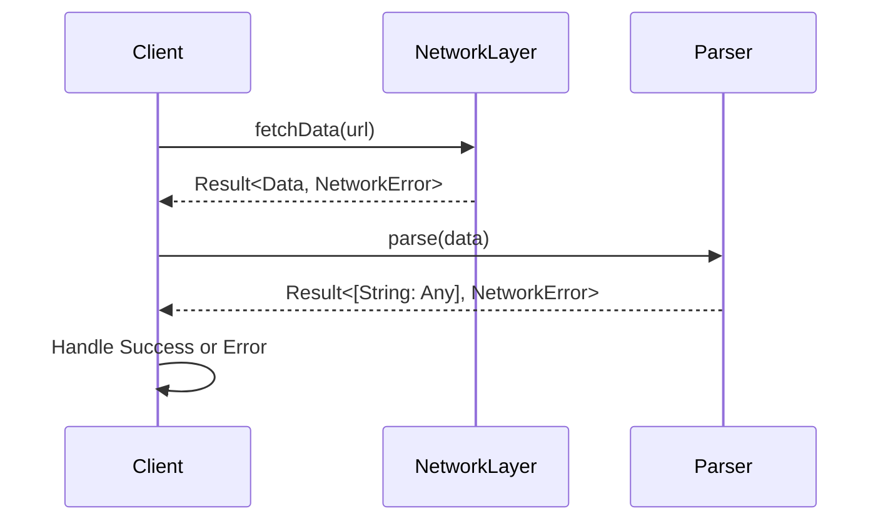

## 8.9 Result Types and Error Handling Patterns

In Swift, handling errors effectively is crucial for building robust applications. The introduction of the `Result` type in Swift 5 has provided developers with a powerful tool to manage success and failure in a unified manner. This section will guide you through understanding and implementing Result types, mapping and flat-mapping operations, creating custom error types, and integrating with asynchronous code. We'll also explore practical use cases such as network requests, parsing, and API design.

### Intent

The primary intent of Result types and error handling patterns in Swift is to encapsulate success and failure in a single construct, making error handling more explicit and functional. This approach improves code readability, maintainability, and predictability.

### Implementing Result Types in Swift

#### Using the `Result` Enum

Swift's `Result` type is an enumeration with two cases: `.success` and `.failure`. This allows you to represent either a successful outcome with an associated value or a failure with an error.

```swift
enum NetworkError: Error {
    case invalidURL
    case noData
    case decodingError
}

func fetchData(from url: String) -> Result<Data, NetworkError> {
    guard let url = URL(string: url) else {
        return .failure(.invalidURL)
    }
    
    // Simulating a network request
    let data = Data() // Assume data is fetched here
    return .success(data)
}

let result = fetchData(from: "https://example.com")

switch result {
case .success(let data):
    print("Data received: \\(data)")
case .failure(let error):
    print("Failed with error: \\(error)")
}
```

In this example, we define a `NetworkError` enum to represent potential errors and use the `Result` type to handle the outcome of a data fetch operation.

#### Mapping and FlatMapping

The `Result` type provides `map` and `flatMap` methods to transform the success value or chain operations while handling errors.

```swift
func processData(_ data: Data) -> Result<String, NetworkError> {
    // Simulate data processing
    let processedData = String(data: data, encoding: .utf8)
    return processedData.map { .success($0) } ?? .failure(.decodingError)
}

let processedResult = result.flatMap(processData)

switch processedResult {
case .success(let string):
    print("Processed data: \\(string)")
case .failure(let error):
    print("Processing failed with error: \\(error)")
}
```

Here, `flatMap` is used to chain the `processData` function to the result of `fetchData`, allowing for streamlined error handling across multiple operations.

#### Custom Error Types

Creating custom error types can provide more meaningful error information, making your code easier to debug and maintain.

```swift
enum FileError: Error {
    case fileNotFound
    case unreadable
    case encodingFailed
}

func readFile(at path: String) -> Result<String, FileError> {
    // Simulate file reading
    guard path == "validPath" else {
        return .failure(.fileNotFound)
    }
    
    let content = "File content"
    return .success(content)
}
```

By defining a `FileError` enum, we can clearly communicate the reasons for failure when reading a file.

#### Asynchronous Results

Combining `Result` types with asynchronous code can simplify error propagation and handling in concurrent operations.

```swift
func fetchDataAsync(from url: String, completion: @escaping (Result<Data, NetworkError>) -> Void) {
    DispatchQueue.global().async {
        guard let url = URL(string: url) else {
            completion(.failure(.invalidURL))
            return
        }
        
        // Simulate network request
        let data = Data() // Assume data is fetched here
        completion(.success(data))
    }
}

fetchDataAsync(from: "https://example.com") { result in
    switch result {
    case .success(let data):
        print("Async data received: \\(data)")
    case .failure(let error):
        print("Async fetch failed with error: \\(error)")
    }
}
```

Using the `Result` type in asynchronous operations allows you to handle success and failure in a consistent manner, even when dealing with concurrent tasks.

### Use Cases and Examples

#### Network Requests

Network requests are a common use case for `Result` types, allowing you to handle responses and errors in a structured way.

```swift
func performNetworkRequest(url: String) -> Result<Data, NetworkError> {
    // Simulate network request logic
    return .success(Data())
}

let networkResult = performNetworkRequest(url: "https://example.com")

switch networkResult {
case .success(let data):
    print("Network data: \\(data)")
case .failure(let error):
    print("Network error: \\(error)")
}
```

By using `Result`, you can encapsulate the response and error handling logic, making your network layer more robust and maintainable.

#### Parsing

Parsing data is another area where `Result` types shine, allowing you to deal with parsing successes and failures effectively.

```swift
func parse(json data: Data) -> Result<[String: Any], NetworkError> {
    do {
        let jsonObject = try JSONSerialization.jsonObject(with: data, options: [])
        if let jsonDict = jsonObject as? [String: Any] {
            return .success(jsonDict)
        } else {
            return .failure(.decodingError)
        }
    } catch {
        return .failure(.decodingError)
    }
}

let jsonData = Data() // Assume this is valid JSON data
let parseResult = parse(json: jsonData)

switch parseResult {
case .success(let json):
    print("Parsed JSON: \\(json)")
case .failure(let error):
    print("Parsing error: \\(error)")
}
```

In this example, `Result` is used to handle potential errors during JSON parsing, providing a clear and concise way to manage parsing outcomes.

#### API Design

When designing APIs, using `Result` types can create clear and predictable interfaces, making it easier for developers to understand and use your API.

```swift
func fetchUserProfile(userID: String) -> Result<UserProfile, NetworkError> {
    // Simulate API logic
    let profile = UserProfile(name: "John Doe", age: 30)
    return .success(profile)
}

let userProfileResult = fetchUserProfile(userID: "12345")

switch userProfileResult {
case .success(let profile):
    print("User profile: \\(profile)")
case .failure(let error):
    print("API error: \\(error)")
}
```

By returning a `Result` type from your API functions, you provide a consistent and clear way to handle both successful and error cases.

### Visualizing Result Types and Error Handling

To better understand how Result types and error handling patterns work, let's visualize the flow of operations using a sequence diagram.



This diagram illustrates the interaction between a client, network layer, and parser, using `Result` types to manage success and failure throughout the process.

### Design Considerations

When using Result types and error handling patterns, consider the following:

- **Error Types**: Define clear and meaningful error types to improve code readability and maintainability.
- **Chaining Operations**: Use `map` and `flatMap` to chain operations and handle errors in a streamlined manner.
- **Asynchronous Handling**: Integrate `Result` types with asynchronous code to simplify error propagation.
- **API Consistency**: Leverage `Result` types in API design to provide clear and predictable interfaces.

### Swift Unique Features

Swift's strong type system and support for functional programming paradigms make it an ideal language for implementing Result types and error handling patterns. The language's emphasis on safety and clarity aligns well with these patterns, allowing developers to write robust and maintainable code.

### Differences and Similarities

Result types are often compared to traditional error handling methods such as throwing and catching errors. While both approaches have their merits, Result types offer a more functional and explicit way to handle success and failure, making them a preferred choice in many scenarios.

### Try It Yourself

To deepen your understanding of Result types and error handling patterns, try modifying the code examples provided:

- **Experiment with Custom Errors**: Define new error types and integrate them into the existing examples.
- **Chain Additional Operations**: Use `map` and `flatMap` to add more processing steps to the data flow.
- **Integrate with Async/Await**: Convert asynchronous examples to use Swift's async/await syntax for a more modern approach.

### Knowledge Check

Before moving on, let's reinforce what we've learned:

- **What is the primary intent of using Result types in Swift?**
- **How do you define custom error types, and why are they important?**
- **What are the benefits of using `map` and `flatMap` with Result types?**

### Embrace the Journey

Remember, mastering Result types and error handling patterns is just one step in your Swift development journey. As you continue to explore and experiment, you'll gain a deeper understanding of how to build robust and efficient applications. Keep pushing the boundaries, stay curious, and enjoy the process!

## Quiz Time!



### What is the primary intent of using Result types in Swift?

- [x] To handle success and failure in a unified way
- [ ] To improve performance
- [ ] To simplify syntax
- [ ] To reduce code size

> **Explanation:** The primary intent of using Result types is to handle success and failure in a unified and explicit manner.

### Which method is used to transform the success value of a Result type?

- [x] map
- [ ] flatMap
- [ ] transform
- [ ] convert

> **Explanation:** The `map` method is used to transform the success value of a Result type.

### What is a key benefit of using custom error types?

- [x] They provide meaningful error information
- [ ] They reduce code complexity
- [ ] They improve performance
- [ ] They simplify syntax

> **Explanation:** Custom error types provide meaningful error information, making code easier to debug and maintain.

### How can Result types be integrated with asynchronous code?

- [x] By using completion handlers
- [ ] By using synchronous functions
- [ ] By using global variables
- [ ] By using static methods

> **Explanation:** Result types can be integrated with asynchronous code by using completion handlers to manage success and failure.

### Which of the following is a common use case for Result types?

- [x] Network requests
- [ ] UI design
- [ ] Database schema
- [ ] Animation

> **Explanation:** Network requests are a common use case for Result types, allowing structured handling of responses and errors.

### What is the role of flatMap in chaining operations with Result types?

- [x] It allows chaining operations while handling errors
- [ ] It transforms the success value
- [ ] It simplifies syntax
- [ ] It improves performance

> **Explanation:** `flatMap` allows chaining operations while handling errors, providing a streamlined error management process.

### How does using Result types in API design benefit developers?

- [x] It creates clear and predictable interfaces
- [ ] It reduces code size
- [ ] It improves performance
- [ ] It simplifies syntax

> **Explanation:** Using Result types in API design creates clear and predictable interfaces, making it easier for developers to understand and use the API.

### What is a key difference between Result types and traditional error handling?

- [x] Result types offer a more functional and explicit way to handle success and failure
- [ ] Result types are faster
- [ ] Result types are easier to implement
- [ ] Result types are less flexible

> **Explanation:** Result types offer a more functional and explicit way to handle success and failure compared to traditional error handling methods.

### Can Result types be used with Swift's async/await syntax?

- [x] Yes
- [ ] No

> **Explanation:** Result types can be integrated with Swift's async/await syntax for modern asynchronous programming.

### What is the benefit of using map with a Result type?

- [x] It transforms the success value
- [ ] It handles errors
- [ ] It reduces code size
- [ ] It improves performance

> **Explanation:** The `map` method is used to transform the success value of a Result type.



By mastering Result types and error handling patterns, you enhance your ability to build robust, efficient, and maintainable Swift applications. Keep experimenting, stay curious, and enjoy the journey!


