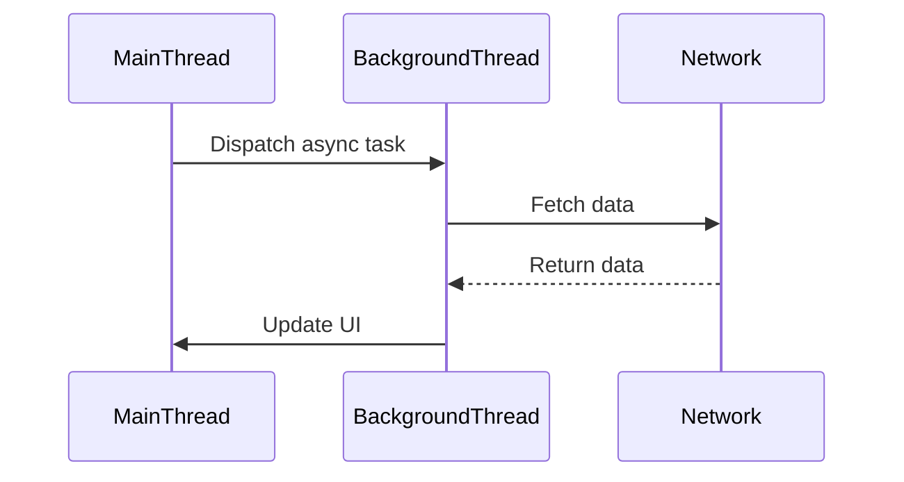

## 9.1 Introduction to Concurrency in Swift

Concurrency is a fundamental concept in modern software development, enabling applications to perform multiple tasks simultaneously. In Swift, understanding concurrency is crucial for building responsive and efficient applications, especially on platforms like iOS and macOS where user experience is paramount. In this section, we'll delve into the essentials of concurrency, its significance, and how Swift empowers developers to harness its potential.

### Understanding Concurrency vs. Parallelism

**Concurrency** and **parallelism** are often used interchangeably, but they represent distinct concepts in computing:

- **Concurrency** refers to the ability of a system to handle multiple tasks at once. It involves managing various processes or threads to ensure they progress without necessarily executing simultaneously.
- **Parallelism**, on the other hand, is the simultaneous execution of multiple tasks. It requires hardware support, such as multi-core processors, to truly execute tasks at the same time.

In Swift, concurrency is primarily about structuring code to handle multiple operations efficiently, while parallelism is about leveraging hardware capabilities to execute tasks concurrently.

### Threads and Queues in Swift

Swift provides powerful abstractions for managing concurrency through threads and queues. Understanding these concepts is vital for implementing concurrent operations effectively.

#### Threads

A **thread** is the smallest unit of processing that can be scheduled by an operating system. Each thread represents a separate path of execution, allowing multiple tasks to run concurrently.

- **Main Thread**: The main thread is where all UI updates occur. It's crucial to keep it responsive to ensure a smooth user experience.
- **Background Threads**: These are used for tasks that don't require immediate user interaction, such as network calls or data processing.

#### Queues

**Queues** in Swift are managed by Grand Central Dispatch (GCD), a low-level API for managing concurrent operations:

- **Serial Queues**: Execute tasks one at a time, in the order they are added. They are useful for tasks that must be completed sequentially.
- **Concurrent Queues**: Allow multiple tasks to run simultaneously. They are ideal for tasks that can be executed independently.

```swift
import Foundation

// Example of creating a serial queue
let serialQueue = DispatchQueue(label: "com.example.serialQueue")

// Example of creating a concurrent queue
let concurrentQueue = DispatchQueue(label: "com.example.concurrentQueue", attributes: .concurrent)

// Adding tasks to queues
serialQueue.async {
    print("Task 1")
}

concurrentQueue.async {
    print("Task 2")
    print("Task 3")
}
```

### Asynchronous Programming in Swift

**Asynchronous programming** allows tasks to run independently of the main program flow, enabling applications to remain responsive while waiting for operations to complete.

#### Benefits of Asynchronous Programming

- **Improved Responsiveness**: By offloading long-running tasks to background threads, the main thread remains free to handle user interactions.
- **Better Resource Utilization**: Asynchronous tasks can take advantage of idle CPU time, improving overall performance.

#### Challenges of Asynchronous Programming

- **Complexity**: Managing multiple asynchronous tasks can lead to complex code, especially when tasks depend on each other.
- **Debugging**: Asynchronous code can be harder to debug due to its non-linear execution.

### Use Cases and Examples

#### Responsive UIs

In iOS development, keeping the user interface responsive is critical. Concurrency allows developers to perform heavy computations or network requests without blocking the main thread.

```swift
import UIKit

class ViewController: UIViewController {
    override func viewDidLoad() {
        super.viewDidLoad()
        
        // Perform a network request on a background queue
        DispatchQueue.global(qos: .background).async {
            let data = self.fetchDataFromNetwork()
            
            // Update the UI on the main thread
            DispatchQueue.main.async {
                self.updateUI(with: data)
            }
        }
    }
    
    func fetchDataFromNetwork() -> Data {
        // Simulate network request
        return Data()
    }
    
    func updateUI(with data: Data) {
        // Update UI elements
    }
}
```

#### Performance Enhancement

Concurrency can significantly enhance performance by utilizing multiple cores to execute tasks in parallel. This is particularly beneficial for CPU-bound tasks like image processing or complex calculations.

```swift
import Foundation

func performHeavyComputation() {
    let queue = DispatchQueue.global(qos: .userInitiated)
    
    queue.async {
        let result = self.heavyComputation()
        print("Computation result: \\(result)")
    }
}

func heavyComputation() -> Int {
    // Simulate heavy computation
    return (0..<1000000).reduce(0, +)
}
```

#### Network Operations

Handling network operations asynchronously prevents blocking the main thread, ensuring the application remains responsive even when network requests take time to complete.

```swift
import Foundation

func fetchData(url: URL) {
    let task = URLSession.shared.dataTask(with: url) { data, response, error in
        guard let data = data, error == nil else {
            print("Error fetching data: \\(String(describing: error))")
            return
        }
        
        // Process the fetched data
        print("Data fetched: \\(data)")
    }
    
    // Start the network request
    task.resume()
}
```

### Visualizing Concurrency in Swift

To better understand how concurrency works in Swift, let's visualize the flow of tasks using a sequence diagram:



This diagram illustrates how a network request is dispatched to a background thread, allowing the main thread to remain responsive. Once the data is fetched, the UI is updated on the main thread.

### Try It Yourself

Experiment with the provided code examples by modifying the task priorities or adding new tasks to the queues. Observe how changes affect the application's responsiveness and performance. Consider implementing error handling for network requests to enhance reliability.

### Knowledge Check

Before moving on, consider these questions:

- How does concurrency differ from parallelism in Swift?
- What are the benefits and challenges of asynchronous programming?
- How can concurrency improve the performance of an iOS application?

### Embrace the Journey

Concurrency is a powerful tool in Swift development, enabling the creation of responsive and efficient applications. As you continue exploring concurrency patterns, remember that mastering these concepts will significantly enhance your ability to build robust software. Stay curious, experiment with different approaches, and enjoy the journey of becoming a proficient Swift developer.

## Quiz Time!



### What is the primary difference between concurrency and parallelism?

- [x] Concurrency is about managing multiple tasks, while parallelism is about executing tasks simultaneously.
- [ ] Concurrency and parallelism are the same concepts.
- [ ] Concurrency requires hardware support, while parallelism does not.
- [ ] Parallelism is a subset of concurrency.

> **Explanation:** Concurrency involves structuring a program to handle multiple tasks, while parallelism involves executing tasks simultaneously with hardware support.

### Which thread is responsible for updating the UI in iOS applications?

- [x] Main Thread
- [ ] Background Thread
- [ ] Network Thread
- [ ] Concurrent Thread

> **Explanation:** The main thread is responsible for updating the UI in iOS applications to ensure responsiveness.

### What is a benefit of asynchronous programming?

- [x] Improved responsiveness
- [ ] Increased code complexity
- [ ] Easier debugging
- [ ] Blocking the main thread

> **Explanation:** Asynchronous programming improves responsiveness by allowing tasks to run independently of the main program flow.

### What is a serial queue used for in Swift?

- [x] Executing tasks one at a time in order
- [ ] Executing tasks simultaneously
- [ ] Managing network requests
- [ ] Handling UI updates

> **Explanation:** Serial queues execute tasks one at a time in the order they are added, ensuring sequential execution.

### How can concurrency enhance performance in an application?

- [x] By utilizing multiple cores to execute tasks in parallel
- [ ] By blocking the main thread
- [ ] By increasing code complexity
- [ ] By reducing resource utilization

> **Explanation:** Concurrency enhances performance by utilizing multiple cores to execute tasks in parallel, improving efficiency.

### What is a challenge of asynchronous programming?

- [x] Increased code complexity
- [ ] Improved responsiveness
- [ ] Simplified debugging
- [ ] Blocking the main thread

> **Explanation:** Asynchronous programming can lead to increased code complexity due to managing multiple tasks and dependencies.

### Which Swift API is used for managing concurrent operations?

- [x] Grand Central Dispatch (GCD)
- [ ] Core Data
- [ ] UIKit
- [ ] SwiftUI

> **Explanation:** Grand Central Dispatch (GCD) is a low-level API used for managing concurrent operations in Swift.

### What is the role of a concurrent queue?

- [x] Allowing multiple tasks to run simultaneously
- [ ] Executing tasks one at a time
- [ ] Handling UI updates
- [ ] Managing network requests

> **Explanation:** Concurrent queues allow multiple tasks to run simultaneously, making them ideal for tasks that can be executed independently.

### How does asynchronous programming benefit network operations?

- [x] Prevents blocking the main thread
- [ ] Simplifies code structure
- [ ] Increases code complexity
- [ ] Reduces responsiveness

> **Explanation:** Asynchronous programming prevents blocking the main thread, ensuring the application remains responsive during network operations.

### True or False: Concurrency only improves performance for CPU-bound tasks.

- [ ] True
- [x] False

> **Explanation:** Concurrency improves performance for both CPU-bound and I/O-bound tasks by efficiently managing multiple operations.




