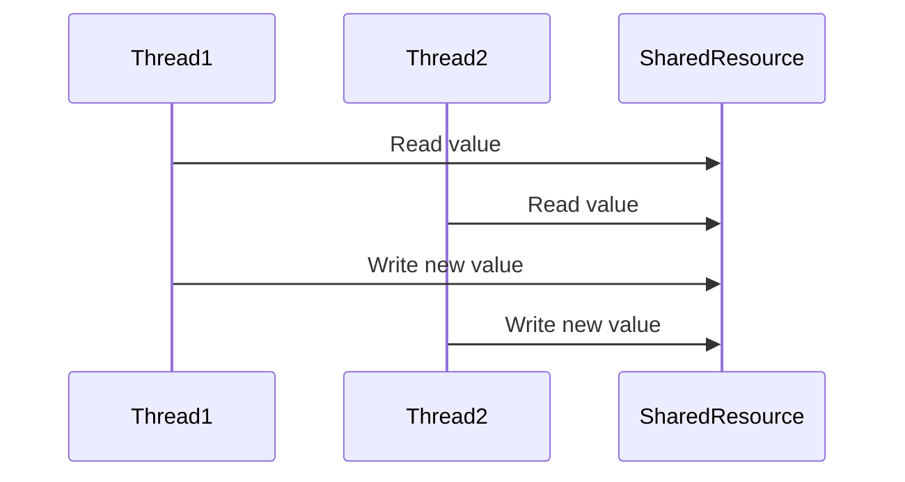
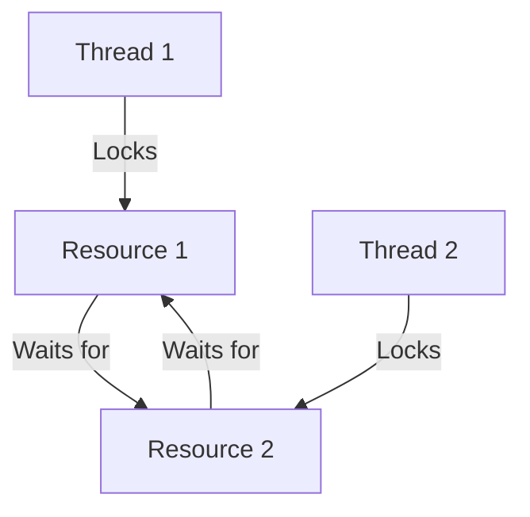

## 9.10 Handling Race Conditions and Deadlocks

Concurrency in Swift can significantly enhance the performance of your applications by allowing multiple tasks to run simultaneously. However, it also introduces complexities such as race conditions and deadlocks. These issues can lead to unpredictable behavior, making your applications unreliable. In this section, we will delve into the intricacies of race conditions and deadlocks, and explore strategies to detect and prevent them in Swift.

### Understanding Race Conditions

**Race conditions** occur when two or more threads access shared data and try to change it at the same time. The final result depends on the sequence of the threads' execution, leading to unpredictable outcomes.

#### Detecting Race Conditions

Detecting race conditions can be challenging due to their non-deterministic nature. Here are some strategies to identify them:

- **Testing Under Load**: Simulate high-load scenarios to increase the likelihood of exposing race conditions. This involves running your application with a large number of concurrent tasks.

- **Static Analysis Tools**: Utilize tools like Thread Sanitizer, which can detect data races by analyzing your code at runtime.

- **Code Reviews**: Conduct thorough code reviews to analyze code paths for potential race conditions. Pay special attention to shared resources and ensure proper synchronization mechanisms are in place.

#### Example of a Race Condition

Consider the following Swift code snippet that simulates a race condition:

```swift
import Foundation

class BankAccount {
    private var balance: Int = 0
    private let queue = DispatchQueue(label: "BankAccountQueue")

    func deposit(amount: Int) {
        queue.async {
            self.balance += amount
            print("Deposited \\(amount), balance is now \\(self.balance)")
        }
    }

    func withdraw(amount: Int) {
        queue.async {
            if self.balance >= amount {
                self.balance -= amount
                print("Withdrew \\(amount), balance is now \\(self.balance)")
            } else {
                print("Insufficient funds to withdraw \\(amount)")
            }
        }
    }
}

let account = BankAccount()
DispatchQueue.concurrentPerform(iterations: 10) { _ in
    account.deposit(amount: 10)
    account.withdraw(amount: 5)
}
```

In this example, the `deposit` and `withdraw` methods are executed concurrently, leading to a potential race condition where the balance might not be updated correctly.

### Preventing Race Conditions

To prevent race conditions, ensure that access to shared resources is properly synchronized. Here are some techniques:

- **Use Serial Queues**: Ensure that critical sections of code are executed serially. This can be achieved using serial dispatch queues in Swift.

- **Locks and Semaphores**: Use locks or semaphores to control access to shared resources. However, be cautious of deadlocks when using these mechanisms.

- **Atomic Operations**: Use atomic operations for simple read-modify-write sequences. Swift provides atomic properties with the `@Atomic` property wrapper in some libraries.

### Understanding Deadlocks

**Deadlocks** occur when two or more threads are blocked forever, each waiting for the other to release a resource. This situation can bring your application to a halt.

#### Preventing Deadlocks

Preventing deadlocks involves careful design and implementation. Consider the following strategies:

- **Lock Ordering**: Always acquire locks in a consistent order across different threads to prevent circular waits.

- **Timeouts**: Implement timeouts when waiting for resources, allowing threads to back off and retry or fail gracefully.

- **Avoid Nested Locks**: Minimize the use of locks within locks, as this increases the risk of deadlocks.

#### Example of a Deadlock

Let's consider a simple example that demonstrates a potential deadlock:

```swift
import Foundation

class Resource {
    private let lock = NSLock()
    func access() {
        lock.lock()
        defer { lock.unlock() }
        print("Resource accessed")
    }
}

let resource1 = Resource()
let resource2 = Resource()

let queue = DispatchQueue.global()

queue.async {
    resource1.access()
    resource2.access()
}

queue.async {
    resource2.access()
    resource1.access()
}
```

In this example, two resources are accessed by two threads in different orders, creating a deadlock scenario.

### Use Cases and Examples

Understanding race conditions and deadlocks is crucial in various scenarios:

- **Financial Transactions**: Ensure consistency in account balances by preventing race conditions during concurrent transactions.

- **Resource Allocation**: Prevent circular waits in resource management systems to avoid deadlocks.

- **Multithreaded Algorithms**: Design algorithms that are inherently thread-safe to avoid race conditions and deadlocks.

### Swift's Concurrency Model

Swift's concurrency model, introduced with Swift 5.5, provides structured concurrency using async/await and actors. These features help manage concurrency more safely and effectively.

#### Actors

Actors in Swift provide a safe way to manage state in concurrent environments by isolating state and ensuring that only one task can access an actor's state at a time.

```swift
actor BankAccount {
    private var balance: Int = 0

    func deposit(amount: Int) {
        balance += amount
        print("Deposited \\(amount), balance is now \\(balance)")
    }

    func withdraw(amount: Int) {
        if balance >= amount {
            balance -= amount
            print("Withdrew \\(amount), balance is now \\(balance)")
        } else {
            print("Insufficient funds to withdraw \\(amount)")
        }
    }
}

let account = BankAccount()
Task {
    await account.deposit(amount: 10)
    await account.withdraw(amount: 5)
}
```

In this example, the `BankAccount` actor ensures that balance updates are thread-safe, preventing race conditions.

### Visualizing Race Conditions and Deadlocks

To better understand the flow and potential issues in concurrent programming, let's visualize these concepts using Mermaid.js diagrams.

#### Race Condition Flow



This sequence diagram illustrates how two threads can read and write to a shared resource simultaneously, leading to a race condition.

#### Deadlock Scenario



This diagram shows a deadlock scenario where two threads lock resources in different orders, causing a circular wait.

### Try It Yourself

Experiment with the provided code examples by introducing intentional delays or modifying the order of operations to observe race conditions and deadlocks. Try using Swift's concurrency features like async/await and actors to resolve these issues.

### Knowledge Check

- **What is a race condition, and how can it be detected?**
- **Explain how deadlocks occur and how they can be prevented.**
- **How do Swift's actors help in managing concurrency?**

### Summary

Handling race conditions and deadlocks is essential for building robust and reliable concurrent applications in Swift. By understanding these concepts and utilizing Swift's concurrency model, you can design applications that are both efficient and safe.

## Quiz Time!



### What is a race condition?

- [x] A situation where two or more threads access shared data and try to change it at the same time
- [ ] A situation where a thread waits indefinitely for a resource
- [ ] A method to synchronize access to shared resources
- [ ] A design pattern for concurrent programming

> **Explanation:** A race condition occurs when multiple threads access shared data concurrently, leading to unpredictable outcomes.

### How can race conditions be detected?

- [x] Using static analysis tools like Thread Sanitizer
- [ ] By implementing timeouts
- [ ] By using nested locks
- [ ] By avoiding shared resources

> **Explanation:** Static analysis tools like Thread Sanitizer can help detect data races by analyzing code execution.

### What is a deadlock?

- [x] A situation where two or more threads are blocked forever, each waiting for the other to release a resource
- [ ] A method to improve application performance
- [ ] A type of race condition
- [ ] A concurrency model in Swift

> **Explanation:** A deadlock occurs when threads are blocked indefinitely, waiting for each other to release resources.

### How can deadlocks be prevented?

- [x] By ensuring consistent lock ordering
- [x] By using timeouts
- [ ] By increasing the number of threads
- [ ] By using nested locks

> **Explanation:** Consistent lock ordering and timeouts can prevent deadlocks by avoiding circular waits.

### What is the role of actors in Swift's concurrency model?

- [x] To provide a safe way to manage state in concurrent environments
- [ ] To increase the number of threads
- [ ] To detect race conditions
- [ ] To improve application performance

> **Explanation:** Actors in Swift isolate state and ensure that only one task can access an actor's state at a time, preventing race conditions.

### What is the purpose of using serial queues?

- [x] To ensure critical sections of code are executed serially
- [ ] To increase concurrency
- [ ] To detect deadlocks
- [ ] To improve application performance

> **Explanation:** Serial queues ensure that critical sections of code are executed one at a time, preventing race conditions.

### How do atomic operations help in concurrent programming?

- [x] By providing simple read-modify-write sequences
- [ ] By increasing the number of threads
- [ ] By detecting race conditions
- [ ] By improving application performance

> **Explanation:** Atomic operations ensure that read-modify-write sequences are executed atomically, preventing race conditions.

### What is a potential risk of using nested locks?

- [x] Increased risk of deadlocks
- [ ] Improved application performance
- [ ] Detection of race conditions
- [ ] Increased concurrency

> **Explanation:** Nested locks increase the risk of deadlocks by creating potential circular waits.

### True or False: Deadlocks can be resolved by increasing the number of threads.

- [ ] True
- [x] False

> **Explanation:** Increasing the number of threads does not resolve deadlocks; it may exacerbate the problem by creating more contention for resources.

### True or False: Swift's concurrency model with async/await and actors helps in managing concurrency safely.

- [x] True
- [ ] False

> **Explanation:** Swift's concurrency model with async/await and actors provides structured concurrency, helping manage concurrency safely.



Remember, mastering concurrency in Swift is a journey. Continue experimenting, learning, and applying these concepts to build robust and efficient applications. Stay curious and embrace the challenges of concurrent programming!


