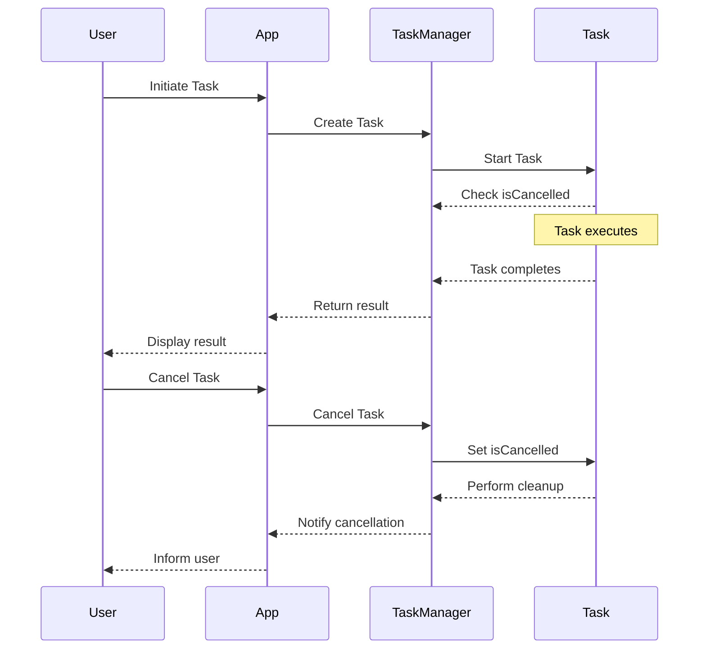

## 9.11 Task Cancellation and Prioritization

Concurrency in Swift allows developers to write efficient and responsive applications by executing multiple tasks simultaneously. However, managing these tasks effectively is crucial to ensure that the application remains responsive and does not consume unnecessary resources. In this section, we will explore the concepts of task cancellation and prioritization in Swift, which are essential for robust concurrency management.

### Intent

The primary intent of task cancellation and prioritization is to responsively manage tasks by cancelling unnecessary work and prioritizing important tasks. This ensures that the application remains efficient and responsive to user interactions.

### Implementing Cancellation

Task cancellation is a critical aspect of managing concurrency. It allows you to stop tasks that are no longer needed, freeing up resources and improving application performance.

#### Checking Cancellation

In Swift, tasks can be checked for cancellation using the `Task.isCancelled` property. It is important to regularly check this property within long-running tasks to determine if they should terminate early.

```swift
func performLongRunningTask() async {
    for i in 0..<100 {
        // Check if the task is cancelled
        if Task.isCancelled {
            print("Task was cancelled")
            return
        }
        
        // Simulate some work
        await Task.sleep(100_000_000) // 100 milliseconds
        print("Processing item \\(i)")
    }
}
```

In this example, the task checks for cancellation at each iteration, allowing it to terminate early if needed.

#### Cancellation Handlers

Cancellation handlers can be used to perform cleanup operations when a task is cancelled. This is useful for releasing resources or resetting the state.

```swift
func downloadFile() async throws {
    let handle = Task {
        // Simulate file download
        for i in 0..<10 {
            if Task.isCancelled {
                print("Download cancelled")
                break
            }
            await Task.sleep(200_000_000) // 200 milliseconds
            print("Downloading chunk \\(i)")
        }
    }
    
    // Attach a cancellation handler
    handle.cancellationHandler = {
        print("Performing cleanup after cancellation")
        // Perform necessary cleanup
    }
    
    try await handle.value
}
```

The cancellation handler is executed when the task is cancelled, allowing for proper cleanup.

#### Throwing Cancellation Errors

Swift provides a `CancellationError` that can be used to propagate cancellation through the task hierarchy. This allows for consistent error handling and cleanup.

```swift
func fetchData() async throws {
    if Task.isCancelled {
        throw CancellationError()
    }
    
    // Simulate data fetching
    await Task.sleep(500_000_000) // 500 milliseconds
    print("Data fetched successfully")
}

func processData() async {
    do {
        try await fetchData()
    } catch is CancellationError {
        print("Task was cancelled")
    } catch {
        print("An unexpected error occurred: \\(error)")
    }
}
```

In this example, the `fetchData` function throws a `CancellationError` if the task is cancelled, allowing the calling function to handle the cancellation appropriately.

### Task Priorities

Task prioritization allows you to control the order in which tasks are executed, ensuring that important tasks are completed first.

#### Prioritized Tasks

Swift provides several task priorities, such as `.userInitiated` and `.background`, which can be assigned to tasks to control their execution order.

```swift
func performHighPriorityTask() async {
    let task = Task(priority: .userInitiated) {
        // Perform high-priority work
        print("High-priority task executing")
    }
    await task.value
}

func performLowPriorityTask() async {
    let task = Task(priority: .background) {
        // Perform low-priority work
        print("Low-priority task executing")
    }
    await task.value
}
```

In this example, the high-priority task is more likely to be executed before the low-priority task, ensuring that critical work is completed first.

#### Priority Inheritance

Child tasks in Swift inherit the priority of their parent tasks, ensuring that the entire task hierarchy is executed according to the intended priority.

```swift
func parentTask() async {
    let parent = Task(priority: .userInitiated) {
        await childTask()
    }
    await parent.value
}

func childTask() async {
    // This task inherits the .userInitiated priority
    print("Child task executing with inherited priority")
}
```

The `childTask` inherits the `.userInitiated` priority from its parent, ensuring consistent execution order.

#### Adjusting Priorities

Task priorities can be adjusted based on runtime conditions to optimize resource usage and responsiveness.

```swift
func dynamicPriorityTask() async {
    let priority: TaskPriority = shouldUseHighPriority() ? .userInitiated : .background
    let task = Task(priority: priority) {
        // Perform work based on dynamic priority
        print("Task executing with dynamic priority")
    }
    await task.value
}

func shouldUseHighPriority() -> Bool {
    // Determine if high priority is needed
    return true
}
```

In this example, the task priority is determined at runtime, allowing for flexible and efficient task management.

### Use Cases and Examples

Task cancellation and prioritization are applicable in various scenarios, enhancing application performance and user experience.

#### Search Operations

In search operations, it is common to cancel previous searches when the query changes, ensuring that only the most relevant results are processed.

```swift
func performSearch(query: String) async {
    // Cancel previous search task
    searchTask?.cancel()
    
    // Start a new search task
    searchTask = Task {
        // Perform search
        print("Searching for \\(query)")
    }
    await searchTask?.value
}
```

By cancelling the previous search task, resources are conserved, and the application remains responsive.

#### Resource Management

Cancelling low-priority tasks can reduce resource usage, freeing up CPU and memory for more important work.

```swift
func manageResources() async {
    // Start a low-priority task
    let lowPriorityTask = Task(priority: .background) {
        // Perform resource-intensive work
        print("Low-priority task executing")
    }
    
    // Cancel the task if resources are needed elsewhere
    if resourcesAreLimited() {
        lowPriorityTask.cancel()
    }
    
    await lowPriorityTask.value
}

func resourcesAreLimited() -> Bool {
    // Determine if resources are limited
    return true
}
```

In this example, the low-priority task is cancelled if resources become constrained, ensuring efficient resource management.

#### User Experience

Prioritizing tasks on the main thread ensures that the UI remains responsive, enhancing the user experience.

```swift
func updateUI() async {
    let uiTask = Task(priority: .userInitiated) {
        // Update UI elements
        print("Updating UI")
    }
    await uiTask.value
}
```

By assigning a high priority to UI tasks, the application remains responsive to user interactions.

### Visualizing Task Cancellation and Prioritization

To better understand the flow of task cancellation and prioritization, let's visualize the process using a sequence diagram.



This diagram illustrates the interaction between the user, application, task manager, and tasks during task execution and cancellation.

### References and Links

- [Swift Concurrency Documentation](https://developer.apple.com/documentation/swift/concurrency)
- [Task Priorities in Swift](https://developer.apple.com/documentation/swift/taskpriority)
- [Handling Cancellation in Swift](https://developer.apple.com/documentation/swift/cancellationerror)

### Knowledge Check

- How can you check if a task is cancelled in Swift?
- What is the purpose of a cancellation handler?
- How do child tasks inherit priorities from parent tasks?
- What are some common use cases for task cancellation?
- How can task priorities be adjusted at runtime?

### Embrace the Journey

Remember, mastering task cancellation and prioritization is just one step in building efficient and responsive applications. As you continue to explore Swift's concurrency features, you'll discover new ways to optimize your code and enhance user experiences. Keep experimenting, stay curious, and enjoy the journey!

## Quiz Time!



### How can you check if a task is cancelled in Swift?

- [x] By using `Task.isCancelled`
- [ ] By using `Task.isRunning`
- [ ] By using `Task.isCompleted`
- [ ] By using `Task.isPaused`

> **Explanation:** `Task.isCancelled` is the property used to check if a task has been cancelled.

### What is the purpose of a cancellation handler in Swift?

- [x] To perform cleanup operations when a task is cancelled
- [ ] To start a new task
- [ ] To increase task priority
- [ ] To pause the task

> **Explanation:** A cancellation handler is used to perform necessary cleanup operations when a task is cancelled.

### How do child tasks inherit priorities from parent tasks?

- [x] Child tasks automatically inherit the priority of their parent tasks
- [ ] Child tasks do not inherit priorities
- [ ] Child tasks inherit priorities only if explicitly set
- [ ] Child tasks inherit priorities based on task duration

> **Explanation:** In Swift, child tasks automatically inherit the priority of their parent tasks, ensuring consistent execution order.

### What is a common use case for task cancellation?

- [x] Canceling previous searches when the query changes
- [ ] Increasing the duration of a task
- [ ] Pausing a task indefinitely
- [ ] Executing tasks in a random order

> **Explanation:** Canceling previous searches when the query changes is a common use case for task cancellation to conserve resources.

### How can task priorities be adjusted at runtime?

- [x] By determining the priority based on runtime conditions
- [ ] By setting a fixed priority at compile time
- [ ] By using a random priority generator
- [ ] By adjusting priorities only after task completion

> **Explanation:** Task priorities can be adjusted at runtime by determining the priority based on current conditions, allowing for flexible task management.

### What is the benefit of prioritizing tasks on the main thread?

- [x] It ensures the UI remains responsive
- [ ] It increases memory usage
- [ ] It decreases CPU usage
- [ ] It slows down task execution

> **Explanation:** Prioritizing tasks on the main thread ensures that the UI remains responsive to user interactions, enhancing the user experience.

### What happens when a task is cancelled in Swift?

- [x] The task stops executing and performs cleanup
- [ ] The task continues executing without interruption
- [ ] The task increases its priority
- [ ] The task switches to a different thread

> **Explanation:** When a task is cancelled, it stops executing and performs any necessary cleanup operations.

### Which of the following is a task priority in Swift?

- [x] .userInitiated
- [ ] .systemInitiated
- [ ] .networkInitiated
- [ ] .diskInitiated

> **Explanation:** `.userInitiated` is a task priority in Swift, used for tasks that the user initiates and expects a quick response.

### What is the role of `CancellationError` in Swift?

- [x] To propagate cancellation through the task hierarchy
- [ ] To start a new task
- [ ] To increase task priority
- [ ] To pause the task

> **Explanation:** `CancellationError` is used to propagate cancellation through the task hierarchy, allowing for consistent error handling and cleanup.

### True or False: Task cancellation and prioritization are only important for background tasks.

- [ ] True
- [x] False

> **Explanation:** Task cancellation and prioritization are important for all tasks, not just background tasks, to ensure efficient and responsive application performance.




