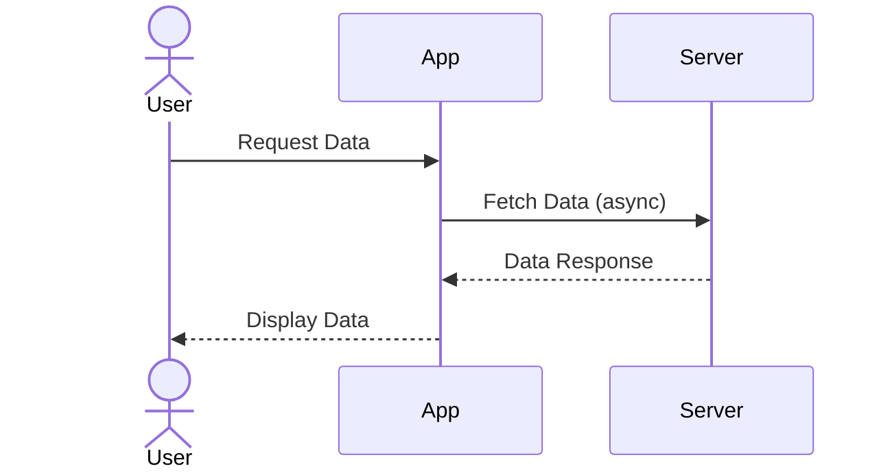

## 9.12 Concurrency Best Practices in Swift

Concurrency in Swift has evolved significantly with the introduction of high-level abstractions like async/await and actors. These advancements allow developers to write concurrent code that is not only efficient but also safe and maintainable. In this section, we will explore best practices for implementing concurrency in Swift, focusing on key principles that help avoid common pitfalls and ensure robust application performance.

### Intent

The primary intent of concurrency best practices in Swift is to adopt techniques that lead to safe, efficient, and maintainable concurrent code. By following these guidelines, developers can minimize errors related to concurrency, such as race conditions and deadlocks, while maximizing performance and code clarity.

### Guidelines for Concurrency in Swift

#### Prefer High-Level APIs

Swift provides powerful high-level concurrency APIs that simplify the management of asynchronous tasks. The async/await syntax and actor model are designed to handle concurrency more intuitively and safely than traditional threading approaches.

- **Async/Await**: This syntax allows you to write asynchronous code that looks like synchronous code, making it easier to read and maintain. It helps in avoiding callback hell and makes error handling more straightforward.

  ```swift
  func fetchData() async throws -> Data {
      let url = URL(string: "https://api.example.com/data")!
      let (data, _) = try await URLSession.shared.data(from: url)
      return data
  }
  ```

- **Actors**: Actors provide a way to encapsulate state and ensure that only one task can access that state at a time, thus avoiding data races.

  ```swift
  actor Counter {
      private var count = 0
      
      func increment() {
          count += 1
      }
      
      func getCount() -> Int {
          return count
      }
  }
  ```

#### Minimize Shared Mutable State

Concurrency issues often arise from shared mutable state. By reducing or eliminating shared state, you can significantly decrease the complexity and potential for errors in your concurrent code.

- **Encapsulation**: Use classes or structs to encapsulate state. Actors are particularly useful for this purpose as they inherently manage state access.

- **Avoid Global State**: Global variables can be accessed from anywhere, making them prone to race conditions. Use local state within functions or closures whenever possible.

#### Immutability

Immutable data structures are inherently thread-safe, as they cannot be modified after creation. This eliminates the need for synchronization and reduces the risk of race conditions.

- **Value Types**: Swift's structs and enums are value types, which are copied when passed around, ensuring that changes in one instance do not affect others.

  ```swift
  struct Point {
      let x: Int
      let y: Int
  }
  ```

- **Functional Programming**: Adopt functional programming techniques that emphasize immutability and pure functions to further enhance safety in concurrent code.

#### Structured Concurrency

Structured concurrency refers to organizing tasks in a way that they are predictable and manageable. This approach helps in maintaining a clear structure of task dependencies and lifecycles.

- **Task Groups**: Use task groups to manage a collection of tasks that need to be executed concurrently but have a clear relationship.

  ```swift
  func processFiles() async {
      await withTaskGroup(of: Void.self) { group in
          for file in files {
              group.addTask {
                  await processFile(file)
              }
          }
      }
  }
  ```

- **Cancellation**: Implement task cancellation to prevent unnecessary work and improve responsiveness.

  ```swift
  func fetchData() async throws -> Data {
      let url = URL(string: "https://api.example.com/data")!
      let (data, _) = try await URLSession.shared.data(from: url)
      return data
  }
  ```

### Testing and Debugging

Testing and debugging concurrent code can be challenging due to its non-deterministic nature. However, with the right tools and practices, you can ensure that your concurrent code is reliable and performs as expected.

#### Use Diagnostics Tools

Swift provides various tools for diagnosing concurrency issues. Instruments and sanitizers can help identify race conditions, memory leaks, and other issues.

- **Thread Sanitizer**: Use the Thread Sanitizer to detect data races and other concurrency issues during development.

#### Write Unit Tests

Unit testing concurrent code involves testing it under different conditions to ensure it behaves correctly in all scenarios.

- **Test for Race Conditions**: Write tests that simulate concurrent access to shared resources to ensure your code handles it gracefully.

#### Code Reviews

Peer reviews are invaluable for catching potential concurrency issues that might be overlooked by automated tests.

- **Review for Concurrency Patterns**: Ensure that established concurrency patterns are followed consistently across the codebase.

### Documentation and Code Style

Clear documentation and consistent code style are crucial for maintaining concurrent code, especially in team environments.

#### Comment Concurrent Code

Comments should explain the reasoning behind concurrency decisions and highlight potential pitfalls.

- **Explain Synchronization**: Document why and how synchronization is used in specific parts of the code.

#### Consistent Patterns

Following consistent concurrency patterns helps team members understand and work with the code more effectively.

- **Pattern Usage**: Use established patterns like async/await and actors consistently throughout the codebase.

### Use Cases and Examples

Concurrency best practices are particularly important in long-term projects and team environments, where maintainability and clarity are critical.

#### Long-Term Projects

In long-term projects, maintaining code quality over time is essential. Adopting best practices from the start can prevent technical debt and ensure the project remains manageable.

#### Team Environments

In team environments, clear and consistent concurrency practices ensure that all team members can understand and work with the code, reducing the likelihood of introducing concurrency-related bugs.

### Visualizing Concurrency in Swift

To better understand concurrency in Swift, let's visualize the flow of async/await and actor usage using Mermaid.js diagrams.



**Diagram Description**: This sequence diagram illustrates the flow of an asynchronous data request from a user through an app to a server. The app fetches data asynchronously from the server and then displays it to the user.

### Knowledge Check

To reinforce your understanding of concurrency best practices in Swift, consider the following questions and exercises:

- Why is it important to minimize shared mutable state in concurrent code?
- How does the actor model help prevent data races?
- What are the benefits of using immutable data structures in concurrent programming?
- Describe how structured concurrency can improve task management.

### Conclusion

Concurrency in Swift has become more accessible and safer with the introduction of high-level APIs like async/await and actors. By following best practices, such as minimizing shared state, embracing immutability, and using structured concurrency, you can write concurrent code that is efficient, maintainable, and free from common concurrency pitfalls. Remember, mastering concurrency is an ongoing journey. Keep experimenting, stay curious, and enjoy the process of building robust Swift applications.

## Quiz Time!



### What is the primary benefit of using async/await in Swift?

- [x] It makes asynchronous code easier to read and maintain.
- [ ] It performs better than all other concurrency models.
- [ ] It eliminates the need for error handling.
- [ ] It is the only way to achieve concurrency in Swift.

> **Explanation:** Async/await syntax allows asynchronous code to be written in a way that resembles synchronous code, making it easier to read and maintain.

### How do actors help in managing concurrency?

- [x] They ensure that only one task can access their state at a time.
- [ ] They eliminate the need for all synchronization.
- [ ] They automatically parallelize tasks.
- [ ] They are faster than threads.

> **Explanation:** Actors encapsulate state and ensure that only one task can access that state at a time, preventing data races.

### Why is immutability important in concurrent programming?

- [x] It eliminates the need for synchronization.
- [ ] It increases the performance of concurrent code.
- [ ] It makes code more complex.
- [ ] It is required by the Swift language.

> **Explanation:** Immutable data structures are thread-safe as they cannot be modified after creation, eliminating the need for synchronization.

### What is structured concurrency?

- [x] Organizing tasks in a way that they are predictable and manageable.
- [ ] Using threads to manage tasks.
- [ ] Writing code in a structured programming language.
- [ ] Avoiding the use of async/await.

> **Explanation:** Structured concurrency refers to organizing tasks in a way that they are predictable and manageable, helping maintain a clear structure of task dependencies and lifecycles.

### Which tool can be used to detect data races in Swift?

- [x] Thread Sanitizer
- [ ] Memory Profiler
- [ ] Performance Monitor
- [ ] Code Linter

> **Explanation:** The Thread Sanitizer is a tool that helps detect data races and other concurrency issues during development.

### What should be minimized in concurrent code to reduce complexity?

- [x] Shared mutable state
- [ ] Immutable data structures
- [ ] Use of async/await
- [ ] Number of functions

> **Explanation:** Minimizing shared mutable state reduces the complexity and potential for errors in concurrent code.

### What is the role of task cancellation in structured concurrency?

- [x] To prevent unnecessary work and improve responsiveness.
- [ ] To increase the number of concurrent tasks.
- [ ] To ensure all tasks complete.
- [ ] To simplify error handling.

> **Explanation:** Task cancellation helps prevent unnecessary work and improve responsiveness by stopping tasks that are no longer needed.

### Why is peer review important in concurrent programming?

- [x] It helps catch potential concurrency issues.
- [ ] It speeds up the development process.
- [ ] It eliminates the need for testing.
- [ ] It is required by Swift guidelines.

> **Explanation:** Peer reviews are invaluable for catching potential concurrency issues that might be overlooked by automated tests.

### What is a common pitfall in concurrent programming?

- [x] Race conditions
- [ ] Using async/await
- [ ] Writing unit tests
- [ ] Code documentation

> **Explanation:** Race conditions are a common pitfall in concurrent programming where two or more threads access shared data simultaneously, leading to unpredictable results.

### True or False: Actors in Swift automatically parallelize tasks.

- [ ] True
- [x] False

> **Explanation:** Actors do not automatically parallelize tasks; they ensure that only one task can access their state at a time, preventing data races.


