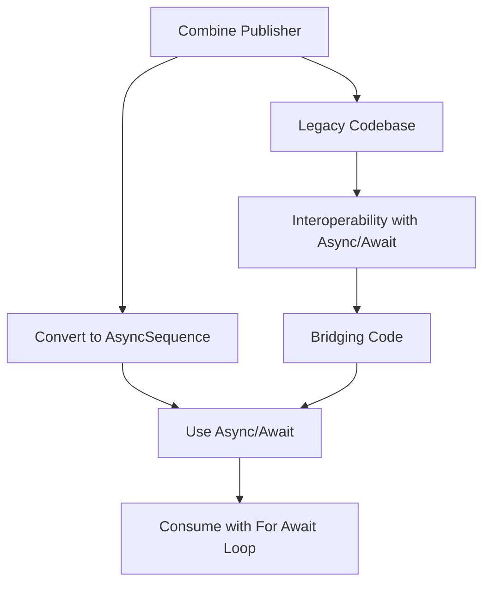

## 9.13 Integrating Concurrency with Combine and AsyncSequence

In this section, we delve into the integration of Swift's concurrency model with Combine and AsyncSequence. This integration aims to bridge traditional reactive programming paradigms with Swift's modern concurrency features, enhancing both clarity and performance in your applications. Let's explore how to effectively transition and leverage these powerful tools.

### Intent

The primary intent of integrating concurrency with Combine and AsyncSequence is to provide a seamless bridge between reactive programming and Swift's new concurrency model. This integration allows developers to take advantage of the expressive power of async/await while maintaining the reactive capabilities of Combine. By doing so, we can achieve more readable, maintainable, and performant code.

### Converting Publishers to AsyncSequences

One of the key aspects of integrating concurrency with Combine is converting Combine publishers to async sequences. This conversion allows us to utilize Swift's async/await syntax, which simplifies asynchronous code.

#### Publisher’s Values

Combine provides a `values` property on its publishers, which can be used to access the values emitted by the publisher as an `AsyncSequence`. This makes it straightforward to iterate over the values using a `for await` loop.

```swift
import Combine

// Example Publisher
let publisher = Just(1).eraseToAnyPublisher()

// Convert to AsyncSequence
Task {
    for await value in publisher.values {
        print("Received value: \\(value)")
    }
}
```

In this example, we use the `values` property to convert a `Just` publisher into an `AsyncSequence`, allowing us to iterate over its values asynchronously.

#### Migration Strategies

Migrating from Combine to async/await can be done gradually, allowing you to replace Combine code with async/await incrementally. This approach is particularly useful in large codebases where a complete rewrite is impractical.

1. **Identify Asynchronous Boundaries**: Start by identifying parts of your code where asynchronous operations occur. These are the areas where async/await can be introduced.

2. **Replace Combine Chains**: Gradually replace Combine chains with async/await syntax. Begin with simpler chains and progress to more complex ones.

3. **Use AsyncSequence**: Convert publishers to async sequences where applicable, and use `for await` loops to handle asynchronous data.

4. **Test Thoroughly**: Ensure that each migration step is thoroughly tested to maintain the integrity of your application.

### Interoperability

Interoperability between Combine and Swift's concurrency model is crucial for integrating these technologies smoothly. Let's explore how to achieve this through async streams and bridging code.

#### Async Streams

`AsyncStream` provides a way to create asynchronous sequences from closures. This is particularly useful for bridging existing Combine publishers with async/await code.

```swift
import Foundation

// Create an AsyncStream
let asyncStream = AsyncStream<Int> { continuation in
    continuation.yield(1)
    continuation.yield(2)
    continuation.finish()
}

// Consume the AsyncStream
Task {
    for await value in asyncStream {
        print("AsyncStream value: \\(value)")
    }
}
```

In this example, we create an `AsyncStream` that yields values asynchronously. This stream can be consumed using a `for await` loop, demonstrating how async streams can be used to bridge Combine and async/await.

#### Bridging Code

To connect Combine publishers with async/await code, we can write adapters that facilitate the transition. These adapters convert Combine publishers into async sequences, allowing them to be used with Swift's concurrency model.

```swift
import Combine

// Adapter to bridge Combine with async/await
func bridgePublisherToAsyncSequence<P: Publisher>(_ publisher: P) -> AsyncStream<P.Output> {
    AsyncStream { continuation in
        let cancellable = publisher.sink(
            receiveCompletion: { _ in continuation.finish() },
            receiveValue: { value in continuation.yield(value) }
        )
        
        continuation.onTermination = { _ in
            cancellable.cancel()
        }
    }
}

// Usage
let asyncSequence = bridgePublisherToAsyncSequence(publisher)
Task {
    for await value in asyncSequence {
        print("Bridged value: \\(value)")
    }
}
```

This adapter function takes a Combine publisher and returns an `AsyncStream`, which can then be consumed using async/await. This approach enables seamless interoperability between Combine and Swift's concurrency model.

### Use Cases and Examples

Integrating concurrency with Combine and AsyncSequence offers numerous benefits, particularly in scenarios involving legacy codebases and third-party libraries.

#### Legacy Codebases

In legacy codebases, integrating new concurrency features without rewriting all existing code is crucial. By gradually introducing async/await and async sequences, you can modernize your codebase while maintaining compatibility with existing Combine code.

- **Incremental Refactoring**: Begin by refactoring small, isolated parts of the codebase to use async/await. This allows you to test and validate changes incrementally.

- **Maintain Compatibility**: Use bridging techniques to maintain compatibility with existing Combine code, ensuring that your application continues to function correctly during the transition.

#### Third-Party Libraries

Many third-party libraries still use Combine for reactive programming. By integrating async/await, you can leverage these libraries while taking advantage of Swift's modern concurrency features.

- **Adapter Patterns**: Use adapter patterns to bridge third-party Combine publishers with async/await code, allowing you to use these libraries seamlessly.

- **Async/Await Wrappers**: Create async/await wrappers around third-party library functions, providing a more modern API for your application.

### Visualizing the Integration

To better understand the integration of concurrency with Combine and AsyncSequence, let's visualize the process using a flowchart.



This flowchart illustrates the process of converting a Combine publisher to an async sequence and using async/await to consume it. It also highlights the interoperability between legacy codebases and Swift's concurrency model.

### Knowledge Check

Let's reinforce what we've learned with some questions and exercises:

1. **What is the primary benefit of converting Combine publishers to async sequences?**

2. **How does `AsyncStream` facilitate interoperability between Combine and async/await?**

3. **Describe a scenario where bridging code would be necessary in a legacy codebase.**

4. **Create an `AsyncStream` that yields a sequence of numbers from 1 to 5 and consumes it using a `for await` loop.**

5. **Explain the migration strategy for transitioning from Combine to async/await.**

### Embrace the Journey

As you integrate concurrency with Combine and AsyncSequence, remember that this is just the beginning. The journey to mastering Swift's concurrency model is filled with opportunities to enhance your applications and improve your skills. Keep experimenting, stay curious, and enjoy the process!

### Quiz Time!



### What is the primary intent of integrating concurrency with Combine and AsyncSequence?

- [x] To bridge reactive programming with Swift's concurrency model for improved clarity and performance.
- [ ] To replace Combine entirely with async/await.
- [ ] To make Combine obsolete.
- [ ] To only use async/await in new projects.

> **Explanation:** The integration aims to bridge reactive programming with Swift's concurrency model, enhancing clarity and performance.

### How can you convert a Combine publisher to an async sequence?

- [x] By using the `values` property of the publisher.
- [ ] By using `AsyncStream` directly.
- [ ] By rewriting the publisher as an async function.
- [ ] By using a third-party library.

> **Explanation:** The `values` property allows you to access the values of a publisher as an `AsyncSequence`.

### What is `AsyncStream` used for?

- [x] To create asynchronous sequences from closures.
- [ ] To replace Combine publishers.
- [ ] To handle errors in async/await code.
- [ ] To manage memory in Swift.

> **Explanation:** `AsyncStream` is used to create asynchronous sequences from closures, facilitating interoperability.

### Why is interoperability important when integrating concurrency with Combine?

- [x] It allows seamless integration with existing codebases and third-party libraries.
- [ ] It makes async/await faster.
- [ ] It eliminates the need for Combine.
- [ ] It simplifies error handling.

> **Explanation:** Interoperability ensures that new concurrency features can be integrated without rewriting existing code or libraries.

### What is a key strategy for migrating from Combine to async/await?

- [x] Gradually replace Combine chains with async/await syntax.
- [ ] Rewrite the entire codebase at once.
- [ ] Use only async/await in new projects.
- [ ] Avoid using async/await with Combine.

> **Explanation:** Gradually replacing Combine chains allows for a smooth transition and testing at each step.

### How can you bridge a Combine publisher with async/await code?

- [x] By writing an adapter that converts the publisher to an async sequence.
- [ ] By using `AsyncStream` directly.
- [ ] By rewriting the publisher as an async function.
- [ ] By using a third-party library.

> **Explanation:** An adapter can convert a Combine publisher to an async sequence, enabling its use with async/await.

### What is a common use case for integrating concurrency with Combine and AsyncSequence?

- [x] Modernizing legacy codebases.
- [ ] Creating new projects without Combine.
- [ ] Replacing all Combine code.
- [ ] Simplifying error handling.

> **Explanation:** Integrating concurrency allows for modernizing legacy codebases without a complete rewrite.

### Which of the following is true about `AsyncStream`?

- [x] It can be used to create asynchronous sequences from closures.
- [ ] It replaces Combine entirely.
- [ ] It is only used for error handling.
- [ ] It is a synchronous sequence.

> **Explanation:** `AsyncStream` is used to create asynchronous sequences from closures, not to replace Combine.

### What is the benefit of using async/await with third-party libraries that still use Combine?

- [x] It allows leveraging these libraries while using modern concurrency features.
- [ ] It forces the libraries to update their code.
- [ ] It makes the libraries obsolete.
- [ ] It simplifies the libraries' APIs.

> **Explanation:** Using async/await with these libraries allows you to leverage them while benefiting from modern concurrency features.

### True or False: `AsyncStream` and Combine are mutually exclusive and cannot be used together.

- [ ] True
- [x] False

> **Explanation:** `AsyncStream` and Combine can be used together, with `AsyncStream` facilitating interoperability with async/await.



By understanding and applying these concepts, you can effectively integrate concurrency with Combine and AsyncSequence, enhancing your Swift applications with modern, efficient, and readable code. Keep exploring and refining your skills as you continue your journey in Swift development.


