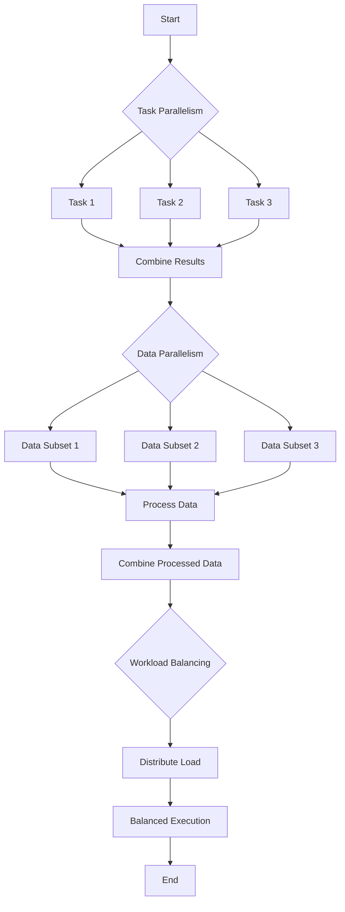

## 9.14 Concurrency and Parallelism Strategies

Concurrency and parallelism are crucial concepts in software development, especially when building applications that need to optimize performance and effectively utilize the underlying hardware resources. In Swift, these strategies are essential for creating responsive and efficient applications, whether for iOS, macOS, or server-side Swift development. In this section, we will delve into various concurrency and parallelism strategies, their implementation techniques, and practical use cases.

### Intent

The primary intent of concurrency and parallelism strategies is to optimize applications by effectively utilizing hardware resources. This involves breaking down tasks and data into smaller units that can be processed simultaneously, thus improving the overall performance and responsiveness of applications.

### Strategies

#### Task Parallelism

Task parallelism involves decomposing a problem into distinct tasks that can run concurrently. Each task represents a unit of work that can be executed independently. This strategy is particularly useful when tasks have different functionalities or when tasks can be executed in parallel without affecting each other.

- **Example**: In a web server, handling multiple client requests simultaneously can be achieved through task parallelism. Each request can be processed as a separate task, allowing the server to handle multiple requests concurrently.

#### Data Parallelism

Data parallelism focuses on distributing data across multiple tasks, where each task performs the same operation on different subsets of the data. This strategy is effective when the same computation needs to be applied to a large dataset.

- **Example**: In image processing, applying a filter to each pixel of an image can be parallelized using data parallelism. Each task processes a portion of the image, applying the same filter operation concurrently.

#### Workload Balancing

Workload balancing ensures that tasks have similar execution times, preventing bottlenecks and improving overall efficiency. This strategy is crucial in scenarios where tasks have varying execution times, and load balancing can help distribute work evenly across available resources.

- **Example**: In a distributed computing environment, workload balancing can be achieved by dynamically assigning tasks to processors based on their current load, ensuring that no single processor becomes a bottleneck.

### Implementation Techniques

#### Parallel Loops

Parallel loops allow for concurrent iterations over collections. In Swift, this can be achieved using the `DispatchQueue` or `OperationQueue` to execute loop iterations in parallel.

```swift
import Foundation

let numbers = Array(1...1000)
let queue = DispatchQueue.global(qos: .userInitiated)

queue.async {
    DispatchQueue.concurrentPerform(iterations: numbers.count) { index in
        let number = numbers[index]
        // Perform some computation on number
        print("Processing number: \\(number)")
    }
}
```

In this example, we use `DispatchQueue.concurrentPerform` to iterate over an array of numbers concurrently, processing each number in parallel.

#### SIMD Operations

Single Instruction, Multiple Data (SIMD) operations leverage vector processing capabilities to perform the same operation on multiple data points simultaneously. Swift provides built-in support for SIMD operations, allowing developers to optimize performance for certain types of computations.

```swift
import simd

let vectorA = SIMD4<Float>(1.0, 2.0, 3.0, 4.0)
let vectorB = SIMD4<Float>(5.0, 6.0, 7.0, 8.0)
let result = vectorA + vectorB

print("SIMD result: \\(result)")
```

Here, we use SIMD to add two vectors, performing the addition operation on all elements simultaneously.

### Use Cases and Examples

#### Scientific Computations

Scientific computations often involve processing large datasets and performing complex calculations. Concurrency and parallelism strategies can significantly improve the efficiency of these computations.

- **Example**: Simulating physical phenomena, such as fluid dynamics or weather patterns, can be parallelized by dividing the computational grid into smaller regions and processing each region concurrently.

#### Image Processing

Image processing tasks, such as applying filters or transformations, can benefit from data parallelism by processing different parts of an image simultaneously.

- **Example**: Applying a Gaussian blur filter to an image can be parallelized by dividing the image into smaller blocks and processing each block concurrently.

```swift
import UIKit

func applyGaussianBlur(to image: UIImage) -> UIImage? {
    guard let inputCGImage = image.cgImage else { return nil }
    let context = CIContext()
    let inputImage = CIImage(cgImage: inputCGImage)

    let filter = CIFilter.gaussianBlur()
    filter.inputImage = inputImage
    filter.radius = 10.0

    guard let outputImage = filter.outputImage else { return nil }
    guard let outputCGImage = context.createCGImage(outputImage, from: inputImage.extent) else { return nil }

    return UIImage(cgImage: outputCGImage)
}

// Usage
if let originalImage = UIImage(named: "example.jpg") {
    let blurredImage = applyGaussianBlur(to: originalImage)
    // Display or use the blurred image
}
```

In this code, we use Core Image to apply a Gaussian blur filter to an image, which can be parallelized by processing different sections of the image concurrently.

#### Machine Learning

Machine learning models often require significant computational resources for training. Concurrency and parallelism can be used to parallelize model training, reducing training time and improving efficiency.

- **Example**: Training a neural network can be parallelized by distributing the training data across multiple processors, allowing each processor to compute gradients concurrently.

```swift
import TensorFlow

let model = Sequential {
    Dense<Float>(inputSize: 784, outputSize: 128, activation: relu)
    Dense<Float>(outputSize: 10, activation: softmax)
}

let optimizer = SGD(for: model, learningRate: 0.01)
let dataset = MNIST(batchSize: 64)

for epoch in 1...5 {
    for batch in dataset.training {
        let (images, labels) = batch
        let gradients = model.gradient { model -> Tensor<Float> in
            let logits = model(images)
            let loss = softmaxCrossEntropy(logits: logits, labels: labels)
            return loss
        }
        optimizer.update(&model, along: gradients)
    }
}
```

In this TensorFlow example, we train a simple neural network model on the MNIST dataset, where each batch of data can be processed concurrently to compute gradients.

### Visualizing Concurrency and Parallelism

To better understand concurrency and parallelism strategies, let's visualize the process using a flowchart.



**Description:** This flowchart illustrates the flow of concurrency and parallelism strategies, starting with task parallelism, followed by data parallelism, and finally workload balancing, leading to optimized execution.

### References and Links

For further reading on concurrency and parallelism strategies in Swift, consider the following resources:

- [Apple's Concurrency Programming Guide](https://developer.apple.com/library/archive/documentation/General/Conceptual/ConcurrencyProgrammingGuide/Introduction/Introduction.html)
- [Swift.org - Concurrency](https://swift.org/documentation/concurrency/)
- [Ray Wenderlich's Concurrency in Swift](https://www.raywenderlich.com/148893/concurrency-in-swift-3-tutorial-getting-started)

### Knowledge Check

Let's test your understanding of concurrency and parallelism strategies with a few questions:

- What is the primary intent of concurrency and parallelism strategies?
- How does task parallelism differ from data parallelism?
- Why is workload balancing important in parallel computing?
- Provide an example of a use case where SIMD operations would be beneficial.

### Embrace the Journey

Remember, mastering concurrency and parallelism strategies is a journey. As you progress, you'll be able to build more efficient and responsive applications. Keep experimenting, stay curious, and enjoy the journey!

## Quiz Time!



### What is the primary intent of concurrency and parallelism strategies?

- [x] To optimize applications by effectively utilizing hardware resources.
- [ ] To increase the complexity of applications.
- [ ] To simplify code structure.
- [ ] To ensure applications run on a single thread.

> **Explanation:** The primary intent of concurrency and parallelism strategies is to optimize applications by effectively utilizing hardware resources, improving performance and responsiveness.

### How does task parallelism differ from data parallelism?

- [x] Task parallelism involves executing different tasks concurrently, while data parallelism involves performing the same operation on different data subsets.
- [ ] Task parallelism involves performing the same operation on different data subsets, while data parallelism involves executing different tasks concurrently.
- [ ] Task parallelism and data parallelism are the same.
- [ ] Task parallelism is only applicable to scientific computations.

> **Explanation:** Task parallelism involves executing different tasks concurrently, while data parallelism involves performing the same operation on different data subsets.

### Why is workload balancing important in parallel computing?

- [x] To prevent bottlenecks and ensure efficient resource utilization.
- [ ] To increase the number of tasks executed.
- [ ] To reduce the complexity of code.
- [ ] To ensure tasks are executed in a specific order.

> **Explanation:** Workload balancing is important in parallel computing to prevent bottlenecks and ensure efficient resource utilization by distributing tasks evenly across available resources.

### Provide an example of a use case where SIMD operations would be beneficial.

- [x] Performing vector arithmetic on large datasets.
- [ ] Handling multiple client requests on a server.
- [ ] Applying different filters to an image.
- [ ] Training a neural network model.

> **Explanation:** SIMD operations are beneficial for performing vector arithmetic on large datasets, as they allow for simultaneous processing of multiple data points.

### What is a key benefit of using parallel loops in Swift?

- [x] They allow for concurrent iterations over collections, improving performance.
- [ ] They simplify the code structure.
- [ ] They ensure tasks are executed sequentially.
- [ ] They reduce the number of lines of code.

> **Explanation:** Parallel loops in Swift allow for concurrent iterations over collections, improving performance by executing iterations in parallel.

### Which strategy involves distributing data across tasks to perform the same operation concurrently?

- [x] Data Parallelism
- [ ] Task Parallelism
- [ ] Workload Balancing
- [ ] SIMD Operations

> **Explanation:** Data parallelism involves distributing data across tasks to perform the same operation concurrently.

### In which scenario is workload balancing most crucial?

- [x] When tasks have varying execution times.
- [ ] When tasks are executed sequentially.
- [ ] When all tasks perform the same operation.
- [ ] When tasks are executed on a single processor.

> **Explanation:** Workload balancing is most crucial when tasks have varying execution times, as it helps distribute work evenly across resources.

### How can you implement task parallelism in Swift?

- [x] By using DispatchQueue or OperationQueue to execute tasks concurrently.
- [ ] By using a single thread to execute tasks sequentially.
- [ ] By using SIMD operations for vector processing.
- [ ] By using a recursive function to execute tasks.

> **Explanation:** Task parallelism in Swift can be implemented using DispatchQueue or OperationQueue to execute tasks concurrently.

### Which of the following is NOT a concurrency strategy?

- [x] Sequential Execution
- [ ] Task Parallelism
- [ ] Data Parallelism
- [ ] Workload Balancing

> **Explanation:** Sequential execution is not a concurrency strategy, as it involves executing tasks one after another without parallelism.

### True or False: Concurrency and parallelism are the same.

- [ ] True
- [x] False

> **Explanation:** Concurrency and parallelism are not the same. Concurrency involves managing multiple tasks at the same time, while parallelism involves executing multiple tasks simultaneously.




