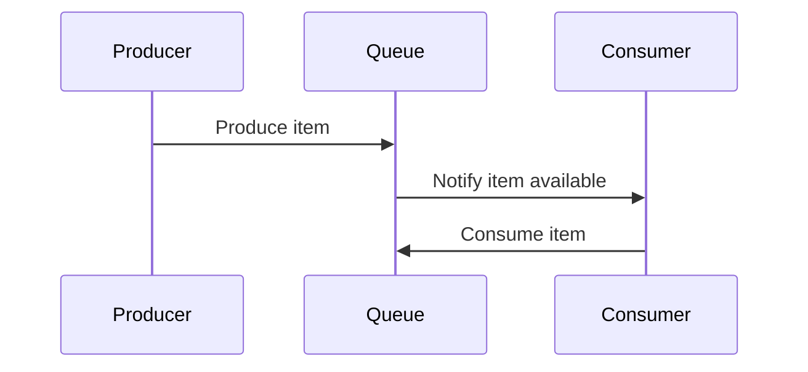

## 9.15 Message Passing and Concurrent Data Structures

In the realm of Swift programming, concurrency is a crucial aspect of building responsive and efficient applications. As we delve into message passing and concurrent data structures, our goal is to understand how to safely share data between concurrent tasks. This section will guide you through implementing message passing using actors, channels, and queues, as well as exploring concurrent data structures like thread-safe collections and lock-free structures. We'll also cover use cases such as producer-consumer models, event systems, and performance-critical systems.

### Intent

The intent of this section is to provide you with the knowledge and tools necessary to safely and efficiently share data between concurrent tasks in Swift. By leveraging message passing and concurrent data structures, you can create robust and scalable applications that handle concurrency gracefully.

### Implementing Message Passing

Message passing is a fundamental concept in concurrent programming, allowing tasks to communicate and synchronize without sharing memory directly. In Swift, message passing can be implemented using actors, channels, and queues.

#### Actors

Actors are a powerful concurrency model in Swift that encapsulate state and ensure safe access to mutable data. By using actors, you can define isolated units of state that communicate with each other through asynchronous method calls.

```swift
actor Counter {
    private var count = 0
    
    func increment() {
        count += 1
    }
    
    func getCount() -> Int {
        return count
    }
}

let counter = Counter()
Task {
    await counter.increment()
    let currentCount = await counter.getCount()
    print("Current count: \\(currentCount)")
}
```

In this example, the `Counter` actor encapsulates a mutable `count` variable. The `increment` and `getCount` methods are asynchronous, ensuring that access to the `count` variable is safe and serialized.

#### Channels and Queues

Channels and queues provide a mechanism for transferring data between concurrent tasks. They act as buffers that store messages until they are consumed by a receiver.

```swift
import Foundation

let queue = DispatchQueue(label: "com.example.queue", attributes: .concurrent)
let semaphore = DispatchSemaphore(value: 0)

var messageQueue: [String] = []

func producer() {
    queue.async {
        for i in 1...5 {
            let message = "Message \\(i)"
            messageQueue.append(message)
            print("Produced: \\(message)")
            semaphore.signal()
        }
    }
}

func consumer() {
    queue.async {
        for _ in 1...5 {
            semaphore.wait()
            if let message = messageQueue.first {
                messageQueue.removeFirst()
                print("Consumed: \\(message)")
            }
        }
    }
}

producer()
consumer()
```

In this example, a simple producer-consumer model is implemented using a concurrent queue and a semaphore. The producer adds messages to the `messageQueue`, and the consumer removes them. The semaphore ensures that the consumer waits for messages to be available before consuming them.

### Concurrent Data Structures

Concurrent data structures are designed to allow safe and efficient access by multiple tasks. These structures are essential for building scalable and performant concurrent applications.

#### Thread-Safe Collections

Swift provides several thread-safe collections that can be used in concurrent environments. These collections ensure that operations on them are atomic and thread-safe.

```swift
import Foundation

let concurrentQueue = DispatchQueue(label: "com.example.concurrentQueue", attributes: .concurrent)
var threadSafeArray = [Int]()

concurrentQueue.async(flags: .barrier) {
    threadSafeArray.append(1)
}

concurrentQueue.async {
    print(threadSafeArray)
}
```

In this example, a concurrent queue is used to safely append to and read from a thread-safe array. The `.barrier` flag ensures that the append operation is executed exclusively, preventing data races.

#### Lock-Free Structures

Lock-free data structures are designed to allow concurrent access without using locks. These structures use atomic operations to ensure consistency and avoid the overhead of locking mechanisms.

```swift
import Foundation

class LockFreeStack<T> {
    private var stack: [T] = []
    private let lock = NSLock()
    
    func push(_ element: T) {
        lock.lock()
        defer { lock.unlock() }
        stack.append(element)
    }
    
    func pop() -> T? {
        lock.lock()
        defer { lock.unlock() }
        return stack.popLast()
    }
}

let stack = LockFreeStack<Int>()
stack.push(10)
if let value = stack.pop() {
    print("Popped value: \\(value)")
}
```

Although this example uses a lock for simplicity, true lock-free structures use atomic operations and compare-and-swap techniques to manage concurrent access without locks.

### Use Cases and Examples

Message passing and concurrent data structures can be applied in various scenarios to improve the performance and reliability of your applications.

#### Producer-Consumer Models

In a producer-consumer model, producers generate data that is consumed by other tasks. This model is common in applications that process data streams or handle background tasks.

```swift
import Foundation

let producerQueue = DispatchQueue(label: "com.example.producerQueue")
let consumerQueue = DispatchQueue(label: "com.example.consumerQueue")
let semaphore = DispatchSemaphore(value: 0)
var buffer: [Int] = []

producerQueue.async {
    for i in 1...10 {
        buffer.append(i)
        print("Produced: \\(i)")
        semaphore.signal()
    }
}

consumerQueue.async {
    for _ in 1...10 {
        semaphore.wait()
        if let item = buffer.first {
            buffer.removeFirst()
            print("Consumed: \\(item)")
        }
    }
}
```

This example demonstrates a simple producer-consumer model using two dispatch queues and a semaphore to synchronize access to the buffer.

#### Event Systems

Event systems allow components to communicate asynchronously by sending and receiving events. This pattern is useful in applications that require decoupled and scalable architectures.

```swift
import Foundation

class EventBus {
    private var listeners: [String: [(String) -> Void]] = [:]
    
    func register(event: String, listener: @escaping (String) -> Void) {
        if listeners[event] == nil {
            listeners[event] = []
        }
        listeners[event]?.append(listener)
    }
    
    func post(event: String, message: String) {
        listeners[event]?.forEach { listener in
            listener(message)
        }
    }
}

let eventBus = EventBus()
eventBus.register(event: "event1") { message in
    print("Received message: \\(message)")
}

eventBus.post(event: "event1", message: "Hello, World!")
```

In this example, an `EventBus` class is implemented to manage event listeners and dispatch messages to registered listeners.

#### Performance-Critical Systems

In performance-critical systems, reducing the overhead of locking mechanisms is essential to achieving high throughput and low latency. Message passing and lock-free structures can help minimize contention and improve performance.

### Visualizing Message Passing and Concurrency

To better understand the flow of message passing and concurrency, let's visualize a producer-consumer model using a sequence diagram.



This diagram illustrates the interaction between a producer, a queue, and a consumer. The producer generates items, which are stored in the queue. The consumer is notified when items are available and consumes them.

### Swift Unique Features

Swift offers several unique features that make it well-suited for concurrent programming:

- **Actors**: Swift's actor model provides a safe and efficient way to manage state in concurrent applications.
- **Structured Concurrency**: Swift's structured concurrency model simplifies the management of concurrent tasks.
- **Async/Await**: The async/await syntax makes it easier to write asynchronous code that is both readable and maintainable.

### Design Considerations

When designing concurrent systems in Swift, consider the following:

- **Avoid Shared Mutable State**: Use message passing and actors to encapsulate state and avoid data races.
- **Choose the Right Data Structures**: Use thread-safe collections and lock-free structures to ensure safe concurrent access.
- **Balance Performance and Complexity**: While lock-free structures can improve performance, they can also increase complexity. Use them judiciously.

### Differences and Similarities

Message passing and shared memory are two approaches to concurrency. While message passing avoids shared state and reduces the risk of data races, shared memory can be more efficient in certain scenarios. Understanding the trade-offs between these approaches is key to designing effective concurrent systems.

### Try It Yourself

Experiment with the code examples provided in this section. Try modifying the producer-consumer model to handle different types of data or implement a more complex event system. By experimenting with these patterns, you'll gain a deeper understanding of how to apply them in your own applications.

### Knowledge Check

- What are the benefits of using actors in Swift for concurrent programming?
- How do channels and queues facilitate message passing between tasks?
- What are the advantages of using lock-free structures over traditional locking mechanisms?

### Embrace the Journey

Remember, mastering concurrency in Swift is a journey. As you explore message passing and concurrent data structures, you'll build more robust and scalable applications. Keep experimenting, stay curious, and enjoy the journey!

## Quiz Time!



### What is the primary benefit of using actors in Swift?

- [x] Encapsulating state and ensuring safe access to mutable data
- [ ] Improving network performance
- [ ] Reducing memory usage
- [ ] Simplifying UI design

> **Explanation:** Actors encapsulate state and ensure safe access to mutable data, making them ideal for concurrent programming.

### How do channels and queues facilitate message passing?

- [x] By acting as buffers that store messages until consumed
- [ ] By reducing network latency
- [ ] By encrypting data
- [ ] By simplifying UI design

> **Explanation:** Channels and queues act as buffers that store messages until they are consumed by a receiver, facilitating message passing.

### What is a key advantage of lock-free structures?

- [x] Avoiding the overhead of locking mechanisms
- [ ] Simplifying UI design
- [ ] Reducing memory usage
- [ ] Improving network performance

> **Explanation:** Lock-free structures use atomic operations to avoid the overhead of locking mechanisms, improving performance.

### In a producer-consumer model, what role does the semaphore play?

- [x] Synchronizing access to the buffer
- [ ] Encrypting data
- [ ] Reducing memory usage
- [ ] Simplifying UI design

> **Explanation:** The semaphore synchronizes access to the buffer, ensuring that the consumer waits for messages to be available before consuming them.

### What is a common use case for event systems?

- [x] Communicating asynchronously between components
- [ ] Simplifying UI design
- [ ] Reducing memory usage
- [ ] Improving network performance

> **Explanation:** Event systems allow components to communicate asynchronously, making them useful for decoupled and scalable architectures.

### Which Swift feature simplifies the management of concurrent tasks?

- [x] Structured Concurrency
- [ ] UI Design
- [ ] Memory Management
- [ ] Network Performance

> **Explanation:** Swift's structured concurrency model simplifies the management of concurrent tasks.

### What is the primary goal of message passing in concurrent programming?

- [x] Allowing tasks to communicate and synchronize without sharing memory directly
- [ ] Improving network performance
- [ ] Reducing memory usage
- [ ] Simplifying UI design

> **Explanation:** Message passing allows tasks to communicate and synchronize without sharing memory directly, reducing the risk of data races.

### What is a potential drawback of using lock-free structures?

- [x] Increased complexity
- [ ] Reduced memory usage
- [ ] Simplified UI design
- [ ] Improved network performance

> **Explanation:** While lock-free structures can improve performance, they can also increase complexity.

### True or False: Message passing always results in higher performance than shared memory.

- [ ] True
- [x] False

> **Explanation:** While message passing reduces the risk of data races, shared memory can be more efficient in certain scenarios.

### What is a key consideration when designing concurrent systems in Swift?

- [x] Avoiding shared mutable state
- [ ] Simplifying UI design
- [ ] Reducing memory usage
- [ ] Improving network performance

> **Explanation:** Avoiding shared mutable state is crucial to prevent data races and ensure safe concurrent access.



By understanding and applying these concepts, you will be well-equipped to tackle the challenges of concurrency in Swift. Keep experimenting and learning, and you'll continue to build more robust and efficient applications.


