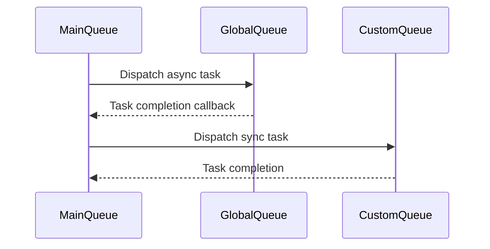

## 9.2 Grand Central Dispatch (GCD) Basics

Concurrency is a cornerstone of modern software development, enabling applications to perform multiple tasks simultaneously. In Swift, Grand Central Dispatch (GCD) is a powerful tool for managing concurrency, allowing developers to execute tasks efficiently in the background while keeping the user interface responsive. In this section, we will delve into the basics of GCD, exploring its components, usage, and practical applications.

### Intent

The primary intent of using GCD is to manage background tasks efficiently. By leveraging GCD, developers can ensure that tasks are executed concurrently without blocking the main thread, which is crucial for maintaining a smooth user experience.

### Implementing GCD in Swift

#### Dispatch Queues

Dispatch queues are the backbone of GCD, providing a mechanism to execute tasks asynchronously or synchronously. There are three main types of dispatch queues:

1. **Main Queue**: This is the serial queue that runs on the main thread. It is used for updating the UI and handling user interactions. Since UI updates must occur on the main thread, tasks that affect the UI should be dispatched to this queue.

2. **Global Queues**: These are concurrent queues provided by the system, categorized by different quality of service (QoS) levels. They are used for executing tasks in the background.

3. **Custom Queues**: Developers can create their own serial or concurrent queues to manage specific tasks.

##### Code Example: Creating and Using Dispatch Queues

```swift
// Main Queue
DispatchQueue.main.async {
    // Code to update UI
    self.updateUI()
}

// Global Queue
DispatchQueue.global(qos: .background).async {
    // Background task
    self.performBackgroundTask()
}

// Custom Serial Queue
let customSerialQueue = DispatchQueue(label: "com.example.serialQueue")
customSerialQueue.sync {
    // Serial task execution
    self.executeSerialTask()
}

// Custom Concurrent Queue
let customConcurrentQueue = DispatchQueue(label: "com.example.concurrentQueue", attributes: .concurrent)
customConcurrentQueue.async {
    // Concurrent task execution
    self.executeConcurrentTask()
}
```

#### Asynchronous and Synchronous Tasks

Understanding the difference between asynchronous (`async`) and synchronous (`sync`) tasks is crucial for effective concurrency management:

- **Asynchronous (`async`)**: Tasks are dispatched and executed without blocking the current thread. The program continues executing subsequent code while the task runs in the background.

- **Synchronous (`sync`)**: The current thread is blocked until the task completes. This is useful when a task must be completed before proceeding.

##### Code Example: Async vs. Sync

```swift
// Asynchronous Task
DispatchQueue.global().async {
    // Perform background task
    self.performBackgroundTask()
    DispatchQueue.main.async {
        // Update UI after task completion
        self.updateUI()
    }
}

// Synchronous Task
DispatchQueue.global().sync {
    // Perform task and wait for completion
    self.performSynchronousTask()
}
```

#### Quality of Service (QoS)

QoS allows developers to prioritize tasks based on their importance and impact on the user experience. The available QoS classes are:

- `.userInteractive`: Highest priority, for tasks that affect the UI directly.
- `.userInitiated`: High priority, for tasks initiated by the user.
- `.default`: Normal priority, for tasks that do not require immediate attention.
- `.utility`: Low priority, for long-running tasks.
- `.background`: Lowest priority, for tasks that are not time-sensitive.

##### Code Example: Using QoS

```swift
DispatchQueue.global(qos: .userInitiated).async {
    // High-priority task
    self.performHighPriorityTask()
}
```

#### Dispatch Work Items

Dispatch Work Items provide a way to encapsulate a task that can be executed on a dispatch queue. They offer additional control over task execution, such as cancellation or delaying.

##### Code Example: Dispatch Work Items

```swift
// Create a Dispatch Work Item
let workItem = DispatchWorkItem {
    // Task to be executed
    self.performTask()
}

// Execute the work item on a global queue
DispatchQueue.global().async(execute: workItem)

// Cancel the work item if needed
workItem.cancel()
```

### Use Cases and Examples

#### Background Processing

GCD is ideal for executing tasks that can run in the background, such as image processing or data parsing. By offloading these tasks to a background queue, the main thread remains free to handle user interactions.

##### Code Example: Background Image Processing

```swift
DispatchQueue.global(qos: .background).async {
    let processedImage = self.processImage(image)
    DispatchQueue.main.async {
        self.imageView.image = processedImage
    }
}
```

#### UI Updates

Ensuring that UI updates occur on the main thread is critical for maintaining a responsive user interface. GCD makes it easy to dispatch UI-related tasks to the main queue.

##### Code Example: Updating UI on Main Thread

```swift
DispatchQueue.main.async {
    self.label.text = "Task Completed"
}
```

#### Synchronization

GCD can help prevent race conditions by synchronizing access to shared resources. This is particularly important in concurrent programming where multiple threads may attempt to modify the same data simultaneously.

##### Code Example: Synchronizing Access to Shared Resource

```swift
let serialQueue = DispatchQueue(label: "com.example.serialQueue")

serialQueue.sync {
    // Access shared resource safely
    self.sharedResource.modify()
}
```

### Visualizing GCD Concepts

To better understand how GCD operates, let's visualize the interaction between different dispatch queues and tasks using a sequence diagram.



### References and Links

For further reading on Grand Central Dispatch, consider the following resources:

- [Apple's Grand Central Dispatch Documentation](https://developer.apple.com/documentation/dispatch)
- [Swift.org Concurrency Guide](https://swift.org/documentation/concurrency/)
- [Ray Wenderlich's GCD Tutorial](https://www.raywenderlich.com/148513/grand-central-dispatch-tutorial-swift-3-part-1-getting-started)

### Knowledge Check

To reinforce your understanding of GCD, try answering the following questions:

1. What is the main purpose of using GCD in Swift applications?
2. How do you ensure that UI updates occur on the main thread?
3. What is the difference between `async` and `sync` tasks?
4. How does QoS affect task execution in GCD?
5. When would you use a Dispatch Work Item?

### Embrace the Journey

Remember, mastering GCD is just one step in becoming proficient in Swift concurrency. As you continue to explore and experiment with GCD, you'll gain a deeper understanding of how to build responsive and efficient applications. Keep experimenting, stay curious, and enjoy the journey!

## Quiz Time!



### What is the main purpose of using GCD in Swift applications?

- [x] To manage background tasks efficiently
- [ ] To handle user interface design
- [ ] To store data persistently
- [ ] To perform network requests

> **Explanation:** GCD is used to manage background tasks efficiently, allowing for concurrent execution without blocking the main thread.

### Which dispatch queue should be used for UI updates?

- [x] Main Queue
- [ ] Global Queue
- [ ] Custom Queue
- [ ] Background Queue

> **Explanation:** UI updates should occur on the Main Queue to ensure they are executed on the main thread.

### What is the difference between `async` and `sync` tasks?

- [x] `async` tasks do not block the current thread, while `sync` tasks do
- [ ] `async` tasks block the current thread, while `sync` tasks do not
- [ ] Both `async` and `sync` tasks block the current thread
- [ ] Neither `async` nor `sync` tasks block the current thread

> **Explanation:** `async` tasks allow the program to continue executing without waiting for the task to complete, whereas `sync` tasks block the current thread until the task finishes.

### How does QoS affect task execution in GCD?

- [x] It prioritizes tasks based on their importance
- [ ] It determines the queue type
- [ ] It controls memory allocation
- [ ] It manages network requests

> **Explanation:** QoS (Quality of Service) prioritizes tasks based on their importance and impact on the user experience.

### When would you use a Dispatch Work Item?

- [x] To encapsulate a task with additional control
- [ ] To create a new dispatch queue
- [ ] To manage memory allocation
- [ ] To handle network requests

> **Explanation:** Dispatch Work Items allow developers to encapsulate tasks with additional control, such as cancellation or delay.

### Which QoS class should be used for tasks that directly affect the UI?

- [x] `.userInteractive`
- [ ] `.background`
- [ ] `.utility`
- [ ] `.default`

> **Explanation:** The `.userInteractive` QoS class is used for tasks that directly affect the UI and require immediate attention.

### What is the role of a custom queue in GCD?

- [x] To manage specific tasks with custom behavior
- [ ] To handle UI updates
- [ ] To perform network requests
- [ ] To store data persistently

> **Explanation:** Custom queues allow developers to manage specific tasks with custom behavior, either serially or concurrently.

### How can you prevent race conditions using GCD?

- [x] By synchronizing access to shared resources
- [ ] By using only asynchronous tasks
- [ ] By avoiding the use of global queues
- [ ] By performing all tasks on the main queue

> **Explanation:** Synchronizing access to shared resources using serial queues can prevent race conditions in concurrent programming.

### Which of the following is a benefit of using GCD?

- [x] Improved application responsiveness
- [ ] Increased memory usage
- [ ] Slower task execution
- [ ] Reduced code readability

> **Explanation:** GCD improves application responsiveness by allowing tasks to be executed concurrently without blocking the main thread.

### True or False: All tasks dispatched to the main queue are executed concurrently.

- [ ] True
- [x] False

> **Explanation:** Tasks dispatched to the main queue are executed serially, one after the other, as they must occur on the main thread.


