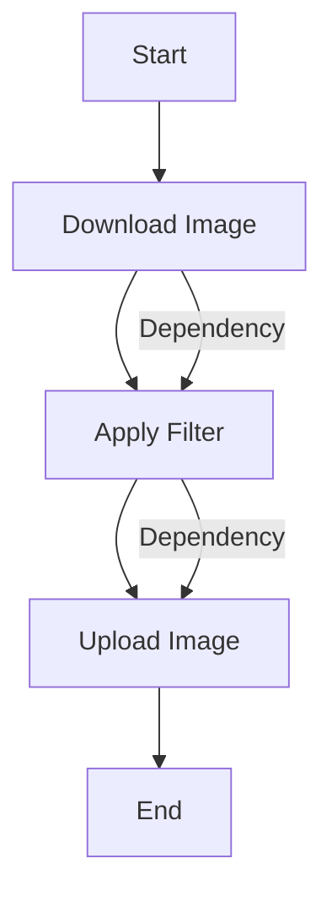

## 9.3 Operation Queues and Dependencies

Concurrency is a cornerstone of modern application development, enabling apps to perform multiple tasks simultaneously, thus improving performance and responsiveness. In Swift, Operation Queues provide a higher-level abstraction over Grand Central Dispatch (GCD), offering more control over task execution, dependencies, and state management. Let's dive deep into understanding and mastering Operation Queues and Dependencies in Swift.

### Intent

The primary intent of using Operation Queues and Dependencies is to provide a structured, flexible, and efficient way to manage concurrent tasks. By utilizing Operation Queues, developers can:

- Execute tasks asynchronously.
- Control the order of task execution through dependencies.
- Manage task priorities and states.
- Handle task cancellation and retry mechanisms.

### Implementing Operation Queues

#### NSOperation and Operation

Swift provides two classes for creating operations: `NSOperation` (Objective-C) and `Operation` (Swift). Both serve as the base class for encapsulating a unit of work that can be executed on an operation queue.

**Creating Custom Operations**

To create a custom operation, subclass `Operation` and override its main method to define the task:

```swift
import Foundation

class CustomOperation: Operation {
    override func main() {
        if isCancelled {
            return
        }
        // Perform the task
        print("Executing custom operation")
    }
}
```

**Key Points:**

- **Check for Cancellation**: Always check `isCancelled` before starting the task to ensure the operation hasn't been cancelled.
- **Override `main`**: The `main` method is where the operation's work is performed.

#### Adding to Queues

`OperationQueue` is used to manage and execute operations. Operations added to a queue are executed concurrently by default.

**Example:**

```swift
let operationQueue = OperationQueue()
let operation1 = CustomOperation()
let operation2 = CustomOperation()

operationQueue.addOperation(operation1)
operationQueue.addOperation(operation2)
```

**Key Points:**

- **Concurrency**: By default, `OperationQueue` executes operations concurrently. You can control the maximum number of concurrent operations using the `maxConcurrentOperationCount` property.
- **Adding Operations**: Use `addOperation(_:)` to add operations to the queue.

#### Dependencies

Dependencies allow you to define the order of operation execution. An operation will not start until all its dependencies have finished executing.

**Setting Up Dependencies:**

```swift
operation2.addDependency(operation1)
operationQueue.addOperations([operation1, operation2], waitUntilFinished: false)
```

**Key Points:**

- **Order of Execution**: `operation2` will not start until `operation1` is finished.
- **Managing Dependencies**: Use `addDependency(_:)` to add dependencies and `removeDependency(_:)` to remove them.

#### Operation States

Understanding operation states is crucial for managing task execution:

- **isReady**: Indicates if the operation is ready to execute.
- **isExecuting**: Indicates if the operation is currently executing.
- **isFinished**: Indicates if the operation has finished executing.

**Example:**

```swift
class StateOperation: Operation {
    private var _executing = false
    private var _finished = false
    
    override var isExecuting: Bool {
        return _executing
    }
    
    override var isFinished: Bool {
        return _finished
    }
    
    override func start() {
        if isCancelled {
            _finished = true
            return
        }
        
        _executing = true
        main()
    }
    
    override func main() {
        // Perform the task
        print("State operation executing")
        
        // Simulate work
        sleep(2)
        
        _executing = false
        _finished = true
    }
}
```

**Key Points:**

- **Custom State Management**: Override `isExecuting` and `isFinished` to manage custom states.
- **Thread Safety**: Ensure state changes are thread-safe, often using KVO (Key-Value Observing).

### Use Cases and Examples

#### Complex Workflows

Operation Queues are ideal for coordinating complex workflows where tasks depend on each other.

**Example: Image Processing Pipeline**

Imagine an app that processes images by applying filters and then uploads them to a server. Each step can be an operation with dependencies:

```swift
let downloadOperation = DownloadImageOperation(url: imageUrl)
let filterOperation = FilterImageOperation()
let uploadOperation = UploadImageOperation()

filterOperation.addDependency(downloadOperation)
uploadOperation.addDependency(filterOperation)

operationQueue.addOperations([downloadOperation, filterOperation, uploadOperation], waitUntilFinished: false)
```

**Key Points:**

- **Sequential Execution**: Ensure tasks execute in the correct order by setting dependencies.
- **Modular Design**: Break down complex tasks into smaller operations for better management and reusability.

#### Retry Mechanisms

Operation Queues can be used to implement retry mechanisms for operations that fail.

**Example:**

```swift
class RetryOperation: Operation {
    private var retryCount = 0
    private let maxRetries = 3
    
    override func main() {
        while retryCount < maxRetries {
            if isCancelled {
                return
            }
            // Attempt the task
            let success = performTask()
            if success {
                break
            }
            retryCount += 1
        }
    }
    
    private func performTask() -> Bool {
        // Simulate task execution
        print("Attempting task, retry count: \\(retryCount)")
        return Bool.random() // Random success/failure
    }
}
```

**Key Points:**

- **Retry Logic**: Implement retry logic within the operation's `main` method.
- **Limit Retries**: Use a counter to limit the number of retries.

#### Cancellation

Operations can be cancelled, providing control over task execution.

**Example:**

```swift
let cancellableOperation = CustomOperation()
operationQueue.addOperation(cancellableOperation)

// Cancel the operation
cancellableOperation.cancel()
```

**Key Points:**

- **Graceful Cancellation**: Check `isCancelled` within the operation to stop execution gracefully.
- **Immediate Effect**: Cancelling an operation does not stop it immediately; the operation must check its cancellation status.

### Visualizing Operation Queues and Dependencies

To better understand how operations and dependencies work, let's visualize the process using a flowchart.



**Diagram Explanation:**

- **Nodes**: Represent operations (Download, Filter, Upload).
- **Edges**: Represent dependencies between operations.

### References and Links

For further reading and a deeper dive into Operation Queues and Dependencies, consider the following resources:

- [Apple's Documentation on OperationQueue](https://developer.apple.com/documentation/foundation/operationqueue)
- [NSHipster's Guide to NSOperation](https://nshipster.com/nsoperation/)

### Knowledge Check

Before we wrap up, let's reinforce what we've learned with a few questions:

- How do you create a custom operation in Swift?
- What is the purpose of setting dependencies between operations?
- How can you implement retry mechanisms using Operation Queues?
- What are the key states of an operation?

### Embrace the Journey

Remember, mastering concurrency with Operation Queues and Dependencies is a journey. As you progress, you'll be able to create more efficient, responsive, and robust applications. Keep experimenting, stay curious, and enjoy the process!

## Quiz Time!



### What is the primary intent of using Operation Queues in Swift?

- [x] To provide structured and efficient task management.
- [ ] To replace all uses of Grand Central Dispatch.
- [ ] To manage memory allocation automatically.
- [ ] To handle UI updates directly.

> **Explanation:** Operation Queues are used to manage tasks efficiently, providing more control over execution order and dependencies.

### How do you create a custom operation in Swift?

- [x] By subclassing `Operation` and overriding the `main` method.
- [ ] By using a closure within `OperationQueue`.
- [ ] By directly using `NSOperationQueue`.
- [ ] By implementing the `Runnable` protocol.

> **Explanation:** Custom operations are created by subclassing `Operation` and defining the task in the `main` method.

### What is the purpose of setting dependencies between operations?

- [x] To control the order of execution.
- [ ] To increase memory efficiency.
- [ ] To automatically retry failed operations.
- [ ] To manage network connections.

> **Explanation:** Dependencies ensure that operations execute in a specific order, waiting for other operations to complete first.

### Which property indicates that an operation is currently executing?

- [ ] `isReady`
- [x] `isExecuting`
- [ ] `isFinished`
- [ ] `isCancelled`

> **Explanation:** The `isExecuting` property indicates whether the operation is currently running.

### How can you implement retry mechanisms using Operation Queues?

- [x] By implementing retry logic within the operation's `main` method.
- [ ] By using a separate `RetryQueue`.
- [ ] By setting the `retryCount` property on `OperationQueue`.
- [ ] By using the `retry` method on `Operation`.

> **Explanation:** Retry logic is implemented within the operation itself, typically in the `main` method.

### What should you always check before starting a task in a custom operation?

- [x] `isCancelled`
- [ ] `isFinished`
- [ ] `isReady`
- [ ] `isExecuting`

> **Explanation:** Always check `isCancelled` to ensure the operation hasn't been cancelled before starting the task.

### What happens when you cancel an operation in an OperationQueue?

- [x] The operation will stop executing if it checks `isCancelled`.
- [ ] The operation is immediately removed from the queue.
- [ ] The operation continues to execute until completion.
- [ ] The operation is paused and can be resumed.

> **Explanation:** Cancellation doesn't stop an operation immediately; it must check `isCancelled` to stop executing.

### What is the default execution behavior of operations in an OperationQueue?

- [x] Concurrent execution.
- [ ] Sequential execution.
- [ ] Parallel execution.
- [ ] Synchronous execution.

> **Explanation:** By default, operations in an OperationQueue execute concurrently.

### Can you set a maximum number of concurrent operations in an OperationQueue?

- [x] True
- [ ] False

> **Explanation:** You can control the number of concurrent operations by setting the `maxConcurrentOperationCount` property.

### Which of the following is a key benefit of using Operation Queues over GCD?

- [x] More control over task dependencies and states.
- [ ] Faster execution of tasks.
- [ ] Automatic memory management.
- [ ] Direct UI updates from background threads.

> **Explanation:** Operation Queues provide more control over task execution, dependencies, and states compared to GCD.




