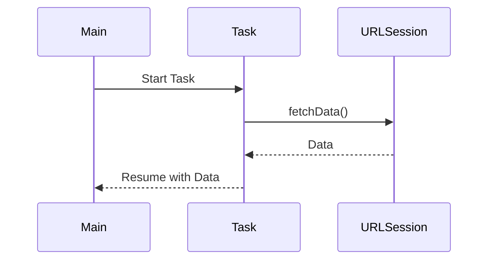

## 9.4 Swift Concurrency with Async/Await

In the ever-evolving world of software development, concurrency remains a cornerstone for building responsive and efficient applications. Swift's introduction of `async/await` marks a significant leap forward in simplifying asynchronous programming, making it more intuitive and less error-prone. This section delves into the intricacies of Swift's concurrency model, exploring how `async/await` transforms the way we handle asynchronous operations.

### Intent

The primary intent of adopting Swift's `async/await` is to provide developers with a modern concurrency model that enhances code clarity and safety. By integrating `async/await`, developers can write asynchronous code that is as straightforward as synchronous code, reducing the cognitive load and potential for errors associated with callback-based approaches.

### Implementing Async/Await

Swift's `async/await` syntax introduces a new paradigm for writing asynchronous code. Let's explore the key components involved in implementing `async/await`.

#### Async Functions

To begin with, any function that performs asynchronous operations must be marked with the `async` keyword. This indicates that the function can suspend its execution, allowing other code to run while waiting for a result.

```swift
// Define an asynchronous function
func fetchData(from url: URL) async throws -> Data {
    // Simulate network call
    let (data, _) = try await URLSession.shared.data(from: url)
    return data
}
```

In this example, `fetchData(from:)` is an asynchronous function that fetches data from a URL. The `async` keyword signifies that the function may pause and resume its execution.

#### Awaiting Calls

The `await` keyword is used to call asynchronous functions, suspending the current task until the operation completes. This allows for linear code flow, making it easier to read and maintain.

```swift
// Call the asynchronous function
Task {
    do {
        let url = URL(string: "https://example.com/data")!
        let data = try await fetchData(from: url)
        print("Data received: \\(data)")
    } catch {
        print("Failed to fetch data: \\(error)")
    }
}
```

Here, `await` is used to pause the execution of the task until `fetchData(from:)` returns a result, providing a straightforward way to handle asynchronous operations.

#### Concurrency Control

Swift offers structured concurrency to manage parallel tasks efficiently. The `async let` syntax allows you to initiate multiple asynchronous tasks concurrently and await their results.

```swift
// Perform concurrent asynchronous operations
Task {
    async let imageData = fetchData(from: imageURL)
    async let jsonData = fetchData(from: jsonURL)
    
    // Await both results
    do {
        let (image, json) = try await (imageData, jsonData)
        print("Image and JSON data received.")
    } catch {
        print("Failed to fetch data: \\(error)")
    }
}
```

In this example, `async let` is used to start fetching image and JSON data concurrently, improving efficiency by utilizing parallel execution.

#### Task Cancellation

Handling task cancellation is crucial in cooperative multitasking environments. Swift's concurrency model allows tasks to be canceled, and developers should handle cancellations gracefully.

```swift
// Handle task cancellation
func fetchData(from url: URL) async throws -> Data {
    // Check for cancellation
    try Task.checkCancellation()
    
    let (data, _) = try await URLSession.shared.data(from: url)
    return data
}

Task {
    do {
        let data = try await fetchData(from: url)
        print("Data received: \\(data)")
    } catch is CancellationError {
        print("Task was canceled.")
    } catch {
        print("Failed to fetch data: \\(error)")
    }
}
```

In this snippet, `Task.checkCancellation()` is used to detect if a task has been canceled, allowing the function to throw a `CancellationError` and terminate gracefully.

### Use Cases and Examples

The `async/await` model shines in various scenarios, offering a cleaner and more efficient approach to asynchronous programming.

#### Simplifying Callbacks

Traditionally, asynchronous operations relied heavily on callbacks, leading to deeply nested and hard-to-read code. `Async/await` flattens these structures, resulting in more readable and maintainable code.

```swift
// Traditional callback approach
fetchData(from: url) { result in
    switch result {
    case .success(let data):
        processData(data)
    case .failure(let error):
        handleError(error)
    }
}

// Simplified with async/await
Task {
    do {
        let data = try await fetchData(from: url)
        processData(data)
    } catch {
        handleError(error)
    }
}
```

The `async/await` approach eliminates the need for nested closures, providing a linear flow that is easier to follow.

#### Error Handling

Combining `async/await` with Swift's `throws` mechanism allows for seamless error propagation, making it easier to handle errors in asynchronous code.

```swift
// Asynchronous function with error handling
func fetchData(from url: URL) async throws -> Data {
    let (data, _) = try await URLSession.shared.data(from: url)
    return data
}

Task {
    do {
        let data = try await fetchData(from: url)
        print("Data received: \\(data)")
    } catch {
        print("Error fetching data: \\(error)")
    }
}
```

In this example, errors are propagated using `throws`, allowing for clean and consistent error handling.

#### Migrating Legacy Code

Migrating existing codebases to use `async/await` can lead to significant improvements in code readability and maintainability. By refactoring legacy code, developers can leverage Swift's modern concurrency features.

```swift
// Legacy code with completion handlers
func fetchData(from url: URL, completion: @escaping (Result<Data, Error>) -> Void) {
    URLSession.shared.dataTask(with: url) { data, response, error in
        if let error = error {
            completion(.failure(error))
        } else if let data = data {
            completion(.success(data))
        }
    }.resume()
}

// Refactored with async/await
func fetchData(from url: URL) async throws -> Data {
    let (data, _) = try await URLSession.shared.data(from: url)
    return data
}
```

Refactoring code to use `async/await` reduces complexity and enhances code quality, making it easier to understand and maintain.

### Visualizing Async/Await

To better understand the flow of asynchronous operations with `async/await`, let's visualize the process using a sequence diagram.



In this diagram, the `Main` participant initiates a `Task`, which then interacts with `URLSession` to fetch data. Once the data is retrieved, the task resumes, returning the data to the main execution flow.

### Swift Unique Features

Swift's concurrency model is designed to work seamlessly with the language's existing features, providing a cohesive and efficient programming experience.

- **Structured Concurrency**: Swift enforces structured concurrency, ensuring that tasks are well-organized and predictable.
- **Task Groups**: Group related tasks together, allowing for collective management and error handling.
- **Actors**: Use actors to manage state in a thread-safe manner, preventing data races and ensuring consistency.

### Design Considerations

When adopting `async/await`, consider the following design considerations:

- **Concurrency Overhead**: While `async/await` simplifies code, it may introduce some overhead. Use it judiciously where it provides clear benefits.
- **Task Prioritization**: Manage task priorities to ensure critical tasks receive the necessary resources.
- **Error Propagation**: Leverage Swift's error handling mechanisms to propagate errors effectively.

### Differences and Similarities

`Async/await` is often compared to existing concurrency models, such as completion handlers and promises. While `async/await` offers a more intuitive syntax, it's essential to understand its similarities and differences with these models to make informed decisions.

- **Completion Handlers**: `Async/await` replaces nested completion handlers with linear code, improving readability.
- **Promises**: Similar to promises, `async/await` provides a way to handle asynchronous operations, but with a more straightforward syntax.

### Try It Yourself

To get hands-on experience with `async/await`, try modifying the code examples provided. Experiment with different asynchronous operations, such as fetching multiple resources concurrently or handling task cancellations.

### References and Links

For further reading on Swift's concurrency model and `async/await`, consider exploring the following resources:

- [Swift.org: Concurrency](https://swift.org/concurrency/)
- [Apple Developer Documentation: Async/Await](https://developer.apple.com/documentation/swift/asyncawait)

### Knowledge Check

Let's reinforce your understanding with a few questions and exercises:

- How does `async/await` improve code readability compared to traditional callback-based approaches?
- What are the benefits of using structured concurrency in Swift?
- Try refactoring a legacy code snippet to use `async/await`. What challenges did you encounter?

### Embrace the Journey

As you continue your journey with Swift's concurrency model, remember that mastering `async/await` is a stepping stone to building more efficient and responsive applications. Keep experimenting, stay curious, and enjoy the process of learning and growing as a developer.

## Quiz Time!



### What keyword is used to mark a function as asynchronous in Swift?

- [x] async
- [ ] await
- [ ] defer
- [ ] async let

> **Explanation:** The `async` keyword is used to mark a function as asynchronous in Swift.

### How do you pause the execution of a task until an asynchronous operation completes?

- [x] await
- [ ] async
- [ ] defer
- [ ] async let

> **Explanation:** The `await` keyword is used to pause the execution of a task until an asynchronous operation completes.

### What is the purpose of the `async let` syntax in Swift?

- [x] To initiate multiple asynchronous tasks concurrently
- [ ] To mark a function as asynchronous
- [ ] To handle errors in asynchronous code
- [ ] To cancel a task

> **Explanation:** The `async let` syntax is used to initiate multiple asynchronous tasks concurrently.

### Which error type is used to handle task cancellation in Swift?

- [x] CancellationError
- [ ] NetworkError
- [ ] TimeoutError
- [ ] AsyncError

> **Explanation:** The `CancellationError` type is used to handle task cancellation in Swift.

### What is a key benefit of using `async/await` over traditional callback-based approaches?

- [x] Improved code readability
- [ ] Increased execution speed
- [ ] Reduced memory usage
- [ ] Enhanced security

> **Explanation:** `Async/await` improves code readability by providing a linear flow, unlike traditional callback-based approaches.

### How does Swift ensure thread safety when managing state?

- [x] By using actors
- [ ] By using semaphores
- [ ] By using locks
- [ ] By using queues

> **Explanation:** Swift uses actors to manage state in a thread-safe manner, preventing data races.

### What is the role of structured concurrency in Swift?

- [x] To organize tasks in a predictable manner
- [ ] To increase task execution speed
- [ ] To reduce memory usage
- [ ] To enhance security

> **Explanation:** Structured concurrency organizes tasks in a predictable manner, ensuring they are well-managed.

### Which of the following is a feature unique to Swift's concurrency model?

- [x] Actors
- [ ] Promises
- [ ] Semaphores
- [ ] Locks

> **Explanation:** Actors are a feature unique to Swift's concurrency model, providing thread-safe state management.

### True or False: `async/await` can be used to handle synchronous operations.

- [ ] True
- [x] False

> **Explanation:** `Async/await` is specifically designed for asynchronous operations, not synchronous ones.

### What should you consider when adopting `async/await` in your codebase?

- [x] Concurrency overhead
- [ ] Increased memory usage
- [ ] Reduced execution speed
- [ ] Enhanced security

> **Explanation:** When adopting `async/await`, consider the concurrency overhead it may introduce.




