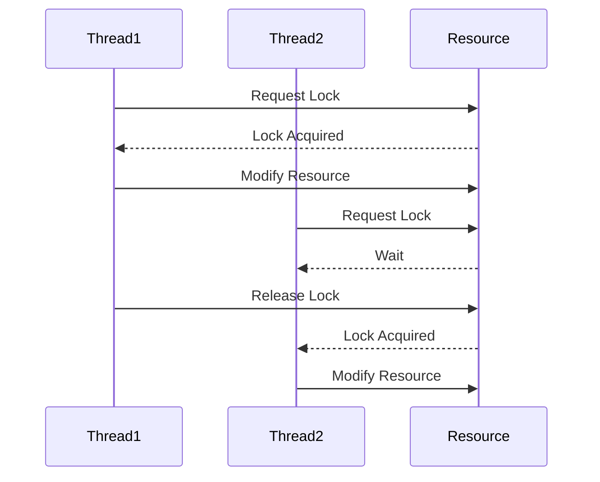

## 9.6 Thread Safety and Synchronization

In the realm of concurrent programming, ensuring thread safety and synchronization is paramount to prevent inconsistent states and crashes. As Swift developers, understanding these concepts allows us to build robust, efficient, and reliable applications. This section delves into the intricacies of thread safety and synchronization, providing you with the tools and knowledge necessary to handle concurrent access to shared resources effectively.

### Intent

The primary intent of thread safety and synchronization is to manage concurrent access to shared resources, ensuring that operations do not lead to data corruption or unexpected behavior. By implementing synchronization mechanisms, we can coordinate the execution of threads, maintaining data integrity and application stability.

### Implementing Synchronization

Synchronization in Swift can be achieved through various mechanisms, each suited for different scenarios. Let's explore these mechanisms and how they can be applied in Swift programming.

#### Serial Queues

Serial queues are a fundamental tool in managing concurrency. By enforcing an execution order, they prevent conflicts that arise from simultaneous access to shared resources.

```swift
let serialQueue = DispatchQueue(label: "com.example.serialQueue")

serialQueue.async {
    // Task 1
    print("Task 1 is running")
}

serialQueue.async {
    // Task 2
    print("Task 2 is running")
}
```

In this example, tasks are executed in the order they are added to the queue, ensuring that only one task runs at a time. This serialization is crucial when tasks modify shared resources.

#### Locks and Semaphores

Locks and semaphores are traditional synchronization tools that provide mutual exclusion, allowing only one thread to access a critical section at a time.

- **NSLock**: Provides a simple locking mechanism.

```swift
let lock = NSLock()

func criticalSection() {
    lock.lock()
    // Access shared resource
    print("Critical section")
    lock.unlock()
}
```

- **DispatchSemaphore**: Controls access to a finite number of resources.

```swift
let semaphore = DispatchSemaphore(value: 1)

DispatchQueue.global().async {
    semaphore.wait()
    // Access shared resource
    print("Accessing resource")
    semaphore.signal()
}
```

#### Atomic Operations

Atomic operations are indivisible operations that ensure thread safety without the need for explicit locks. Swift provides atomic properties for thread-safe operations.

```swift
import Foundation

class AtomicCounter {
    private var _value: Int32 = 0

    var value: Int32 {
        return OSAtomicAdd32(0, &_value)
    }

    func increment() {
        OSAtomicIncrement32(&_value)
    }
}

let counter = AtomicCounter()
counter.increment()
print(counter.value)
```

#### Immutable Data Structures

Leveraging immutability is a powerful strategy for ensuring thread safety. By using immutable data structures, we eliminate the risk of data being modified by multiple threads simultaneously.

```swift
struct ImmutableData {
    let value: Int
}

let data = ImmutableData(value: 42)
// No thread can modify 'data', ensuring safety
```

### Use Cases and Examples

Understanding when and how to apply synchronization techniques is crucial. Let's explore some common use cases and examples.

#### Critical Sections

Critical sections are parts of the code that access shared resources. Protecting these sections is essential to prevent data races.

```swift
let lock = NSLock()

func updateSharedResource() {
    lock.lock()
    // Modify shared resource
    print("Updating shared resource")
    lock.unlock()
}
```

#### Resource Management

Managing access to finite resources, such as network connections or file handles, is a common synchronization challenge.

```swift
let semaphore = DispatchSemaphore(value: 3) // Allow 3 concurrent accesses

func accessResource() {
    semaphore.wait()
    // Access resource
    print("Resource accessed")
    semaphore.signal()
}
```

#### Deadlock Avoidance

Deadlocks occur when two or more threads are blocked forever, waiting for each other. Implementing lock hierarchies carefully can help avoid deadlocks.

```swift
class Resource {
    private let lock1 = NSLock()
    private let lock2 = NSLock()

    func method1() {
        lock1.lock()
        lock2.lock()
        // Perform operations
        lock2.unlock()
        lock1.unlock()
    }

    func method2() {
        lock1.lock()
        lock2.lock()
        // Perform operations
        lock2.unlock()
        lock1.unlock()
    }
}
```

### Visualizing Thread Safety and Synchronization

To better understand these concepts, let's visualize the process of thread synchronization using Mermaid.js diagrams.



This sequence diagram illustrates how two threads interact with a shared resource, acquiring and releasing locks to ensure safe access.

### References and Links

For further reading on thread safety and synchronization in Swift, consider exploring the following resources:

- [Apple's Concurrency Programming Guide](https://developer.apple.com/library/archive/documentation/General/Conceptual/ConcurrencyProgrammingGuide/Introduction/Introduction.html)
- [Swift.org - Concurrency](https://swift.org/documentation/concurrency/)
- [Ray Wenderlich's Concurrency in Swift](https://www.raywenderlich.com/148893/concurrency-in-swift-2)

### Knowledge Check

To reinforce your understanding of thread safety and synchronization, consider the following questions:

- What are the benefits of using serial queues for synchronization?
- How do locks and semaphores differ in their approach to synchronization?
- Why are atomic operations important in concurrent programming?

### Embrace the Journey

Remember, mastering thread safety and synchronization is a journey. As you continue to explore these concepts, you'll gain the skills necessary to build more complex and reliable applications. Keep experimenting, stay curious, and enjoy the process!

## Quiz Time!



### What is the primary intent of thread safety and synchronization?

- [x] To manage concurrent access to shared resources and prevent data corruption
- [ ] To increase the speed of application execution
- [ ] To reduce the number of threads in an application
- [ ] To simplify code readability

> **Explanation:** Thread safety and synchronization aim to manage concurrent access to shared resources, ensuring data integrity and preventing corruption.

### Which synchronization mechanism enforces an execution order to prevent conflicts?

- [x] Serial Queues
- [ ] Atomic Operations
- [ ] Locks
- [ ] Semaphores

> **Explanation:** Serial queues enforce an execution order, ensuring tasks are executed one at a time, preventing conflicts.

### What is the role of `NSLock` in synchronization?

- [x] To provide a simple locking mechanism for mutual exclusion
- [ ] To manage multiple threads simultaneously
- [ ] To increase the speed of data processing
- [ ] To handle network requests

> **Explanation:** `NSLock` is used to provide a simple locking mechanism, ensuring mutual exclusion for critical sections.

### How do atomic operations ensure thread safety?

- [x] By performing indivisible operations without explicit locks
- [ ] By using semaphores to manage access
- [ ] By creating new threads for each operation
- [ ] By using immutable data structures

> **Explanation:** Atomic operations are indivisible, ensuring thread safety without the need for explicit locks.

### What is a common cause of deadlocks in concurrent programming?

- [x] Threads waiting for each other to release locks
- [ ] Using too many semaphores
- [ ] Excessive use of atomic operations
- [ ] Insufficient number of threads

> **Explanation:** Deadlocks occur when threads wait indefinitely for each other to release locks, causing a standstill.

### How can immutability contribute to thread safety?

- [x] By preventing data from being modified by multiple threads simultaneously
- [ ] By allowing threads to modify data freely
- [ ] By increasing the speed of data processing
- [ ] By simplifying code readability

> **Explanation:** Immutability ensures that data cannot be modified by multiple threads simultaneously, contributing to thread safety.

### What is the purpose of `DispatchSemaphore` in synchronization?

- [x] To control access to a finite number of resources
- [ ] To lock and unlock critical sections
- [ ] To perform atomic operations
- [ ] To manage thread priorities

> **Explanation:** `DispatchSemaphore` is used to control access to a finite number of resources, ensuring synchronized access.

### Why is it important to protect critical sections in concurrent programming?

- [x] To prevent data races and ensure data integrity
- [ ] To increase the number of threads
- [ ] To simplify code readability
- [ ] To manage network requests

> **Explanation:** Protecting critical sections prevents data races, ensuring data integrity and consistent application behavior.

### What is a benefit of using serial queues for synchronization?

- [x] They ensure tasks are executed one at a time, preventing conflicts
- [ ] They increase the speed of execution
- [ ] They allow for parallel processing
- [ ] They simplify code readability

> **Explanation:** Serial queues ensure tasks are executed one at a time, preventing conflicts and ensuring data integrity.

### True or False: Deadlocks can occur when threads wait indefinitely for each other to release locks.

- [x] True
- [ ] False

> **Explanation:** Deadlocks occur when threads wait indefinitely for each other to release locks, causing a standstill in execution.


