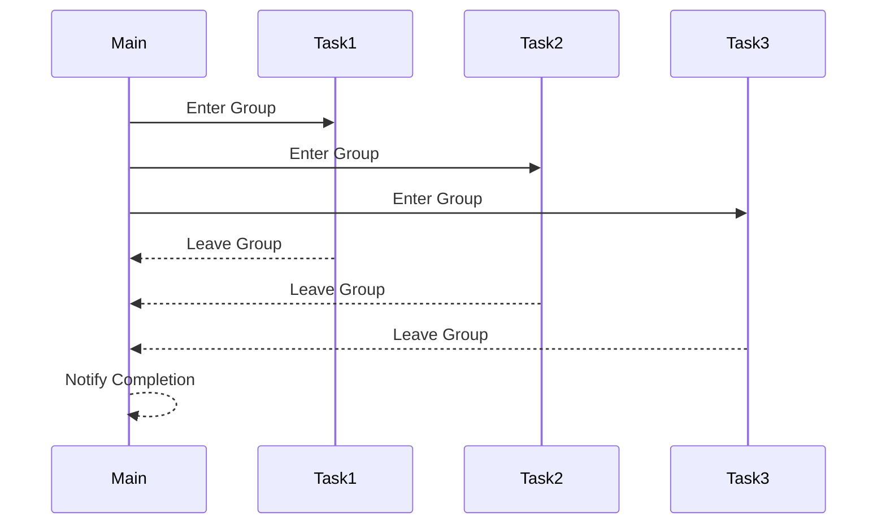
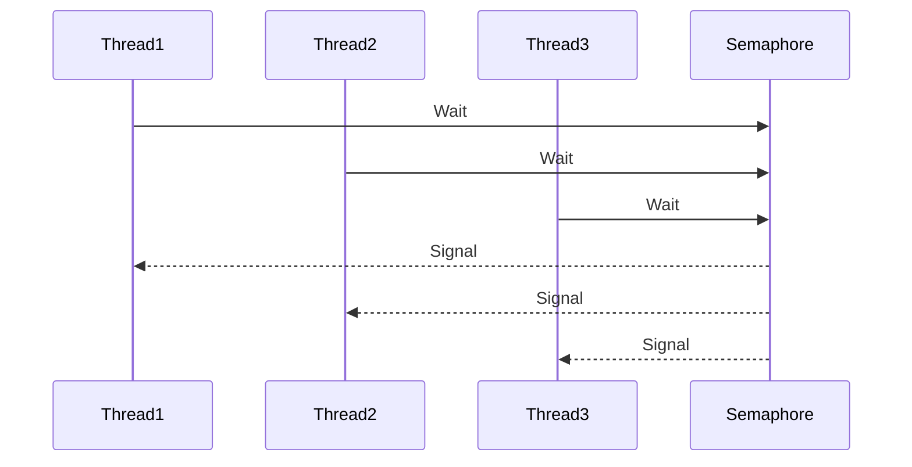

## 9.7 Dispatch Groups and Semaphores

Concurrency is a fundamental aspect of modern programming, especially in the context of Swift development for iOS and macOS. In this section, we delve into two powerful tools provided by Swift's Grand Central Dispatch (GCD): **Dispatch Groups** and **Semaphores**. These constructs allow us to coordinate multiple asynchronous tasks and synchronize their completion, ensuring efficient and effective resource management.

### Intent

The primary intent of using Dispatch Groups and Semaphores is to coordinate multiple asynchronous tasks and synchronize their completion. This is crucial when you need to:

- Wait for a set of tasks to complete before proceeding.
- Limit the number of concurrent accesses to a resource.
- Manage the execution flow of threads.

### Using Dispatch Groups

Dispatch Groups in Swift provide a mechanism for monitoring a group of tasks and receiving a notification when all tasks in the group have completed. This is particularly useful for coordinating multiple asynchronous operations.

#### Entering and Leaving

To utilize Dispatch Groups, you need to signal when tasks start and finish using the `enter()` and `leave()` methods. Let's explore a simple example:

```swift
import Foundation

let dispatchGroup = DispatchGroup()

for i in 1...5 {
    dispatchGroup.enter()
    DispatchQueue.global().async {
        print("Task \\(i) started")
        sleep(2) // Simulate a network request or a long task
        print("Task \\(i) completed")
        dispatchGroup.leave()
    }
}

dispatchGroup.notify(queue: DispatchQueue.main) {
    print("All tasks are completed")
}
```

In this example, we create a dispatch group and enter it before starting each task. Once a task is completed, we call `leave()`. The `notify(queue:)` method is used to specify a block of code to execute once all tasks have finished.

#### Waiting for Completion

Sometimes, you might want to block the current thread until all tasks in the group are completed. This can be achieved using the `wait()` method:

```swift
dispatchGroup.wait()
print("All tasks have finished, continuing execution")
```

This approach is useful when you need to ensure that all tasks are completed before proceeding, but be cautious as it can block the main thread, potentially leading to a frozen UI in iOS applications.

#### Handling Timeouts

In scenarios where tasks might take longer than expected, you can handle timeouts using the `wait(timeout:)` method:

```swift
let result = dispatchGroup.wait(timeout: .now() + 5) // Wait for 5 seconds
if result == .timedOut {
    print("Tasks timed out")
} else {
    print("All tasks completed within the timeout")
}
```

This allows you to specify a maximum time to wait for the tasks to complete, providing a way to handle long-running operations gracefully.

### Using Semaphores

Semaphores are another powerful concurrency tool in Swift, used to control access to a resource by multiple threads. They can be particularly useful for limiting the number of concurrent accesses.

#### Counting Semaphores

A semaphore can be initialized with a count, which represents the number of concurrent accesses allowed. Here's an example:

```swift
import Foundation

let semaphore = DispatchSemaphore(value: 2) // Allow 2 concurrent accesses

for i in 1...5 {
    DispatchQueue.global().async {
        semaphore.wait() // Request access
        print("Task \\(i) is accessing the resource")
        sleep(2) // Simulate work
        print("Task \\(i) is releasing the resource")
        semaphore.signal() // Release access
    }
}
```

In this code, we create a semaphore with a count of 2, allowing two tasks to access the resource concurrently. Each task waits for access and signals when it's done, ensuring that no more than two tasks run simultaneously.

#### Signaling and Waiting

The `wait()` and `signal()` methods are used to control the flow of execution. `wait()` decreases the semaphore count, blocking if the count is zero, while `signal()` increases the count, allowing blocked threads to proceed.

#### Thread Pooling

Semaphores can also be used to manage thread pooling, ensuring that a fixed number of threads are active at any given time. This helps in optimizing resource usage and preventing system overload.

### Use Cases and Examples

#### Concurrent Downloads

Consider a scenario where you need to download multiple files concurrently and perform an action once all downloads are complete. Dispatch Groups are perfect for this use case:

```swift
let downloadGroup = DispatchGroup()

for url in downloadURLs {
    downloadGroup.enter()
    downloadFile(from: url) {
        downloadGroup.leave()
    }
}

downloadGroup.notify(queue: DispatchQueue.main) {
    print("All downloads completed")
}
```

In this example, each download task enters the group and leaves once completed. The `notify` method ensures that the completion block is executed only after all downloads are finished.

#### Resource Limiting

When dealing with limited resources, such as network connections or database connections, semaphores can be used to prevent overloading:

```swift
let resourceSemaphore = DispatchSemaphore(value: 3) // Limit to 3 concurrent accesses

for task in tasks {
    DispatchQueue.global().async {
        resourceSemaphore.wait()
        performTask(task)
        resourceSemaphore.signal()
    }
}
```

This code ensures that no more than three tasks access the resource simultaneously, preventing potential bottlenecks.

#### Batch Processing

Batch processing involves executing tasks in batches, waiting for each batch to complete before starting the next. Dispatch Groups can be used to synchronize the completion of each batch:

```swift
let batchGroup = DispatchGroup()

for batch in taskBatches {
    for task in batch {
        batchGroup.enter()
        DispatchQueue.global().async {
            performTask(task)
            batchGroup.leave()
        }
    }
    batchGroup.wait() // Wait for the current batch to complete
}

print("All batches processed")
```

In this example, we process tasks in batches, ensuring that each batch is completed before moving on to the next.

### Visualizing Dispatch Groups and Semaphores

To better understand the flow of execution when using Dispatch Groups and Semaphores, let's visualize these concepts using Mermaid.js diagrams.

#### Dispatch Groups Flow



This diagram illustrates the flow of tasks entering and leaving a Dispatch Group, with the main thread being notified upon completion.

#### Semaphores Flow



Here, we see multiple threads waiting on a semaphore, with each thread proceeding once the semaphore signals.

### Swift Unique Features

Swift's concurrency model, including Dispatch Groups and Semaphores, is built on top of Grand Central Dispatch (GCD), providing a robust and efficient way to manage concurrency. Swift's syntax and language features, such as closures and async/await, further enhance the ease of use and readability of concurrent code.

### Differences and Similarities

While both Dispatch Groups and Semaphores are used for managing concurrency, they serve different purposes:

- **Dispatch Groups**: Best used for coordinating the completion of multiple asynchronous tasks. They notify when all tasks are done.
- **Semaphores**: Ideal for controlling access to a limited resource, ensuring that a fixed number of tasks can access the resource concurrently.

### Design Considerations

When using Dispatch Groups and Semaphores, consider the following:

- **Avoid Blocking the Main Thread**: Use `notify` instead of `wait()` to prevent UI freezing.
- **Handle Timeouts**: Use timeouts to manage long-running tasks and avoid indefinite blocking.
- **Resource Management**: Use semaphores to prevent resource overuse, ensuring optimal performance.

### Try It Yourself

Experiment with the provided examples by modifying the number of tasks, semaphore counts, or adding timeouts. Observe how these changes affect the flow of execution and resource management.

### References and Links

- [Apple's Grand Central Dispatch Documentation](https://developer.apple.com/documentation/dispatch)
- [Swift.org - Concurrency](https://swift.org/documentation/concurrency/)
- [Ray Wenderlich's Guide to GCD](https://www.raywenderlich.com/60749-grand-central-dispatch-tutorial-getting-started)

### Knowledge Check

- What is the primary purpose of Dispatch Groups?
- How do semaphores help in managing resources?
- What are the potential pitfalls of using `wait()` on the main thread?

### Embrace the Journey

Remember, mastering concurrency is a journey. As you progress, you'll build more efficient and responsive applications. Keep experimenting, stay curious, and enjoy the process!

## Quiz Time!



### What is the primary purpose of Dispatch Groups?

- [x] To coordinate the completion of multiple asynchronous tasks.
- [ ] To limit the number of concurrent accesses to a resource.
- [ ] To manage thread pooling.
- [ ] To handle timeouts in tasks.

> **Explanation:** Dispatch Groups are used to coordinate the completion of multiple asynchronous tasks and notify when all tasks are done.

### How do semaphores help in managing resources?

- [x] By limiting the number of concurrent accesses.
- [ ] By notifying when all tasks are completed.
- [ ] By blocking the main thread.
- [ ] By handling timeouts.

> **Explanation:** Semaphores help manage resources by limiting the number of concurrent accesses, ensuring optimal performance.

### What method is used to signal the completion of a task in a Dispatch Group?

- [ ] enter()
- [x] leave()
- [ ] wait()
- [ ] notify()

> **Explanation:** The `leave()` method is used to signal the completion of a task in a Dispatch Group.

### Which method in Dispatch Groups can block the current thread until all tasks are completed?

- [ ] notify()
- [ ] enter()
- [x] wait()
- [ ] leave()

> **Explanation:** The `wait()` method can block the current thread until all tasks in the Dispatch Group are completed.

### What is the effect of calling `wait()` on a semaphore?

- [x] It decreases the semaphore count.
- [ ] It increases the semaphore count.
- [ ] It notifies the main thread.
- [ ] It blocks the semaphore.

> **Explanation:** Calling `wait()` on a semaphore decreases the semaphore count, potentially blocking if the count is zero.

### How can you prevent a Dispatch Group from blocking the main thread?

- [x] Use `notify` instead of `wait()`.
- [ ] Use `enter()` instead of `leave()`.
- [ ] Use `signal()` instead of `wait()`.
- [ ] Use a semaphore instead.

> **Explanation:** Using `notify` instead of `wait()` prevents a Dispatch Group from blocking the main thread.

### What is a common use case for semaphores?

- [x] Resource Limiting
- [ ] Coordinating asynchronous tasks
- [ ] Handling timeouts
- [ ] Blocking the main thread

> **Explanation:** A common use case for semaphores is resource limiting, ensuring that a fixed number of tasks can access a resource concurrently.

### What is the purpose of the `signal()` method in semaphores?

- [ ] To decrease the semaphore count
- [x] To increase the semaphore count
- [ ] To block the main thread
- [ ] To notify when tasks are completed

> **Explanation:** The `signal()` method increases the semaphore count, allowing blocked threads to proceed.

### What is the primary difference between Dispatch Groups and Semaphores?

- [x] Dispatch Groups coordinate task completion, while Semaphores control resource access.
- [ ] Dispatch Groups limit concurrent accesses, while Semaphores coordinate task completion.
- [ ] Both are used for handling timeouts.
- [ ] Both block the main thread.

> **Explanation:** Dispatch Groups coordinate the completion of tasks, while Semaphores control access to resources.

### True or False: Semaphores can be used to manage thread pooling.

- [x] True
- [ ] False

> **Explanation:** True. Semaphores can be used to manage thread pooling by controlling the number of active threads.



By understanding and utilizing Dispatch Groups and Semaphores, we can significantly enhance the concurrency capabilities of our Swift applications, leading to more responsive and efficient software. Keep exploring these concepts, and you'll be well on your way to mastering Swift concurrency!


