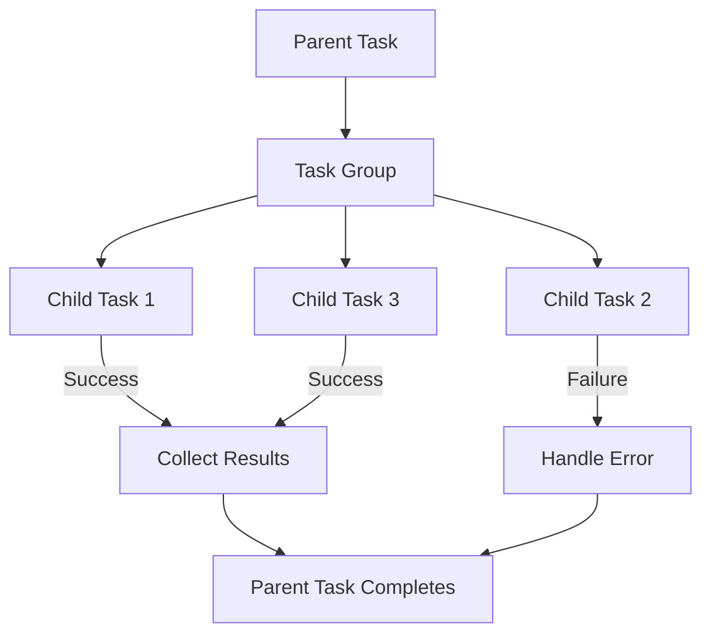

## 9.8 Structured Concurrency

In modern software development, concurrency is a crucial aspect that allows applications to perform multiple tasks simultaneously, improving responsiveness and efficiency. Swift, with its robust concurrency model, introduces structured concurrency to help developers manage concurrent tasks in a clear and maintainable way. In this section, we will delve into the concept of structured concurrency, explore its key components, and demonstrate how to implement it effectively in Swift applications.

### Intent

The primary intent of structured concurrency is to organize concurrent code into a clear and maintainable structure, where the lifetimes of tasks are controlled, and errors are propagated appropriately. This approach ensures that concurrent tasks are managed within a defined scope, making it easier to reason about their behavior and interactions.

### Implementing Structured Concurrency

#### Task Groups

Task groups are a fundamental component of structured concurrency in Swift. They allow you to create groups of tasks that run concurrently and manage their execution in a structured manner. Task groups provide a way to spawn multiple tasks and wait for their completion, collecting results and handling errors along the way.

**Creating a Task Group**

To create a task group, you use the `withTaskGroup` function, which takes a closure where you can add tasks to the group. Here's a simple example:

```swift
import Foundation

func fetchDataConcurrently() async {
    await withTaskGroup(of: String.self) { group in
        // Add tasks to the group
        group.addTask {
            // Simulate a network request
            return await fetchData(from: "https://api.example.com/data1")
        }
        
        group.addTask {
            // Simulate another network request
            return await fetchData(from: "https://api.example.com/data2")
        }
        
        // Collect results
        for await result in group {
            print("Fetched data: \\(result)")
        }
    }
}

func fetchData(from url: String) async -> String {
    // Simulate network delay
    try? await Task.sleep(nanoseconds: 1_000_000_000)
    return "Data from \\(url)"
}
```

In this example, we create a task group to fetch data from two different URLs concurrently. The `withTaskGroup` function manages the lifecycle of the tasks, ensuring they are all completed before proceeding.

#### Child Tasks

Child tasks are tasks that are spawned within a parent task. They inherit the context of the parent task, including its cancellation state and priority. This hierarchical relationship allows for better management of task lifetimes and error propagation.

**Spawning Child Tasks**

You can spawn child tasks using the `Task` initializer within an existing task context. Here's how you can create child tasks:

```swift
func processImagesConcurrently() async {
    await withTaskGroup(of: Void.self) { group in
        for imageName in ["image1.png", "image2.png", "image3.png"] {
            group.addTask {
                await processImage(named: imageName)
            }
        }
    }
}

func processImage(named imageName: String) async {
    // Simulate image processing
    try? await Task.sleep(nanoseconds: 500_000_000)
    print("Processed \\(imageName)")
}
```

In this example, we use a task group to process multiple images concurrently. Each image processing task is a child task of the task group.

#### Automatic Cancellation

One of the key benefits of structured concurrency is automatic cancellation. When a parent task is canceled, all its child tasks are automatically canceled as well. This behavior ensures that resources are not wasted on tasks that are no longer needed.

**Handling Cancellation**

You can handle cancellation by checking the cancellation state within your tasks. Here's an example:

```swift
func performCancellableTask() async {
    await withTaskGroup(of: Void.self) { group in
        group.addTask {
            if Task.isCancelled {
                print("Task was cancelled")
                return
            }
            // Perform some work
            print("Task completed")
        }
    }
}
```

In this example, we check if the task is canceled using `Task.isCancelled`. If the task is canceled, we can exit early, avoiding unnecessary work.

#### Awaiting Task Groups

Awaiting task groups allows you to collect results from multiple concurrent tasks. You can iterate over the results of a task group using a `for await` loop, which processes each result as it becomes available.

**Collecting Results**

Here's an example of collecting results from a task group:

```swift
func fetchDataAndProcess() async {
    await withTaskGroup(of: (String, Int).self) { group in
        for url in ["https://api.example.com/data1", "https://api.example.com/data2"] {
            group.addTask {
                let data = await fetchData(from: url)
                let processedData = processData(data)
                return (data, processedData)
            }
        }
        
        for await (data, processedData) in group {
            print("Fetched: \\(data), Processed: \\(processedData)")
        }
    }
}

func processData(_ data: String) -> Int {
    // Simulate data processing
    return data.count
}
```

In this example, we fetch data from multiple URLs and process it concurrently. The results are collected and printed as they become available.

### Use Cases and Examples

Structured concurrency is particularly useful in scenarios where multiple tasks need to be executed concurrently, and their results need to be collected and processed. Here are some common use cases:

#### Parallel Data Processing

Structured concurrency is ideal for parallel data processing, where large datasets can be divided into smaller chunks and processed concurrently. This approach can significantly improve performance by utilizing multiple cores effectively.

**Example: Parallel Data Processing**

```swift
func processLargeDataSet() async {
    let dataChunks = [/* large dataset divided into chunks */]
    
    await withTaskGroup(of: Int.self) { group in
        for chunk in dataChunks {
            group.addTask {
                return processChunk(chunk)
            }
        }
        
        var totalResult = 0
        for await result in group {
            totalResult += result
        }
        
        print("Total result: \\(totalResult)")
    }
}

func processChunk(_ chunk: [Int]) -> Int {
    // Simulate processing
    return chunk.reduce(0, +)
}
```

In this example, a large dataset is divided into chunks, and each chunk is processed concurrently. The results are aggregated to produce a final result.

#### Concurrent UI Updates

In UI applications, structured concurrency can be used to update UI components concurrently when it is safe to do so. This approach can improve the responsiveness of the application by offloading work to background tasks.

**Example: Concurrent UI Updates**

```swift
import SwiftUI

struct ContentView: View {
    @State private var images: [UIImage] = []
    
    var body: some View {
        VStack {
            ForEach(images, id: \.self) { image in
                Image(uiImage: image)
                    .resizable()
                    .scaledToFit()
            }
        }
        .onAppear {
            Task {
                await loadImagesConcurrently()
            }
        }
    }
    
    func loadImagesConcurrently() async {
        await withTaskGroup(of: UIImage?.self) { group in
            for imageName in ["image1.png", "image2.png", "image3.png"] {
                group.addTask {
                    return loadImage(named: imageName)
                }
            }
            
            for await image in group {
                if let image = image {
                    images.append(image)
                }
            }
        }
    }
    
    func loadImage(named imageName: String) -> UIImage? {
        // Simulate image loading
        return UIImage(named: imageName)
    }
}
```

In this SwiftUI example, images are loaded concurrently and displayed in a list. The use of structured concurrency ensures that the UI remains responsive while the images are being loaded.

#### Error Aggregation

Structured concurrency provides a mechanism for collecting and handling errors from concurrent tasks. This feature is particularly useful in scenarios where multiple tasks may fail, and you need to aggregate and handle these errors appropriately.

**Example: Error Aggregation**

```swift
enum DataError: Error {
    case networkError
    case processingError
}

func fetchDataWithErrorHandling() async throws {
    try await withThrowingTaskGroup(of: String.self) { group in
        let urls = ["https://api.example.com/data1", "https://api.example.com/data2"]
        
        for url in urls {
            group.addTask {
                let data = try await fetchData(from: url)
                guard !data.isEmpty else {
                    throw DataError.processingError
                }
                return data
            }
        }
        
        for try await result in group {
            print("Fetched data: \\(result)")
        }
    }
}

func fetchData(from url: String) async throws -> String {
    // Simulate network request
    let success = Bool.random()
    if !success {
        throw DataError.networkError
    }
    return "Data from \\(url)"
}
```

In this example, we use a throwing task group to handle errors from concurrent tasks. If a task fails, the error is propagated, and you can handle it appropriately.

### Visualizing Structured Concurrency

To better understand structured concurrency, let's visualize the flow of tasks and their relationships using a Mermaid.js diagram:



**Diagram Description**: This diagram illustrates a parent task that creates a task group. The task group spawns multiple child tasks, each running concurrently. The results of successful tasks are collected, and any errors are handled appropriately. Once all tasks are completed, the parent task also completes.

### Try It Yourself

To get hands-on experience with structured concurrency, try modifying the code examples provided. Here are some suggestions:

- **Modify the URLs** in the data fetching examples to point to real APIs and observe how the application handles network delays and errors.
- **Add more images** to the concurrent UI updates example and experiment with different image sizes to see how it affects performance.
- **Introduce random errors** in the error aggregation example and implement custom error handling logic to see how structured concurrency manages error propagation.

### References and Links

For further reading on structured concurrency and Swift's concurrency model, consider the following resources:

- [Swift.org: Concurrency](https://swift.org/documentation/concurrency/)
- [Apple Developer Documentation: Swift Concurrency](https://developer.apple.com/documentation/swift/swift_concurrency)
- [Swift Evolution Proposal: Structured Concurrency](https://github.com/apple/swift-evolution/blob/main/proposals/0304-structured-concurrency.md)

### Knowledge Check

Let's reinforce what we've learned about structured concurrency with some questions and exercises.

## Quiz Time!



### What is the primary intent of structured concurrency in Swift?

- [x] To organize concurrent code into a clear and maintainable structure
- [ ] To increase the speed of execution by running tasks in parallel
- [ ] To simplify the syntax of asynchronous code
- [ ] To eliminate the need for error handling in concurrent tasks

> **Explanation:** The primary intent of structured concurrency is to organize concurrent code into a clear and maintainable structure, ensuring controlled task lifetimes and appropriate error propagation.

### How do you create a task group in Swift?

- [x] Using the `withTaskGroup` function
- [ ] By creating an instance of `TaskGroup`
- [ ] Using the `DispatchGroup` class
- [ ] By implementing a custom concurrency model

> **Explanation:** Task groups are created using the `withTaskGroup` function, which provides a closure to add tasks and manage their execution.

### What is the benefit of automatic cancellation in structured concurrency?

- [x] It ensures that child tasks are canceled when the parent task is canceled
- [ ] It speeds up the execution of tasks
- [ ] It allows tasks to run indefinitely
- [ ] It eliminates the need for error handling

> **Explanation:** Automatic cancellation ensures that child tasks are canceled when the parent task is canceled, preventing unnecessary resource usage.

### How can you handle errors in a task group?

- [x] By using a throwing task group
- [ ] By ignoring errors
- [ ] By using `try-catch` within each task
- [ ] By implementing custom error handlers

> **Explanation:** Errors can be handled in a task group by using a throwing task group, which propagates errors from child tasks.

### Which of the following is a use case for structured concurrency?

- [x] Parallel data processing
- [ ] Sequential task execution
- [ ] Single-threaded applications
- [ ] Blocking I/O operations

> **Explanation:** Structured concurrency is ideal for parallel data processing, where tasks can be executed concurrently.

### What is the role of child tasks in structured concurrency?

- [x] They are tasks spawned within a parent task
- [ ] They run independently of parent tasks
- [ ] They are always executed sequentially
- [ ] They cannot be canceled

> **Explanation:** Child tasks are tasks spawned within a parent task, inheriting its context and cancellation state.

### How do you collect results from a task group?

- [x] Using a `for await` loop
- [ ] By accessing a results array directly
- [ ] By using `DispatchGroup` methods
- [ ] By polling each task individually

> **Explanation:** Results from a task group can be collected using a `for await` loop, which processes each result as it becomes available.

### What happens if a task in a throwing task group throws an error?

- [x] The error is propagated to the caller
- [ ] The task is retried automatically
- [ ] The error is ignored
- [ ] The task group continues without interruption

> **Explanation:** If a task in a throwing task group throws an error, the error is propagated to the caller, allowing for appropriate handling.

### True or False: Structured concurrency can be used to update UI components concurrently.

- [x] True
- [ ] False

> **Explanation:** True. Structured concurrency can be used to update UI components concurrently when it is safe to do so, improving application responsiveness.

### Which function is used to create a throwing task group?

- [x] `withThrowingTaskGroup`
- [ ] `withTaskGroup`
- [ ] `createThrowingTaskGroup`
- [ ] `taskGroupWithThrowing`

> **Explanation:** The `withThrowingTaskGroup` function is used to create a throwing task group, which handles errors from concurrent tasks.



Remember, structured concurrency is a powerful tool that can help you manage concurrent tasks effectively in your Swift applications. Keep experimenting, stay curious, and enjoy the journey of mastering concurrency in Swift!


