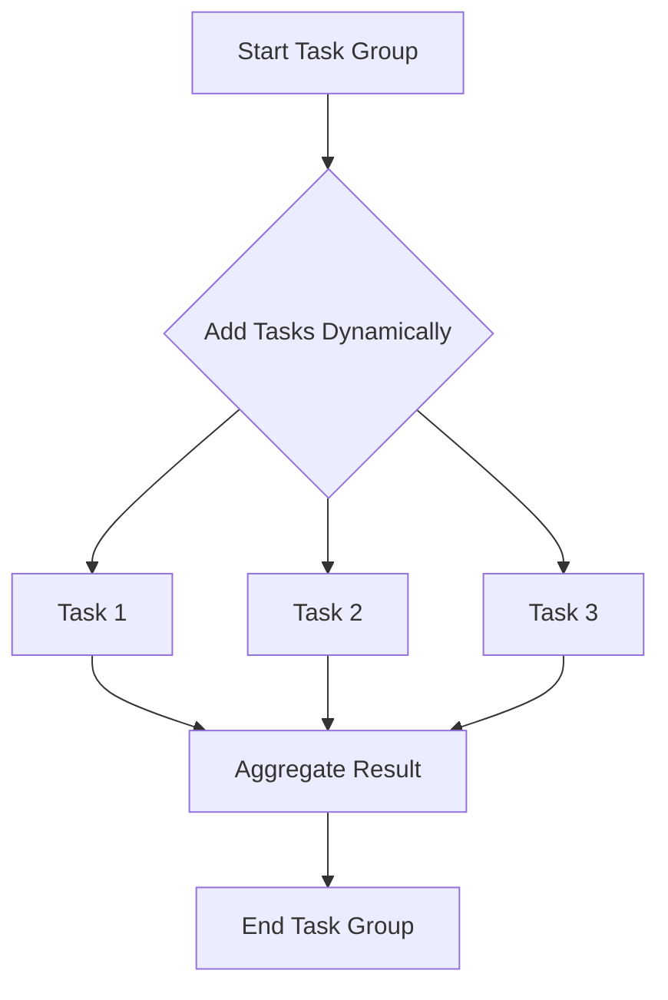
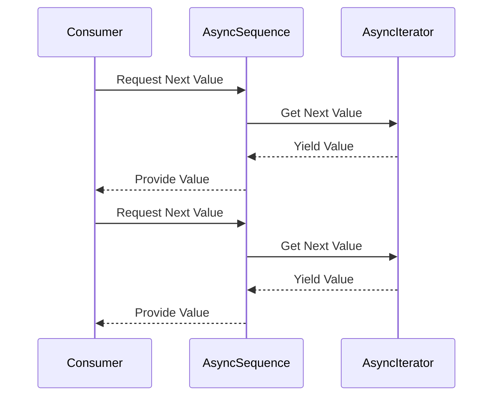

## 9.9 Task Groups and Asynchronous Sequences

In the realm of Swift concurrency, Task Groups and Asynchronous Sequences are pivotal constructs that allow developers to manage collections of asynchronous tasks and handle data streams efficiently. These tools provide a robust framework for executing tasks concurrently and processing data as it becomes available, making them indispensable for building scalable and responsive applications.

### Intent

The primary intent of using Task Groups and Asynchronous Sequences is to work efficiently with collections of asynchronous tasks or data streams. They enable developers to:

- **Concurrent Iteration**: Execute multiple tasks in parallel and iterate over their results as they complete.
- **Result Aggregation**: Collect and aggregate results from concurrent tasks seamlessly.
- **Dynamic Task Creation**: Add tasks to a group dynamically based on runtime conditions.
- **Streaming Data**: Process data incrementally as it becomes available.
- **Event Handling**: React to events in an asynchronous manner.
- **Concurrent Fetching**: Retrieve data from multiple sources simultaneously.

### Using Task Groups

Task Groups in Swift allow you to manage a collection of tasks that run concurrently. They are particularly useful when you need to perform a set of operations in parallel and then aggregate their results.

#### Concurrent Iteration

Task Groups enable concurrent iteration over tasks, allowing each task to run independently and in parallel. This is particularly useful when you have a collection of tasks that can be executed simultaneously.

```swift
import Foundation

func fetchDataConcurrently(urls: [URL]) async throws -> [Data] {
    return try await withThrowingTaskGroup(of: Data.self) { group in
        for url in urls {
            group.addTask {
                let (data, _) = try await URLSession.shared.data(from: url)
                return data
            }
        }
        
        var results = [Data]()
        for try await data in group {
            results.append(data)
        }
        return results
    }
}
```

In this example, we use a `TaskGroup` to fetch data from multiple URLs concurrently. Each task fetches data from a URL and appends the result to the `results` array as it completes.

#### Result Aggregation

Task Groups provide a convenient way to aggregate results from concurrent tasks. As tasks complete, their results can be collected and processed.

```swift
import Foundation

func sumNumbersConcurrently(numbers: [Int]) async -> Int {
    await withTaskGroup(of: Int.self) { group in
        for number in numbers {
            group.addTask {
                return number * number
            }
        }
        
        var sum = 0
        for await result in group {
            sum += result
        }
        return sum
    }
}
```

Here, we use a `TaskGroup` to compute the square of each number in the `numbers` array concurrently. The results are aggregated into a `sum` as they become available.

#### Dynamic Task Creation

Task Groups allow for dynamic task creation, meaning you can add tasks to a group based on runtime conditions. This flexibility is useful when the number of tasks or their inputs are not known at compile time.

```swift
import Foundation

func performDynamicTasks() async {
    await withTaskGroup(of: Void.self) { group in
        for i in 1...5 {
            group.addTask {
                print("Task \\(i) started")
                try await Task.sleep(nanoseconds: UInt64(i) * 1_000_000_000)
                print("Task \\(i) completed")
            }
        }
    }
}
```

In this example, we dynamically create tasks within a loop, each with a different delay. The tasks are added to the group and executed concurrently.

### Implementing Asynchronous Sequences

Asynchronous Sequences in Swift are sequences that produce values over time. They are defined using the `AsyncSequence` protocol and provide a way to handle data streams asynchronously.

#### AsyncSequence Protocol

The `AsyncSequence` protocol defines a sequence that produces values asynchronously. It is similar to the `Sequence` protocol but tailored for asynchronous operations.

```swift
import Foundation

struct Countdown: AsyncSequence {
    typealias Element = Int
    
    let start: Int
    
    struct AsyncIterator: AsyncIteratorProtocol {
        var current: Int
        
        mutating func next() async -> Int? {
            guard current > 0 else { return nil }
            try await Task.sleep(nanoseconds: 1_000_000_000)
            defer { current -= 1 }
            return current
        }
    }
    
    func makeAsyncIterator() -> AsyncIterator {
        return AsyncIterator(current: start)
    }
}
```

In this example, we define a `Countdown` asynchronous sequence that counts down from a given start number, producing one value per second.

#### AsyncIterator

The `AsyncIterator` is responsible for producing values asynchronously. It implements the `AsyncIteratorProtocol` and provides the `next()` method to yield values over time.

```swift
// Usage of Countdown AsyncSequence
let countdown = Countdown(start: 5)
for await number in countdown {
    print(number)
}
```

Here, we use a `for-await` loop to consume the `Countdown` sequence, printing each number as it becomes available.

#### For-Await Loops

The `for-await` loop is used to consume asynchronous sequences. It allows you to iterate over the values produced by an `AsyncSequence` as they become available.

### Use Cases and Examples

Task Groups and Asynchronous Sequences are versatile tools that can be applied to various use cases, including:

#### Streaming Data

Asynchronous sequences are ideal for streaming data, where data is processed incrementally as it becomes available. This is useful for handling large datasets or real-time data feeds.

```swift
import Foundation

struct DataStream: AsyncSequence {
    typealias Element = Data
    
    struct AsyncIterator: AsyncIteratorProtocol {
        var currentIndex = 0
        let dataChunks: [Data]
        
        mutating func next() async -> Data? {
            guard currentIndex < dataChunks.count else { return nil }
            let chunk = dataChunks[currentIndex]
            currentIndex += 1
            try await Task.sleep(nanoseconds: 500_000_000) // Simulate delay
            return chunk
        }
    }
    
    let dataChunks: [Data]
    
    func makeAsyncIterator() -> AsyncIterator {
        return AsyncIterator(dataChunks: dataChunks)
    }
}

// Usage of DataStream AsyncSequence
let dataStream = DataStream(dataChunks: [Data("Chunk1".utf8), Data("Chunk2".utf8)])
for await chunk in dataStream {
    print(String(data: chunk, encoding: .utf8)!)
}
```

In this example, we define a `DataStream` asynchronous sequence that simulates streaming data in chunks.

#### Event Handling

Asynchronous sequences can be used to handle events, reacting to them as they occur. This is useful for building responsive applications that need to process events in real-time.

```swift
import Foundation

struct EventStream: AsyncSequence {
    typealias Element = String
    
    struct AsyncIterator: AsyncIteratorProtocol {
        var events: [String]
        
        mutating func next() async -> String? {
            guard !events.isEmpty else { return nil }
            let event = events.removeFirst()
            try await Task.sleep(nanoseconds: 1_000_000_000) // Simulate delay
            return event
        }
    }
    
    let events: [String]
    
    func makeAsyncIterator() -> AsyncIterator {
        return AsyncIterator(events: events)
    }
}

// Usage of EventStream AsyncSequence
let eventStream = EventStream(events: ["Event1", "Event2", "Event3"])
for await event in eventStream {
    print(event)
}
```

Here, we define an `EventStream` asynchronous sequence that simulates handling events as they occur.

#### Concurrent Fetching

Task Groups are perfect for concurrent fetching, where data is retrieved from multiple sources simultaneously. This is useful for optimizing network requests or parallelizing computations.

```swift
import Foundation

func fetchConcurrentData(urls: [URL]) async throws -> [Data] {
    return try await withThrowingTaskGroup(of: Data.self) { group in
        for url in urls {
            group.addTask {
                let (data, _) = try await URLSession.shared.data(from: url)
                return data
            }
        }
        
        var results = [Data]()
        for try await data in group {
            results.append(data)
        }
        return results
    }
}
```

In this example, we use a `TaskGroup` to fetch data from multiple URLs concurrently, optimizing network requests.

### Visualizing Task Groups and Asynchronous Sequences

To better understand the flow of Task Groups and Asynchronous Sequences, let's visualize their operation using Mermaid.js diagrams.

#### Task Group Flow



This diagram illustrates the flow of a Task Group, where tasks are added dynamically, executed concurrently, and their results are aggregated.

#### Asynchronous Sequence Flow



This sequence diagram shows the interaction between a consumer and an asynchronous sequence, where values are requested and provided over time.

### Swift Unique Features

Swift's concurrency model, powered by `async/await`, provides a seamless way to work with asynchronous code. Task Groups and Asynchronous Sequences leverage these features to offer powerful abstractions for concurrent programming.

- **Structured Concurrency**: Swift's structured concurrency model ensures that tasks are managed in a predictable and safe manner.
- **Error Handling**: Task Groups support error propagation, allowing you to handle errors gracefully in concurrent tasks.
- **Cancellation**: Swift's concurrency model supports task cancellation, providing control over long-running operations.

### Differences and Similarities

Task Groups and Asynchronous Sequences are both designed to handle concurrency, but they serve different purposes:

- **Task Groups**: Focus on executing and managing multiple concurrent tasks, ideal for parallel computations and aggregating results.
- **Asynchronous Sequences**: Focus on producing values over time, suitable for streaming data and event handling.

### Design Considerations

When using Task Groups and Asynchronous Sequences, consider the following:

- **Task Management**: Ensure tasks are properly managed and canceled when no longer needed.
- **Resource Utilization**: Be mindful of resource consumption, especially when dealing with a large number of concurrent tasks.
- **Error Handling**: Implement robust error handling to manage failures in asynchronous operations.

### Try It Yourself

Experiment with the provided code examples by modifying the task logic, changing the number of tasks, or simulating different data streams. This hands-on approach will deepen your understanding of Task Groups and Asynchronous Sequences.

### Knowledge Check

- **What are Task Groups used for?**
- **How do Asynchronous Sequences differ from regular sequences?**
- **What is the role of an AsyncIterator?**
- **How can you handle errors in Task Groups?**

### Embrace the Journey

Remember, mastering concurrency in Swift is a journey. As you explore Task Groups and Asynchronous Sequences, you'll unlock the potential to build high-performance, responsive applications. Keep experimenting, stay curious, and enjoy the process!

## Quiz Time!



### What is the primary purpose of Task Groups in Swift?

- [x] To manage and execute multiple concurrent tasks
- [ ] To handle synchronous tasks
- [ ] To manage memory allocation
- [ ] To define data structures

> **Explanation:** Task Groups are used to manage and execute multiple concurrent tasks, allowing for parallel processing.

### How do Asynchronous Sequences differ from regular sequences?

- [x] They produce values over time asynchronously
- [ ] They are faster than regular sequences
- [ ] They are used for synchronous data processing
- [ ] They do not support iteration

> **Explanation:** Asynchronous Sequences produce values over time asynchronously, unlike regular sequences that produce values immediately.

### What protocol must an asynchronous sequence conform to?

- [x] AsyncSequence
- [ ] Sequence
- [ ] AsyncIterator
- [ ] Iterator

> **Explanation:** An asynchronous sequence must conform to the `AsyncSequence` protocol to produce values asynchronously.

### What is the role of an AsyncIterator?

- [x] To produce values asynchronously for an AsyncSequence
- [ ] To manage task cancellation
- [ ] To handle errors in tasks
- [ ] To synchronize data access

> **Explanation:** An `AsyncIterator` is responsible for producing values asynchronously for an `AsyncSequence`.

### What is a key feature of Swift's concurrency model?

- [x] Structured Concurrency
- [ ] Synchronous Execution
- [ ] Manual Memory Management
- [ ] Lack of Error Handling

> **Explanation:** Swift's concurrency model features Structured Concurrency, ensuring safe and predictable task management.

### How can errors be handled in Task Groups?

- [x] Using error propagation and handling within the group
- [ ] By ignoring errors
- [ ] By using synchronous error handling
- [ ] By restarting tasks

> **Explanation:** Errors in Task Groups can be handled using error propagation and handling within the group.

### What is a common use case for Asynchronous Sequences?

- [x] Streaming data
- [ ] Synchronous data processing
- [ ] Memory management
- [ ] Task cancellation

> **Explanation:** Asynchronous Sequences are commonly used for streaming data, where values are processed incrementally.

### Which of the following is a benefit of using Task Groups?

- [x] Concurrent execution of tasks
- [ ] Synchronous task management
- [ ] Manual error handling
- [ ] Lack of resource management

> **Explanation:** Task Groups allow for the concurrent execution of tasks, optimizing performance.

### What is the function of a `for-await` loop?

- [x] To consume values from an AsyncSequence
- [ ] To iterate over synchronous sequences
- [ ] To manage task cancellation
- [ ] To handle errors

> **Explanation:** A `for-await` loop is used to consume values from an `AsyncSequence` as they become available.

### True or False: Task Groups can only be used for synchronous tasks.

- [ ] True
- [x] False

> **Explanation:** Task Groups are specifically designed for managing and executing concurrent asynchronous tasks.




