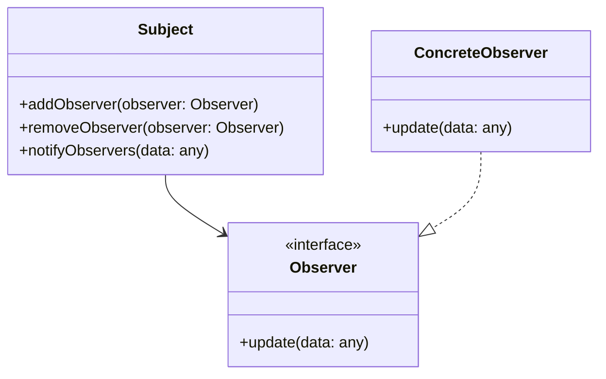

## 1.1 What are Design Patterns?

Design patterns are a cornerstone of software engineering, providing reusable solutions to common design problems. They are not finished designs that can be directly transformed into code but rather templates for solving problems that occur repeatedly in software development. In this section, we will delve into the essence of design patterns, their historical context, and their significance in modern programming, particularly in TypeScript.

### Defining Design Patterns

Design patterns are best described as general, reusable solutions to recurring problems within a given context in software design. They are like blueprints that can be customized to solve a particular design issue in your code. The concept of design patterns was popularized by the book "Design Patterns: Elements of Reusable Object-Oriented Software" by Erich Gamma, Richard Helm, Ralph Johnson, and John Vlissides, commonly known as the "Gang of Four" (GoF). This seminal work categorized patterns into three types: Creational, Structural, and Behavioral, each addressing different aspects of object-oriented design.

### The Origin of Design Patterns

The term "design pattern" was borrowed from the field of architecture, where it was used by Christopher Alexander to describe a solution to a problem in a context. Alexander's work inspired the GoF to apply similar principles to software engineering. The GoF book, published in 1994, laid the foundation for the formalization of design patterns in software development, providing a shared vocabulary for designers to communicate and collaborate effectively.

### Solving Recurring Design Problems

Design patterns are instrumental in addressing recurring design challenges. They encapsulate best practices and provide a proven approach to solving specific problems. For instance, consider the Singleton pattern, which ensures a class has only one instance and provides a global point of access to it. This pattern is particularly useful in scenarios where a single instance of a class is needed to coordinate actions across a system, such as a configuration manager or a connection pool.

Here's a simple implementation of the Singleton pattern in TypeScript:

```typescript
class Singleton {
  private static instance: Singleton;

  private constructor() {
    // Private constructor to prevent instantiation
  }

  public static getInstance(): Singleton {
    if (!Singleton.instance) {
      Singleton.instance = new Singleton();
    }
    return Singleton.instance;
  }

  public someBusinessLogic() {
    // Business logic here
  }
}

// Usage
const singleton1 = Singleton.getInstance();
const singleton2 = Singleton.getInstance();

console.log(singleton1 === singleton2); // true
```

In this example, the `Singleton` class restricts instantiation to a single object and provides a static method `getInstance` to access that instance. This pattern is particularly useful in managing shared resources or configurations.

### Importance of Design Patterns

Design patterns play a crucial role in promoting best practices and standardization in software development. They offer several benefits:

1. **Reusability**: Patterns provide a tested and proven solution to common problems, reducing the need to reinvent the wheel.
2. **Maintainability**: By following established patterns, code becomes more predictable and easier to maintain.
3. **Scalability**: Patterns help in designing systems that can scale efficiently as requirements evolve.
4. **Communication**: Patterns provide a common language for developers, facilitating better communication and understanding.

### Abstracting Complex Design Concepts

Design patterns abstract complex design concepts, making them more accessible and easier to implement. For example, the Observer pattern defines a one-to-many dependency between objects, so that when one object changes state, all its dependents are notified and updated automatically. This pattern is widely used in event-driven programming and is a key component of many frameworks.

Let's look at an example of the Observer pattern in TypeScript:

```typescript
interface Observer {
  update(data: any): void;
}

class Subject {
  private observers: Observer[] = [];

  public addObserver(observer: Observer): void {
    this.observers.push(observer);
  }

  public removeObserver(observer: Observer): void {
    this.observers = this.observers.filter(obs => obs !== observer);
  }

  public notifyObservers(data: any): void {
    for (const observer of this.observers) {
      observer.update(data);
    }
  }
}

class ConcreteObserver implements Observer {
  private name: string;

  constructor(name: string) {
    this.name = name;
  }

  public update(data: any): void {
    console.log(`${this.name} received data: ${data}`);
  }
}

// Usage
const subject = new Subject();
const observer1 = new ConcreteObserver('Observer 1');
const observer2 = new ConcreteObserver('Observer 2');

subject.addObserver(observer1);
subject.addObserver(observer2);

subject.notifyObservers('Hello, Observers!');
```

In this example, `Subject` maintains a list of `Observer` objects and notifies them of any changes. This pattern is particularly useful in scenarios where changes in one part of the system need to be reflected in others, such as in user interfaces or real-time data feeds.

### Try It Yourself

To deepen your understanding, try modifying the code examples above. For the Singleton pattern, experiment with adding additional methods or properties to the Singleton class. For the Observer pattern, try adding more observers or changing the data being notified to see how the system responds.

### Visualizing Design Patterns

To better understand how design patterns work, let's visualize the Observer pattern using a class diagram:



In this diagram, the `Subject` class maintains a list of `Observer` objects and notifies them of changes. The `ConcreteObserver` class implements the `Observer` interface and defines the `update` method to react to changes.

### References and Links

For further reading on design patterns, consider exploring the following resources:

- [Design Patterns: Elements of Reusable Object-Oriented Software](https://en.wikipedia.org/wiki/Design_Patterns) by the Gang of Four
- [MDN Web Docs on JavaScript Design Patterns](https://developer.mozilla.org/en-US/docs/Web/JavaScript/Guide/Details_of_the_Object_Model)
- [Refactoring Guru's Design Patterns](https://refactoring.guru/design-patterns)

### Knowledge Check

- What are design patterns, and why are they important?
- How does the Singleton pattern ensure that a class has only one instance?
- What are the benefits of using design patterns in software development?
- How does the Observer pattern facilitate communication between objects?

### Embrace the Journey

Remember, understanding design patterns is just the beginning. As you continue to explore and apply these patterns, you'll find new ways to solve complex problems and improve your code. Keep experimenting, stay curious, and enjoy the journey!

### Quiz Time!



### What is a design pattern in software engineering?

- [x] A reusable solution to a common problem in software design.
- [ ] A specific implementation of a software feature.
- [ ] A programming language syntax rule.
- [ ] A type of software testing methodology.

> **Explanation:** Design patterns provide reusable solutions to common design problems, acting as templates for solving recurring issues in software development.

### Who popularized the concept of design patterns in software engineering?

- [x] The Gang of Four (GoF)
- [ ] Christopher Alexander
- [ ] Alan Turing
- [ ] Donald Knuth

> **Explanation:** The Gang of Four (GoF) popularized design patterns in software engineering through their book "Design Patterns: Elements of Reusable Object-Oriented Software."

### Which of the following is a benefit of using design patterns?

- [x] Improved maintainability
- [x] Better communication among developers
- [ ] Increased code duplication
- [ ] Reduced code readability

> **Explanation:** Design patterns improve maintainability and provide a common language for developers, enhancing communication and understanding.

### What type of pattern is the Singleton pattern?

- [x] Creational
- [ ] Structural
- [ ] Behavioral
- [ ] Observer

> **Explanation:** The Singleton pattern is a creational pattern that ensures a class has only one instance and provides a global point of access to it.

### How does the Observer pattern work?

- [x] It defines a one-to-many dependency between objects.
- [ ] It ensures a class has only one instance.
- [ ] It provides a simplified interface to a complex subsystem.
- [ ] It decouples an abstraction from its implementation.

> **Explanation:** The Observer pattern defines a one-to-many dependency between objects, allowing changes in one object to be reflected in others.

### What is the primary purpose of design patterns?

- [x] To provide reusable solutions to common design problems.
- [ ] To enforce strict coding standards.
- [ ] To replace the need for software testing.
- [ ] To eliminate the need for documentation.

> **Explanation:** The primary purpose of design patterns is to provide reusable solutions to common design problems, facilitating better software design.

### Which pattern is useful for managing shared resources or configurations?

- [x] Singleton
- [ ] Observer
- [ ] Factory
- [ ] Decorator

> **Explanation:** The Singleton pattern is useful for managing shared resources or configurations by ensuring a single instance of a class.

### What is a key characteristic of design patterns?

- [x] They are language-agnostic.
- [ ] They are specific to JavaScript.
- [ ] They are only applicable to web development.
- [ ] They are only used in TypeScript.

> **Explanation:** Design patterns are language-agnostic and can be applied across different programming languages and domains.

### True or False: Design patterns are finished designs ready to be implemented in code.

- [ ] True
- [x] False

> **Explanation:** Design patterns are not finished designs but templates that provide a proven approach to solving specific design problems.

### Which of the following is a type of design pattern?

- [x] Creational
- [x] Structural
- [x] Behavioral
- [ ] Functional

> **Explanation:** Design patterns are categorized into Creational, Structural, and Behavioral types, each addressing different aspects of software design.


