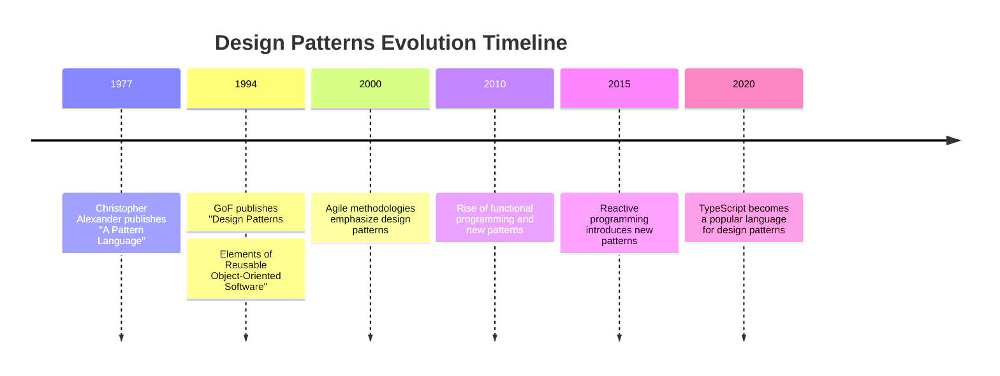

## 1.2 History and Evolution of Design Patterns

Design patterns have become an essential part of software engineering, providing reusable solutions to common problems. This section explores the history and evolution of design patterns, tracing their roots from architectural concepts to their modern application in TypeScript.

### The Architectural Roots: Christopher Alexander

The concept of design patterns originated in the field of architecture, introduced by Christopher Alexander in the 1970s. Alexander's work focused on identifying recurring problems in architectural design and proposing reusable solutions. His book, "A Pattern Language: Towns, Buildings, Construction," laid the foundation for pattern-based thinking.

Alexander's patterns were not just solutions but a language for architects to communicate ideas. This concept of a "pattern language" inspired software engineers to apply similar principles to software design. The idea was to create a shared vocabulary that developers could use to discuss and solve design problems.

### The Birth of Software Design Patterns: The Gang of Four

The pivotal moment in the history of design patterns in software engineering came with the publication of "Design Patterns: Elements of Reusable Object-Oriented Software" in 1994 by Erich Gamma, Richard Helm, Ralph Johnson, and John Vlissides, collectively known as the "Gang of Four" (GoF). This book cataloged 23 design patterns, providing a common language for software developers.

The GoF patterns were categorized into three types: Creational, Structural, and Behavioral. These patterns addressed common problems in object-oriented programming and offered solutions that could be reused across different projects. The book emphasized the importance of design patterns in creating flexible and maintainable code.

### Evolution with Programming Paradigms

As programming paradigms evolved, so did design patterns. The rise of object-oriented programming (OOP) in the 1980s and 1990s provided fertile ground for the application of design patterns. OOP languages like C++ and Java were well-suited for implementing the GoF patterns, which focused on class and object interactions.

With the advent of new paradigms, such as functional programming and reactive programming, design patterns have continued to evolve. Functional programming languages like Haskell and Scala introduced patterns that leverage immutability and higher-order functions. Reactive programming, popularized by libraries like RxJS, brought patterns for handling asynchronous data streams.

### Milestones in the Adoption of Design Patterns

Several milestones mark the adoption and evolution of design patterns in software engineering:

1. **The GoF Book (1994):** The publication of the GoF book was a watershed moment, providing a comprehensive catalog of design patterns for OOP.

2. **Patterns in Java (1990s):** As Java gained popularity, design patterns became integral to Java development. Frameworks like Spring and Hibernate incorporated patterns to enhance modularity and flexibility.

3. **Agile and Patterns (2000s):** The Agile movement emphasized iterative development and adaptability, aligning well with the flexibility offered by design patterns. Patterns became a key part of Agile methodologies.

4. **Functional Patterns (2010s):** The rise of functional programming languages brought new patterns, such as monads and functors, which focus on composition and immutability.

5. **Reactive Patterns (2010s):** Reactive programming introduced patterns for managing asynchronous data flows, crucial for modern web applications.

### Design Patterns in Modern TypeScript Development

TypeScript, with its strong typing and OOP features, is well-suited for implementing design patterns. The language's support for classes, interfaces, and modules makes it an ideal choice for applying both traditional and modern patterns.

#### Creational Patterns in TypeScript

Creational patterns, such as Singleton and Factory, are commonly used in TypeScript to manage object creation. TypeScript's class syntax and access modifiers facilitate the implementation of these patterns.

```typescript
// Singleton Pattern in TypeScript
class Singleton {
  private static instance: Singleton;

  private constructor() {
    // Private constructor to prevent instantiation
  }

  public static getInstance(): Singleton {
    if (!Singleton.instance) {
      Singleton.instance = new Singleton();
    }
    return Singleton.instance;
  }
}

// Usage
const singleton1 = Singleton.getInstance();
const singleton2 = Singleton.getInstance();
console.log(singleton1 === singleton2); // true
```

#### Structural Patterns in TypeScript

Structural patterns, like Adapter and Decorator, help organize code and manage dependencies. TypeScript's interfaces and decorators make these patterns easy to implement.

```typescript
// Adapter Pattern in TypeScript
interface Target {
  request(): string;
}

class Adaptee {
  specificRequest(): string {
    return "Adaptee's specific request";
  }
}

class Adapter implements Target {
  private adaptee: Adaptee;

  constructor(adaptee: Adaptee) {
    this.adaptee = adaptee;
  }

  public request(): string {
    return this.adaptee.specificRequest();
  }
}

// Usage
const adaptee = new Adaptee();
const adapter = new Adapter(adaptee);
console.log(adapter.request()); // Adaptee's specific request
```

#### Behavioral Patterns in TypeScript

Behavioral patterns, such as Observer and Strategy, manage object interactions and behavior. TypeScript's support for classes and interfaces allows for clean implementations of these patterns.

```typescript
// Observer Pattern in TypeScript
interface Observer {
  update(message: string): void;
}

class Subject {
  private observers: Observer[] = [];

  public addObserver(observer: Observer): void {
    this.observers.push(observer);
  }

  public removeObserver(observer: Observer): void {
    this.observers = this.observers.filter(obs => obs !== observer);
  }

  public notifyObservers(message: string): void {
    for (const observer of this.observers) {
      observer.update(message);
    }
  }
}

class ConcreteObserver implements Observer {
  private name: string;

  constructor(name: string) {
    this.name = name;
  }

  public update(message: string): void {
    console.log(`${this.name} received message: ${message}`);
  }
}

// Usage
const subject = new Subject();
const observer1 = new ConcreteObserver("Observer 1");
const observer2 = new ConcreteObserver("Observer 2");

subject.addObserver(observer1);
subject.addObserver(observer2);

subject.notifyObservers("Hello, Observers!");
```

### Key Publications and Thought Leaders

The evolution of design patterns has been influenced by numerous publications and thought leaders. Beyond the GoF book, other significant contributions include:

- **"Patterns of Enterprise Application Architecture" by Martin Fowler:** This book extends the concept of design patterns to enterprise applications, providing patterns for data access, distribution, and concurrency.

- **"Domain-Driven Design" by Eric Evans:** Evans introduces patterns for modeling complex domains, emphasizing the importance of a shared language between developers and domain experts.

- **"Refactoring: Improving the Design of Existing Code" by Martin Fowler:** This book highlights the role of design patterns in refactoring, providing techniques for improving code structure.

### The Relevance of Design Patterns Today

Design patterns remain relevant in modern software development, including TypeScript applications. They provide a proven approach to solving common problems, enhancing code maintainability and scalability. As TypeScript continues to evolve, incorporating new language features, design patterns will adapt to leverage these capabilities.

### Try It Yourself

To deepen your understanding of design patterns in TypeScript, try modifying the code examples provided. For instance, experiment with creating your own patterns or adapting existing ones to suit different scenarios. Consider how TypeScript's features, such as generics and decorators, can enhance pattern implementations.

### Visualizing the Evolution of Design Patterns

To better understand the evolution of design patterns, let's visualize the timeline and key milestones:



### Knowledge Check

Reflect on the history and evolution of design patterns by considering the following questions:

- How did Christopher Alexander's work influence software design patterns?
- What role did the GoF book play in popularizing design patterns?
- How have design patterns evolved with new programming paradigms?
- Why are design patterns still relevant in modern TypeScript development?

### Conclusion

The history and evolution of design patterns demonstrate their enduring value in software engineering. From architectural roots to modern TypeScript applications, design patterns provide a framework for creating flexible, maintainable, and scalable software. As we continue to explore new paradigms and technologies, design patterns will remain a vital tool in the developer's toolkit.

## Quiz Time!



### Who introduced the concept of design patterns in architecture?

- [x] Christopher Alexander
- [ ] Erich Gamma
- [ ] Martin Fowler
- [ ] Eric Evans

> **Explanation:** Christopher Alexander introduced the concept of design patterns in architecture, which later inspired their application in software engineering.

### What is the significance of the "Gang of Four" book?

- [x] It cataloged 23 design patterns for object-oriented programming.
- [ ] It introduced functional programming patterns.
- [ ] It focused on design patterns for web development.
- [ ] It was the first book on software engineering.

> **Explanation:** The "Gang of Four" book cataloged 23 design patterns for object-oriented programming, providing a common language for developers.

### How have design patterns evolved with new programming paradigms?

- [x] They have incorporated patterns for functional and reactive programming.
- [ ] They have remained unchanged since the GoF book.
- [ ] They have focused solely on web development.
- [ ] They have been replaced by new methodologies.

> **Explanation:** Design patterns have evolved with new programming paradigms, incorporating patterns for functional and reactive programming.

### Which programming language is well-suited for implementing design patterns due to its features?

- [x] TypeScript
- [ ] Python
- [ ] Ruby
- [ ] PHP

> **Explanation:** TypeScript, with its strong typing and OOP features, is well-suited for implementing design patterns.

### What is a key benefit of using design patterns in software development?

- [x] They provide reusable solutions to common problems.
- [ ] They eliminate the need for testing.
- [ ] They make code less readable.
- [ ] They increase code complexity.

> **Explanation:** Design patterns provide reusable solutions to common problems, enhancing code maintainability and scalability.

### Which pattern is commonly used in TypeScript for managing object creation?

- [x] Singleton
- [ ] Observer
- [ ] Strategy
- [ ] Visitor

> **Explanation:** The Singleton pattern is commonly used in TypeScript for managing object creation.

### What is the role of structural patterns in software design?

- [x] They help organize code and manage dependencies.
- [ ] They focus on object creation.
- [ ] They define object behavior.
- [ ] They are used for data storage.

> **Explanation:** Structural patterns help organize code and manage dependencies, enhancing code structure.

### How do behavioral patterns benefit software design?

- [x] They manage object interactions and behavior.
- [ ] They focus on data storage.
- [ ] They eliminate the need for testing.
- [ ] They increase code complexity.

> **Explanation:** Behavioral patterns manage object interactions and behavior, improving software design.

### What is the significance of Martin Fowler's book "Patterns of Enterprise Application Architecture"?

- [x] It extends design patterns to enterprise applications.
- [ ] It focuses on web development patterns.
- [ ] It introduces patterns for game development.
- [ ] It was the first book on design patterns.

> **Explanation:** Martin Fowler's book extends design patterns to enterprise applications, providing patterns for data access, distribution, and concurrency.

### True or False: Design patterns are no longer relevant in modern software development.

- [ ] True
- [x] False

> **Explanation:** False. Design patterns remain relevant in modern software development, providing proven solutions to common problems.


