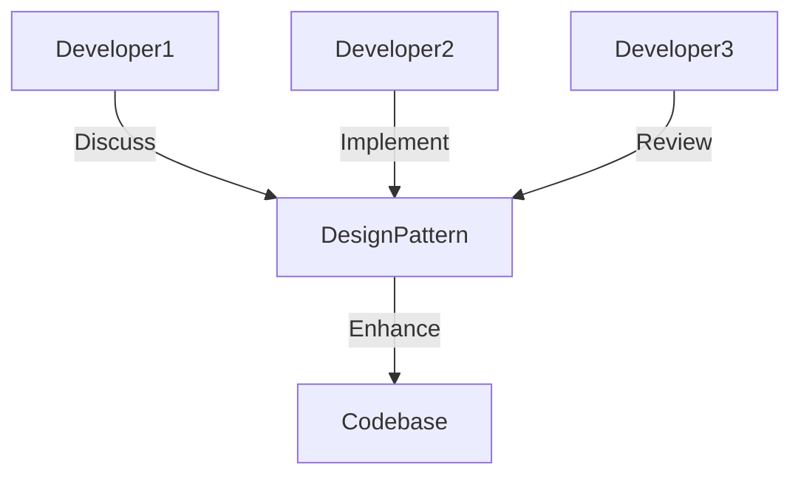
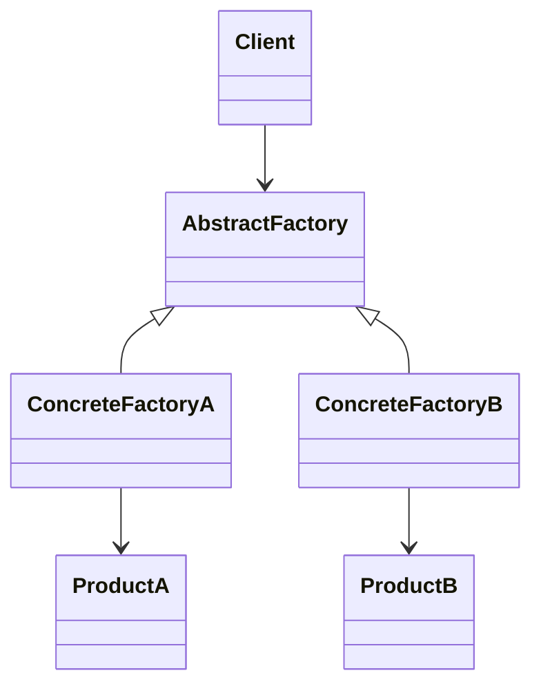

## 1.3 Importance of Design Patterns in Software Development

In the realm of software development, design patterns play an indispensable role in crafting maintainable, scalable, and efficient code. They provide a set of best practices that have been proven over time, helping developers solve common design problems. In this section, we will delve into the significance of design patterns, particularly in the context of TypeScript, and explore how they contribute to various aspects of software development.

### Enhancing Code Reusability and Maintainability

Design patterns are fundamental in promoting code reusability and maintainability. By encapsulating solutions to recurring problems, they allow developers to reuse code across different projects and contexts. This reusability is crucial in reducing redundancy and ensuring consistency throughout the codebase.

#### Code Example: Singleton Pattern

The Singleton pattern ensures that a class has only one instance and provides a global point of access to it. This is particularly useful in scenarios where a single instance of a class is required to coordinate actions across the system.

```typescript
class Singleton {
  private static instance: Singleton;

  private constructor() {
    // Private constructor to prevent instantiation
  }

  public static getInstance(): Singleton {
    if (!Singleton.instance) {
      Singleton.instance = new Singleton();
    }
    return Singleton.instance;
  }

  public showMessage(): void {
    console.log("Singleton instance method called!");
  }
}

// Usage
const singleton = Singleton.getInstance();
singleton.showMessage();
```

> **Try It Yourself**: Modify the Singleton class to include a counter that tracks how many times the `getInstance` method is called. Observe how the pattern ensures only one instance is created.

### Facilitating Communication Among Developers

Design patterns serve as a shared vocabulary among developers, enabling them to communicate complex ideas succinctly. This shared understanding is vital in collaborative environments, where clear and efficient communication can significantly impact project success.

#### Visualizing Communication with Design Patterns



> **Diagram Explanation**: This diagram illustrates how developers use design patterns as a common language to discuss, implement, and review code, ultimately enhancing the codebase.

### Speeding Up the Development Process

By providing proven solutions to common problems, design patterns can accelerate the development process. Developers can leverage these patterns to avoid reinventing the wheel, focusing instead on the unique aspects of their projects.

#### Code Example: Factory Method Pattern

The Factory Method pattern defines an interface for creating objects but allows subclasses to alter the type of objects that will be created. This pattern is particularly useful in scenarios where the exact type of object to be created is determined at runtime.

```typescript
interface Product {
  operation(): string;
}

class ConcreteProductA implements Product {
  public operation(): string {
    return '{Result of the ConcreteProductA}';
  }
}

class ConcreteProductB implements Product {
  public operation(): string {
    return '{Result of the ConcreteProductB}';
  }
}

abstract class Creator {
  public abstract factoryMethod(): Product;

  public someOperation(): string {
    const product = this.factoryMethod();
    return `Creator: The same creator's code has just worked with ${product.operation()}`;
  }
}

class ConcreteCreatorA extends Creator {
  public factoryMethod(): Product {
    return new ConcreteProductA();
  }
}

class ConcreteCreatorB extends Creator {
  public factoryMethod(): Product {
    return new ConcreteProductB();
  }
}

// Usage
function clientCode(creator: Creator) {
  console.log(creator.someOperation());
}

clientCode(new ConcreteCreatorA());
clientCode(new ConcreteCreatorB());
```

> **Try It Yourself**: Extend the example by adding a new product type and a corresponding creator. Notice how the pattern allows for easy extension without modifying existing code.

### Impact on Software Architecture and Design Quality

Design patterns have a profound impact on software architecture and design quality. They encourage the separation of concerns, modularity, and flexibility, which are essential attributes of robust software architecture.

#### Visualizing the Impact of Design Patterns on Architecture



> **Diagram Explanation**: This class diagram represents the Abstract Factory pattern, showcasing how design patterns contribute to a well-structured and flexible architecture.

### Consequences of the Absence of Design Patterns

Without design patterns, code can become difficult to maintain or extend. The absence of these patterns often leads to anti-patterns, such as spaghetti code, which is characterized by tangled and unstructured code that is hard to understand and modify.

#### Scenario: Spaghetti Code

Imagine a large application with no clear structure or design principles. As new features are added, the code becomes increasingly complex and interdependent, making it challenging to implement changes without breaking existing functionality.

### Benefits for Large-Scale and Long-Term Projects

Design patterns are particularly beneficial for large-scale and long-term projects. They provide a blueprint for organizing code, making it easier to manage complexity and ensure consistency across the codebase.

#### Code Example: Observer Pattern

The Observer pattern defines a one-to-many dependency between objects so that when one object changes state, all its dependents are notified and updated automatically. This pattern is invaluable in large-scale applications where multiple components need to react to changes in state.

```typescript
interface Observer {
  update(subject: Subject): void;
}

class ConcreteObserverA implements Observer {
  public update(subject: Subject): void {
    if (subject.state < 3) {
      console.log('ConcreteObserverA: Reacted to the event.');
    }
  }
}

class ConcreteObserverB implements Observer {
  public update(subject: Subject): void {
    if (subject.state === 0 || subject.state >= 2) {
      console.log('ConcreteObserverB: Reacted to the event.');
    }
  }
}

class Subject {
  public state: number;

  private observers: Observer[] = [];

  public attach(observer: Observer): void {
    const isExist = this.observers.includes(observer);
    if (isExist) {
      return console.log('Subject: Observer has been attached already.');
    }

    console.log('Subject: Attached an observer.');
    this.observers.push(observer);
  }

  public detach(observer: Observer): void {
    const observerIndex = this.observers.indexOf(observer);
    if (observerIndex === -1) {
      return console.log('Subject: Nonexistent observer.');
    }

    this.observers.splice(observerIndex, 1);
    console.log('Subject: Detached an observer.');
  }

  public notify(): void {
    console.log('Subject: Notifying observers...');
    for (const observer of this.observers) {
      observer.update(this);
    }
  }

  public someBusinessLogic(): void {
    console.log('\nSubject: I\'m doing something important.');
    this.state = Math.floor(Math.random() * (10 + 1));

    console.log(`Subject: My state has just changed to: ${this.state}`);
    this.notify();
  }
}

// Usage
const subject = new Subject();

const observer1 = new ConcreteObserverA();
subject.attach(observer1);

const observer2 = new ConcreteObserverB();
subject.attach(observer2);

subject.someBusinessLogic();
subject.someBusinessLogic();

subject.detach(observer2);

subject.someBusinessLogic();
```

> **Try It Yourself**: Add a new observer that reacts to a specific state change. Observe how the pattern allows for easy addition of new observers without modifying existing code.

### Addressing Common Misconceptions About Design Patterns

Despite their benefits, design patterns are sometimes misunderstood. A common misconception is that they are rigid templates that must be followed exactly. In reality, design patterns are flexible guidelines that can be adapted to fit the specific needs of a project.

#### Misconception: Design Patterns Are Overhead

Some developers believe that design patterns introduce unnecessary complexity. However, when used appropriately, they simplify the development process by providing clear solutions to common problems.

### Conclusion

Design patterns are a cornerstone of effective software development. They enhance code reusability and maintainability, facilitate communication among developers, speed up the development process, and improve software architecture and design quality. By understanding and applying design patterns, developers can create robust, scalable, and maintainable software solutions.

### Knowledge Check

Before we conclude, let's reinforce our understanding with a few questions and exercises.

1. **Explain how design patterns contribute to code reusability.**
2. **Discuss the role of design patterns in facilitating communication among developers.**
3. **Provide an example of how a design pattern can speed up the development process.**
4. **Analyze the impact of design patterns on software architecture and design quality.**
5. **Describe a scenario where the absence of design patterns could lead to code that is difficult to maintain or extend.**

Remember, this is just the beginning. As you progress, you'll build more complex and interactive applications using design patterns. Keep experimenting, stay curious, and enjoy the journey!

## Quiz Time!



### How do design patterns contribute to code reusability?

- [x] By encapsulating solutions to recurring problems
- [ ] By increasing code complexity
- [ ] By enforcing strict coding guidelines
- [ ] By limiting the use of inheritance

> **Explanation:** Design patterns encapsulate solutions to recurring problems, allowing developers to reuse code across different projects and contexts.

### What role do design patterns play in developer communication?

- [x] They provide a shared vocabulary for discussing complex ideas.
- [ ] They enforce strict coding standards.
- [ ] They eliminate the need for documentation.
- [ ] They reduce the need for code comments.

> **Explanation:** Design patterns serve as a shared vocabulary among developers, enabling them to communicate complex ideas succinctly.

### How can design patterns speed up the development process?

- [x] By providing proven solutions to common problems
- [ ] By requiring more time for implementation
- [ ] By increasing the need for debugging
- [ ] By complicating the codebase

> **Explanation:** Design patterns provide proven solutions to common problems, allowing developers to focus on the unique aspects of their projects.

### What impact do design patterns have on software architecture?

- [x] They encourage separation of concerns and modularity.
- [ ] They increase coupling between components.
- [ ] They reduce code readability.
- [ ] They limit the use of interfaces.

> **Explanation:** Design patterns encourage separation of concerns, modularity, and flexibility, which are essential attributes of robust software architecture.

### What is a common misconception about design patterns?

- [x] They are rigid templates that must be followed exactly.
- [ ] They simplify the development process.
- [ ] They enhance code maintainability.
- [ ] They facilitate communication among developers.

> **Explanation:** A common misconception is that design patterns are rigid templates that must be followed exactly, whereas they are flexible guidelines that can be adapted to fit specific project needs.

### How do design patterns benefit large-scale projects?

- [x] They provide a blueprint for organizing code.
- [ ] They increase the complexity of the codebase.
- [ ] They limit the scalability of the application.
- [ ] They enforce strict coding standards.

> **Explanation:** Design patterns provide a blueprint for organizing code, making it easier to manage complexity and ensure consistency across the codebase.

### What is the consequence of not using design patterns?

- [x] Code can become difficult to maintain or extend.
- [ ] Code becomes more readable.
- [ ] Code is easier to debug.
- [ ] Code is more efficient.

> **Explanation:** Without design patterns, code can become difficult to maintain or extend, often leading to anti-patterns like spaghetti code.

### How does the Observer pattern benefit large-scale applications?

- [x] It allows multiple components to react to changes in state.
- [ ] It increases the complexity of the application.
- [ ] It limits the scalability of the application.
- [ ] It reduces code readability.

> **Explanation:** The Observer pattern defines a one-to-many dependency between objects, allowing multiple components to react to changes in state.

### What is the Singleton pattern used for?

- [x] Ensuring a class has only one instance
- [ ] Creating multiple instances of a class
- [ ] Defining a family of algorithms
- [ ] Separating an abstraction from its implementation

> **Explanation:** The Singleton pattern ensures that a class has only one instance and provides a global point of access to it.

### True or False: Design patterns are only useful for large projects.

- [ ] True
- [x] False

> **Explanation:** Design patterns are useful for projects of all sizes, as they provide proven solutions to common problems and enhance code maintainability and scalability.


