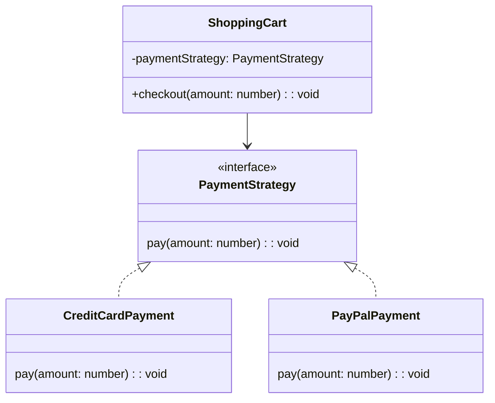
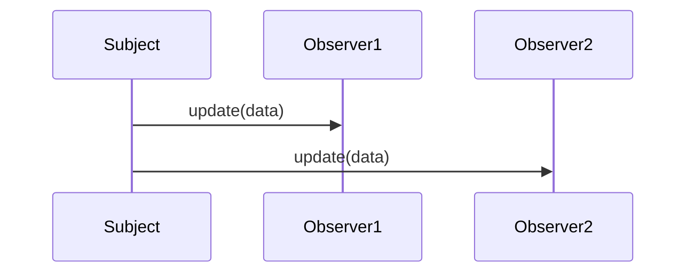

## 1.4 Benefits of Using Design Patterns in TypeScript

As expert software engineers, we understand that the complexity of modern applications demands robust solutions to common problems. Design patterns provide these solutions by offering proven templates for addressing recurring design challenges. When combined with TypeScript, a language that extends JavaScript by adding static types, interfaces, and other powerful features, design patterns become even more effective. In this section, we'll explore the benefits of using design patterns in TypeScript, focusing on how the language's features enhance pattern implementation, improve code maintainability, and boost development efficiency.

### Enhancing Design Patterns with TypeScript's Static Typing

Static typing is one of TypeScript's most significant advantages over JavaScript. By enforcing type constraints at compile time, TypeScript helps catch errors early in the development process, reducing runtime errors and improving code reliability. Let's examine how static typing enhances the implementation of design patterns.

#### Improved Code Safety and Predictability

Design patterns often involve complex interactions between objects. With TypeScript's static typing, we can define clear contracts between these objects, ensuring that they interact as expected. For instance, consider the Observer pattern, where a subject maintains a list of observers. By defining interfaces for both the subject and the observers, we can ensure that all observers implement the necessary methods to receive updates.

```typescript
interface Observer {
  update(data: any): void;
}

class Subject {
  private observers: Observer[] = [];

  addObserver(observer: Observer): void {
    this.observers.push(observer);
  }

  notifyObservers(data: any): void {
    for (const observer of this.observers) {
      observer.update(data);
    }
  }
}
```

In this example, the `Observer` interface defines a contract that all observers must follow, ensuring that the `notifyObservers` method can safely call the `update` method on each observer.

#### Enhanced Refactoring Capabilities

Static typing also facilitates refactoring, a crucial aspect of maintaining large codebases. When we refactor code in TypeScript, the compiler helps identify all the places where a type is used, making it easier to update code consistently. This capability is particularly beneficial when implementing design patterns, as it allows us to modify or extend patterns with confidence.

### Leveraging TypeScript's Features in Design Patterns

TypeScript offers several features that synergize well with design patterns, including interfaces, classes, and generics. Let's explore how these features enhance pattern implementation.

#### Interfaces and Abstraction

Interfaces in TypeScript provide a way to define the shape of an object, promoting abstraction and decoupling. Many design patterns, such as the Strategy and Factory patterns, rely on abstraction to allow for interchangeable components. By using interfaces, we can define these components' expected behavior without specifying their concrete implementations.

```typescript
interface PaymentStrategy {
  pay(amount: number): void;
}

class CreditCardPayment implements PaymentStrategy {
  pay(amount: number): void {
    console.log(`Paid ${amount} using Credit Card.`);
  }
}

class PayPalPayment implements PaymentStrategy {
  pay(amount: number): void {
    console.log(`Paid ${amount} using PayPal.`);
  }
}

class ShoppingCart {
  private paymentStrategy: PaymentStrategy;

  constructor(paymentStrategy: PaymentStrategy) {
    this.paymentStrategy = paymentStrategy;
  }

  checkout(amount: number): void {
    this.paymentStrategy.pay(amount);
  }
}
```

In this example, the `PaymentStrategy` interface allows us to switch between different payment methods without changing the `ShoppingCart` class, demonstrating the power of abstraction.

#### Classes and Inheritance

TypeScript's class syntax, which closely resembles that of other object-oriented languages, makes it easier to implement patterns that rely on inheritance, such as the Template Method and Decorator patterns. Classes in TypeScript support inheritance, access modifiers, and method overriding, providing a robust foundation for these patterns.

```typescript
abstract class Game {
  play(): void {
    this.initialize();
    this.startPlay();
    this.endPlay();
  }

  abstract initialize(): void;
  abstract startPlay(): void;
  abstract endPlay(): void;
}

class Football extends Game {
  initialize(): void {
    console.log("Football Game Initialized.");
  }

  startPlay(): void {
    console.log("Football Game Started.");
  }

  endPlay(): void {
    console.log("Football Game Finished.");
  }
}
```

Here, the Template Method pattern is implemented using TypeScript's abstract classes, allowing subclasses to define specific steps of the algorithm.

#### Generics for Reusability

Generics in TypeScript enable us to write reusable and flexible code by allowing types to be parameters. This feature is particularly useful in patterns like the Factory Method and Iterator patterns, where we want to create or iterate over objects of various types.

```typescript
class GenericFactory<T> {
  create(type: { new (): T }): T {
    return new type();
  }
}

class ProductA {
  constructor() {
    console.log("ProductA created");
  }
}

class ProductB {
  constructor() {
    console.log("ProductB created");
  }
}

const factory = new GenericFactory();
const productA = factory.create(ProductA);
const productB = factory.create(ProductB);
```

In this example, the `GenericFactory` class can create instances of any type, demonstrating the flexibility provided by generics.

### Managing Complex TypeScript Codebases with Design Patterns

As TypeScript applications grow in size and complexity, managing the codebase becomes increasingly challenging. Design patterns offer a structured approach to organizing code, making it easier to maintain and extend.

#### Promoting Code Organization and Readability

Design patterns provide a blueprint for organizing code, promoting consistency and readability across the codebase. By following established patterns, developers can quickly understand the structure and flow of the application, reducing the learning curve for new team members.

#### Facilitating Collaboration and Code Reviews

When multiple developers work on a project, consistent use of design patterns can facilitate collaboration and code reviews. Patterns provide a common language for discussing design decisions, making it easier to communicate ideas and identify potential issues.

### Performance and Development Efficiency Gains

Using design patterns in TypeScript can lead to performance improvements and increased development efficiency. Let's explore how patterns contribute to these gains.

#### Optimizing Performance with Efficient Patterns

Some design patterns, such as the Flyweight and Object Pool patterns, are specifically designed to optimize performance by reducing memory usage and improving resource management. By implementing these patterns in TypeScript, we can create applications that are both efficient and scalable.

```typescript
class Flyweight {
  private sharedState: string;

  constructor(sharedState: string) {
    this.sharedState = sharedState;
  }

  operation(uniqueState: string): void {
    console.log(`Shared: ${this.sharedState}, Unique: ${uniqueState}`);
  }
}

class FlyweightFactory {
  private flyweights: { [key: string]: Flyweight } = {};

  getFlyweight(sharedState: string): Flyweight {
    if (!this.flyweights[sharedState]) {
      this.flyweights[sharedState] = new Flyweight(sharedState);
    }
    return this.flyweights[sharedState];
  }
}

const factory = new FlyweightFactory();
const flyweight1 = factory.getFlyweight("shared");
flyweight1.operation("unique1");
const flyweight2 = factory.getFlyweight("shared");
flyweight2.operation("unique2");
```

In this Flyweight pattern example, shared state is reused, reducing memory consumption.

#### Streamlining Development Processes

Design patterns can streamline development by providing ready-made solutions to common problems. This approach reduces the time spent on designing and implementing custom solutions, allowing developers to focus on building features and improving the application.

### Overcoming JavaScript Limitations with TypeScript

While JavaScript is a versatile language, it has limitations that can complicate the implementation of design patterns. TypeScript addresses many of these limitations, making it easier to apply patterns effectively.

#### Ensuring Type Safety and Consistency

JavaScript's dynamic typing can lead to runtime errors and inconsistencies, especially in large codebases. TypeScript's static typing enforces type safety, ensuring that objects conform to expected interfaces and reducing the likelihood of errors.

#### Supporting Advanced Language Features

TypeScript supports advanced language features, such as decorators and async/await, that enhance the implementation of certain patterns. For example, decorators can simplify the Decorator pattern by providing a concise syntax for adding behavior to classes and methods.

```typescript
function Log(target: any, propertyKey: string, descriptor: PropertyDescriptor) {
  const originalMethod = descriptor.value;
  descriptor.value = function (...args: any[]) {
    console.log(`Calling ${propertyKey} with`, args);
    return originalMethod.apply(this, args);
  };
}

class Calculator {
  @Log
  add(a: number, b: number): number {
    return a + b;
  }
}

const calculator = new Calculator();
calculator.add(2, 3);
```

In this example, a decorator is used to log method calls, demonstrating how TypeScript's features can simplify pattern implementation.

### Encouraging Best Practices in TypeScript Development

Design patterns encourage best practices in software development, such as separation of concerns, loose coupling, and high cohesion. By applying these principles in TypeScript, we can create applications that are maintainable, scalable, and easy to understand.

#### Promoting Separation of Concerns

Design patterns help separate different aspects of an application, such as business logic, data access, and user interface. This separation makes it easier to manage changes and extend functionality without affecting other parts of the application.

#### Encouraging Loose Coupling and High Cohesion

Patterns like the Observer and Mediator patterns promote loose coupling by reducing dependencies between components. This approach increases flexibility and makes it easier to modify or replace components without impacting the entire system.

### Try It Yourself

To deepen your understanding of how TypeScript enhances design patterns, try modifying the examples provided in this section. Experiment with adding new features, such as additional payment methods in the Strategy pattern example, or implement a new pattern using TypeScript's features. By actively engaging with the code, you'll gain a deeper appreciation for the synergy between TypeScript and design patterns.

### Visualizing the Synergy Between TypeScript and Design Patterns

To further illustrate the synergy between TypeScript and design patterns, let's visualize some key concepts using Mermaid.js diagrams.

#### Class Diagram: Strategy Pattern with TypeScript Interfaces



*Diagram Description*: This class diagram illustrates the Strategy pattern implemented with TypeScript interfaces. The `PaymentStrategy` interface defines the contract for payment methods, and the `ShoppingCart` class uses this interface to interact with different payment strategies.

#### Sequence Diagram: Observer Pattern Notification Flow



*Diagram Description*: This sequence diagram shows the notification flow in the Observer pattern. The `Subject` notifies each `Observer` by calling their `update` method, demonstrating the pattern's one-to-many relationship.

### Knowledge Check

Before we conclude, let's reinforce our understanding with a few questions:

- How does TypeScript's static typing enhance the implementation of design patterns?
- What are some TypeScript features that synergize well with design patterns?
- How do design patterns help manage complex TypeScript codebases?
- What are some performance and development efficiency gains from using design patterns in TypeScript?
- How does TypeScript overcome certain limitations found in JavaScript when implementing design patterns?

### Conclusion

In this section, we've explored the numerous benefits of using design patterns in TypeScript. By leveraging TypeScript's static typing, interfaces, classes, and generics, we can enhance pattern implementation, improve code maintainability, and boost development efficiency. Design patterns provide a structured approach to managing complex codebases, optimizing performance, and encouraging best practices. As you continue your journey in TypeScript development, remember to embrace these patterns and explore their potential to create robust and scalable applications.

## Quiz Time!



### How does TypeScript's static typing enhance design pattern implementation?

- [x] By enforcing type constraints at compile time
- [ ] By allowing dynamic typing
- [ ] By removing type checks
- [ ] By supporting runtime type inference

> **Explanation:** TypeScript's static typing enforces type constraints at compile time, reducing runtime errors and improving code reliability.

### Which TypeScript feature helps define clear contracts between objects in design patterns?

- [x] Interfaces
- [ ] Decorators
- [ ] Modules
- [ ] Generics

> **Explanation:** Interfaces in TypeScript help define clear contracts between objects, ensuring that they interact as expected.

### What advantage do generics provide in design pattern implementation?

- [x] They enable reusable and flexible code
- [ ] They enforce strict typing
- [ ] They simplify inheritance
- [ ] They remove type constraints

> **Explanation:** Generics enable reusable and flexible code by allowing types to be parameters, which is useful in patterns like Factory Method and Iterator.

### How do design patterns facilitate collaboration in TypeScript projects?

- [x] By providing a common language for discussing design decisions
- [ ] By enforcing strict coding standards
- [ ] By reducing code complexity
- [ ] By eliminating code reviews

> **Explanation:** Design patterns provide a common language for discussing design decisions, making it easier to communicate ideas and identify potential issues.

### Which pattern is specifically designed to optimize performance by reducing memory usage?

- [x] Flyweight Pattern
- [ ] Observer Pattern
- [ ] Strategy Pattern
- [ ] Singleton Pattern

> **Explanation:** The Flyweight Pattern is designed to optimize performance by reducing memory usage through shared state.

### How does TypeScript overcome JavaScript's dynamic typing limitations?

- [x] By enforcing static typing
- [ ] By supporting dynamic typing
- [ ] By removing type checks
- [ ] By allowing runtime type inference

> **Explanation:** TypeScript overcomes JavaScript's dynamic typing limitations by enforcing static typing, ensuring type safety and consistency.

### What role do decorators play in TypeScript design patterns?

- [x] They simplify the Decorator pattern by providing a concise syntax
- [ ] They enforce strict typing
- [ ] They remove type constraints
- [ ] They support runtime type inference

> **Explanation:** Decorators in TypeScript simplify the Decorator pattern by providing a concise syntax for adding behavior to classes and methods.

### Which principle do design patterns promote to manage complex TypeScript codebases?

- [x] Separation of Concerns
- [ ] Dynamic Typing
- [ ] Code Duplication
- [ ] Tight Coupling

> **Explanation:** Design patterns promote the principle of Separation of Concerns, making it easier to manage changes and extend functionality.

### How do design patterns encourage loose coupling in TypeScript applications?

- [x] By reducing dependencies between components
- [ ] By enforcing strict typing
- [ ] By increasing code complexity
- [ ] By eliminating interfaces

> **Explanation:** Design patterns encourage loose coupling by reducing dependencies between components, increasing flexibility and ease of modification.

### True or False: TypeScript's features do not enhance the implementation of design patterns.

- [ ] True
- [x] False

> **Explanation:** False. TypeScript's features, such as static typing, interfaces, and generics, significantly enhance the implementation of design patterns.


