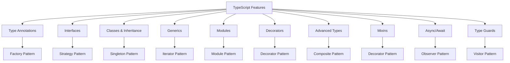

## 1.5 Overview of TypeScript's Features Relevant to Design Patterns

Design patterns are essential tools in a software engineer's toolkit, providing reusable solutions to common problems in software design. TypeScript, with its robust set of features, enhances the implementation of these patterns by offering type safety, modularity, and advanced object-oriented programming capabilities. In this section, we will explore the TypeScript-specific features that facilitate the implementation of design patterns, setting the foundation for deeper exploration in subsequent sections.

### Type Annotations and Type Inference

TypeScript's type annotations and inference capabilities are pivotal in ensuring type safety and reducing runtime errors. By explicitly defining the types of variables, function parameters, and return values, developers can catch errors at compile time rather than at runtime.

#### Example: Type Annotations

```typescript
function add(a: number, b: number): number {
    return a + b;
}

let result: number = add(5, 10);
```

In the above example, the function `add` is annotated to accept two numbers and return a number. This prevents accidental misuse of the function, such as passing non-numeric arguments.

#### Type Inference

TypeScript can often infer types based on the context, reducing the need for explicit annotations.

```typescript
let count = 10; // inferred as number
```

**How It Supports Design Patterns:** Type annotations and inference ensure that the components of a design pattern interact correctly, maintaining the integrity of the pattern's structure.

### Interfaces and Type Aliases

Interfaces in TypeScript define the shape of an object, providing a way to enforce a contract on classes or objects. Type aliases offer similar functionality but can also represent primitive types, unions, and intersections.

#### Example: Interfaces

```typescript
interface Shape {
    area(): number;
}

class Circle implements Shape {
    constructor(private radius: number) {}

    area(): number {
        return Math.PI * this.radius * this.radius;
    }
}
```

Here, the `Shape` interface ensures that any class implementing it must provide an `area` method.

#### Type Aliases

```typescript
type StringOrNumber = string | number;

let value: StringOrNumber = "Hello";
value = 42; // valid
```

**How It Supports Design Patterns:** Interfaces and type aliases allow for flexible and reusable code structures, essential in patterns like Factory and Strategy, where different implementations can be swapped seamlessly.

### Classes, Inheritance, and Access Modifiers

TypeScript's class-based syntax supports object-oriented programming principles, including inheritance and encapsulation, which are crucial for many design patterns.

#### Example: Classes and Inheritance

```typescript
class Animal {
    constructor(protected name: string) {}

    speak(): void {
        console.log(`${this.name} makes a noise.`);
    }
}

class Dog extends Animal {
    speak(): void {
        console.log(`${this.name} barks.`);
    }
}

let dog = new Dog("Rex");
dog.speak(); // Rex barks.
```

#### Access Modifiers

TypeScript provides `public`, `protected`, and `private` access modifiers to control the visibility of class members.

```typescript
class Person {
    private age: number;

    constructor(age: number) {
        this.age = age;
    }

    getAge(): number {
        return this.age;
    }
}
```

**How It Supports Design Patterns:** Classes and inheritance are foundational to patterns like Singleton, Factory, and Decorator, enabling structured and maintainable code.

### Generics

Generics allow for the creation of components that work with a variety of data types while maintaining type safety. They are particularly useful in patterns that require flexibility and reusability.

#### Example: Generics

```typescript
function identity<T>(arg: T): T {
    return arg;
}

let output1 = identity<string>("Hello");
let output2 = identity<number>(42);
```

**How It Supports Design Patterns:** Generics are essential in patterns like Iterator and Observer, where operations must be applicable to different data types.

### Modules and Namespaces

Modules and namespaces in TypeScript help organize code, making it more maintainable and scalable. Modules are the preferred way to structure code in modern TypeScript applications.

#### Example: Modules

```typescript
// math.ts
export function add(a: number, b: number): number {
    return a + b;
}

// app.ts
import { add } from './math';

console.log(add(2, 3));
```

**How It Supports Design Patterns:** Modules facilitate the implementation of patterns like Module and Facade by encapsulating functionality and exposing only necessary components.

### Decorators

Decorators are a powerful feature in TypeScript, allowing for the modification of classes and their members at design time. They are experimental but widely used in frameworks like Angular.

#### Example: Decorators

```typescript
function log(target: any, key: string) {
    let value = target[key];

    const getter = () => {
        console.log(`Get: ${key} => ${value}`);
        return value;
    };

    const setter = (newVal: any) => {
        console.log(`Set: ${key} => ${newVal}`);
        value = newVal;
    };

    Object.defineProperty(target, key, {
        get: getter,
        set: setter,
    });
}

class Person {
    @log
    name: string;

    constructor(name: string) {
        this.name = name;
    }
}

let person = new Person("Alice");
person.name = "Bob";
```

**How It Supports Design Patterns:** Decorators are integral to the Decorator pattern, allowing behavior to be added to objects dynamically.

### Advanced Types

TypeScript offers advanced types like union, intersection, mapped, and conditional types, which provide powerful ways to define complex type relationships.

#### Example: Union and Intersection Types

```typescript
type Admin = {
    name: string;
    privileges: string[];
};

type Employee = {
    name: string;
    startDate: Date;
};

type ElevatedEmployee = Admin & Employee;

const e1: ElevatedEmployee = {
    name: "John",
    privileges: ["create-server"],
    startDate: new Date(),
};
```

**How It Supports Design Patterns:** Advanced types enable more precise type definitions, crucial for patterns like Composite and Strategy, where objects may have multiple roles or behaviors.

### Mixins

Mixins provide a way to compose classes from reusable components, offering an alternative to traditional inheritance.

#### Example: Mixins

```typescript
type Constructor<T = {}> = new (...args: any[]) => T;

function Timestamped<TBase extends Constructor>(Base: TBase) {
    return class extends Base {
        timestamp = new Date();
    };
}

class User {
    constructor(public name: string) {}
}

const TimestampedUser = Timestamped(User);

const user = new TimestampedUser("Alice");
console.log(user.timestamp);
```

**How It Supports Design Patterns:** Mixins support patterns like Decorator and Strategy by allowing dynamic composition of behaviors.

### Asynchronous Programming with Promises and Async/Await

TypeScript's support for promises and async/await syntax simplifies asynchronous programming, making it easier to implement patterns that involve asynchronous operations.

#### Example: Async/Await

```typescript
async function fetchData(url: string): Promise<any> {
    const response = await fetch(url);
    return response.json();
}

fetchData("https://api.example.com/data")
    .then(data => console.log(data))
    .catch(error => console.error(error));
```

**How It Supports Design Patterns:** Asynchronous features are vital for patterns like Observer and Mediator, where non-blocking operations are essential.

### Type Guards and Type Predicates

Type guards and predicates enhance type safety by allowing developers to narrow down types at runtime, ensuring that operations are performed on valid data.

#### Example: Type Guards

```typescript
function isString(value: any): value is string {
    return typeof value === "string";
}

function print(value: string | number) {
    if (isString(value)) {
        console.log(`String: ${value}`);
    } else {
        console.log(`Number: ${value}`);
    }
}
```

**How It Supports Design Patterns:** Type guards are crucial in patterns like Visitor and Strategy, where operations depend on the specific type of an object.

### Visualizing TypeScript's Interaction with Design Patterns

To better understand how TypeScript's features interact with design patterns, let's visualize the relationship between these features and some common patterns.



**Diagram Description:** This diagram illustrates how various TypeScript features support different design patterns, highlighting the synergy between TypeScript's capabilities and pattern implementation.

### Preparing for Future Sections

As we delve deeper into design patterns in the subsequent sections, we'll leverage these TypeScript features to implement and explore patterns in detail. Understanding these features will enable you to apply design patterns effectively, creating robust, maintainable, and scalable applications.

### Try It Yourself

To solidify your understanding, try modifying the code examples provided in this section. Experiment with adding new methods to interfaces, creating more complex generic functions, or using decorators to add logging to different class properties. By engaging with the code, you'll gain a deeper appreciation for TypeScript's capabilities and how they enhance design pattern implementation.

### Conclusion

TypeScript's rich feature set provides a powerful foundation for implementing design patterns. From type safety and modularity to advanced object-oriented programming constructs, TypeScript enhances the clarity, maintainability, and scalability of your code. As we continue our journey through design patterns, these features will be instrumental in crafting elegant and efficient solutions.

## Quiz Time!



### Which TypeScript feature allows you to define the shape of an object?

- [x] Interfaces
- [ ] Generics
- [ ] Decorators
- [ ] Modules

> **Explanation:** Interfaces in TypeScript are used to define the shape of an object, specifying what properties and methods it should have.

### What is the primary benefit of using type annotations in TypeScript?

- [x] Type safety
- [ ] Faster execution
- [ ] Smaller code size
- [ ] Easier syntax

> **Explanation:** Type annotations provide type safety by allowing the TypeScript compiler to catch type-related errors at compile time.

### Which feature allows you to create components that work with a variety of data types?

- [ ] Interfaces
- [x] Generics
- [ ] Modules
- [ ] Decorators

> **Explanation:** Generics enable the creation of components that can operate with different data types while maintaining type safety.

### What is the purpose of access modifiers in TypeScript?

- [x] To control the visibility of class members
- [ ] To define the shape of an object
- [ ] To enable asynchronous programming
- [ ] To create modules

> **Explanation:** Access modifiers like `public`, `protected`, and `private` control the visibility and accessibility of class members.

### Which TypeScript feature is experimental but widely used in frameworks like Angular?

- [ ] Generics
- [ ] Modules
- [x] Decorators
- [ ] Type Guards

> **Explanation:** Decorators are an experimental feature in TypeScript that are widely used in frameworks like Angular to modify classes and their members.

### What is the advantage of using modules in TypeScript?

- [ ] Faster execution
- [ ] Easier syntax
- [x] Better code organization
- [ ] Smaller code size

> **Explanation:** Modules help organize code into separate files and namespaces, making it more maintainable and scalable.

### How do type guards enhance type safety in TypeScript?

- [x] By allowing runtime type checks
- [ ] By reducing code size
- [ ] By enabling decorators
- [ ] By creating modules

> **Explanation:** Type guards allow developers to perform runtime checks to narrow down types, ensuring operations are performed on valid data.

### Which TypeScript feature allows for dynamic composition of behaviors?

- [ ] Interfaces
- [ ] Generics
- [x] Mixins
- [ ] Modules

> **Explanation:** Mixins provide a way to compose classes from reusable components, allowing for dynamic composition of behaviors.

### What is the benefit of using async/await in TypeScript?

- [ ] Faster execution
- [x] Simplified asynchronous code
- [ ] Smaller code size
- [ ] Easier syntax

> **Explanation:** Async/await syntax simplifies writing and reading asynchronous code, making it more intuitive and less error-prone.

### True or False: TypeScript's type inference can often determine the type of a variable without explicit annotations.

- [x] True
- [ ] False

> **Explanation:** TypeScript's type inference can automatically determine the type of a variable based on the context, reducing the need for explicit annotations.


