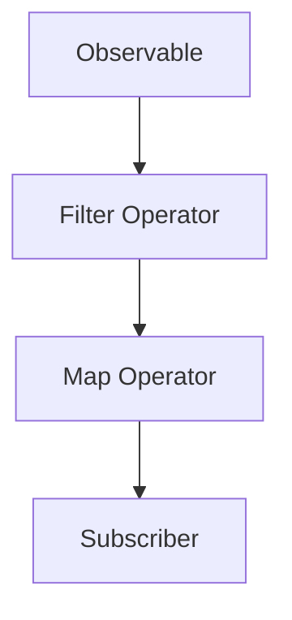

## 10.1.1 Using RxJS in TypeScript

Reactive programming is a powerful paradigm that allows developers to work with asynchronous data streams. RxJS (Reactive Extensions for JavaScript) is a library that brings reactive programming to the JavaScript ecosystem, and it integrates seamlessly with TypeScript, providing robust type checking and autocompletion. In this section, we'll explore how to set up RxJS in a TypeScript project, configure it correctly, and use it effectively.

### Installing RxJS in a TypeScript Project

To get started with RxJS in a TypeScript project, we need to install the RxJS library. This can be done using popular package managers like npm or yarn. Let's go through the steps:

1. **Initialize Your Project**

   If you haven't already, create a new TypeScript project. You can do this by running the following commands:

   ```bash
   mkdir rxjs-typescript-project
   cd rxjs-typescript-project
   npm init -y
   ```

   This will create a new directory and initialize a Node.js project with a `package.json` file.

2. **Install TypeScript**

   Ensure that TypeScript is installed in your project. You can install it globally or as a dev dependency:

   ```bash
   npm install typescript --save-dev
   ```

3. **Install RxJS**

   Now, install RxJS using npm:

   ```bash
   npm install rxjs
   ```

   Alternatively, if you prefer yarn, you can use:

   ```bash
   yarn add rxjs
   ```

### Configuring TypeScript for RxJS

Once RxJS is installed, we need to configure TypeScript to work seamlessly with it. This involves setting up the `tsconfig.json` file to ensure proper compilation and type checking.

1. **Create a `tsconfig.json` File**

   In the root of your project, create a `tsconfig.json` file with the following configuration:

   ```json
   {
     "compilerOptions": {
       "target": "ES6",
       "module": "commonjs",
       "strict": true,
       "esModuleInterop": true,
       "skipLibCheck": true,
       "forceConsistentCasingInFileNames": true
     },
     "include": ["src/**/*"]
   }
   ```

   - **`target`**: Specifies the ECMAScript target version. ES6 is a good choice for RxJS.
   - **`module`**: Defines the module system. CommonJS is commonly used in Node.js environments.
   - **`strict`**: Enables all strict type-checking options.
   - **`esModuleInterop`**: Allows for better interoperability between CommonJS and ES Modules.
   - **`skipLibCheck`**: Skips type checking of declaration files, which can speed up the build process.
   - **`forceConsistentCasingInFileNames`**: Ensures consistent casing in file names.

2. **Create a Source Directory**

   Create a `src` directory where you'll write your TypeScript code:

   ```bash
   mkdir src
   ```

### Understanding RxJS Typings

RxJS comes with built-in TypeScript typings, which enhance code completion and error checking. This means you can take advantage of TypeScript's powerful type system to catch errors early and improve code quality.

- **Type Inference**: RxJS operators and functions are strongly typed, allowing TypeScript to infer types and provide helpful suggestions.
- **Error Checking**: TypeScript will alert you to potential type mismatches, helping you avoid runtime errors.

### Importing RxJS Modules and Operators

RxJS is a modular library, meaning you can import only the parts you need. This is crucial for optimizing bundle size and performance.

1. **Importing Core Modules**

   To start using RxJS, you need to import the core modules. Here's an example of importing the `Observable` class:

   ```typescript
   import { Observable } from 'rxjs';
   ```

2. **Using Operators**

   RxJS provides a wide range of operators to transform, filter, and combine streams. Operators are functions that can be applied to observables to modify their behavior.

   ```typescript
   import { map, filter } from 'rxjs/operators';

   const numbers$ = new Observable<number>((observer) => {
     observer.next(1);
     observer.next(2);
     observer.next(3);
     observer.complete();
   });

   numbers$
     .pipe(
       filter((value) => value > 1),
       map((value) => value * 2)
     )
     .subscribe((value) => console.log(value)); // Output: 4, 6
   ```

   - **`filter`**: Filters out values that don't meet a condition.
   - **`map`**: Transforms each value emitted by the observable.

### Best Practices for Organizing RxJS Imports

To optimize bundle size and performance, it's important to follow best practices when importing RxJS modules and operators.

- **Use Pipeable Operators**: Instead of importing operators directly from `'rxjs/operators'`, use the `pipe` method to chain them together. This approach is more efficient and reduces bundle size.

- **Avoid Importing Everything**: Only import the specific operators and functions you need. Avoid using wildcard imports like `import * as rxjs from 'rxjs'`.

- **Tree Shaking**: Ensure your build process supports tree shaking, which removes unused code from the final bundle. This is typically handled by modern bundlers like Webpack or Rollup.

### Common Pitfalls and How to Avoid Them

Integrating RxJS with TypeScript can present some challenges. Here are common pitfalls and how to avoid them:

1. **Type Mismatches**

   Type mismatches can occur when the types of values emitted by observables don't match the expected types. Use TypeScript's type system to define explicit types for observables and operators.

   ```typescript
   const numbers$: Observable<number> = new Observable((observer) => {
     observer.next(1);
     observer.next(2);
     observer.next(3);
     observer.complete();
   });
   ```

2. **Memory Leaks**

   Memory leaks can occur if subscriptions are not properly managed. Always unsubscribe from observables when they are no longer needed.

   ```typescript
   const subscription = numbers$.subscribe((value) => console.log(value));

   // Unsubscribe when done
   subscription.unsubscribe();
   ```

3. **Overusing Subjects**

   Subjects are a powerful feature of RxJS, but they can lead to complex and hard-to-maintain code if overused. Use subjects judiciously and prefer pure observables when possible.

### Try It Yourself

Now that we've covered the basics, it's time to experiment. Try modifying the code examples to see how different operators affect the output. For instance, add a `reduce` operator to accumulate values or a `debounceTime` operator to delay emissions.

### Visualizing RxJS Streams

Understanding the flow of data in RxJS can be challenging. Visualizing streams can help clarify how data moves through your application.



**Diagram Description**: This diagram illustrates a simple RxJS data flow. An `Observable` emits values, which pass through a `Filter Operator` and a `Map Operator` before reaching the `Subscriber`.

### References and Links

- [RxJS Documentation](https://rxjs.dev/): Official RxJS documentation for detailed information on operators and usage.
- [TypeScript Handbook](https://www.typescriptlang.org/docs/handbook/intro.html): Comprehensive guide to TypeScript features and best practices.
- [MDN Web Docs on JavaScript](https://developer.mozilla.org/en-US/docs/Web/JavaScript): In-depth resource for JavaScript concepts and APIs.

### Knowledge Check

To reinforce your understanding, consider these questions:

- How do you ensure TypeScript compatibility when using RxJS?
- What are the benefits of using pipeable operators?
- How can you prevent memory leaks when using RxJS?

### Embrace the Journey

Remember, this is just the beginning. As you progress, you'll build more complex and interactive applications using RxJS and TypeScript. Keep experimenting, stay curious, and enjoy the journey!

## Quiz Time!



### What is the primary purpose of RxJS in a TypeScript project?

- [x] To handle asynchronous data streams
- [ ] To compile TypeScript code to JavaScript
- [ ] To manage project dependencies
- [ ] To provide a testing framework

> **Explanation:** RxJS is used to handle asynchronous data streams, enabling reactive programming in JavaScript applications.

### Which TypeScript configuration option allows for better interoperability between CommonJS and ES Modules?

- [ ] `target`
- [ ] `module`
- [x] `esModuleInterop`
- [ ] `skipLibCheck`

> **Explanation:** The `esModuleInterop` option in TypeScript allows for better interoperability between CommonJS and ES Modules.

### What is the recommended way to import RxJS operators to optimize bundle size?

- [ ] Import all operators using a wildcard import
- [x] Use pipeable operators with the `pipe` method
- [ ] Import operators directly from `'rxjs/operators'`
- [ ] Use a custom bundler

> **Explanation:** Using pipeable operators with the `pipe` method is recommended to optimize bundle size and performance.

### How can you prevent memory leaks when using RxJS?

- [ ] Use wildcard imports
- [ ] Avoid using TypeScript
- [x] Unsubscribe from observables when they are no longer needed
- [ ] Use subjects for all data streams

> **Explanation:** Unsubscribing from observables when they are no longer needed helps prevent memory leaks.

### What is a common pitfall when integrating RxJS with TypeScript?

- [x] Type mismatches
- [ ] Lack of documentation
- [ ] Overuse of TypeScript decorators
- [ ] Using ES6 modules

> **Explanation:** Type mismatches can occur when the types of values emitted by observables don't match the expected types.

### Which RxJS feature should be used judiciously to avoid complex and hard-to-maintain code?

- [ ] Observables
- [x] Subjects
- [ ] Operators
- [ ] Subscribers

> **Explanation:** Subjects should be used judiciously as they can lead to complex and hard-to-maintain code if overused.

### What is the purpose of the `map` operator in RxJS?

- [ ] To filter values
- [x] To transform each value emitted by the observable
- [ ] To combine multiple observables
- [ ] To delay emissions

> **Explanation:** The `map` operator is used to transform each value emitted by the observable.

### Which of the following is a benefit of using TypeScript with RxJS?

- [x] Enhanced code completion and error checking
- [ ] Faster runtime performance
- [ ] Reduced code size
- [ ] Automatic memory management

> **Explanation:** TypeScript provides enhanced code completion and error checking when used with RxJS.

### What is the role of the `filter` operator in RxJS?

- [x] To filter out values that don't meet a condition
- [ ] To transform values
- [ ] To combine observables
- [ ] To handle errors

> **Explanation:** The `filter` operator is used to filter out values that don't meet a specified condition.

### True or False: Tree shaking is a process that removes unused code from the final bundle.

- [x] True
- [ ] False

> **Explanation:** Tree shaking is a process used by modern bundlers to remove unused code from the final bundle, optimizing performance.


