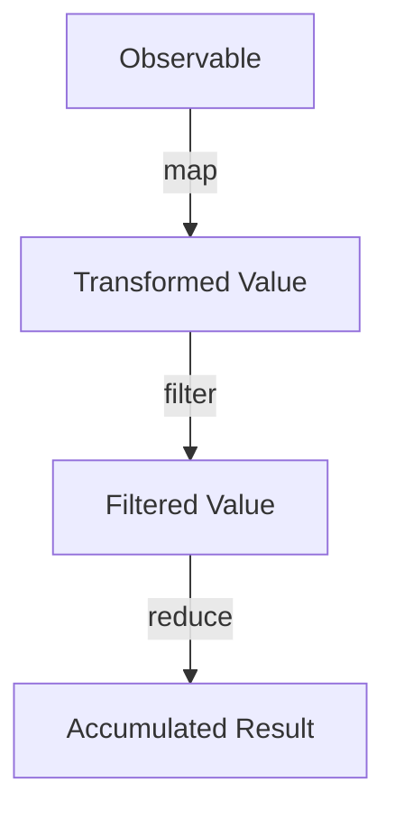

## 10.1.2 Creating Observables and Operators

Reactive programming is a paradigm that enables developers to work with asynchronous data streams. At the heart of this paradigm in TypeScript is RxJS (Reactive Extensions for JavaScript), a library that provides powerful tools for creating and managing these streams. In this section, we will delve into the creation of Observables and the use of operators to manipulate data streams, enabling you to build robust and responsive applications.

### Understanding Observables

Observables are the core building blocks of RxJS. They represent a sequence of values that can be observed over time. Unlike Promises, which resolve once with a single value or error, Observables can emit multiple values over time and can be canceled, making them more suitable for handling streams of data such as user inputs, web socket connections, or API requests.

#### Observables vs. Promises

- **Observables**:
  - Emit multiple values over time.
  - Can be canceled (unsubscribed).
  - Lazy execution: values are not emitted until there is a subscription.
  - Support operators for transforming and combining data streams.

- **Promises**:
  - Emit a single value or error.
  - Cannot be canceled.
  - Eager execution: starts immediately upon creation.
  - Limited transformation capabilities.

### Creating Observables

RxJS provides several creation functions to generate Observables. Let's explore some of the most commonly used ones.

#### Using `of`

The `of` function creates an Observable that emits the arguments you provide, then completes.

```typescript
import { of } from 'rxjs';

const numbers$ = of(1, 2, 3, 4, 5);

numbers$.subscribe({
  next: value => console.log(`Emitted value: ${value}`),
  complete: () => console.log('All values emitted, Observable completed.')
});
```

#### Using `from`

The `from` function converts various data structures like arrays, Promises, or iterable objects into Observables.

```typescript
import { from } from 'rxjs';

const array$ = from([10, 20, 30, 40]);

array$.subscribe({
  next: value => console.log(`Array value: ${value}`),
  complete: () => console.log('Array Observable completed.')
});
```

#### Using `interval`

The `interval` function creates an Observable that emits sequential numbers at specified intervals.

```typescript
import { interval } from 'rxjs';

const interval$ = interval(1000); // Emits a number every second

const subscription = interval$.subscribe({
  next: value => console.log(`Interval value: ${value}`),
  complete: () => console.log('Interval Observable completed.')
});

// Unsubscribe after 5 seconds
setTimeout(() => subscription.unsubscribe(), 5000);
```

#### Using `fromEvent`

The `fromEvent` function creates an Observable from DOM events.

```typescript
import { fromEvent } from 'rxjs';

const clicks$ = fromEvent(document, 'click');

clicks$.subscribe(event => console.log('Mouse clicked:', event));
```

### Subscribing to Observables

Subscribing to an Observable is how you start receiving values. You can handle emitted values, errors, and completion events by providing corresponding handlers.

```typescript
const observable$ = of('Hello', 'World');

observable$.subscribe({
  next: value => console.log(value),
  error: err => console.error('Error:', err),
  complete: () => console.log('Observable completed.')
});
```

### Core RxJS Operators

Operators are the functions that allow you to transform, filter, and combine data streams. They are the heart of RxJS's power and flexibility.

#### `map`

The `map` operator transforms each emitted value by applying a function.

```typescript
import { map } from 'rxjs/operators';

const numbers$ = of(1, 2, 3);

numbers$.pipe(
  map(value => value * 2)
).subscribe(value => console.log(`Mapped value: ${value}`));
```

#### `filter`

The `filter` operator allows you to filter out values based on a predicate function.

```typescript
import { filter } from 'rxjs/operators';

const numbers$ = of(1, 2, 3, 4, 5);

numbers$.pipe(
  filter(value => value % 2 === 0)
).subscribe(value => console.log(`Filtered value: ${value}`));
```

#### `reduce`

The `reduce` operator accumulates values over time, similar to the `reduce` function in arrays.

```typescript
import { reduce } from 'rxjs/operators';

const numbers$ = of(1, 2, 3, 4);

numbers$.pipe(
  reduce((acc, value) => acc + value, 0)
).subscribe(total => console.log(`Total: ${total}`));
```

#### `merge`

The `merge` operator combines multiple Observables into a single Observable.

```typescript
import { merge } from 'rxjs';

const obs1$ = of('A', 'B');
const obs2$ = of('1', '2');

merge(obs1$, obs2$).subscribe(value => console.log(`Merged value: ${value}`));
```

#### `switchMap`

The `switchMap` operator maps each value to an Observable and flattens the resulting Observables into one.

```typescript
import { switchMap } from 'rxjs/operators';
import { of } from 'rxjs';

const letters$ = of('a', 'b', 'c');

letters$.pipe(
  switchMap(letter => of(letter.toUpperCase()))
).subscribe(value => console.log(`Switched value: ${value}`));
```

#### `debounceTime`

The `debounceTime` operator delays emissions from the source Observable by a given time span.

```typescript
import { debounceTime } from 'rxjs/operators';

const clicks$ = fromEvent(document, 'click');

clicks$.pipe(
  debounceTime(500)
).subscribe(() => console.log('Click debounced.'));
```

### Chaining Operators with Pipeable Syntax

RxJS uses a pipeable operator syntax to chain multiple operators together, enhancing readability and maintainability.

```typescript
const numbers$ = of(1, 2, 3, 4, 5);

numbers$.pipe(
  filter(value => value > 2),
  map(value => value * 10)
).subscribe(value => console.log(`Transformed value: ${value}`));
```

### Error Handling and Memory Management

Handling errors and managing subscriptions are crucial for building reliable applications.

#### Error Handling

Use the `catchError` operator to handle errors gracefully.

```typescript
import { catchError } from 'rxjs/operators';
import { throwError } from 'rxjs';

const source$ = throwError('An error occurred!');

source$.pipe(
  catchError(err => {
    console.error('Caught error:', err);
    return of('Fallback value');
  })
).subscribe(value => console.log(value));
```

#### Unsubscribing from Observables

Always unsubscribe from Observables to prevent memory leaks, especially in applications with long-running processes or dynamic subscriptions.

```typescript
const subscription = interval(1000).subscribe(value => console.log(value));

setTimeout(() => {
  subscription.unsubscribe();
  console.log('Unsubscribed from interval Observable.');
}, 5000);
```

### TypeScript and RxJS

TypeScript's type system enhances RxJS by providing type safety across the data flow. When using operators, TypeScript can infer the types of emitted values, helping catch errors at compile time.

```typescript
const numbers$ = of<number>(1, 2, 3);

numbers$.pipe(
  map(value => value.toString())
).subscribe(value => console.log(`String value: ${value}`));
```

### Benefits of Using RxJS Operators

- **Conciseness**: Write less code to achieve complex data transformations.
- **Declarative**: Focus on what you want to achieve rather than how to achieve it.
- **Asynchronous Handling**: Simplify working with asynchronous data streams.
- **Composability**: Easily combine multiple data streams and transformations.

### Try It Yourself

Experiment with the following code examples by modifying the operators or adding new ones to see how the data streams change. Try creating a new Observable using `fromEvent` and apply a series of operators to transform the emitted events.

### Visualizing Data Flow with Mermaid.js

To better understand how Observables and operators work together, let's visualize a simple data flow using Mermaid.js.



This diagram represents an Observable that emits values, which are then transformed, filtered, and accumulated using various operators.

### Knowledge Check

- What are the key differences between Observables and Promises?
- How does the `map` operator transform emitted values?
- Why is it important to unsubscribe from Observables?
- How does TypeScript enhance the use of RxJS operators?

### Summary

In this section, we've explored how to create Observables and use operators in RxJS to manage data streams effectively. By leveraging TypeScript's type system, we can ensure type safety and write concise, declarative code. Remember, the power of RxJS lies in its ability to transform and combine data streams, making it an invaluable tool for building reactive applications.

## Quiz Time!



### What is the primary advantage of using Observables over Promises?

- [x] Observables can emit multiple values over time.
- [ ] Observables are easier to use than Promises.
- [ ] Observables are always faster than Promises.
- [ ] Observables do not require subscriptions.

> **Explanation:** Observables can emit multiple values over time, unlike Promises which resolve once with a single value or error.

### Which RxJS function is used to create an Observable from an array?

- [ ] of
- [x] from
- [ ] interval
- [ ] fromEvent

> **Explanation:** The `from` function converts arrays and other iterable objects into Observables.

### What does the `map` operator do in RxJS?

- [ ] Filters values based on a condition.
- [x] Transforms each emitted value using a function.
- [ ] Combines multiple Observables into one.
- [ ] Delays emissions by a specified time.

> **Explanation:** The `map` operator applies a function to each emitted value, transforming it.

### How can you handle errors in an Observable stream?

- [ ] By using the `map` operator.
- [ ] By ignoring them.
- [x] By using the `catchError` operator.
- [ ] By unsubscribing.

> **Explanation:** The `catchError` operator allows you to handle errors in an Observable stream gracefully.

### What is the purpose of the `debounceTime` operator?

- [ ] To transform emitted values.
- [x] To delay emissions by a specified time.
- [ ] To combine multiple Observables.
- [ ] To handle errors in the stream.

> **Explanation:** The `debounceTime` operator delays emissions from the source Observable by a given time span.

### Why is it important to unsubscribe from Observables?

- [ ] To improve performance.
- [x] To prevent memory leaks.
- [ ] To increase the speed of data emissions.
- [ ] To handle errors.

> **Explanation:** Unsubscribing from Observables is crucial to prevent memory leaks, especially in applications with long-running processes.

### How does TypeScript enhance the use of RxJS operators?

- [ ] By making code execution faster.
- [x] By providing type safety across the data flow.
- [ ] By simplifying the syntax.
- [ ] By automatically unsubscribing from Observables.

> **Explanation:** TypeScript's type system provides type safety, helping catch errors at compile time.

### What does the `switchMap` operator do?

- [ ] Combines multiple Observables.
- [ ] Delays emissions by a specified time.
- [x] Maps each value to an Observable and flattens the result.
- [ ] Filters values based on a condition.

> **Explanation:** The `switchMap` operator maps each value to an Observable and flattens the resulting Observables into one.

### Which operator would you use to combine multiple Observables into one?

- [ ] map
- [ ] filter
- [x] merge
- [ ] reduce

> **Explanation:** The `merge` operator combines multiple Observables into a single Observable.

### True or False: Observables in RxJS are eager, meaning they start emitting values immediately upon creation.

- [ ] True
- [x] False

> **Explanation:** Observables are lazy, meaning they do not emit values until there is a subscription.


