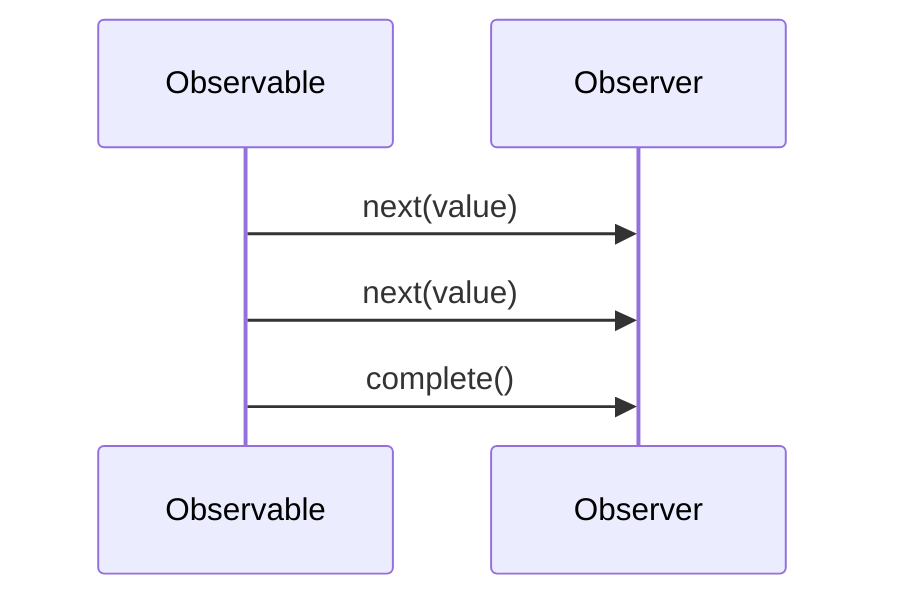

## 10.1 Observer Pattern with RxJS

In the realm of software design patterns, the Observer Pattern stands out as a fundamental solution for handling communication between objects. This pattern is particularly relevant in the context of reactive programming, where it facilitates the management of asynchronous data streams. In this section, we will delve into the Observer Pattern, explore the RxJS library, and demonstrate how they can be combined to create powerful reactive applications in TypeScript.

### Understanding the Observer Pattern

The Observer Pattern is a behavioral design pattern that defines a one-to-many dependency between objects. When one object (the subject) changes state, all its dependents (observers) are notified and updated automatically. This pattern is widely used in scenarios where changes in one part of an application need to be reflected in another, such as in user interfaces or event-driven systems.

#### Key Components of the Observer Pattern

1. **Subject**: The core object that holds the state and notifies observers of any changes.
2. **Observer**: An interface or abstract class that defines the update method, which is called when the subject's state changes.
3. **Concrete Observer**: A class that implements the Observer interface and defines specific actions to take when notified.
4. **Concrete Subject**: A class that extends the Subject and maintains a list of observers.

### Introducing RxJS

RxJS (Reactive Extensions for JavaScript) is a library designed to handle asynchronous data streams using observable sequences. It provides a robust implementation of the Observer Pattern, allowing developers to work with data streams in a declarative and functional manner.

#### Core Concepts of RxJS

- **Observable**: Represents a stream of data that can be observed. Observables are the foundation of RxJS and can emit multiple values over time.
- **Observer**: An object that subscribes to an Observable and reacts to the data it emits.
- **Subscription**: Represents the execution of an Observable. It is used to manage the lifecycle of the data stream, allowing observers to unsubscribe when they no longer need updates.
- **Operators**: Functions that enable the transformation, filtering, and combination of data streams. Operators are used to manipulate the data emitted by Observables.

### Implementing the Observer Pattern with RxJS

RxJS provides a seamless way to implement the Observer Pattern in TypeScript, offering type safety and a rich set of operators for handling complex data flows. Let's explore how RxJS embodies the principles of reactive programming and the Observer Pattern.

#### Creating Observables

In RxJS, Observables are created using the `Observable` class. They can emit data synchronously or asynchronously, making them versatile for various use cases.

```typescript
import { Observable } from 'rxjs';

// Create an Observable that emits a sequence of numbers
const numberObservable = new Observable<number>((subscriber) => {
  subscriber.next(1);
  subscriber.next(2);
  subscriber.next(3);
  subscriber.complete();
});

// Subscribe to the Observable
numberObservable.subscribe({
  next: (value) => console.log(`Received value: ${value}`),
  complete: () => console.log('Observable completed'),
});
```

In this example, we create an Observable that emits a sequence of numbers. The `subscribe` method is used to listen for emitted values and handle them accordingly.

#### Using Observers and Subscriptions

Observers in RxJS are objects that define how to react to data emitted by an Observable. They can handle three types of notifications: `next`, `error`, and `complete`.

```typescript
import { Observable } from 'rxjs';

// Define an Observer
const numberObserver = {
  next: (value: number) => console.log(`Received value: ${value}`),
  error: (err: any) => console.error(`Error occurred: ${err}`),
  complete: () => console.log('Observable completed'),
};

// Create an Observable
const numberObservable = new Observable<number>((subscriber) => {
  subscriber.next(1);
  subscriber.next(2);
  subscriber.next(3);
  subscriber.complete();
});

// Subscribe the Observer to the Observable
const subscription = numberObservable.subscribe(numberObserver);

// Unsubscribe when no longer needed
subscription.unsubscribe();
```

Here, we define an Observer with handlers for `next`, `error`, and `complete` notifications. The `subscribe` method returns a Subscription, which can be used to unsubscribe from the Observable when updates are no longer needed.

### Advantages of Using RxJS in TypeScript

RxJS, when combined with TypeScript, offers several advantages:

- **Type Safety**: TypeScript's static typing ensures that data emitted by Observables is type-checked, reducing runtime errors.
- **Improved Developer Experience**: TypeScript's tooling, such as IntelliSense and autocompletion, enhances the development experience when working with RxJS.
- **Rich Ecosystem**: RxJS provides a comprehensive set of operators for transforming and combining data streams, making it easier to implement complex data flows.

### Reactive Programming Principles in RxJS

Reactive programming is a paradigm that focuses on asynchronous data streams and the propagation of change. RxJS embodies these principles through its core concepts and operators.

#### Declarative Data Flow

RxJS allows developers to define data flows declaratively, specifying what should happen to data as it moves through the system. This approach contrasts with imperative programming, where developers must explicitly define each step of the process.

#### Composability

RxJS operators enable the composition of complex data flows by chaining operations together. This composability makes it easier to build and maintain reactive applications.

#### Asynchronous Data Handling

RxJS excels at handling asynchronous data, such as user input, network requests, and timers. Observables can emit data over time, and operators provide tools for managing concurrency and synchronization.

### Code Example: Building a Simple Reactive Application

Let's build a simple reactive application using RxJS and TypeScript. We'll create an Observable that emits user input events and transforms them into uppercase strings.

```typescript
import { fromEvent } from 'rxjs';
import { map } from 'rxjs/operators';

// Get a reference to the input element
const inputElement = document.querySelector('input');

// Create an Observable from input events
const inputObservable = fromEvent<InputEvent>(inputElement, 'input');

// Transform input values to uppercase
const uppercaseObservable = inputObservable.pipe(
  map((event: InputEvent) => {
    const input = event.target as HTMLInputElement;
    return input.value.toUpperCase();
  })
);

// Subscribe to the transformed Observable
uppercaseObservable.subscribe((value) => {
  console.log(`Uppercase value: ${value}`);
});
```

In this example, we use the `fromEvent` function to create an Observable from input events. The `map` operator is used to transform input values to uppercase. Finally, we subscribe to the transformed Observable to log the uppercase values.

### Visualizing the Observer Pattern with RxJS

To better understand how the Observer Pattern works with RxJS, let's visualize the flow of data between Observables and Observers.



This sequence diagram illustrates the interaction between an Observable and an Observer. The Observable emits values to the Observer, which processes them. Once all values have been emitted, the Observable sends a `complete` notification.

### Try It Yourself

Experiment with the code examples provided in this section. Try modifying the Observables to emit different types of data or use different operators to transform the data. For example, you could create an Observable that emits mouse click events and logs the coordinates of each click.

### References and Further Reading

- [RxJS Documentation](https://rxjs.dev/): Official documentation for RxJS, including guides and API references.
- [MDN Web Docs: Observer Pattern](https://developer.mozilla.org/en-US/docs/Web/JavaScript/Guide/Design_Patterns/Observer_Pattern): An overview of the Observer Pattern and its applications.
- [TypeScript Handbook](https://www.typescriptlang.org/docs/handbook/intro.html): Comprehensive guide to TypeScript, including its features and best practices.

### Knowledge Check

- What are the key components of the Observer Pattern?
- How does RxJS implement the Observer Pattern?
- What are the advantages of using RxJS in TypeScript?
- How do RxJS operators enhance the composability of data flows?
- What is the role of a Subscription in RxJS?

### Embrace the Journey

As you explore the Observer Pattern with RxJS, remember that this is just the beginning. Reactive programming offers a powerful paradigm for handling asynchronous data, and RxJS provides the tools you need to build responsive and efficient applications. Keep experimenting, stay curious, and enjoy the journey!

## Quiz Time!



### What is the primary purpose of the Observer Pattern?

- [x] To define a one-to-many dependency between objects
- [ ] To encapsulate a request as an object
- [ ] To provide a simplified interface to a complex subsystem
- [ ] To separate the construction of a complex object from its representation

> **Explanation:** The Observer Pattern is used to define a one-to-many dependency between objects, where changes in one object are automatically reflected in its dependents.

### Which RxJS concept represents a stream of data that can be observed?

- [x] Observable
- [ ] Observer
- [ ] Subscription
- [ ] Operator

> **Explanation:** In RxJS, an Observable represents a stream of data that can be observed and can emit multiple values over time.

### What is the role of an Observer in RxJS?

- [x] To react to data emitted by an Observable
- [ ] To manage the lifecycle of a data stream
- [ ] To transform and combine data streams
- [ ] To create new Observables

> **Explanation:** An Observer in RxJS is an object that subscribes to an Observable and reacts to the data it emits.

### What is the purpose of a Subscription in RxJS?

- [x] To manage the lifecycle of an Observable
- [ ] To transform data emitted by an Observable
- [ ] To define a one-to-many dependency between objects
- [ ] To encapsulate a request as an object

> **Explanation:** A Subscription in RxJS represents the execution of an Observable and is used to manage the lifecycle of the data stream, allowing observers to unsubscribe when they no longer need updates.

### How do RxJS operators enhance the composability of data flows?

- [x] By enabling the transformation, filtering, and combination of data streams
- [ ] By providing a simplified interface to a complex subsystem
- [ ] By encapsulating a request as an object
- [ ] By separating the construction of a complex object from its representation

> **Explanation:** RxJS operators enhance the composability of data flows by enabling the transformation, filtering, and combination of data streams.

### What are the three types of notifications that an Observer can handle in RxJS?

- [x] next, error, complete
- [ ] start, stop, pause
- [ ] create, update, delete
- [ ] open, close, error

> **Explanation:** An Observer in RxJS can handle three types of notifications: `next` for emitted values, `error` for errors, and `complete` for when the Observable has finished emitting values.

### What is the advantage of using RxJS in TypeScript?

- [x] Type safety and improved developer experience
- [ ] Faster execution of JavaScript code
- [ ] Simplified syntax for asynchronous operations
- [ ] Automatic memory management

> **Explanation:** RxJS, when combined with TypeScript, offers type safety and an improved developer experience through features like static typing, IntelliSense, and autocompletion.

### What is reactive programming primarily concerned with?

- [x] Asynchronous data streams and the propagation of change
- [ ] Synchronous data processing and state management
- [ ] Encapsulation of data and behavior
- [ ] Simplification of complex subsystems

> **Explanation:** Reactive programming is primarily concerned with asynchronous data streams and the propagation of change, allowing data to flow through the system in a declarative manner.

### What is the purpose of the `map` operator in RxJS?

- [x] To transform data emitted by an Observable
- [ ] To create a new Observable
- [ ] To manage the lifecycle of a data stream
- [ ] To define a one-to-many dependency between objects

> **Explanation:** The `map` operator in RxJS is used to transform data emitted by an Observable, allowing developers to apply a function to each value and return a new value.

### True or False: In RxJS, an Observable can only emit a single value.

- [ ] True
- [x] False

> **Explanation:** False. In RxJS, an Observable can emit multiple values over time, making it suitable for handling streams of data.


