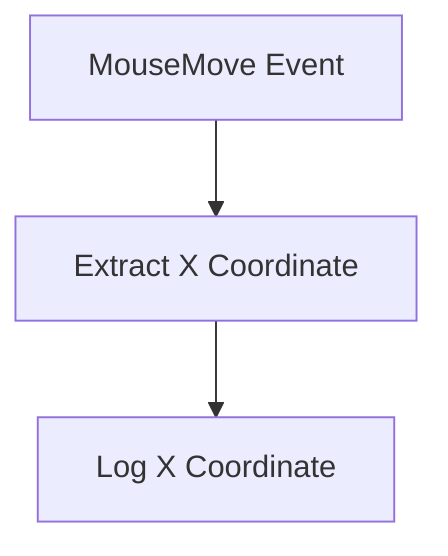
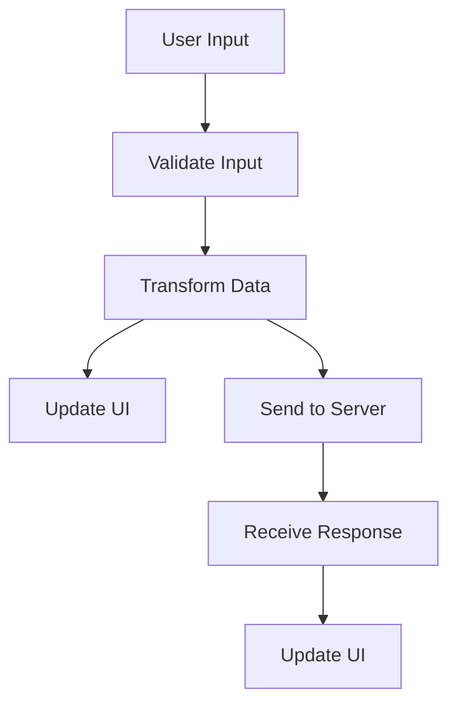

## 10.2.1 Concepts of FRP

Functional Reactive Programming (FRP) is a paradigm that combines the principles of functional programming with reactive programming to handle asynchronous data streams and the propagation of change. In this section, we delve into the core concepts of FRP, focusing on continuous data flows and time-varying values, and how these are modeled using streams and dataflow graphs. We will also explore the key abstractions in FRP, such as Observables, and discuss the advantages and challenges of implementing FRP in complex, event-driven scenarios.

### Understanding Time-Varying Values

In traditional programming, values are static and change only when explicitly updated. However, in many real-world applications, values are inherently dynamic, changing over time. FRP models these time-varying values as continuous streams, allowing developers to work with them as first-class citizens.

#### Continuous Streams vs. Discrete Events

FRP distinguishes between continuous signals and discrete events:

- **Continuous Signals**: These represent values that change over time, such as the position of a mouse cursor or the temperature in a room. They are modeled as continuous streams, capturing the notion of time-varying data.

- **Discrete Events**: These are occurrences that happen at specific points in time, such as a button click or a network request completion. They are modeled as event streams, which are sequences of events that can be observed and reacted to.

The distinction between continuous signals and discrete events is crucial in FRP, as it allows for a more natural representation of real-world phenomena.

### Key Abstractions in FRP

FRP introduces several key abstractions to model and manipulate time-varying values and event streams:

#### Observables

Observables are the cornerstone of FRP. They represent a sequence of values or events over time and provide a way to subscribe to these sequences to react to changes. Observables can be created from various sources, such as user inputs, network requests, or timers.

```typescript
import { Observable } from 'rxjs';

// Create an observable that emits a value every second
const seconds = new Observable<number>(observer => {
  let count = 0;
  const intervalId = setInterval(() => {
    observer.next(count++);
  }, 1000);

  // Cleanup function
  return () => clearInterval(intervalId);
});

// Subscribe to the observable
seconds.subscribe(value => console.log(`Seconds: ${value}`));
```

In this example, the `seconds` observable emits an increasing integer every second, simulating a continuous stream of time.

#### Streams

Streams are another fundamental concept in FRP. They represent sequences of data that can be transformed, filtered, and combined using a variety of operators. Streams allow developers to build complex data processing pipelines that react to changes in real-time.

```typescript
import { fromEvent } from 'rxjs';
import { map } from 'rxjs/operators';

// Create a stream from mouse move events
const mouseMoves = fromEvent<MouseEvent>(document, 'mousemove');

// Transform the stream to extract the x-coordinate
const xCoordinates = mouseMoves.pipe(
  map(event => event.clientX)
);

// Subscribe to the transformed stream
xCoordinates.subscribe(x => console.log(`Mouse X: ${x}`));
```

Here, we create a stream from mouse move events and transform it to extract the x-coordinate of the mouse position.

#### Dataflow Graphs

Dataflow graphs are a visual representation of the dependencies between different streams and signals in an FRP system. They illustrate how data flows through the system and how changes propagate through the network of streams.



In this simple dataflow graph, the `MouseMove Event` node represents the source stream, which is transformed by the `Extract X Coordinate` node and finally consumed by the `Log X Coordinate` node.

### Handling State Changes Over Time

One of the key strengths of FRP is its ability to handle state changes over time in a declarative manner. By modeling state as streams, FRP allows developers to express complex state transitions and dependencies without resorting to imperative code.

#### Propagation of Updates

In FRP, updates propagate automatically through the dataflow graph whenever a source stream emits a new value. This automatic propagation ensures that all dependent streams and computations are updated consistently and efficiently.

```typescript
import { BehaviorSubject } from 'rxjs';

// Create a behavior subject to represent a state
const state = new BehaviorSubject<number>(0);

// Subscribe to the state and log changes
state.subscribe(value => console.log(`State: ${value}`));

// Update the state
state.next(1);
state.next(2);
```

In this example, the `state` is represented by a `BehaviorSubject`, which is a type of observable that holds a current value. Whenever the state is updated, all subscribers are notified automatically.

### Advantages of FRP

FRP offers several advantages in handling complex event-driven scenarios:

- **Declarative Syntax**: FRP allows developers to express complex data dependencies and transformations declaratively, reducing the need for boilerplate code.

- **Automatic Propagation**: Changes propagate automatically through the dataflow graph, ensuring consistency and reducing the risk of bugs.

- **Composability**: Streams and observables can be easily composed and combined, allowing for flexible and reusable code.

- **Concurrency**: FRP naturally handles asynchronous data flows, making it well-suited for applications that require concurrency and parallelism.

### Challenges and Limitations of FRP

Despite its advantages, FRP also presents some challenges and limitations:

- **Learning Curve**: FRP introduces new concepts and abstractions that may be unfamiliar to developers accustomed to imperative programming.

- **Performance Overhead**: The abstraction layers in FRP can introduce performance overhead, particularly in systems with high-frequency updates.

- **Debugging Complexity**: The declarative nature of FRP can make debugging more challenging, as the flow of data is not always immediately apparent.

### Practical Implementation Considerations

When implementing FRP in a real-world application, consider the following:

- **Choose the Right Library**: There are several FRP libraries available for TypeScript, such as RxJS and Bacon.js. Choose a library that best fits your application's needs and constraints.

- **Optimize for Performance**: Be mindful of performance bottlenecks, particularly in high-frequency data streams. Use operators and techniques that minimize unnecessary computations.

- **Leverage TypeScript's Type System**: Use TypeScript's type system to enforce type safety and catch errors at compile time.

- **Integrate with Existing Code**: FRP can be integrated with existing codebases by gradually introducing observables and streams where appropriate.

### Try It Yourself

To gain a deeper understanding of FRP, try modifying the code examples provided in this section. Experiment with different operators and transformations, and observe how changes propagate through the dataflow graph. Consider creating a simple application that uses FRP to handle user interactions or network requests.

### Visualizing Data Flow in FRP Systems

To further illustrate the flow of data in FRP systems, let's consider a more complex example involving multiple streams and transformations.



In this dataflow graph, user input is validated and transformed before updating the UI and sending data to the server. The server response is then used to update the UI again, demonstrating the flow of data through the system.

### Conclusion

Functional Reactive Programming offers a powerful paradigm for handling asynchronous data streams and state changes over time. By modeling time-varying values as continuous streams and leveraging key abstractions like observables and dataflow graphs, FRP enables developers to build complex, event-driven applications with ease. While FRP presents some challenges, its advantages in terms of declarative syntax, automatic propagation, and composability make it a valuable tool for modern software development.

## Quiz Time!



### What is a key advantage of using FRP?

- [x] Declarative syntax
- [ ] Imperative control flow
- [ ] Manual state management
- [ ] Synchronous execution

> **Explanation:** FRP allows developers to express complex data dependencies and transformations declaratively, reducing the need for boilerplate code.


### What is the primary abstraction used in FRP to represent sequences of values over time?

- [x] Observables
- [ ] Promises
- [ ] Callbacks
- [ ] Functions

> **Explanation:** Observables are the cornerstone of FRP, representing sequences of values or events over time.


### How does FRP handle state changes?

- [x] By modeling state as streams
- [ ] By using global variables
- [ ] By relying on manual updates
- [ ] By using synchronous functions

> **Explanation:** In FRP, state is modeled as streams, allowing for automatic propagation of updates.


### What is a potential challenge of using FRP?

- [x] Debugging complexity
- [ ] Lack of composability
- [ ] Synchronous execution
- [ ] Manual state management

> **Explanation:** The declarative nature of FRP can make debugging more challenging, as the flow of data is not always immediately apparent.


### Which of the following is a type of stream in FRP?

- [x] Continuous signals
- [ ] Static variables
- [ ] Synchronous functions
- [ ] Global objects

> **Explanation:** Continuous signals represent values that change over time and are modeled as continuous streams in FRP.


### What is the role of dataflow graphs in FRP?

- [x] To visually represent dependencies between streams
- [ ] To execute imperative code
- [ ] To manage global state
- [ ] To handle synchronous tasks

> **Explanation:** Dataflow graphs illustrate how data flows through the system and how changes propagate through the network of streams.


### How can FRP be integrated into existing codebases?

- [x] By gradually introducing observables and streams
- [ ] By replacing all existing code with FRP constructs
- [ ] By using only synchronous functions
- [ ] By avoiding any asynchronous operations

> **Explanation:** FRP can be integrated with existing codebases by gradually introducing observables and streams where appropriate.


### What is a common use case for FRP?

- [x] Handling complex event-driven scenarios
- [ ] Managing static configurations
- [ ] Executing synchronous tasks
- [ ] Using global variables

> **Explanation:** FRP is well-suited for applications that require handling complex event-driven scenarios.


### What is a BehaviorSubject in FRP?

- [x] An observable that holds a current value
- [ ] A synchronous function
- [ ] A global variable
- [ ] A static object

> **Explanation:** A BehaviorSubject is a type of observable that holds a current value and notifies subscribers of changes.


### True or False: FRP naturally handles asynchronous data flows.

- [x] True
- [ ] False

> **Explanation:** FRP is designed to handle asynchronous data flows, making it well-suited for applications that require concurrency and parallelism.


