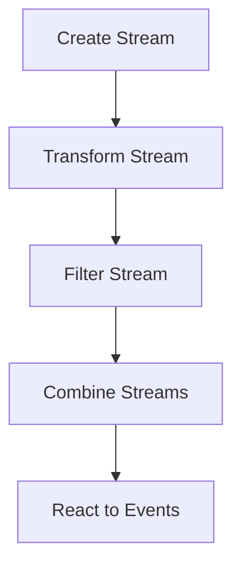

## 10.2.2 Implementing Functional Reactive Programming in TypeScript

Functional Reactive Programming (FRP) is a paradigm that allows developers to work with asynchronous data streams in a declarative manner. By using FRP, you can create applications that are more responsive and easier to maintain. In this section, we will explore how to implement FRP in TypeScript using popular libraries such as Bacon.js, Most.js, and Kefir.js. We will cover the integration of these libraries into TypeScript projects, demonstrate how to leverage TypeScript's type system for type safety, and provide examples of common FRP operations.

### Introduction to FRP Libraries

Before diving into implementation, let's introduce some of the popular FRP libraries compatible with TypeScript:

- **Bacon.js**: A functional reactive programming library for JavaScript that provides a comprehensive set of tools for working with streams and properties.
- **Most.js**: Known for its high performance, Most.js is a reactive programming library that focuses on speed and efficiency.
- **Kefir.js**: A smaller library that offers a simple API for creating and managing streams and properties.

Each of these libraries has its strengths and can be chosen based on the specific needs of your project.

### Integrating FRP Libraries into a TypeScript Project

To start using an FRP library in your TypeScript project, you need to install it and configure your project accordingly. Let's go through the installation and basic setup for each library.

#### Installing Bacon.js

To install Bacon.js, use npm or yarn:

```bash
npm install baconjs
```

or

```bash
yarn add baconjs
```

After installation, you can import Bacon.js into your TypeScript files:

```typescript
import * as Bacon from 'baconjs';
```

#### Installing Most.js

Similarly, install Most.js using npm or yarn:

```bash
npm install most
```

or

```bash
yarn add most
```

Import Most.js into your TypeScript files:

```typescript
import { Stream } from 'most';
```

#### Installing Kefir.js

For Kefir.js, use the following command:

```bash
npm install kefir
```

or

```bash
yarn add kefir
```

Import Kefir.js into your TypeScript files:

```typescript
import * as Kefir from 'kefir';
```

### Leveraging TypeScript's Type System

TypeScript's type system is a powerful tool for ensuring type safety in your FRP applications. By defining types for your streams and events, you can catch errors at compile time, leading to more robust code.

For example, when using Bacon.js, you can define a stream with a specific type:

```typescript
const numberStream: Bacon.EventStream<number> = Bacon.fromArray([1, 2, 3, 4, 5]);
```

This ensures that the stream only emits numbers, and any attempt to emit a different type will result in a compile-time error.

### Creating and Combining Streams

Streams are the core concept in FRP, representing sequences of events over time. Let's explore how to create and combine streams using our chosen libraries.

#### Creating Streams

In Bacon.js, you can create a stream from an array:

```typescript
const numberStream = Bacon.fromArray([1, 2, 3, 4, 5]);
numberStream.onValue(value => console.log(value));
```

In Most.js, streams are created using the `from` method:

```typescript
import { from } from 'most';

const numberStream = from([1, 2, 3, 4, 5]);
numberStream.observe(value => console.log(value));
```

In Kefir.js, use the `fromArray` method:

```typescript
const numberStream = Kefir.fromArray([1, 2, 3, 4, 5]);
numberStream.onValue(value => console.log(value));
```

#### Combining Streams

Combining streams allows you to merge multiple streams into one. This is useful when you want to react to multiple events simultaneously.

In Bacon.js, use the `merge` method:

```typescript
const stream1 = Bacon.fromArray([1, 2, 3]);
const stream2 = Bacon.fromArray([4, 5, 6]);
const combinedStream = Bacon.mergeAll(stream1, stream2);

combinedStream.onValue(value => console.log(value));
```

In Most.js, use the `merge` function:

```typescript
import { merge, from } from 'most';

const stream1 = from([1, 2, 3]);
const stream2 = from([4, 5, 6]);
const combinedStream = merge(stream1, stream2);

combinedStream.observe(value => console.log(value));
```

In Kefir.js, use the `merge` method:

```typescript
const stream1 = Kefir.fromArray([1, 2, 3]);
const stream2 = Kefir.fromArray([4, 5, 6]);
const combinedStream = Kefir.merge([stream1, stream2]);

combinedStream.onValue(value => console.log(value));
```

### Performing Common FRP Operations

FRP libraries provide a variety of operations to manipulate streams. Let's discuss some common operations such as mapping, filtering, merging, and throttling.

#### Mapping

Mapping transforms each event in a stream using a function.

In Bacon.js:

```typescript
const numberStream = Bacon.fromArray([1, 2, 3, 4, 5]);
const squaredStream = numberStream.map(value => value * value);

squaredStream.onValue(value => console.log(value));
```

In Most.js:

```typescript
import { map, from } from 'most';

const numberStream = from([1, 2, 3, 4, 5]);
const squaredStream = map(value => value * value, numberStream);

squaredStream.observe(value => console.log(value));
```

In Kefir.js:

```typescript
const numberStream = Kefir.fromArray([1, 2, 3, 4, 5]);
const squaredStream = numberStream.map(value => value * value);

squaredStream.onValue(value => console.log(value));
```

#### Filtering

Filtering allows you to remove events from a stream based on a condition.

In Bacon.js:

```typescript
const numberStream = Bacon.fromArray([1, 2, 3, 4, 5]);
const evenStream = numberStream.filter(value => value % 2 === 0);

evenStream.onValue(value => console.log(value));
```

In Most.js:

```typescript
import { filter, from } from 'most';

const numberStream = from([1, 2, 3, 4, 5]);
const evenStream = filter(value => value % 2 === 0, numberStream);

evenStream.observe(value => console.log(value));
```

In Kefir.js:

```typescript
const numberStream = Kefir.fromArray([1, 2, 3, 4, 5]);
const evenStream = numberStream.filter(value => value % 2 === 0);

evenStream.onValue(value => console.log(value));
```

#### Merging

Merging combines multiple streams into one.

In Bacon.js:

```typescript
const stream1 = Bacon.fromArray([1, 2, 3]);
const stream2 = Bacon.fromArray([4, 5, 6]);
const mergedStream = Bacon.mergeAll(stream1, stream2);

mergedStream.onValue(value => console.log(value));
```

In Most.js:

```typescript
import { merge, from } from 'most';

const stream1 = from([1, 2, 3]);
const stream2 = from([4, 5, 6]);
const mergedStream = merge(stream1, stream2);

mergedStream.observe(value => console.log(value));
```

In Kefir.js:

```typescript
const stream1 = Kefir.fromArray([1, 2, 3]);
const stream2 = Kefir.fromArray([4, 5, 6]);
const mergedStream = Kefir.merge([stream1, stream2]);

mergedStream.onValue(value => console.log(value));
```

#### Throttling

Throttling limits the rate at which events are emitted from a stream.

In Bacon.js:

```typescript
const numberStream = Bacon.fromArray([1, 2, 3, 4, 5]);
const throttledStream = numberStream.throttle(1000);

throttledStream.onValue(value => console.log(value));
```

In Most.js:

```typescript
import { throttle, from } from 'most';

const numberStream = from([1, 2, 3, 4, 5]);
const throttledStream = throttle(1000, numberStream);

throttledStream.observe(value => console.log(value));
```

In Kefir.js:

```typescript
const numberStream = Kefir.fromArray([1, 2, 3, 4, 5]);
const throttledStream = numberStream.throttle(1000);

throttledStream.onValue(value => console.log(value));
```

### Best Practices for Organizing FRP Code

When working with FRP, it's important to organize your code in a way that is maintainable and scalable. Here are some best practices to consider:

- **Separate Concerns**: Keep your stream definitions, transformations, and side effects separate. This makes it easier to understand and maintain your code.
- **Use TypeScript's Type System**: Leverage TypeScript's type system to define types for your streams and events. This helps catch errors early and improves code readability.
- **Modularize Your Code**: Break down your code into smaller, reusable modules. This makes it easier to test and maintain.
- **Document Your Streams**: Use comments and documentation to explain the purpose and behavior of your streams. This helps other developers understand your code.

### Choosing the Right FRP Library

Each FRP library has its strengths and weaknesses. When choosing a library for your project, consider the following factors:

- **Performance**: If performance is a critical factor, Most.js is known for its speed and efficiency.
- **Ease of Use**: If you prefer a simple API, Kefir.js might be the right choice.
- **Feature Set**: Bacon.js offers a comprehensive set of features, making it suitable for complex applications.

### Performance Considerations

FRP can introduce performance overhead if not used carefully. Here are some tips to optimize your FRP code:

- **Avoid Unnecessary Stream Creation**: Create streams only when necessary to reduce memory usage.
- **Use Throttling and Debouncing**: Limit the rate of events to prevent overwhelming your application.
- **Profile Your Code**: Use profiling tools to identify performance bottlenecks and optimize your code accordingly.

### Try It Yourself

Now that we've covered the basics of implementing FRP in TypeScript, it's time to experiment with the code examples provided. Try modifying the examples to suit your needs, or create new streams and transformations to see how they work in practice.

### Visualizing FRP Concepts

To better understand how streams and events flow in FRP, let's visualize the process using a flowchart.



**Diagram Description**: This flowchart represents the typical process of working with streams in FRP. It starts with creating a stream, followed by transforming and filtering it. The streams are then combined, and the application reacts to the resulting events.

### References and Links

For further reading and deeper dives into FRP and TypeScript, consider the following resources:

- [Bacon.js Documentation](https://baconjs.github.io/)
- [Most.js Documentation](https://mostcore.readthedocs.io/en/latest/)
- [Kefir.js Documentation](https://rpominov.github.io/kefir/)
- [TypeScript Handbook](https://www.typescriptlang.org/docs/)

### Knowledge Check

- What are the main differences between Bacon.js, Most.js, and Kefir.js?
- How can you leverage TypeScript's type system to ensure type safety in FRP?
- What are some common FRP operations, and how do they work?
- What are the best practices for organizing code in an FRP-based application?
- How can you optimize FRP code for performance?

### Embrace the Journey

Remember, implementing FRP in TypeScript is just the beginning of your journey into reactive programming. As you progress, you'll discover more advanced techniques and patterns that will help you build even more responsive and efficient applications. Keep experimenting, stay curious, and enjoy the journey!

## Quiz Time!



### Which library is known for its high performance in FRP?

- [ ] Bacon.js
- [x] Most.js
- [ ] Kefir.js
- [ ] RxJS

> **Explanation:** Most.js is known for its high performance and efficiency in handling streams.

### What is the primary purpose of using TypeScript's type system in FRP?

- [x] To ensure type safety
- [ ] To increase performance
- [ ] To reduce code size
- [ ] To simplify syntax

> **Explanation:** TypeScript's type system helps ensure type safety by catching errors at compile time.

### Which method is used to create a stream from an array in Bacon.js?

- [ ] from
- [x] fromArray
- [ ] createStream
- [ ] arrayStream

> **Explanation:** `fromArray` is the method used in Bacon.js to create a stream from an array.

### What operation would you use to combine two streams into one?

- [ ] map
- [ ] filter
- [x] merge
- [ ] throttle

> **Explanation:** The `merge` operation combines two or more streams into a single stream.

### Which operation is used to limit the rate of events emitted from a stream?

- [ ] map
- [ ] filter
- [ ] merge
- [x] throttle

> **Explanation:** Throttling limits the rate at which events are emitted from a stream.

### What is a best practice for organizing FRP code?

- [x] Separate concerns
- [ ] Use global variables
- [ ] Avoid using types
- [ ] Combine all logic in one function

> **Explanation:** Separating concerns helps maintain and scale FRP code effectively.

### Which library offers a simple API for creating and managing streams?

- [ ] Bacon.js
- [ ] Most.js
- [x] Kefir.js
- [ ] RxJS

> **Explanation:** Kefir.js is known for its simple API, making it easy to create and manage streams.

### What should you avoid to reduce memory usage in FRP?

- [ ] Using streams
- [x] Unnecessary stream creation
- [ ] Using TypeScript
- [ ] Combining streams

> **Explanation:** Avoiding unnecessary stream creation helps reduce memory usage.

### Which library provides a comprehensive set of features for complex applications?

- [x] Bacon.js
- [ ] Most.js
- [ ] Kefir.js
- [ ] RxJS

> **Explanation:** Bacon.js offers a comprehensive set of features suitable for complex applications.

### True or False: Profiling tools are useful for identifying performance bottlenecks in FRP code.

- [x] True
- [ ] False

> **Explanation:** Profiling tools help identify performance bottlenecks, allowing for optimization of FRP code.


