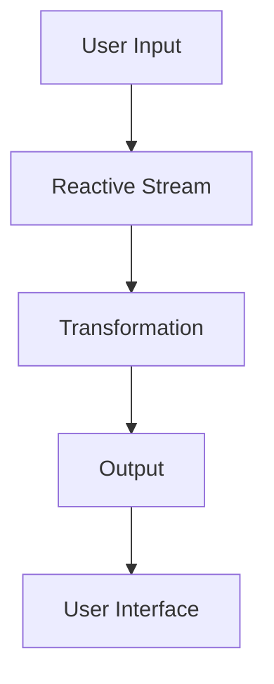

## 10.2 Functional Reactive Programming

Functional Reactive Programming (FRP) is an advanced paradigm that combines the principles of functional programming with reactive programming to create systems that respond to continuous data flows. This approach is particularly beneficial for managing complex asynchronous operations, providing a more declarative and composable way to handle time-varying values.

### Understanding Functional Reactive Programming

#### Core Principles of FRP

Functional Reactive Programming is built on two main pillars: functional programming and reactive programming. Let's delve into each:

1. **Functional Programming**: This paradigm emphasizes the use of pure functions, immutability, and higher-order functions. It promotes a declarative style of coding, where you describe what the program should accomplish rather than detailing how to achieve it.

2. **Reactive Programming**: This paradigm focuses on data streams and the propagation of change. Reactive systems are designed to react to changes in their environment, making them ideal for applications that require real-time updates or need to handle asynchronous data.

FRP marries these two paradigms by using functional programming techniques to manipulate reactive data streams, resulting in systems that are both responsive and easy to reason about.

### Key Concepts in FRP

To effectively utilize FRP, it's essential to understand its core concepts: signals, behaviors, events, and continuous time models.

#### Signals and Behaviors

- **Signals**: These represent time-varying values. In FRP, a signal is a function from time to a value. For instance, the position of a mouse cursor can be represented as a signal that changes over time.

- **Behaviors**: Similar to signals, behaviors represent values that change over time. However, behaviors are typically used to model continuous changes, such as the position of an object in a game.

#### Events

- **Events**: These are discrete occurrences that happen at specific points in time. In FRP, events are used to model things like button clicks or network responses.

#### Continuous Time Models

- **Continuous Time Models**: FRP allows you to model systems as continuous functions of time, which can be particularly useful for simulations or animations where you need to interpolate values smoothly over time.

### Benefits of FRP

FRP offers several advantages over traditional imperative approaches:

1. **Declarative Code**: FRP allows you to express complex behaviors in a declarative manner, making the code easier to read and understand.

2. **Ease of Reasoning**: By abstracting away the details of how data flows through the system, FRP makes it easier to reason about the behavior of your application over time.

3. **Composability**: FRP encourages the use of small, composable functions, which can be combined to create more complex behaviors.

### Implementing FRP in TypeScript

Let's explore how we can implement FRP concepts in TypeScript using a popular library like RxJS, which provides a powerful set of tools for working with reactive streams.

#### Example: Creating a Reactive Stream

```typescript
import { fromEvent } from 'rxjs';
import { map, filter } from 'rxjs/operators';

// Create a stream from button click events
const button = document.querySelector('button');
const clicks$ = fromEvent(button, 'click');

// Transform the stream to emit the number of clicks
const clickCount$ = clicks$.pipe(
  map(() => 1),
  scan((acc, curr) => acc + curr, 0)
);

// Subscribe to the stream and log the click count
clickCount$.subscribe(count => console.log(`Button clicked ${count} times`));
```

In this example, we create a reactive stream from button click events using RxJS's `fromEvent` function. We then transform the stream using the `map` and `scan` operators to count the number of clicks. Finally, we subscribe to the stream to log the click count.

#### Example: Modeling Time-Varying Values

```typescript
import { interval } from 'rxjs';
import { map } from 'rxjs/operators';

// Create a stream that emits a value every second
const time$ = interval(1000);

// Transform the stream to represent a time-varying value
const timeInSeconds$ = time$.pipe(
  map(t => t + 1)
);

// Subscribe to the stream and log the time
timeInSeconds$.subscribe(time => console.log(`Time: ${time} seconds`));
```

Here, we use the `interval` function to create a stream that emits a value every second. We then transform the stream to represent a time-varying value, which we log to the console.

### Comparing FRP with Imperative Approaches

Traditional imperative programming involves explicitly managing state and events, often resulting in complex and error-prone code. In contrast, FRP abstracts these details, allowing you to focus on the relationships between data and how it flows through the system.

#### Imperative Example

```typescript
let count = 0;
const button = document.querySelector('button');

button.addEventListener('click', () => {
  count++;
  console.log(`Button clicked ${count} times`);
});
```

In this imperative example, we manually manage the state of the `count` variable and update it each time the button is clicked. This approach can become cumbersome as the complexity of the application increases.

### Visualizing FRP Concepts

To better understand how FRP works, let's visualize the flow of data through a reactive system.



**Diagram Description**: This flowchart illustrates how user input is transformed into a reactive stream, which is then processed and output to the user interface.

### Try It Yourself

Experiment with the provided code examples by modifying the transformation logic or adding new streams. For instance, try creating a stream that reacts to mouse movements or keyboard events.

### Further Reading

- [MDN Web Docs on Functional Programming](https://developer.mozilla.org/en-US/docs/Glossary/Functional_programming)
- [RxJS Documentation](https://rxjs.dev/guide/overview)

### Knowledge Check

- What are the core principles of Functional Reactive Programming?
- How do signals and behaviors differ in FRP?
- What are the benefits of using FRP over traditional imperative approaches?

### Embrace the Journey

Remember, mastering FRP is a journey. As you continue to explore this paradigm, you'll discover new ways to simplify complex asynchronous operations and create more responsive applications. Keep experimenting, stay curious, and enjoy the journey!

## Quiz Time!



### What is a core principle of Functional Reactive Programming?

- [x] Combining functional programming with reactive data streams
- [ ] Using only imperative programming techniques
- [ ] Avoiding the use of data streams
- [ ] Focusing solely on object-oriented programming

> **Explanation:** Functional Reactive Programming combines functional programming with reactive data streams to manage time-varying values and asynchronous operations.

### What does a signal represent in FRP?

- [x] A time-varying value
- [ ] A static value
- [ ] A discrete event
- [ ] An error state

> **Explanation:** In FRP, a signal represents a value that changes over time, such as the position of a mouse cursor.

### How does FRP improve code readability?

- [x] By allowing declarative expression of complex behaviors
- [ ] By increasing the amount of imperative code
- [ ] By using more global variables
- [ ] By avoiding the use of functions

> **Explanation:** FRP improves code readability by allowing developers to express complex behaviors in a declarative manner, making the code easier to understand.

### What is an event in FRP?

- [x] A discrete occurrence at a specific point in time
- [ ] A continuous value change
- [ ] A static data point
- [ ] A function call

> **Explanation:** An event in FRP is a discrete occurrence that happens at a specific point in time, such as a button click.

### Which of the following is a benefit of FRP?

- [x] Composability
- [ ] Increased complexity
- [ ] More manual state management
- [ ] Less modular code

> **Explanation:** FRP promotes composability by encouraging the use of small, reusable functions that can be combined to create complex behaviors.

### How can you create a reactive stream in TypeScript?

- [x] Using RxJS's `fromEvent` function
- [ ] By writing imperative loops
- [ ] By using global variables
- [ ] By avoiding the use of libraries

> **Explanation:** You can create a reactive stream in TypeScript using RxJS's `fromEvent` function, which allows you to listen to events and create streams.

### What is a continuous time model in FRP?

- [x] A model that represents systems as continuous functions of time
- [ ] A model that only uses discrete events
- [ ] A model that ignores time
- [ ] A model that uses only static values

> **Explanation:** A continuous time model in FRP represents systems as continuous functions of time, useful for simulations or animations.

### How does FRP handle asynchronous operations?

- [x] By abstracting away the details of data flow
- [ ] By using only synchronous code
- [ ] By avoiding the use of streams
- [ ] By relying on global state

> **Explanation:** FRP handles asynchronous operations by abstracting away the details of data flow, allowing developers to focus on the relationships between data.

### What is the role of RxJS in FRP?

- [x] It provides tools for working with reactive streams
- [ ] It replaces TypeScript's type system
- [ ] It is used for styling web pages
- [ ] It is a database management system

> **Explanation:** RxJS provides a powerful set of tools for working with reactive streams, making it easier to implement FRP concepts in TypeScript.

### True or False: FRP is only useful for small applications.

- [ ] True
- [x] False

> **Explanation:** False. FRP is useful for applications of all sizes, especially those that require managing complex asynchronous operations and continuous data flows.


