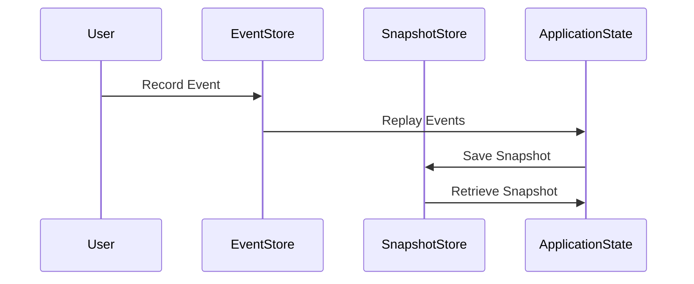

## 10.3.1 Implementing Event Sourcing in TypeScript

Event Sourcing is a powerful design pattern that enables us to record all changes to the application state as a sequence of events. This approach allows for reconstructing the state at any point in time by replaying these events. In this section, we'll explore how to implement Event Sourcing in TypeScript, leveraging its strong typing and modern features to build robust applications.

### Understanding Event Sourcing

Before diving into implementation, let's understand the core concepts of Event Sourcing:

1. **Events as the Source of Truth**: Instead of storing the current state of an entity, we store a series of events that represent state changes. Each event is immutable and represents a single change.

2. **Event Store**: This is a storage mechanism where all events are recorded. It can be an in-memory store, a database, or an external service.

3. **State Reconstruction**: The current state of an entity is reconstructed by replaying the events from the event store.

4. **Snapshots**: To improve performance, snapshots of the state can be taken periodically to avoid replaying all events from the beginning.

### Step-by-Step Guide to Implementing Event Sourcing in TypeScript

#### 1. Defining Events

Events are the backbone of Event Sourcing. In TypeScript, we can define events using interfaces or classes. It's crucial to ensure that events are immutable.

```typescript
// Define an interface for a generic event
interface Event {
  type: string;
  timestamp: Date;
}

// Define specific events
class UserCreatedEvent implements Event {
  type = 'UserCreated';
  timestamp: Date;
  constructor(public userId: string, public username: string) {
    this.timestamp = new Date();
  }
}

class UserNameUpdatedEvent implements Event {
  type = 'UserNameUpdated';
  timestamp: Date;
  constructor(public userId: string, public newUsername: string) {
    this.timestamp = new Date();
  }
}
```

**Key Points**:
- Use TypeScript's `interface` or `class` to define events.
- Ensure events are immutable by using `readonly` properties or constructor assignments.

#### 2. Recording Events in an Event Store

The event store is responsible for persisting events. It can be implemented in various ways, such as using an in-memory array, a database, or an external service.

```typescript
class EventStore {
  private events: Event[] = [];

  // Record an event
  record(event: Event): void {
    this.events.push(event);
  }

  // Retrieve all events
  getEvents(): Event[] {
    return [...this.events];
  }
}

// Usage
const eventStore = new EventStore();
eventStore.record(new UserCreatedEvent('123', 'john_doe'));
eventStore.record(new UserNameUpdatedEvent('123', 'john_doe_updated'));
```

**Key Points**:
- Use a simple array for an in-memory event store.
- Ensure the event store can record and retrieve events efficiently.

#### 3. Reconstructing Application State

To reconstruct the state, we replay the events from the event store. This involves applying each event to an initial state to build up the current state.

```typescript
class User {
  userId: string;
  username: string;

  constructor(userId: string, username: string) {
    this.userId = userId;
    this.username = username;
  }

  // Apply a UserCreatedEvent
  static applyUserCreated(event: UserCreatedEvent): User {
    return new User(event.userId, event.username);
  }

  // Apply a UserNameUpdatedEvent
  applyUserNameUpdated(event: UserNameUpdatedEvent): void {
    this.username = event.newUsername;
  }
}

// Reconstruct user state from events
function reconstructUser(events: Event[]): User | null {
  let user: User | null = null;
  for (const event of events) {
    if (event instanceof UserCreatedEvent) {
      user = User.applyUserCreated(event);
    } else if (event instanceof UserNameUpdatedEvent && user) {
      user.applyUserNameUpdated(event);
    }
  }
  return user;
}

// Usage
const events = eventStore.getEvents();
const user = reconstructUser(events);
console.log(user);
```

**Key Points**:
- Define methods to apply events to entities.
- Reconstruct state by iterating over events and applying them in order.

#### 4. Handling Snapshots

Snapshots can significantly improve performance by reducing the number of events that need to be replayed. A snapshot captures the state at a specific point in time.

```typescript
interface Snapshot {
  state: any;
  timestamp: Date;
}

class SnapshotStore {
  private snapshots: Map<string, Snapshot> = new Map();

  // Save a snapshot
  saveSnapshot(entityId: string, state: any): void {
    this.snapshots.set(entityId, { state, timestamp: new Date() });
  }

  // Retrieve a snapshot
  getSnapshot(entityId: string): Snapshot | undefined {
    return this.snapshots.get(entityId);
  }
}

// Usage
const snapshotStore = new SnapshotStore();
snapshotStore.saveSnapshot('123', user);
const snapshot = snapshotStore.getSnapshot('123');
```

**Key Points**:
- Use snapshots to store the state at specific intervals.
- Retrieve snapshots to reduce the number of events needed for state reconstruction.

#### 5. Considerations for Distributed Environments

In distributed systems, ensuring data consistency and handling events across multiple services can be challenging. Here are some considerations:

- **Event Ordering**: Ensure events are processed in the correct order. Use timestamps or sequence numbers to maintain order.
- **Idempotency**: Design event handlers to be idempotent, meaning processing the same event multiple times has no additional effect.
- **Consistency**: Use distributed consensus algorithms or eventual consistency models to ensure data consistency across services.

#### 6. Best Practices for Organizing Code

- **Event Schemas**: Define clear and consistent schemas for events. Use TypeScript's type system to enforce these schemas.
- **Modular Design**: Organize code into modules, separating event definitions, event store logic, and state reconstruction logic.
- **Testing**: Write tests for event handlers and state reconstruction logic to ensure correctness.

#### 7. Try It Yourself

Experiment with the code examples provided by modifying them to suit different scenarios. For instance, add new event types, implement a database-backed event store, or introduce snapshots at different intervals.

### Visualizing Event Sourcing

Below is a diagram illustrating the flow of events in an Event Sourcing system:



**Diagram Explanation**:
- **User**: Initiates events that are recorded in the event store.
- **EventStore**: Stores events and provides them for state reconstruction.
- **SnapshotStore**: Saves and retrieves snapshots to optimize state reconstruction.
- **ApplicationState**: Reconstructs the state by replaying events and applying snapshots.

### Knowledge Check

- What are the benefits of using Event Sourcing?
- How do snapshots improve performance in Event Sourcing?
- What are some challenges of implementing Event Sourcing in distributed systems?

### Conclusion

Event Sourcing in TypeScript provides a robust way to manage application state by recording and replaying events. By following the steps outlined in this guide, you can implement Event Sourcing in your applications, ensuring data consistency and enabling powerful state management capabilities.

Remember, this is just the beginning. As you progress, you'll build more complex systems and explore advanced techniques. Keep experimenting, stay curious, and enjoy the journey!

## Quiz Time!



### What is the primary purpose of Event Sourcing?

- [x] To record all changes to the application state as a sequence of events.
- [ ] To store only the current state of an entity.
- [ ] To use a relational database for storing events.
- [ ] To ensure high availability of the application.

> **Explanation:** Event Sourcing focuses on recording all changes to the application state as a sequence of events, allowing for complete state reconstruction.

### How are events typically defined in TypeScript for Event Sourcing?

- [x] Using interfaces or classes with immutable properties.
- [ ] Using plain JavaScript objects with mutable properties.
- [ ] Using JSON strings stored in a database.
- [ ] Using TypeScript enums for event types.

> **Explanation:** Events are defined using TypeScript interfaces or classes with immutable properties to ensure consistency and reliability.

### What is the role of an event store in Event Sourcing?

- [x] To persist events for later retrieval and replay.
- [ ] To execute business logic based on events.
- [ ] To provide a user interface for event management.
- [ ] To generate reports based on event data.

> **Explanation:** The event store is responsible for persisting events, allowing them to be retrieved and replayed to reconstruct application state.

### How can snapshots improve performance in Event Sourcing?

- [x] By reducing the number of events that need to be replayed.
- [ ] By storing events in a more compact format.
- [ ] By eliminating the need for an event store.
- [ ] By providing real-time analytics on events.

> **Explanation:** Snapshots capture the state at specific points, reducing the number of events that need to be replayed for state reconstruction.

### What is a key consideration for handling events in a distributed environment?

- [x] Ensuring event ordering and idempotency.
- [ ] Using a single centralized event store.
- [ ] Avoiding the use of snapshots.
- [ ] Storing events in a relational database.

> **Explanation:** In distributed environments, it's crucial to ensure event ordering and idempotency to maintain consistency across services.

### Which of the following is a best practice for organizing code in Event Sourcing?

- [x] Defining clear and consistent event schemas.
- [ ] Storing all events in a single file.
- [ ] Using global variables for event management.
- [ ] Avoiding the use of TypeScript types.

> **Explanation:** Defining clear and consistent event schemas helps maintain a well-organized and reliable codebase.

### What is the benefit of using TypeScript's type system in Event Sourcing?

- [x] Enforcing event schemas and ensuring type safety.
- [ ] Reducing the size of event data.
- [ ] Improving the performance of event replay.
- [ ] Eliminating the need for an event store.

> **Explanation:** TypeScript's type system helps enforce event schemas and ensures type safety, leading to more reliable code.

### How can you experiment with the provided code examples?

- [x] By adding new event types and implementing a database-backed event store.
- [ ] By removing all TypeScript types and using plain JavaScript.
- [ ] By converting the code to a different programming language.
- [ ] By using a different IDE for development.

> **Explanation:** Experimenting with new event types and implementing a database-backed event store allows for practical exploration of Event Sourcing concepts.

### What is the role of the SnapshotStore in the provided code example?

- [x] To save and retrieve snapshots of the application state.
- [ ] To execute business logic based on snapshots.
- [ ] To provide a user interface for snapshot management.
- [ ] To generate reports based on snapshot data.

> **Explanation:** The SnapshotStore is responsible for saving and retrieving snapshots, optimizing state reconstruction.

### True or False: Event Sourcing requires the use of a relational database for storing events.

- [ ] True
- [x] False

> **Explanation:** Event Sourcing does not require a relational database; events can be stored in various ways, such as in-memory stores, NoSQL databases, or external services.


