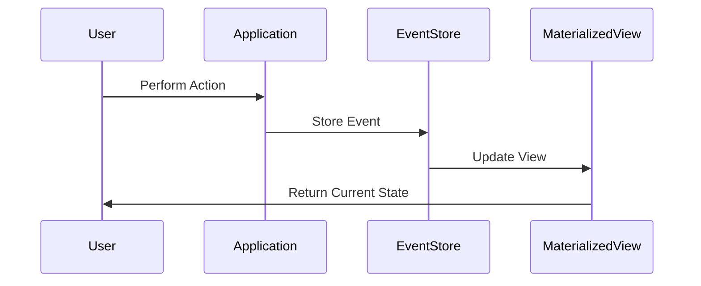

## 10.3.2 Benefits and Challenges

Event Sourcing is a powerful architectural pattern that offers numerous benefits, especially in systems where auditability, traceability, and scalability are crucial. However, it also presents several challenges that must be carefully managed. In this section, we will delve into the advantages of Event Sourcing, such as high auditability, the ability to reconstruct past states, and enhanced scalability. We will also explore the challenges, including increased storage requirements, complexity in event versioning, and difficulties in querying the current state. Finally, we will discuss strategies to mitigate these challenges and provide guidance on when to consider Event Sourcing for your applications.

### Benefits of Event Sourcing

#### High Auditability and Traceability

One of the most significant benefits of Event Sourcing is its ability to provide a complete and immutable history of all changes made to the system. This high level of auditability is invaluable in industries where compliance and traceability are critical, such as finance, healthcare, and government sectors.

- **Complete History**: Every change to the system is recorded as a distinct event, allowing you to trace the entire lifecycle of an entity. This makes it possible to understand exactly how the system reached its current state.
- **Audit Trails**: With a complete log of all events, generating audit trails becomes straightforward. This is particularly useful for compliance with regulations that require detailed records of data changes.

#### Ability to Reconstruct Past States

Event Sourcing allows you to reconstruct the state of the system at any point in time by replaying the events from the event log. This capability is beneficial for debugging, analysis, and even forensic investigations.

- **Debugging and Analysis**: By replaying events, you can recreate the exact conditions that led to a specific issue, making it easier to identify and fix bugs.
- **Forensic Investigations**: In cases where you need to understand the sequence of events leading up to a particular outcome, Event Sourcing provides a clear and detailed picture.

#### Enhanced Scalability through Decoupled Event Handling

Event Sourcing naturally supports scalability by decoupling the event generation from the event processing. This decoupling allows for more flexible and scalable system architectures.

- **Decoupled Architecture**: Events can be processed asynchronously, enabling the system to handle high loads more effectively.
- **Scalable Event Processing**: By distributing event processing across multiple services or nodes, you can scale the system horizontally to accommodate increasing demand.

#### Support for Eventual Consistency

In distributed systems, achieving strong consistency can be challenging. Event Sourcing supports eventual consistency, which is often more practical in such environments.

- **Eventual Consistency**: By allowing different parts of the system to become consistent over time, Event Sourcing can improve system availability and performance.
- **Resilience to Failures**: Since events are stored persistently, the system can recover from failures by replaying events, ensuring that no data is lost.

### Challenges of Event Sourcing

#### Increased Storage Requirements

One of the primary challenges of Event Sourcing is the increased storage requirements due to the need to persist every event.

- **Storage Costs**: As the number of events grows, so does the storage required to maintain the event log. This can lead to increased costs and complexity in managing storage infrastructure.
- **Data Retention Policies**: Implementing effective data retention policies is crucial to manage storage costs while ensuring compliance with regulatory requirements.

#### Complexity in Event Versioning and Schema Evolution

As systems evolve, the structure of events may need to change. Managing these changes while maintaining compatibility with existing events can be complex.

- **Event Versioning**: Introducing new versions of events requires careful planning to ensure backward compatibility and prevent disruptions.
- **Schema Evolution**: Changes to the schema of events must be managed to avoid breaking existing consumers of the event stream.

#### Difficulties in Querying Current State without Materialized Views

Event Sourcing stores the state as a series of events, which can make querying the current state challenging without additional mechanisms.

- **Materialized Views**: To efficiently query the current state, materialized views or projections are often used. These views must be kept up-to-date with the latest events, adding complexity to the system.
- **Query Performance**: Without materialized views, querying the current state can be slow and resource-intensive, as it requires replaying events to reconstruct the state.

### Strategies for Mitigating Challenges

#### Using Snapshotting

Snapshotting is a technique used to mitigate the storage and performance challenges associated with Event Sourcing.

- **Periodic Snapshots**: By periodically taking snapshots of the current state, you can reduce the number of events that need to be replayed to reconstruct the state.
- **Efficient Recovery**: Snapshots allow the system to recover more quickly by starting from a known state rather than replaying the entire event log.

#### Implementing Proper Event Versioning Practices

To manage schema evolution and event versioning, it is essential to adopt best practices that ensure compatibility and minimize disruptions.

- **Backward Compatibility**: Design events to be backward compatible, allowing older versions to coexist with newer ones.
- **Versioning Strategies**: Use versioning strategies, such as semantic versioning, to clearly indicate changes and their impact on consumers.

#### Leveraging Materialized Views

Materialized views or projections can be used to efficiently query the current state and improve performance.

- **Real-time Updates**: Keep materialized views up-to-date with the latest events to ensure they reflect the current state accurately.
- **Optimized Queries**: Use materialized views to optimize queries, reducing the need to replay events and improving response times.

### Weighing Benefits Against Complexities

When considering Event Sourcing for your applications, it is crucial to weigh the benefits against the complexities. While Event Sourcing offers significant advantages in terms of auditability, scalability, and consistency, it also introduces challenges that require careful management.

- **Assessing Needs**: Evaluate whether the benefits of Event Sourcing align with your application's requirements and constraints.
- **Complexity Management**: Consider the complexity and cost of implementing and maintaining an Event Sourcing architecture, and whether your team has the necessary expertise.

### Conclusion

Event Sourcing is a powerful pattern that can provide significant benefits in terms of auditability, scalability, and consistency. However, it also presents challenges that must be carefully managed. By understanding these benefits and challenges, and employing strategies to mitigate the latter, you can make informed decisions about whether Event Sourcing is the right fit for your applications.

### Try It Yourself

To deepen your understanding of Event Sourcing, try implementing a simple event-sourced application in TypeScript. Start by defining a domain model and creating events to represent changes. Implement a basic event store and experiment with snapshotting and materialized views. Consider how you would handle event versioning and schema evolution. By experimenting with these concepts, you can gain practical experience and insights into the benefits and challenges of Event Sourcing.

### Visualizing Event Sourcing

To help visualize the concepts discussed, let's look at a simple diagram that illustrates the flow of events in an Event Sourcing architecture.

This sequence diagram shows how a user's action results in an event being stored in the Event Store. The Materialized View is then updated to reflect the current state, which is returned to the user.

### References and Links

- [Event Sourcing on Martin Fowler's Blog](https://martinfowler.com/eaaDev/EventSourcing.html)
- [CQRS and Event Sourcing](https://docs.microsoft.com/en-us/azure/architecture/patterns/cqrs)
- [Event Sourcing in Node.js](https://nodejsdesignpatterns.com/blog/event-sourcing-in-nodejs/)

## Quiz Time!



### What is one of the main benefits of Event Sourcing?

- [x] High auditability due to a complete history of changes.
- [ ] Reduced storage requirements.
- [ ] Simplicity in querying current state.
- [ ] Strong consistency in distributed systems.

> **Explanation:** Event Sourcing provides high auditability by maintaining a complete history of changes as events, which is invaluable for compliance and traceability.

### How does Event Sourcing support eventual consistency?

- [x] By allowing different parts of the system to become consistent over time.
- [ ] By ensuring all parts of the system are always consistent.
- [ ] By eliminating the need for consistency altogether.
- [ ] By using strong consistency models.

> **Explanation:** Event Sourcing supports eventual consistency by allowing different parts of the system to synchronize over time, improving availability and performance.

### What is a challenge associated with Event Sourcing?

- [x] Increased storage requirements for the event log.
- [ ] Reduced auditability.
- [ ] Simplified event versioning.
- [ ] Strong consistency in distributed systems.

> **Explanation:** Event Sourcing requires storing every event, leading to increased storage requirements, which can be a challenge to manage.

### What is a strategy to mitigate the storage challenge in Event Sourcing?

- [x] Using snapshotting to reduce the number of events replayed.
- [ ] Eliminating old events to save space.
- [ ] Storing events in memory only.
- [ ] Using a single database for all events.

> **Explanation:** Snapshotting involves periodically saving the current state, reducing the need to replay all events, thus mitigating storage challenges.

### What is a materialized view in the context of Event Sourcing?

- [x] A mechanism to efficiently query the current state.
- [ ] A backup of the event log.
- [ ] A temporary storage for events.
- [ ] A method to store events in memory.

> **Explanation:** A materialized view is used to efficiently query the current state by maintaining an up-to-date representation of the system's state.

### What is a benefit of using materialized views?

- [x] Improved query performance by avoiding replaying events.
- [ ] Reduced auditability.
- [ ] Increased storage requirements.
- [ ] Simplified event versioning.

> **Explanation:** Materialized views improve query performance by providing a current state representation without needing to replay all events.

### How can event versioning be managed effectively?

- [x] By ensuring backward compatibility and using versioning strategies.
- [ ] By ignoring older versions of events.
- [ ] By storing all events in a single format.
- [ ] By using a single version for all events.

> **Explanation:** Effective event versioning involves ensuring backward compatibility and employing strategies like semantic versioning to manage changes.

### What is a challenge when querying the current state in Event Sourcing?

- [x] The need to replay events without materialized views.
- [ ] The inability to store events.
- [ ] The lack of auditability.
- [ ] The simplicity of event versioning.

> **Explanation:** Without materialized views, querying the current state requires replaying events, which can be resource-intensive and slow.

### Why is Event Sourcing beneficial for debugging?

- [x] It allows reconstruction of past states by replaying events.
- [ ] It simplifies the codebase.
- [ ] It reduces the number of events.
- [ ] It eliminates the need for logs.

> **Explanation:** Event Sourcing enables debugging by allowing developers to reconstruct past states and understand the sequence of events leading to an issue.

### True or False: Event Sourcing always ensures strong consistency in distributed systems.

- [ ] True
- [x] False

> **Explanation:** Event Sourcing supports eventual consistency, not strong consistency, allowing parts of the system to become consistent over time.


