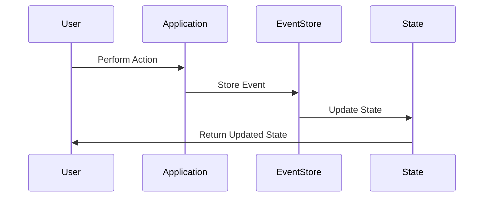

## 10.3.3 Use Cases and Examples

Event Sourcing is a powerful design pattern that captures all changes to an application's state as a sequence of events. This approach is particularly beneficial in scenarios where maintaining a precise history of changes is crucial. Let's explore some practical applications of Event Sourcing, focusing on financial systems, auditing, and complex domain models.

### Financial Applications

Financial systems are prime candidates for Event Sourcing due to their need for precise transaction histories and the ability to undo operations. In these systems, every transaction, whether it's a deposit, withdrawal, or transfer, is recorded as an event. This ensures that the entire history of transactions is preserved, allowing for accurate auditing and reconciliation.

#### Example: Banking System

Consider a banking application where users can perform various transactions. By implementing Event Sourcing, each transaction is stored as an event, capturing details such as the transaction type, amount, and timestamp. This approach provides several advantages:

- **Traceability**: Every transaction is recorded, allowing for a complete audit trail.
- **Undo Capabilities**: If a transaction needs to be reversed, the system can replay events up to a certain point, effectively undoing the transaction.
- **Regulatory Compliance**: Financial regulations often require detailed records of all transactions. Event Sourcing ensures that these records are complete and accurate.

Here's a simplified TypeScript example illustrating how Event Sourcing might be implemented in a banking application:

```typescript
interface Event {
    type: string;
    data: any;
    timestamp: Date;
}

class BankAccount {
    private balance: number = 0;
    private events: Event[] = [];

    deposit(amount: number) {
        const event: Event = { type: 'DEPOSIT', data: amount, timestamp: new Date() };
        this.apply(event);
        this.events.push(event);
    }

    withdraw(amount: number) {
        const event: Event = { type: 'WITHDRAW', data: amount, timestamp: new Date() };
        this.apply(event);
        this.events.push(event);
    }

    private apply(event: Event) {
        switch (event.type) {
            case 'DEPOSIT':
                this.balance += event.data;
                break;
            case 'WITHDRAW':
                this.balance -= event.data;
                break;
        }
    }

    getBalance(): number {
        return this.balance;
    }

    getEvents(): Event[] {
        return this.events;
    }
}

const account = new BankAccount();
account.deposit(100);
account.withdraw(50);
console.log(account.getBalance()); // Output: 50
console.log(account.getEvents());  // Output: Array of events
```

### Auditing Systems

Auditing systems benefit greatly from Event Sourcing, as they require a comprehensive record of all changes to data. By capturing each change as an event, these systems can provide detailed logs that are essential for compliance and analysis.

#### Example: User Activity Tracking

In an auditing system for tracking user activities, every action a user takes can be recorded as an event. This might include logging in, updating a profile, or making a purchase. By storing these events, the system can generate detailed reports and analyses of user behavior.

- **Detailed Logs**: Every user action is recorded, providing a complete history of interactions.
- **Compliance**: Many industries require detailed logs for compliance purposes. Event Sourcing ensures these logs are accurate and complete.
- **Behavior Analysis**: By analyzing the sequence of events, organizations can gain insights into user behavior and preferences.

Here's an example of how user activity might be tracked using Event Sourcing in TypeScript:

```typescript
interface UserEvent {
    type: string;
    userId: string;
    data: any;
    timestamp: Date;
}

class UserActivityTracker {
    private events: UserEvent[] = [];

    logEvent(event: UserEvent) {
        this.events.push(event);
    }

    getEventsForUser(userId: string): UserEvent[] {
        return this.events.filter(event => event.userId === userId);
    }
}

const tracker = new UserActivityTracker();
tracker.logEvent({ type: 'LOGIN', userId: 'user123', data: {}, timestamp: new Date() });
tracker.logEvent({ type: 'UPDATE_PROFILE', userId: 'user123', data: { name: 'John Doe' }, timestamp: new Date() });

console.log(tracker.getEventsForUser('user123')); // Output: Array of events for user123
```

### Complex Domain Models

In complex domain models, state changes are significant and need detailed tracking. Event Sourcing provides a way to capture these changes as events, allowing for a complete history of the model's evolution.

#### Example: E-commerce Order Management

In an e-commerce platform, the lifecycle of an order involves multiple state changes, from creation to fulfillment. By using Event Sourcing, each state change can be recorded as an event, providing a detailed history of the order's lifecycle.

- **State Evolution**: Track the evolution of an order through its various states.
- **Reconstruct State**: Reconstruct the current state of an order by replaying events.
- **Debugging and Analysis**: Analyze the sequence of events to identify issues or optimize processes.

Here's a TypeScript example demonstrating how Event Sourcing can be applied to order management:

```typescript
interface OrderEvent {
    type: string;
    orderId: string;
    data: any;
    timestamp: Date;
}

class Order {
    private state: string = 'CREATED';
    private events: OrderEvent[] = [];

    updateState(newState: string) {
        const event: OrderEvent = { type: 'STATE_CHANGE', orderId: this.getOrderId(), data: newState, timestamp: new Date() };
        this.apply(event);
        this.events.push(event);
    }

    private apply(event: OrderEvent) {
        if (event.type === 'STATE_CHANGE') {
            this.state = event.data;
        }
    }

    getState(): string {
        return this.state;
    }

    getEvents(): OrderEvent[] {
        return this.events;
    }

    private getOrderId(): string {
        // Logic to generate or retrieve order ID
        return 'order123';
    }
}

const order = new Order();
order.updateState('PROCESSING');
order.updateState('SHIPPED');
console.log(order.getState()); // Output: SHIPPED
console.log(order.getEvents()); // Output: Array of order events
```

### Real-World Case Studies

Several companies have successfully implemented Event Sourcing to address their specific needs. Let's explore a few real-world examples:

#### 1. Event Sourcing in Financial Services

A major financial institution adopted Event Sourcing to manage its transaction processing system. By capturing each transaction as an event, the institution was able to provide a complete audit trail, ensuring compliance with regulatory requirements. The system also allowed for efficient reconciliation and error correction by replaying events to reconstruct the state at any point in time.

#### 2. Auditing in Healthcare

A healthcare provider implemented Event Sourcing to track changes to patient records. Each update to a record was stored as an event, allowing for a detailed history of changes. This approach not only ensured compliance with healthcare regulations but also provided valuable insights into patient care and treatment outcomes.

#### 3. E-commerce Platform

An e-commerce company used Event Sourcing to manage its order processing system. By recording each state change as an event, the company was able to track the lifecycle of orders, identify bottlenecks, and optimize its fulfillment process. The detailed event history also facilitated customer service by providing a complete view of each order's journey.

### Implementation Considerations

When implementing Event Sourcing, several considerations must be taken into account, particularly in domains such as finance and healthcare where data integrity and security are paramount.

#### Security

- **Data Encryption**: Ensure that events are encrypted both in transit and at rest to protect sensitive information.
- **Access Control**: Implement strict access controls to ensure that only authorized users can view or modify events.

#### Data Integrity

- **Consistency**: Ensure that events are consistently recorded and applied to maintain the integrity of the system's state.
- **Validation**: Implement validation checks to ensure that events are correctly formatted and contain valid data.

#### Scalability

- **Event Storage**: Consider the storage requirements for events, particularly in systems with high transaction volumes.
- **Performance**: Optimize the performance of event processing and replay to ensure that the system can handle large volumes of events efficiently.

### Compliance and Regulations

Event Sourcing can facilitate compliance with regulations that require detailed data change logs. By capturing every change as an event, organizations can provide a complete audit trail that meets regulatory requirements. This is particularly important in industries such as finance, healthcare, and government, where compliance is critical.

### Encouragement for Adoption

For systems where data integrity and traceability are paramount, Event Sourcing offers a robust solution. By capturing every change as an event, organizations can ensure that their systems are accurate, auditable, and compliant with regulatory requirements. As you consider building or enhancing your systems, keep Event Sourcing in mind as a powerful tool for achieving these goals.

### Try It Yourself

To deepen your understanding of Event Sourcing, try implementing a simple event-sourced application in TypeScript. Start with a basic domain model, such as a task management system, and capture each state change as an event. Experiment with replaying events to reconstruct the state and explore how this approach can enhance traceability and auditability.

### Visualizing Event Sourcing

To better understand how Event Sourcing works, let's visualize the flow of events in a system:



**Diagram Description**: This sequence diagram illustrates the flow of events in an event-sourced system. A user performs an action, which is captured by the application and stored as an event in the Event Store. The state is then updated based on the event, and the updated state is returned to the user.

### Knowledge Check

- **What are the benefits of using Event Sourcing in financial systems?**
- **How does Event Sourcing enhance auditing capabilities?**
- **What are some implementation considerations for Event Sourcing?**

### Key Takeaways

- Event Sourcing captures all changes to an application's state as a sequence of events, providing a complete history.
- It is particularly beneficial in financial systems, auditing, and complex domain models where traceability and compliance are critical.
- Real-world examples demonstrate the successful application of Event Sourcing in various industries.
- Considerations such as security, data integrity, and scalability are crucial when implementing Event Sourcing.

Remember, this is just the beginning. As you progress, you'll discover more ways to leverage Event Sourcing in your applications. Keep experimenting, stay curious, and enjoy the journey!

## Quiz Time!



### What is a primary benefit of using Event Sourcing in financial systems?

- [x] Precise transaction history and undo capabilities
- [ ] Simplified user interface design
- [ ] Reduced development time
- [ ] Increased application speed

> **Explanation:** Event Sourcing provides a complete transaction history, allowing for precise auditing and the ability to undo transactions.

### How does Event Sourcing enhance auditing capabilities?

- [x] By capturing every change as an event, providing a complete audit trail
- [ ] By simplifying data storage requirements
- [ ] By reducing the need for manual data entry
- [ ] By improving user experience

> **Explanation:** Event Sourcing captures every change as an event, ensuring a detailed and complete audit trail.

### What is an important consideration when implementing Event Sourcing in healthcare?

- [x] Compliance with healthcare regulations
- [ ] Simplifying user interface design
- [ ] Reducing application load times
- [ ] Enhancing graphical elements

> **Explanation:** Healthcare systems must comply with strict regulations, and Event Sourcing helps ensure that all changes are accurately recorded and auditable.

### Which of the following is a real-world example of Event Sourcing?

- [x] E-commerce order management
- [ ] Basic to-do list application
- [ ] Static website content management
- [ ] Simple calculator application

> **Explanation:** E-commerce order management involves complex state changes, making it a suitable candidate for Event Sourcing.

### What is a key security consideration for Event Sourcing?

- [x] Data encryption and access control
- [ ] Simplifying code structure
- [ ] Reducing server load
- [ ] Enhancing user interface design

> **Explanation:** Ensuring data encryption and access control is crucial to protect sensitive information in an event-sourced system.

### How can Event Sourcing facilitate compliance with regulations?

- [x] By providing a complete audit trail of all data changes
- [ ] By reducing the number of required data fields
- [ ] By simplifying user interface elements
- [ ] By increasing application speed

> **Explanation:** Event Sourcing captures every change as an event, ensuring a detailed audit trail that meets regulatory requirements.

### What is a benefit of using Event Sourcing in complex domain models?

- [x] Detailed tracking of state changes
- [ ] Simplified user interface design
- [ ] Reduced development time
- [ ] Increased application speed

> **Explanation:** Event Sourcing provides detailed tracking of state changes, which is beneficial in complex domain models.

### Which TypeScript feature is commonly used in Event Sourcing?

- [x] Interfaces for defining event structures
- [ ] Generators for asynchronous operations
- [ ] Decorators for modifying class behavior
- [ ] Mixins for sharing behavior across classes

> **Explanation:** Interfaces are used to define the structure of events in an event-sourced system.

### What is a challenge of implementing Event Sourcing?

- [x] Managing large volumes of events efficiently
- [ ] Simplifying user interface design
- [ ] Reducing application load times
- [ ] Enhancing graphical elements

> **Explanation:** Managing large volumes of events efficiently is a challenge that must be addressed in an event-sourced system.

### Event Sourcing is particularly beneficial in systems where data integrity and traceability are paramount.

- [x] True
- [ ] False

> **Explanation:** Event Sourcing ensures that all changes are recorded as events, providing a complete history and ensuring data integrity and traceability.


