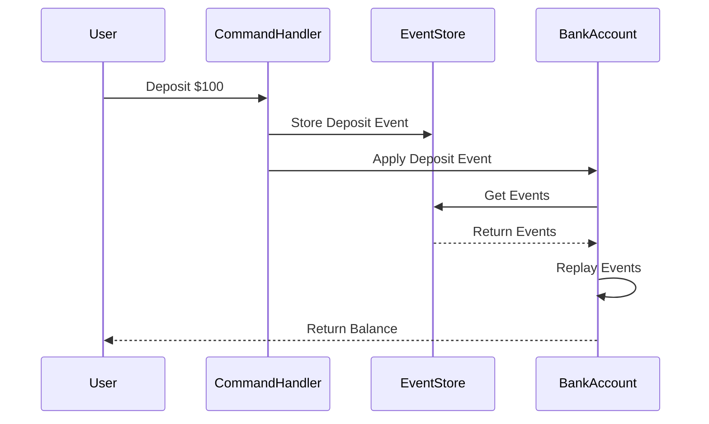

## 10.3 Event Sourcing

Event Sourcing is a powerful design pattern that captures all changes to an application's state as a sequence of immutable events. This approach enables precise state reconstruction and enhanced traceability, offering a robust alternative to traditional state management systems that only store the current state. In this section, we will delve into the core principles of Event Sourcing, its benefits, implementation in TypeScript, and its relationship with Command Query Responsibility Segregation (CQRS).

### Understanding Event Sourcing

Event Sourcing is a pattern where every change to the state of an application is captured as an event. These events are immutable and stored in sequence, allowing the entire history of changes to be replayed to reconstruct the current state. This is in contrast to traditional state management systems, where only the current state is stored, and past states are lost.

#### Core Principles of Event Sourcing

1. **Immutability**: Events are immutable records of state changes. Once an event is created, it cannot be altered or deleted.
2. **Event Stream**: All events are stored in a sequence, forming an event stream that represents the history of changes.
3. **State Reconstruction**: The current state of the application can be reconstructed by replaying the event stream from the beginning.
4. **Auditability**: Since all changes are recorded as events, the system provides a complete audit trail of state changes.

### Event Sourcing vs. Traditional State Management

In traditional state management, the focus is on maintaining the current state of the application. Changes to the state overwrite the previous state, and history is typically not preserved. This approach can lead to challenges in debugging, auditing, and understanding the evolution of the system.

Event Sourcing, on the other hand, records every state change as an event. This provides several advantages:

- **Auditability**: Every change is recorded, providing a complete history of the system's state.
- **Debugging**: Developers can replay events to understand how a particular state was reached.
- **Time-Travel Capabilities**: The system can be rolled back to any previous state by replaying events up to a certain point.
- **Scalability and Consistency**: In distributed systems, Event Sourcing can enhance scalability and consistency by ensuring that all nodes have access to the same sequence of events.

### Benefits of Event Sourcing

1. **Auditability and Traceability**: Every change is logged as an event, providing a complete audit trail.
2. **Debugging and Diagnostics**: Replay events to diagnose issues and understand state transitions.
3. **Time-Travel and State Replay**: Reconstruct past states for analysis or rollback purposes.
4. **Scalability**: Event streams can be distributed across nodes, enhancing scalability.
5. **Consistency**: Ensures all nodes in a distributed system have the same view of the event history.

### Implementing Event Sourcing in TypeScript

Let's explore how Event Sourcing can be implemented in TypeScript with a practical example. We'll create a simple event-sourced system for managing a bank account, where every deposit and withdrawal is recorded as an event.

#### Step 1: Define Event Interfaces

First, we define interfaces for our events. Each event will have a type and a payload.

```typescript
interface Event {
  type: string;
  timestamp: Date;
}

interface DepositEvent extends Event {
  type: 'DEPOSIT';
  amount: number;
}

interface WithdrawalEvent extends Event {
  type: 'WITHDRAWAL';
  amount: number;
}
```

#### Step 2: Create an Event Store

The event store is responsible for storing and retrieving events. It can be implemented as a simple in-memory array for demonstration purposes.

```typescript
class EventStore {
  private events: Event[] = [];

  addEvent(event: Event): void {
    this.events.push(event);
  }

  getEvents(): Event[] {
    return this.events;
  }
}
```

#### Step 3: Implement State Reconstruction

To reconstruct the state of the bank account, we replay the events stored in the event store.

```typescript
class BankAccount {
  private balance: number = 0;

  constructor(private eventStore: EventStore) {}

  applyEvent(event: Event): void {
    switch (event.type) {
      case 'DEPOSIT':
        this.balance += (event as DepositEvent).amount;
        break;
      case 'WITHDRAWAL':
        this.balance -= (event as WithdrawalEvent).amount;
        break;
    }
  }

  replayEvents(): void {
    const events = this.eventStore.getEvents();
    events.forEach(event => this.applyEvent(event));
  }

  getBalance(): number {
    return this.balance;
  }
}
```

#### Step 4: Record and Replay Events

Now, let's use our event-sourced system to record some events and replay them to reconstruct the state.

```typescript
const eventStore = new EventStore();
const account = new BankAccount(eventStore);

// Record events
eventStore.addEvent({ type: 'DEPOSIT', timestamp: new Date(), amount: 100 });
eventStore.addEvent({ type: 'WITHDRAWAL', timestamp: new Date(), amount: 50 });

// Replay events to reconstruct state
account.replayEvents();
console.log(`Current Balance: ${account.getBalance()}`); // Output: Current Balance: 50
```

### Command Query Responsibility Segregation (CQRS)

Event Sourcing is often used in conjunction with Command Query Responsibility Segregation (CQRS). CQRS is a pattern that separates the responsibility of handling commands (which change the state) from queries (which read the state).

#### How CQRS Relates to Event Sourcing

- **Commands**: In an event-sourced system, commands result in events that change the state.
- **Queries**: Queries read the state, which can be reconstructed by replaying events.

By separating commands and queries, CQRS allows for more scalable and maintainable systems. It also enables different models for reading and writing data, optimizing each for its specific use case.

### Challenges of Event Sourcing

While Event Sourcing offers many benefits, it also introduces some challenges:

1. **Storage Requirements**: Storing every event can lead to increased storage requirements.
2. **Complexity**: Replaying events to reconstruct state can be complex, especially in large systems.
3. **Event Versioning**: As the system evolves, events may need to be versioned to handle changes in the event schema.
4. **Consistency**: Ensuring consistency across distributed systems can be challenging.

### Visualizing Event Sourcing

To better understand the flow of events in an event-sourced system, let's visualize the process using a sequence diagram.



### Try It Yourself

To deepen your understanding of Event Sourcing, try modifying the code examples above:

- **Add New Event Types**: Implement additional event types, such as `TransferEvent`, and update the state reconstruction logic accordingly.
- **Persist Events**: Replace the in-memory event store with a persistent storage solution, such as a database.
- **Implement CQRS**: Separate the command and query responsibilities in the example, using different models for reading and writing data.

### References and Further Reading

- [Martin Fowler on Event Sourcing](https://martinfowler.com/eaaDev/EventSourcing.html)
- [CQRS and Event Sourcing](https://docs.microsoft.com/en-us/azure/architecture/patterns/cqrs)
- [Event Sourcing in Practice](https://eventstore.com/)

### Knowledge Check

- **What are the core principles of Event Sourcing?**
- **How does Event Sourcing differ from traditional state management?**
- **What are the benefits of using Event Sourcing?**
- **How can Event Sourcing enhance scalability in distributed systems?**
- **What challenges might you encounter when implementing Event Sourcing?**

### Embrace the Journey

Remember, Event Sourcing is a powerful pattern that can transform how you manage state in your applications. As you explore this pattern, keep experimenting, stay curious, and enjoy the journey of building more robust and scalable systems!

## Quiz Time!



### What is a core principle of Event Sourcing?

- [x] Immutability
- [ ] Volatility
- [ ] Transience
- [ ] Ephemerality

> **Explanation:** Immutability is a core principle of Event Sourcing, where events are immutable records of state changes.

### How does Event Sourcing differ from traditional state management?

- [x] Event Sourcing records every state change as an event.
- [ ] Event Sourcing only stores the current state.
- [ ] Event Sourcing discards past states.
- [ ] Event Sourcing does not provide an audit trail.

> **Explanation:** Event Sourcing records every state change as an event, unlike traditional state management, which typically only stores the current state.

### What is a benefit of Event Sourcing?

- [x] Auditability
- [ ] Increased volatility
- [ ] Reduced storage requirements
- [ ] Simplified debugging

> **Explanation:** Event Sourcing provides auditability by recording every change as an event.

### What pattern is often used in conjunction with Event Sourcing?

- [x] CQRS (Command Query Responsibility Segregation)
- [ ] MVC (Model View Controller)
- [ ] MVVM (Model View ViewModel)
- [ ] MVP (Model View Presenter)

> **Explanation:** CQRS is often used in conjunction with Event Sourcing to separate command and query responsibilities.

### What challenge might you face with Event Sourcing?

- [x] Increased storage requirements
- [ ] Simplified state reconstruction
- [ ] Reduced complexity
- [ ] Decreased auditability

> **Explanation:** Storing every event can lead to increased storage requirements, which is a challenge of Event Sourcing.

### How can Event Sourcing enhance scalability?

- [x] By distributing event streams across nodes
- [ ] By reducing the number of events
- [ ] By simplifying state management
- [ ] By eliminating the need for storage

> **Explanation:** Event streams can be distributed across nodes, enhancing scalability in distributed systems.

### What is a key feature of events in Event Sourcing?

- [x] Immutability
- [ ] Volatility
- [ ] Transience
- [ ] Ephemerality

> **Explanation:** Events in Event Sourcing are immutable, meaning they cannot be changed once created.

### What is a potential benefit of using CQRS with Event Sourcing?

- [x] Optimizing read and write models separately
- [ ] Simplifying event storage
- [ ] Reducing the number of events
- [ ] Eliminating the need for commands

> **Explanation:** CQRS allows for optimizing read and write models separately, which can be beneficial when used with Event Sourcing.

### What is a potential challenge of event replay in Event Sourcing?

- [x] Complexity in reconstructing state
- [ ] Simplified debugging
- [ ] Reduced storage requirements
- [ ] Decreased auditability

> **Explanation:** Replaying events to reconstruct state can be complex, especially in large systems.

### Event Sourcing provides a complete audit trail of state changes.

- [x] True
- [ ] False

> **Explanation:** True. Event Sourcing records every state change as an event, providing a complete audit trail.


