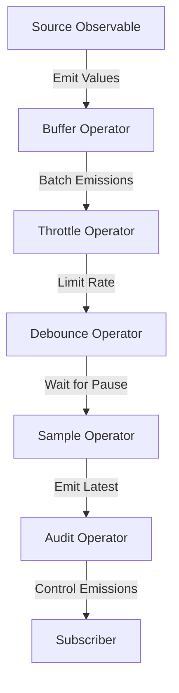

## 10.4.1 Implementing Backpressure in RxJS

In the world of reactive programming, managing data flow efficiently is crucial, especially when dealing with high-frequency data streams or rapid user inputs. RxJS, a powerful library for reactive programming, offers a suite of operators that allow us to implement backpressure, effectively controlling the rate at which data is emitted and processed. In this section, we will explore how to use these operators in TypeScript applications to manage data flow and prevent system overload.

### Understanding Backpressure

Backpressure refers to the mechanism of controlling the flow of data between producers and consumers, ensuring that the consumer is not overwhelmed by the rate of data production. In reactive systems, backpressure is essential to maintain performance and prevent data loss or system crashes.

### RxJS Operators for Backpressure

RxJS provides several operators to manage backpressure, each with unique characteristics and use cases. Let's explore some of the most commonly used operators:

#### 1. Buffer

The `buffer` operator collects emitted values from an observable until a specified condition is met, then emits them as an array. This is useful for batching data.

```typescript
import { interval } from 'rxjs';
import { buffer, take } from 'rxjs/operators';

// Emit a value every 500ms
const source$ = interval(500);

// Buffer the emitted values until 5 values are collected
const buffered$ = source$.pipe(
  buffer(interval(2500)), // Emit buffered values every 2.5 seconds
  take(3) // Take only the first 3 buffered emissions
);

buffered$.subscribe(val => console.log('Buffered Values:', val));
```

In this example, values emitted every 500ms are buffered and emitted as an array every 2.5 seconds.

#### 2. Throttle

The `throttle` operator limits the rate of emissions by allowing only one value to be emitted within a specified time frame.

```typescript
import { fromEvent } from 'rxjs';
import { throttleTime } from 'rxjs/operators';

// Listen for click events
const clicks$ = fromEvent(document, 'click');

// Throttle the click events to one every second
const throttled$ = clicks$.pipe(
  throttleTime(1000)
);

throttled$.subscribe(() => console.log('Throttled Click'));
```

Here, click events are throttled to ensure only one event is processed per second, regardless of how many clicks occur.

#### 3. Debounce

The `debounce` operator waits for a specified time after the last emission before emitting a value. This is particularly useful for handling rapid user inputs, such as typing.

```typescript
import { fromEvent } from 'rxjs';
import { debounceTime, map } from 'rxjs/operators';

// Listen for input events
const input$ = fromEvent(document.getElementById('myInput'), 'input');

// Debounce the input events by 300ms
const debounced$ = input$.pipe(
  debounceTime(300),
  map(event => (event.target as HTMLInputElement).value)
);

debounced$.subscribe(value => console.log('Debounced Input:', value));
```

In this example, the input value is emitted only after the user stops typing for 300ms, reducing unnecessary processing.

#### 4. Sample

The `sample` operator emits the most recent value from the source observable whenever another observable emits.

```typescript
import { interval } from 'rxjs';
import { sample } from 'rxjs/operators';

// Emit a value every 500ms
const source$ = interval(500);

// Sample the source observable every 2 seconds
const sampled$ = source$.pipe(
  sample(interval(2000))
);

sampled$.subscribe(val => console.log('Sampled Value:', val));
```

This code samples the source observable every 2 seconds, emitting the latest value available at that time.

#### 5. Audit

The `audit` operator is similar to `throttle`, but it waits for the specified duration after an emission before allowing another emission.

```typescript
import { fromEvent } from 'rxjs';
import { auditTime } from 'rxjs/operators';

// Listen for scroll events
const scroll$ = fromEvent(document, 'scroll');

// Audit the scroll events to one every 2 seconds
const audited$ = scroll$.pipe(
  auditTime(2000)
);

audited$.subscribe(() => console.log('Audited Scroll'));
```

In this example, scroll events are audited, allowing only one event to be processed every 2 seconds.

### Applying Backpressure Operators

When implementing backpressure, it's important to choose the right operator based on the application's needs. Here are some guidelines:

- **Use `buffer`** when you need to batch data for processing or transmission.
- **Use `throttle`** to limit the rate of emissions, ensuring that the system is not overwhelmed.
- **Use `debounce`** to handle rapid inputs, such as form fields, where you want to wait for a pause before processing.
- **Use `sample`** to periodically check the latest value from a high-frequency stream.
- **Use `audit`** when you need to wait after an emission before allowing another one.

### Customizing Operator Parameters

Each operator can be customized with parameters to fine-tune its behavior. For example, `throttleTime` and `debounceTime` accept a duration parameter that specifies the time interval for throttling or debouncing.

```typescript
// Throttle with a 500ms interval
const throttled$ = source$.pipe(
  throttleTime(500)
);

// Debounce with a 200ms interval
const debounced$ = input$.pipe(
  debounceTime(200)
);
```

Adjust these parameters based on the specific requirements of your application to achieve the desired backpressure effect.

### Best Practices for Backpressure Handling

- **Understand the data flow**: Analyze the data flow in your application to identify where backpressure might be needed.
- **Choose the right operator**: Select the operator that best fits the scenario, considering factors like data frequency and processing requirements.
- **Test different configurations**: Experiment with different parameter values to find the optimal configuration for your application.
- **Monitor performance**: Continuously monitor the performance of your application to ensure that backpressure is effectively managing data flow.

### Potential Pitfalls

While backpressure operators are powerful tools, they can introduce challenges:

- **Data Loss**: Operators like `throttle` and `sample` can lead to data loss if not configured correctly, as they may skip values.
- **Increased Latency**: Operators like `debounce` can introduce latency, as they wait for a pause before emitting values.
- **Complexity**: Adding backpressure can increase the complexity of your code, making it harder to maintain.

### Try It Yourself

Experiment with the provided code examples by adjusting the parameters and observing the effects. Try combining different operators to see how they interact and affect data flow. For instance, you can combine `throttle` and `debounce` to create a more sophisticated backpressure strategy.

### Visualizing Backpressure in RxJS

To better understand how these operators work, let's visualize the flow of data through an observable with backpressure applied.



**Diagram Explanation**: This flowchart illustrates how data flows through a series of RxJS operators, each applying a different form of backpressure to manage the rate of emissions before reaching the subscriber.

### References and Links

For further reading on RxJS and backpressure, consider the following resources:

- [RxJS Documentation](https://rxjs.dev/guide/overview)
- [MDN Web Docs on Observables](https://developer.mozilla.org/en-US/docs/Web/JavaScript/Reference/Global_Objects/Observable)
- [W3Schools on JavaScript Promises](https://www.w3schools.com/js/js_promise.asp)

### Knowledge Check

To reinforce your understanding of backpressure in RxJS, consider the following questions:

- What is backpressure, and why is it important in reactive programming?
- How does the `buffer` operator differ from `throttle`?
- When would you use `debounce` instead of `throttle`?
- What are some potential pitfalls of using backpressure operators?

### Embrace the Journey

Remember, mastering backpressure in RxJS is just one step in your journey to becoming an expert in reactive programming. Keep experimenting, stay curious, and enjoy the process of learning and applying these powerful concepts in your TypeScript applications.

## Quiz Time!



### What is the primary purpose of backpressure in reactive programming?

- [x] To control the flow of data between producers and consumers
- [ ] To increase the speed of data processing
- [ ] To reduce the size of data packets
- [ ] To enhance the security of data transmission

> **Explanation:** Backpressure is used to control the flow of data between producers and consumers, ensuring that the consumer is not overwhelmed by the rate of data production.

### Which RxJS operator would you use to batch emitted values into arrays?

- [x] buffer
- [ ] throttle
- [ ] debounce
- [ ] sample

> **Explanation:** The `buffer` operator collects emitted values until a specified condition is met and then emits them as an array.

### How does the `throttle` operator manage data flow?

- [x] It limits the rate of emissions by allowing only one value to be emitted within a specified time frame.
- [ ] It waits for a pause in emissions before emitting a value.
- [ ] It emits the most recent value whenever another observable emits.
- [ ] It collects values and emits them as an array.

> **Explanation:** The `throttle` operator limits the rate of emissions by allowing only one value to be emitted within a specified time frame.

### When is the `debounce` operator particularly useful?

- [x] When handling rapid user inputs, such as typing
- [ ] When batching data for processing
- [ ] When limiting the rate of emissions
- [ ] When sampling the latest value from a stream

> **Explanation:** The `debounce` operator is useful for handling rapid user inputs, as it waits for a pause in emissions before emitting a value.

### What is a potential pitfall of using the `throttle` operator?

- [x] Data loss due to skipped values
- [ ] Increased latency
- [ ] Complexity in code
- [ ] Reduced security

> **Explanation:** The `throttle` operator can lead to data loss if not configured correctly, as it may skip values.

### Which operator would you use to emit the most recent value from a source observable whenever another observable emits?

- [x] sample
- [ ] buffer
- [ ] throttle
- [ ] debounce

> **Explanation:** The `sample` operator emits the most recent value from the source observable whenever another observable emits.

### How can you customize the behavior of the `throttleTime` operator?

- [x] By adjusting the duration parameter
- [ ] By changing the source observable
- [ ] By modifying the subscriber
- [ ] By using a different operator

> **Explanation:** You can customize the behavior of the `throttleTime` operator by adjusting the duration parameter, which specifies the time interval for throttling.

### What is a common use case for the `audit` operator?

- [x] Controlling the rate of scroll events
- [ ] Batching data for transmission
- [ ] Handling rapid user inputs
- [ ] Sampling the latest value from a stream

> **Explanation:** The `audit` operator is commonly used to control the rate of events, such as scroll events, by allowing only one event to be processed within a specified time frame.

### What is the effect of using the `debounceTime` operator with a 300ms interval?

- [x] It waits for 300ms after the last emission before emitting a value.
- [ ] It limits emissions to one every 300ms.
- [ ] It batches values into arrays emitted every 300ms.
- [ ] It emits the most recent value every 300ms.

> **Explanation:** The `debounceTime` operator waits for 300ms after the last emission before emitting a value, effectively handling rapid inputs.

### True or False: The `buffer` operator can be used to reduce latency in data processing.

- [ ] True
- [x] False

> **Explanation:** The `buffer` operator collects emitted values into arrays, which can increase latency as it waits for the buffer to fill before emitting.


