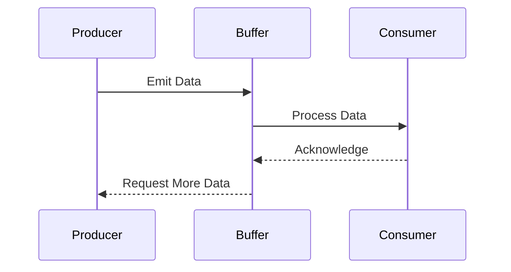

## 10.4.3 Use Cases and Examples

In the realm of reactive programming, backpressure handling is a pivotal concept that ensures systems remain responsive and stable under varying loads. This section delves into practical scenarios where backpressure handling is indispensable, such as in networked applications, IoT data streams, and real-time user interactions. We will explore code examples, discuss the consequences of neglecting backpressure, and highlight success stories that underscore its importance.

### Understanding Backpressure

Backpressure refers to the mechanism of controlling the flow of data between producers and consumers to prevent overwhelming the system. In a reactive system, producers generate data at varying rates, and consumers process this data. Without backpressure, a fast producer can overwhelm a slow consumer, leading to performance degradation, crashes, or data loss.

### Key Concepts

- **Producer**: The source of data, such as a network request handler or a sensor.
- **Consumer**: The entity that processes the data, like a database writer or a user interface component.
- **Flow Control**: Techniques to manage the rate of data transfer between producers and consumers.

### Use Case 1: Managing Network Requests in High-Traffic Servers

In high-traffic servers, such as those handling web requests, managing the influx of requests is crucial to maintaining performance and reliability. Without backpressure, a server can become overwhelmed, leading to increased response times or even crashes.

#### Code Example: Implementing Backpressure in a Node.js Server

```typescript
import * as http from 'http';
import { Subject } from 'rxjs';
import { bufferTime, filter } from 'rxjs/operators';

const requestSubject = new Subject<http.IncomingMessage>();

// Simulate a consumer that processes requests
const processRequest = (req: http.IncomingMessage) => {
  console.log(`Processing request: ${req.url}`);
  // Simulate processing delay
  setTimeout(() => console.log(`Finished processing: ${req.url}`), 1000);
};

// Buffer incoming requests and process them at a controlled rate
requestSubject.pipe(
  bufferTime(1000), // Buffer requests for 1 second
  filter(buffer => buffer.length > 0) // Only process if there are requests
).subscribe(buffer => {
  console.log(`Processing ${buffer.length} requests`);
  buffer.forEach(processRequest);
});

const server = http.createServer((req, res) => {
  requestSubject.next(req);
  res.writeHead(200, { 'Content-Type': 'text/plain' });
  res.end('Request received\n');
});

server.listen(3000, () => {
  console.log('Server listening on port 3000');
});
```

#### Explanation

In this example, we use RxJS to buffer incoming HTTP requests and process them at a controlled rate. The `bufferTime` operator collects requests over a specified time window (1 second) and processes them in batches. This approach prevents the server from being overwhelmed by a sudden surge of requests.

#### Consequences of Not Implementing Backpressure

Without backpressure, a server can quickly become overloaded, leading to:

- **Increased Latency**: As the server struggles to keep up with requests, response times increase.
- **Resource Exhaustion**: Memory and CPU resources can be depleted, causing crashes.
- **Poor User Experience**: Users experience slow responses or timeouts.

### Use Case 2: Handling Sensor Data Streams in IoT Applications

IoT applications often deal with data streams from numerous sensors. These sensors can produce data at high rates, and without proper handling, the system can become overwhelmed.

#### Code Example: Backpressure in an IoT Data Stream

```typescript
import { Subject, interval } from 'rxjs';
import { take, bufferCount } from 'rxjs/operators';

const sensorDataSubject = new Subject<number>();

// Simulate a sensor producing data
interval(100).pipe(take(50)).subscribe(sensorDataSubject);

// Consumer that processes sensor data
sensorDataSubject.pipe(
  bufferCount(10) // Process data in batches of 10
).subscribe(batch => {
  console.log(`Processing batch of ${batch.length} sensor readings`);
  // Simulate processing delay
  setTimeout(() => console.log(`Finished processing batch`), 500);
});
```

#### Explanation

In this scenario, we simulate a sensor producing data every 100 milliseconds. The `bufferCount` operator collects data into batches of 10 readings before processing. This batching mechanism ensures that the consumer can handle the data at a manageable rate.

#### Consequences of Not Implementing Backpressure

- **Data Loss**: Without backpressure, data can be lost if the consumer cannot keep up.
- **System Overload**: The system can become overloaded, leading to crashes or degraded performance.
- **Inaccurate Data Processing**: Important data might be missed or processed incorrectly.

### Use Case 3: Processing User Interactions in Real-Time Applications

Real-time applications, such as gaming or live data dashboards, require efficient handling of user interactions to maintain responsiveness.

#### Code Example: Backpressure in a Real-Time Dashboard

```typescript
import { fromEvent } from 'rxjs';
import { throttleTime } from 'rxjs/operators';

const button = document.getElementById('actionButton');

// Handle button clicks with throttling
fromEvent(button, 'click').pipe(
  throttleTime(1000) // Allow one click per second
).subscribe(() => {
  console.log('Button clicked');
  // Simulate action processing
  setTimeout(() => console.log('Action processed'), 500);
});
```

#### Explanation

In this example, we use the `throttleTime` operator to limit the rate of button click events processed by the application. This ensures that the system remains responsive and does not become overwhelmed by rapid user interactions.

#### Consequences of Not Implementing Backpressure

- **Laggy Interface**: Rapid interactions can cause the interface to lag or freeze.
- **Unresponsive System**: The system may become unresponsive if overwhelmed by events.
- **Poor User Experience**: Users may experience delays or missed actions.

### Success Stories and Case Studies

#### Case Study: Netflix

Netflix employs backpressure handling extensively in its streaming services. By managing the flow of data between servers and clients, Netflix ensures smooth playback and high-quality streaming, even under varying network conditions. This approach has significantly improved user satisfaction and reduced buffering times.

#### Case Study: Uber

Uber uses backpressure mechanisms to handle the massive influx of data from drivers and riders. By controlling the rate of data processing, Uber maintains a responsive and reliable service, even during peak times.

### Encouragement for Implementation

Implementing backpressure handling in your applications can greatly enhance stability and performance. By managing the flow of data between producers and consumers, you can prevent system overloads, reduce latency, and improve user experiences. As you design your systems, consider incorporating backpressure mechanisms to ensure they remain robust and reliable under varying conditions.

### Try It Yourself

Experiment with the provided code examples by modifying parameters such as buffer sizes or throttle times. Observe how these changes impact system performance and responsiveness. By doing so, you'll gain a deeper understanding of backpressure handling and its importance in reactive programming.

### Visualizing Backpressure Handling

To further illustrate the concept of backpressure handling, let's visualize the flow of data between producers and consumers using a sequence diagram.



#### Diagram Explanation

This sequence diagram represents the interaction between a producer, a buffer, and a consumer. The producer emits data, which is temporarily stored in a buffer. The consumer processes the data at its own pace, acknowledging each processed item. Once the buffer has capacity, it requests more data from the producer, ensuring a controlled flow.

### Key Takeaways

- **Backpressure Handling**: Essential for maintaining system stability and performance in reactive applications.
- **Practical Use Cases**: Include networked applications, IoT data streams, and real-time user interactions.
- **Consequences of Neglect**: Can lead to system overload, data loss, and poor user experiences.
- **Success Stories**: Companies like Netflix and Uber leverage backpressure to enhance service reliability.

### Further Reading

For more information on backpressure handling and reactive programming, consider exploring the following resources:

- [ReactiveX Documentation](http://reactivex.io/)
- [RxJS Official Documentation](https://rxjs.dev/)
- [Node.js Streams API](https://nodejs.org/api/stream.html)

## Quiz Time!



### What is backpressure in the context of reactive programming?

- [x] A mechanism to control the flow of data between producers and consumers.
- [ ] A method to increase the speed of data processing.
- [ ] A technique to reduce memory usage.
- [ ] A strategy to enhance user interface design.

> **Explanation:** Backpressure is a mechanism to control the flow of data between producers and consumers to prevent system overload.

### Which RxJS operator is used to buffer incoming data for a specified time?

- [x] bufferTime
- [ ] throttleTime
- [ ] debounceTime
- [ ] switchMap

> **Explanation:** The `bufferTime` operator collects incoming data over a specified time window and emits it as an array.

### What is a potential consequence of not implementing backpressure in a high-traffic server?

- [x] Increased latency and potential crashes.
- [ ] Faster response times.
- [ ] Reduced memory usage.
- [ ] Improved user experience.

> **Explanation:** Without backpressure, a server can become overwhelmed, leading to increased latency and potential crashes.

### In the IoT data stream example, which operator is used to process data in batches?

- [x] bufferCount
- [ ] mergeMap
- [ ] concatMap
- [ ] switchMap

> **Explanation:** The `bufferCount` operator collects a specified number of items and emits them as an array, allowing batch processing.

### What is the purpose of the `throttleTime` operator in the real-time dashboard example?

- [x] To limit the rate of event processing.
- [ ] To increase the speed of event processing.
- [ ] To buffer events for later processing.
- [ ] To switch to a different data source.

> **Explanation:** The `throttleTime` operator limits the rate at which events are processed, preventing system overload from rapid interactions.

### Which company is mentioned as using backpressure handling to improve streaming services?

- [x] Netflix
- [ ] Amazon
- [ ] Google
- [ ] Facebook

> **Explanation:** Netflix employs backpressure handling to ensure smooth playback and high-quality streaming.

### What is a common consequence of neglecting backpressure in IoT applications?

- [x] Data loss and system overload.
- [ ] Improved data accuracy.
- [ ] Faster data processing.
- [ ] Enhanced user interface.

> **Explanation:** Without backpressure, IoT applications can experience data loss and system overload due to high data rates.

### How does Uber use backpressure mechanisms?

- [x] To handle the influx of data from drivers and riders.
- [ ] To enhance the visual design of their app.
- [ ] To reduce the number of drivers on the road.
- [ ] To increase the speed of their vehicles.

> **Explanation:** Uber uses backpressure to manage the massive influx of data from drivers and riders, ensuring a responsive service.

### What does the sequence diagram in the article illustrate?

- [x] The flow of data between a producer, buffer, and consumer.
- [ ] The architecture of a web application.
- [ ] The design of a user interface.
- [ ] The structure of a database.

> **Explanation:** The sequence diagram illustrates the flow of data between a producer, buffer, and consumer, highlighting backpressure handling.

### True or False: Implementing backpressure can enhance system stability and performance.

- [x] True
- [ ] False

> **Explanation:** Implementing backpressure is crucial for maintaining system stability and performance by controlling data flow.


