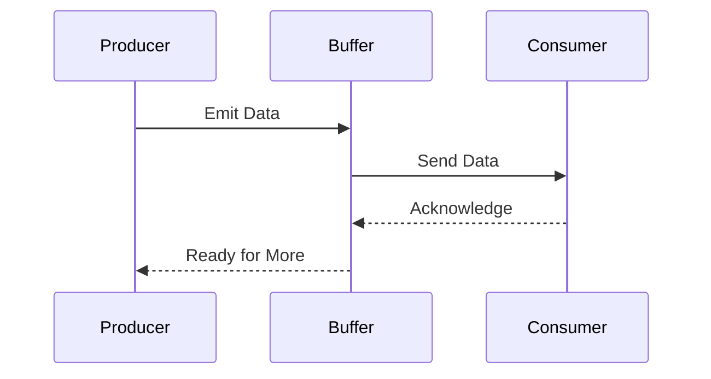

## 10.4 Backpressure Handling

In the realm of reactive programming, managing data flow rates between producers and consumers is crucial to maintaining system stability and reliability. This section delves into the concept of backpressure, its importance, and how it can be effectively implemented using TypeScript and RxJS.

### Understanding Backpressure

Backpressure is a mechanism used to control the flow of data between producers and consumers in a system. It becomes essential when data is produced at a rate faster than it can be consumed, leading to potential issues such as resource exhaustion and application crashes.

#### Why Backpressure Matters

In any reactive system, producers generate data that consumers process. When the production rate exceeds the consumption capacity, it can lead to:

- **Resource Exhaustion**: Memory and CPU resources can be overwhelmed, leading to degraded performance or system crashes.
- **Data Loss**: Without proper handling, excess data might be dropped or lost.
- **Increased Latency**: As queues fill up, the time taken to process each data item increases, leading to higher latency.

Backpressure mechanisms ensure that the data flow is regulated, matching the rate of production to the capacity of consumers, thus preventing these issues.

### Problems Arising from Unmanaged Data Flow

When data flow is unmanaged, several problems can arise:

1. **Memory Overflow**: Continuous data production without consumption can lead to memory overflow, causing the application to crash.
2. **CPU Overload**: Excessive data processing demands can overload the CPU, affecting system performance.
3. **Network Congestion**: In distributed systems, unmanaged data flow can congest network resources, leading to slow data transmission and processing delays.

### Backpressure Mechanisms

Backpressure mechanisms help regulate data flow, ensuring that the system remains stable and reliable. Some common strategies include:

#### Buffering

Buffering involves temporarily storing data in a buffer until the consumer is ready to process it. This approach helps manage data bursts but requires careful management to avoid buffer overflow.

```typescript
import { of, interval } from 'rxjs';
import { bufferTime } from 'rxjs/operators';

// Example: Buffering data for 2 seconds
const source = interval(500); // Emits every 500ms
const buffered = source.pipe(bufferTime(2000));

buffered.subscribe(data => {
  console.log('Buffered Data:', data);
});
```

In this example, data emitted every 500 milliseconds is buffered for 2 seconds before being processed, allowing the consumer to handle data in manageable chunks.

#### Throttling

Throttling limits the rate at which data is processed, ensuring that consumers are not overwhelmed by high-frequency data emissions.

```typescript
import { fromEvent } from 'rxjs';
import { throttleTime } from 'rxjs/operators';

// Example: Throttling click events
const clicks = fromEvent(document, 'click');
const throttledClicks = clicks.pipe(throttleTime(1000));

throttledClicks.subscribe(() => {
  console.log('Throttled Click');
});
```

Here, click events are throttled to one event per second, preventing the consumer from being overwhelmed by rapid clicks.

#### Debouncing

Debouncing delays data processing until a specified period of inactivity has passed. This is useful for scenarios like search input fields, where processing should only occur after the user has stopped typing.

```typescript
import { fromEvent } from 'rxjs';
import { debounceTime, map } from 'rxjs/operators';

// Example: Debouncing input events
const input = document.getElementById('search');
const inputEvents = fromEvent(input, 'input');

const debouncedInput = inputEvents.pipe(
  debounceTime(300),
  map(event => event.target.value)
);

debouncedInput.subscribe(value => {
  console.log('Debounced Input:', value);
});
```

In this case, input events are debounced by 300 milliseconds, ensuring that processing only occurs after the user has stopped typing.

### Implementing Backpressure in TypeScript with RxJS

RxJS provides a robust framework for handling backpressure in TypeScript applications. Let's explore how to implement backpressure using RxJS operators.

#### Buffering with RxJS

Buffering in RxJS can be achieved using operators like `buffer`, `bufferTime`, and `bufferCount`. These operators allow you to collect emitted values into arrays and process them as a batch.

```typescript
import { interval } from 'rxjs';
import { bufferCount } from 'rxjs/operators';

// Example: Buffering a specific number of emissions
const source = interval(100);
const buffered = source.pipe(bufferCount(5));

buffered.subscribe(data => {
  console.log('Buffered Count:', data);
});
```

This example buffers every five emissions from the source, allowing the consumer to process data in chunks.

#### Throttling with RxJS

Throttling can be implemented using the `throttleTime` and `throttle` operators, which control the rate of data flow.

```typescript
import { fromEvent } from 'rxjs';
import { throttle } from 'rxjs/operators';

// Example: Throttling with a custom function
const clicks = fromEvent(document, 'click');
const throttled = clicks.pipe(throttle(() => interval(1000)));

throttled.subscribe(() => {
  console.log('Custom Throttled Click');
});
```

In this example, a custom throttling function is used to control the rate of click events.

#### Debouncing with RxJS

Debouncing is implemented using the `debounceTime` and `debounce` operators, which delay processing until a period of inactivity.

```typescript
import { fromEvent } from 'rxjs';
import { debounce } from 'rxjs/operators';

// Example: Debouncing with a custom function
const input = document.getElementById('search');
const inputEvents = fromEvent(input, 'input');

const debounced = inputEvents.pipe(debounce(() => interval(300)));

debounced.subscribe(event => {
  console.log('Custom Debounced Input:', event.target.value);
});
```

This example uses a custom debouncing function to delay processing of input events.

### Trade-offs in Backpressure Strategies

Each backpressure strategy comes with its own set of trade-offs:

- **Buffering**: While buffering can handle data bursts, it requires careful management to avoid overflow and increased memory usage.
- **Throttling**: Throttling reduces the data processing rate, which can lead to data loss if not managed properly.
- **Debouncing**: Debouncing can introduce latency, as it waits for a period of inactivity before processing data.

Choosing the right strategy depends on the specific requirements of your application, such as the acceptable latency, memory constraints, and the importance of data completeness.

### Visualizing Backpressure Handling

To better understand how backpressure handling works, let's visualize the flow of data between producers and consumers using a sequence diagram.



This diagram illustrates the interaction between a producer, a buffer, and a consumer. The producer emits data to the buffer, which then sends it to the consumer. The consumer acknowledges receipt, allowing the buffer to signal the producer that it is ready for more data.

### Try It Yourself

Experiment with the provided code examples by modifying parameters such as buffer size, throttle time, and debounce time. Observe how these changes affect the data flow and the system's ability to handle high data rates.

### Further Reading

For more information on backpressure handling and reactive programming, consider exploring the following resources:

- [RxJS Documentation](https://rxjs.dev/)
- [ReactiveX](http://reactivex.io/)
- [MDN Web Docs on Event Handling](https://developer.mozilla.org/en-US/docs/Web/Events)

### Knowledge Check

To reinforce your understanding of backpressure handling, consider the following questions:

- What are the potential consequences of unmanaged data flow in a reactive system?
- How does buffering help manage data flow between producers and consumers?
- What are the trade-offs involved in using throttling as a backpressure strategy?
- How can debouncing improve the performance of a search input field?

### Embrace the Journey

Remember, mastering backpressure handling is a journey. As you progress, you'll gain a deeper understanding of how to design systems that are both efficient and resilient. Keep experimenting, stay curious, and enjoy the journey!

## Quiz Time!



### What is backpressure in reactive programming?

- [x] A mechanism to control data flow between producers and consumers
- [ ] A method to increase data production rate
- [ ] A technique to reduce network latency
- [ ] A strategy to enhance data security

> **Explanation:** Backpressure is a mechanism used to control the flow of data between producers and consumers, ensuring that the system remains stable and reliable.

### Which of the following is a consequence of unmanaged data flow?

- [x] Resource exhaustion
- [x] Data loss
- [ ] Improved performance
- [ ] Enhanced security

> **Explanation:** Unmanaged data flow can lead to resource exhaustion and data loss, as the system is unable to handle the excess data efficiently.

### How does buffering help in backpressure handling?

- [x] By temporarily storing data until the consumer is ready
- [ ] By increasing the data production rate
- [ ] By reducing the consumer's processing speed
- [ ] By encrypting the data

> **Explanation:** Buffering helps in backpressure handling by temporarily storing data in a buffer until the consumer is ready to process it, thus managing data bursts.

### What is the primary trade-off of using throttling as a backpressure strategy?

- [x] Potential data loss
- [ ] Increased memory usage
- [ ] Higher latency
- [ ] Enhanced data security

> **Explanation:** Throttling reduces the data processing rate, which can lead to potential data loss if not managed properly.

### In which scenario is debouncing particularly useful?

- [x] Search input fields
- [ ] Real-time data streaming
- [ ] High-frequency trading
- [ ] Video streaming

> **Explanation:** Debouncing is particularly useful in scenarios like search input fields, where processing should only occur after the user has stopped typing.

### Which RxJS operator is used for debouncing?

- [x] debounceTime
- [ ] bufferTime
- [ ] throttleTime
- [ ] map

> **Explanation:** The `debounceTime` operator is used for debouncing in RxJS, delaying processing until a specified period of inactivity has passed.

### What is a potential downside of buffering?

- [x] Increased memory usage
- [ ] Reduced data production rate
- [ ] Enhanced data security
- [ ] Improved latency

> **Explanation:** Buffering can lead to increased memory usage, as data is temporarily stored in a buffer until the consumer is ready to process it.

### Which operator would you use to limit the rate of data processing?

- [x] throttleTime
- [ ] debounceTime
- [ ] bufferCount
- [ ] map

> **Explanation:** The `throttleTime` operator is used to limit the rate of data processing, ensuring that consumers are not overwhelmed by high-frequency data emissions.

### How can you visualize the interaction between producers and consumers in a reactive system?

- [x] Using a sequence diagram
- [ ] With a pie chart
- [ ] Through a bar graph
- [ ] By a line chart

> **Explanation:** A sequence diagram is useful for visualizing the interaction between producers and consumers in a reactive system, showing the flow of data and acknowledgments.

### True or False: Debouncing introduces latency by waiting for a period of inactivity before processing data.

- [x] True
- [ ] False

> **Explanation:** True. Debouncing introduces latency by waiting for a period of inactivity before processing data, ensuring that processing only occurs after the user has stopped interacting.


