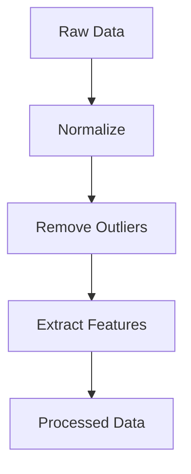

## 10.5.1 Pipeline Pattern for Data Processing

In the realm of machine learning (ML), data processing is a critical step that can significantly impact the performance and accuracy of models. The Pipeline Pattern offers a structured approach to organizing data transformations and processing steps, making workflows more flexible, reusable, and maintainable. In this section, we will delve into the Pipeline Pattern, its relevance in ML data processing, and how to implement it using TypeScript.

### Understanding the Pipeline Pattern

The Pipeline Pattern is a design pattern that allows for the sequential processing of data through a series of steps, or stages, where each stage performs a specific transformation or operation on the data. This pattern is particularly useful in ML applications, where data preprocessing, feature extraction, and data augmentation are often required before feeding data into a model.

#### Relevance in Machine Learning

In ML, data often needs to be cleaned, transformed, and enriched before it can be used effectively. The Pipeline Pattern helps organize these tasks into a coherent workflow, ensuring that each transformation is applied in the correct order. This not only improves the modularity of the code but also allows for easy reuse of processing steps across different models or datasets.

### Organizing Data Processing with Pipelines

Let's explore how various data processing tasks can be organized into pipelines.

#### Data Preprocessing

Data preprocessing involves cleaning and preparing raw data for analysis. This may include tasks such as handling missing values, normalizing data, and encoding categorical variables. By organizing these tasks into a pipeline, we can ensure that the data is consistently processed in the same manner.

#### Feature Extraction

Feature extraction involves transforming raw data into a set of features that can be used by a machine learning model. This might include tasks such as dimensionality reduction, text vectorization, or image feature extraction. Pipelines allow these transformations to be applied systematically and consistently.

#### Data Augmentation

Data augmentation is a technique used to increase the diversity of data available for training models without actually collecting new data. This can include operations like rotating images, adding noise, or flipping text. Pipelines make it easy to apply these transformations in a controlled and repeatable manner.

### Implementing Pipelines in TypeScript

In TypeScript, pipelines can be implemented using functions, classes, or streams. Let's explore each approach with examples.

#### Using Functions

One way to implement a pipeline is by chaining functions together. Each function represents a stage in the pipeline and takes the output of the previous stage as its input.

```typescript
// Define a type for our data
type Data = number[];

// Define a function for each stage of the pipeline
const normalize = (data: Data): Data => data.map(x => x / Math.max(...data));
const removeOutliers = (data: Data): Data => data.filter(x => x < 100);
const extractFeatures = (data: Data): Data => data.map(x => x * 2);

// Create a pipeline by composing functions
const pipeline = (data: Data): Data => {
    return extractFeatures(removeOutliers(normalize(data)));
};

// Example usage
const rawData: Data = [120, 80, 50, 200, 90];
const processedData = pipeline(rawData);
console.log(processedData);
```

In this example, the `pipeline` function chains together three processing functions: `normalize`, `removeOutliers`, and `extractFeatures`. The data flows through each stage in sequence, resulting in a transformed dataset.

#### Using Classes

For more complex pipelines, using classes can provide better organization and encapsulation.

```typescript
// Define an interface for pipeline stages
interface PipelineStage {
    process(data: Data): Data;
}

// Implement specific stages as classes
class Normalizer implements PipelineStage {
    process(data: Data): Data {
        return data.map(x => x / Math.max(...data));
    }
}

class OutlierRemover implements PipelineStage {
    process(data: Data): Data {
        return data.filter(x => x < 100);
    }
}

class FeatureExtractor implements PipelineStage {
    process(data: Data): Data {
        return data.map(x => x * 2);
    }
}

// Define a Pipeline class
class DataPipeline {
    private stages: PipelineStage[] = [];

    addStage(stage: PipelineStage): void {
        this.stages.push(stage);
    }

    execute(data: Data): Data {
        return this.stages.reduce((acc, stage) => stage.process(acc), data);
    }
}

// Example usage
const pipeline = new DataPipeline();
pipeline.addStage(new Normalizer());
pipeline.addStage(new OutlierRemover());
pipeline.addStage(new FeatureExtractor());

const processedData = pipeline.execute(rawData);
console.log(processedData);
```

In this example, each stage of the pipeline is implemented as a class that adheres to the `PipelineStage` interface. The `DataPipeline` class manages the sequence of stages and executes them on the input data.

#### Using Streams

For handling large datasets or asynchronous operations, streams can be a powerful tool.

```typescript
import { Readable, Transform, Writable } from 'stream';

// Define a Transform stream for each stage
class NormalizeStream extends Transform {
    _transform(chunk: Buffer, encoding: string, callback: Function) {
        const data = JSON.parse(chunk.toString()) as Data;
        const normalized = data.map(x => x / Math.max(...data));
        this.push(JSON.stringify(normalized));
        callback();
    }
}

class RemoveOutliersStream extends Transform {
    _transform(chunk: Buffer, encoding: string, callback: Function) {
        const data = JSON.parse(chunk.toString()) as Data;
        const filtered = data.filter(x => x < 100);
        this.push(JSON.stringify(filtered));
        callback();
    }
}

class FeatureExtractorStream extends Transform {
    _transform(chunk: Buffer, encoding: string, callback: Function) {
        const data = JSON.parse(chunk.toString()) as Data;
        const features = data.map(x => x * 2);
        this.push(JSON.stringify(features));
        callback();
    }
}

// Create a pipeline using streams
const rawDataStream = new Readable({
    read() {
        this.push(JSON.stringify(rawData));
        this.push(null);
    }
});

const outputStream = new Writable({
    write(chunk: Buffer, encoding: string, callback: Function) {
        console.log(JSON.parse(chunk.toString()));
        callback();
    }
});

rawDataStream
    .pipe(new NormalizeStream())
    .pipe(new RemoveOutliersStream())
    .pipe(new FeatureExtractorStream())
    .pipe(outputStream);
```

This example demonstrates how to use Node.js streams to create a pipeline. Each stage is implemented as a `Transform` stream, allowing data to flow through the pipeline asynchronously.

### Benefits of Pipelines

Pipelines offer several advantages in ML data processing:

- **Modularity**: Each stage of the pipeline is a separate unit, making it easy to modify or replace individual steps without affecting the entire workflow.
- **Reusability**: Once defined, pipelines can be reused across different datasets or models, reducing code duplication.
- **Scalability**: Pipelines can handle large datasets efficiently, especially when implemented using streams or asynchronous processing.

### Handling Asynchronous Data Transformations

In many ML applications, data transformations may involve asynchronous operations, such as fetching data from a remote source or performing computationally intensive tasks. TypeScript's async/await syntax can be used to handle these scenarios within a pipeline.

```typescript
// Define an asynchronous pipeline stage
class AsyncFeatureExtractor implements PipelineStage {
    async process(data: Data): Promise<Data> {
        // Simulate an asynchronous operation
        await new Promise(resolve => setTimeout(resolve, 1000));
        return data.map(x => x * 2);
    }
}

// Modify the DataPipeline class to handle async stages
class AsyncDataPipeline {
    private stages: (PipelineStage | AsyncFeatureExtractor)[] = [];

    addStage(stage: PipelineStage | AsyncFeatureExtractor): void {
        this.stages.push(stage);
    }

    async execute(data: Data): Promise<Data> {
        let result = data;
        for (const stage of this.stages) {
            if (stage instanceof AsyncFeatureExtractor) {
                result = await stage.process(result);
            } else {
                result = stage.process(result);
            }
        }
        return result;
    }
}

// Example usage
const asyncPipeline = new AsyncDataPipeline();
asyncPipeline.addStage(new Normalizer());
asyncPipeline.addStage(new OutlierRemover());
asyncPipeline.addStage(new AsyncFeatureExtractor());

asyncPipeline.execute(rawData).then(processedData => {
    console.log(processedData);
});
```

In this example, the `AsyncFeatureExtractor` class simulates an asynchronous operation using `setTimeout`. The `AsyncDataPipeline` class is designed to handle both synchronous and asynchronous stages, executing them in sequence.

### Best Practices for Composing and Managing Pipelines

When designing pipelines, consider the following best practices:

- **Error Handling**: Implement robust error handling to manage failures at any stage of the pipeline. This can include logging errors, retrying failed operations, or skipping problematic data.
- **Logging**: Use logging to track the progress of data through the pipeline and to diagnose issues. This is especially important in production environments where debugging can be challenging.
- **Testing**: Write unit tests for each stage of the pipeline to ensure that individual transformations work as expected. Integration tests can verify that the entire pipeline functions correctly.
- **Performance Optimization**: Consider the performance implications of each transformation, especially when processing large datasets. Use efficient algorithms and data structures, and consider parallelizing operations where possible.

### Performance Considerations

When processing large datasets, performance can become a critical concern. Here are some strategies to optimize pipeline performance:

- **Batch Processing**: Process data in batches rather than one item at a time to reduce overhead and improve throughput.
- **Parallel Processing**: Use parallel processing techniques to take advantage of multi-core processors. This can be achieved using worker threads or distributed computing frameworks.
- **Memory Management**: Be mindful of memory usage, especially when working with large datasets. Use streams or generators to process data incrementally and avoid loading entire datasets into memory at once.
- **Caching**: Cache intermediate results to avoid redundant computations, especially for expensive transformations.

### Visualizing the Pipeline Pattern

To better understand the flow of data through a pipeline, let's visualize the process using a diagram.



**Diagram Description**: This diagram illustrates a simple pipeline with three stages: Normalize, Remove Outliers, and Extract Features. Data flows from the raw input through each stage, resulting in processed data.

### Try It Yourself

Experiment with the pipeline examples provided by modifying the stages or adding new ones. Consider implementing additional transformations, such as data scaling or encoding, and observe how they affect the output. Try converting the synchronous pipeline to an asynchronous one using async/await syntax.

### Conclusion

The Pipeline Pattern is a powerful tool for organizing data processing workflows in machine learning applications. By structuring transformations into modular, reusable stages, pipelines enhance the maintainability and scalability of ML codebases. Whether implemented using functions, classes, or streams, pipelines offer a flexible approach to handling complex data processing tasks.

### Further Reading

For more information on the Pipeline Pattern and related concepts, consider exploring the following resources:

- [MDN Web Docs: Streams](https://developer.mozilla.org/en-US/docs/Web/API/Streams_API)
- [Node.js Streams](https://nodejs.org/api/stream.html)
- [TypeScript Handbook](https://www.typescriptlang.org/docs/handbook/intro.html)

## Quiz Time!



### What is the primary benefit of using the Pipeline Pattern in data processing?

- [x] Modularity and reusability of processing steps
- [ ] Increased data storage capacity
- [ ] Faster data transmission
- [ ] Enhanced data security

> **Explanation:** The Pipeline Pattern enhances modularity and reusability by organizing data processing into distinct stages.

### Which TypeScript feature is used to handle asynchronous operations in pipelines?

- [x] async/await
- [ ] Promises only
- [ ] Callbacks
- [ ] Generators

> **Explanation:** The async/await syntax in TypeScript is used to handle asynchronous operations, making code easier to read and write.

### What is a common use case for the Pipeline Pattern in machine learning?

- [x] Data preprocessing and feature extraction
- [ ] Model training
- [ ] Hyperparameter tuning
- [ ] Data visualization

> **Explanation:** The Pipeline Pattern is commonly used for organizing data preprocessing and feature extraction tasks in machine learning.

### How can performance be optimized when processing large datasets in a pipeline?

- [x] Batch processing and parallel processing
- [ ] Increasing dataset size
- [ ] Using more complex algorithms
- [ ] Reducing the number of pipeline stages

> **Explanation:** Batch processing and parallel processing can optimize performance by reducing overhead and utilizing multiple cores.

### What is the role of the `Transform` stream in a Node.js pipeline?

- [x] It processes and transforms data chunks.
- [ ] It reads data from a source.
- [ ] It writes data to a destination.
- [ ] It stores data temporarily.

> **Explanation:** The `Transform` stream in Node.js processes and transforms data chunks as they pass through the pipeline.

### Which of the following is a best practice for managing pipelines?

- [x] Implementing robust error handling
- [ ] Avoiding logging to reduce overhead
- [ ] Using global variables for state management
- [ ] Hardcoding data paths

> **Explanation:** Implementing robust error handling is crucial for managing pipelines effectively, ensuring reliability and maintainability.

### What is a potential drawback of not using pipelines in data processing?

- [x] Increased code complexity and duplication
- [ ] Faster execution time
- [ ] Reduced memory usage
- [ ] Enhanced data accuracy

> **Explanation:** Without pipelines, code can become complex and duplicated, making it harder to maintain and reuse.

### How does the Pipeline Pattern contribute to scalability in ML applications?

- [x] By allowing easy addition and modification of processing stages
- [ ] By reducing the need for data preprocessing
- [ ] By increasing the number of models used
- [ ] By simplifying the model training process

> **Explanation:** The Pipeline Pattern allows easy addition and modification of processing stages, contributing to scalability.

### What is the purpose of caching in a data processing pipeline?

- [x] To avoid redundant computations
- [ ] To increase data redundancy
- [ ] To enhance data security
- [ ] To simplify code logic

> **Explanation:** Caching intermediate results in a pipeline avoids redundant computations, improving efficiency.

### True or False: The Pipeline Pattern is only applicable to machine learning applications.

- [ ] True
- [x] False

> **Explanation:** The Pipeline Pattern is not limited to machine learning; it can be applied to various domains requiring sequential data processing.


