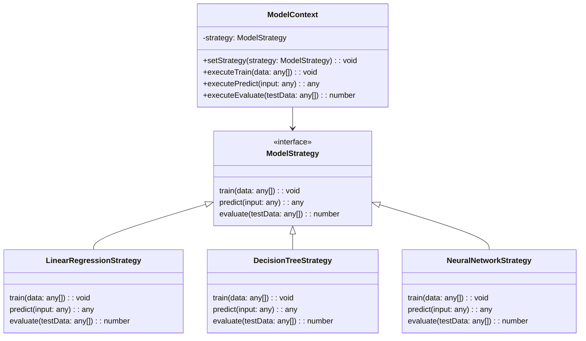

## 10.5.2 Strategy Pattern in Model Selection

In the ever-evolving field of machine learning (ML), the ability to adapt and experiment with different models and algorithms is crucial. The Strategy Pattern, a behavioral design pattern, provides a powerful mechanism for selecting and switching between various algorithms or models at runtime. This flexibility is particularly beneficial in ML applications, where different models may be more suitable depending on the dataset characteristics or performance metrics.

### Understanding the Strategy Pattern

The Strategy Pattern allows you to define a family of algorithms, encapsulate each one, and make them interchangeable. This pattern promotes the use of composition over inheritance, enabling the client to choose the appropriate algorithm at runtime. In the context of ML, this means you can dynamically select the best model for your data without altering the client code.

#### Key Components of the Strategy Pattern

- **Strategy Interface**: Defines a common interface for all supported algorithms. In ML, this could include methods like `train`, `predict`, and `evaluate`.
- **Concrete Strategies**: Implementations of the strategy interface, each encapsulating a specific algorithm or model.
- **Context**: Maintains a reference to a strategy object and delegates the execution of the algorithm to the strategy.

### Applying the Strategy Pattern in Model Selection

In ML applications, the Strategy Pattern can be used to select and switch between different models such as Linear Regression, Decision Trees, and Neural Networks. By defining a common interface, we can ensure that all models conform to the same contract, making it easy to swap them out as needed.

#### Defining a Common Interface

Let's start by defining a common interface for our models. This interface will include methods for training, predicting, and evaluating the model.

```typescript
interface ModelStrategy {
  train(data: any[]): void;
  predict(input: any): any;
  evaluate(testData: any[]): number;
}
```

This interface ensures that any model we implement will have these three essential methods, allowing us to interact with them in a consistent manner.

#### Implementing Different Model Strategies

Next, we'll implement several concrete strategies that conform to the `ModelStrategy` interface. Each strategy will represent a different ML model.

##### Linear Regression Strategy

```typescript
class LinearRegressionStrategy implements ModelStrategy {
  private coefficients: number[] = [];

  train(data: any[]): void {
    // Implement training logic for linear regression
    console.log("Training Linear Regression model...");
    // Assume coefficients are calculated here
    this.coefficients = [0.5, 1.2]; // Example coefficients
  }

  predict(input: any): any {
    // Implement prediction logic using the coefficients
    console.log("Predicting with Linear Regression model...");
    return input.reduce((acc: number, val: number, idx: number) => acc + val * this.coefficients[idx], 0);
  }

  evaluate(testData: any[]): number {
    // Implement evaluation logic
    console.log("Evaluating Linear Regression model...");
    return 0.85; // Example accuracy
  }
}
```

##### Decision Tree Strategy

```typescript
class DecisionTreeStrategy implements ModelStrategy {
  private tree: any;

  train(data: any[]): void {
    // Implement training logic for decision tree
    console.log("Training Decision Tree model...");
    // Assume tree is built here
    this.tree = {}; // Example tree structure
  }

  predict(input: any): any {
    // Implement prediction logic using the decision tree
    console.log("Predicting with Decision Tree model...");
    return "Class A"; // Example prediction
  }

  evaluate(testData: any[]): number {
    // Implement evaluation logic
    console.log("Evaluating Decision Tree model...");
    return 0.90; // Example accuracy
  }
}
```

##### Neural Network Strategy

```typescript
class NeuralNetworkStrategy implements ModelStrategy {
  private network: any;

  train(data: any[]): void {
    // Implement training logic for neural network
    console.log("Training Neural Network model...");
    // Assume network is trained here
    this.network = {}; // Example network structure
  }

  predict(input: any): any {
    // Implement prediction logic using the neural network
    console.log("Predicting with Neural Network model...");
    return [0.1, 0.9]; // Example prediction probabilities
  }

  evaluate(testData: any[]): number {
    // Implement evaluation logic
    console.log("Evaluating Neural Network model...");
    return 0.95; // Example accuracy
  }
}
```

#### Switching Between Models at Runtime

With our strategies defined, we can now create a context class that will allow us to switch between different models at runtime based on criteria such as dataset characteristics or performance metrics.

```typescript
class ModelContext {
  private strategy: ModelStrategy;

  constructor(strategy: ModelStrategy) {
    this.strategy = strategy;
  }

  setStrategy(strategy: ModelStrategy): void {
    this.strategy = strategy;
  }

  executeTrain(data: any[]): void {
    this.strategy.train(data);
  }

  executePredict(input: any): any {
    return this.strategy.predict(input);
  }

  executeEvaluate(testData: any[]): number {
    return this.strategy.evaluate(testData);
  }
}
```

#### Example Usage

Let's see how we can use the `ModelContext` to switch between different models.

```typescript
// Example dataset
const trainingData = [...];
const testData = [...];
const inputData = [...];

// Initialize context with Linear Regression strategy
const context = new ModelContext(new LinearRegressionStrategy());
context.executeTrain(trainingData);
console.log(context.executePredict(inputData));
console.log(context.executeEvaluate(testData));

// Switch to Decision Tree strategy
context.setStrategy(new DecisionTreeStrategy());
context.executeTrain(trainingData);
console.log(context.executePredict(inputData));
console.log(context.executeEvaluate(testData));

// Switch to Neural Network strategy
context.setStrategy(new NeuralNetworkStrategy());
context.executeTrain(trainingData);
console.log(context.executePredict(inputData));
console.log(context.executeEvaluate(testData));
```

### Supporting Experimentation and Hyperparameter Tuning

The Strategy Pattern is particularly useful for experimentation and hyperparameter tuning in ML applications. By allowing you to easily switch between different models and configurations, you can quickly test various approaches and find the optimal solution for your problem.

#### Experimentation

Experimentation is a key aspect of ML development. With the Strategy Pattern, you can easily compare the performance of different models on the same dataset. This flexibility allows you to iterate quickly and find the best model for your needs.

#### Hyperparameter Tuning

Hyperparameter tuning involves adjusting the parameters of your models to improve their performance. With the Strategy Pattern, you can create different strategies for each set of hyperparameters and switch between them to find the optimal configuration.

### Managing Dependencies and Ensuring Type Safety

When implementing the Strategy Pattern in TypeScript, it's important to manage dependencies and ensure type safety. TypeScript's static typing and interfaces help enforce the contract between the context and the strategies, reducing the risk of runtime errors.

#### Dependency Management

Ensure that each strategy is self-contained and does not rely on external dependencies that could cause conflicts. Use dependency injection to provide any necessary resources to the strategies.

#### Type Safety

TypeScript's type system helps ensure that all strategies conform to the `ModelStrategy` interface. This guarantees that the context can interact with any strategy in a consistent manner.

### Visualizing the Strategy Pattern in Model Selection

To better understand how the Strategy Pattern works in model selection, let's visualize the relationships between the components using a class diagram.



**Diagram Description**: This class diagram illustrates the Strategy Pattern in the context of model selection. The `ModelStrategy` interface defines the contract for all strategies. The `LinearRegressionStrategy`, `DecisionTreeStrategy`, and `NeuralNetworkStrategy` classes implement this interface. The `ModelContext` class maintains a reference to a `ModelStrategy` and delegates the execution of methods to the strategy.

### Try It Yourself

To deepen your understanding of the Strategy Pattern in model selection, try modifying the code examples provided. Here are a few suggestions:

- **Add a New Model Strategy**: Implement a new strategy for a different ML model, such as a Support Vector Machine (SVM) or K-Nearest Neighbors (KNN).
- **Experiment with Hyperparameters**: Create multiple strategies for the same model with different hyperparameters and compare their performance.
- **Integrate a Real Dataset**: Use a real dataset and implement the training, prediction, and evaluation logic for each strategy.

### Knowledge Check

Before moving on, let's review some key concepts:

- **What is the Strategy Pattern?**: A design pattern that allows you to define a family of algorithms, encapsulate each one, and make them interchangeable.
- **How does the Strategy Pattern support model selection?**: It allows you to dynamically switch between different models or algorithms at runtime.
- **What are the benefits of using the Strategy Pattern in ML applications?**: It supports experimentation, hyperparameter tuning, and ensures a consistent interface for interacting with different models.

### Embrace the Journey

Remember, the Strategy Pattern is just one of many tools available to you as a software engineer. As you continue to explore design patterns and their applications, you'll gain a deeper understanding of how to build flexible and maintainable software. Keep experimenting, stay curious, and enjoy the journey!

## Quiz Time!



### What is the primary purpose of the Strategy Pattern?

- [x] To define a family of algorithms and make them interchangeable
- [ ] To encapsulate data and behavior in a single class
- [ ] To provide a simplified interface to a complex subsystem
- [ ] To allow an object to alter its behavior when its internal state changes

> **Explanation:** The Strategy Pattern is used to define a family of algorithms, encapsulate each one, and make them interchangeable.

### How does the Strategy Pattern benefit machine learning applications?

- [x] It allows dynamic switching between different models at runtime
- [ ] It simplifies the user interface design
- [ ] It ensures data consistency across distributed systems
- [ ] It provides a mechanism for caching data

> **Explanation:** The Strategy Pattern allows for dynamic switching between different models or algorithms at runtime, which is beneficial for experimentation and adaptation in ML applications.

### Which method is NOT typically part of a model strategy interface?

- [ ] train
- [ ] predict
- [ ] evaluate
- [x] render

> **Explanation:** The typical methods in a model strategy interface include `train`, `predict`, and `evaluate`. `render` is not usually part of this interface.

### What is a key advantage of using TypeScript for implementing the Strategy Pattern?

- [x] Type safety ensures all strategies conform to the interface
- [ ] It automatically optimizes the performance of algorithms
- [ ] It provides built-in machine learning libraries
- [ ] It eliminates the need for testing

> **Explanation:** TypeScript's type safety ensures that all strategies conform to the defined interface, reducing the risk of runtime errors.

### In the context of the Strategy Pattern, what is the role of the context class?

- [x] To maintain a reference to a strategy object and delegate execution
- [ ] To define the algorithms that can be used interchangeably
- [ ] To manage the lifecycle of the application
- [ ] To provide a user interface for selecting strategies

> **Explanation:** The context class maintains a reference to a strategy object and delegates the execution of methods to the strategy.

### What is a common use case for the Strategy Pattern in ML applications?

- [x] Experimentation and hyperparameter tuning
- [ ] Rendering complex graphics
- [ ] Managing user authentication
- [ ] Storing large datasets

> **Explanation:** The Strategy Pattern is commonly used in ML applications for experimentation and hyperparameter tuning, allowing for easy switching between models.

### How can you add a new model strategy in the provided TypeScript example?

- [x] Implement a new class that conforms to the `ModelStrategy` interface
- [ ] Modify the existing context class to include new methods
- [ ] Change the implementation of the existing strategies
- [ ] Use a different programming language

> **Explanation:** To add a new model strategy, you need to implement a new class that conforms to the `ModelStrategy` interface.

### Why is dependency management important when using the Strategy Pattern?

- [x] To ensure strategies are self-contained and avoid conflicts
- [ ] To increase the execution speed of algorithms
- [ ] To simplify the user interface
- [ ] To reduce the size of the codebase

> **Explanation:** Dependency management ensures that each strategy is self-contained and does not rely on external dependencies that could cause conflicts.

### What is a potential benefit of using the Strategy Pattern for hyperparameter tuning?

- [x] It allows easy comparison of different configurations
- [ ] It automatically selects the best hyperparameters
- [ ] It eliminates the need for training data
- [ ] It provides real-time feedback to users

> **Explanation:** The Strategy Pattern allows for easy comparison of different configurations, facilitating hyperparameter tuning.

### True or False: The Strategy Pattern can only be used with machine learning models.

- [ ] True
- [x] False

> **Explanation:** The Strategy Pattern is a general design pattern that can be used in various contexts, not just with machine learning models.


