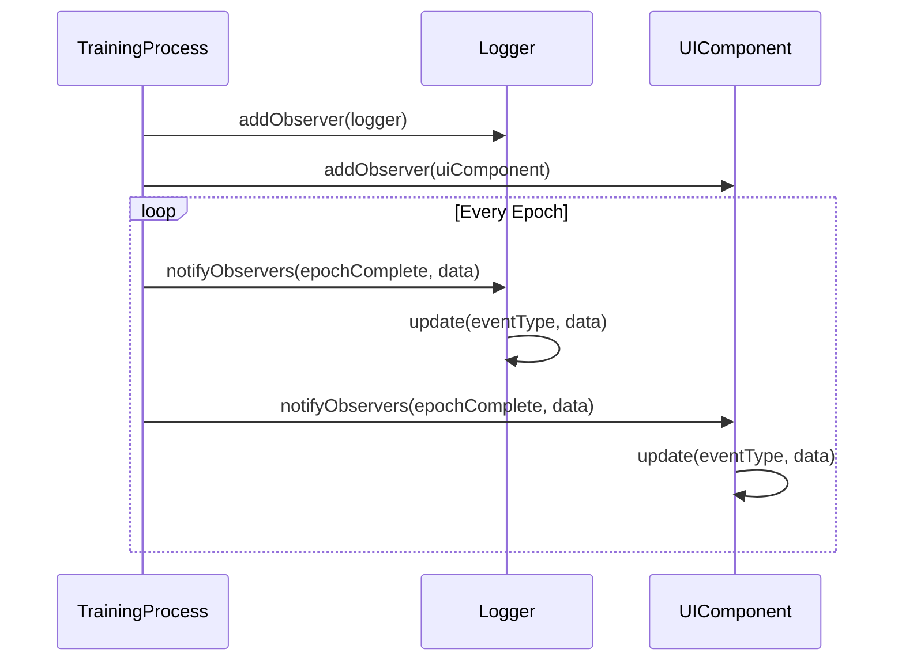

## 10.5.3 Observer Pattern for Training Progress

In the realm of machine learning, monitoring the progress of model training is crucial for understanding how well the model is learning and for making real-time adjustments. The Observer Pattern offers a robust solution for this task by allowing us to decouple the training logic from the monitoring and visualization concerns. This section will delve into how the Observer Pattern can be effectively utilized to monitor long-running training processes, update user interfaces in real-time, and integrate with machine learning libraries like TensorFlow.js.

### Understanding the Observer Pattern

The Observer Pattern is a behavioral design pattern that defines a one-to-many dependency between objects. When the state of one object (the subject) changes, all its dependents (observers) are notified and updated automatically. This pattern is particularly useful in scenarios where an object needs to notify other objects about changes in its state without being tightly coupled to them.

#### Key Components of the Observer Pattern

1. **Subject**: Maintains a list of observers and provides methods to add, remove, and notify observers.
2. **Observer**: Defines an updating interface for objects that should be notified of changes in a subject.
3. **ConcreteSubject**: Stores state of interest to ConcreteObserver objects and sends a notification to its observers when its state changes.
4. **ConcreteObserver**: Maintains a reference to a ConcreteSubject object and implements the Observer updating interface to keep its state consistent with the subject's.

### Applying the Observer Pattern to Monitor Training Progress

In a machine learning context, the training process can be considered the subject, while various components like UI elements, loggers, or analytics tools can act as observers. These observers can listen to training events such as epoch completion, accuracy improvements, or convergence, and update accordingly.

#### Implementing the Observer Pattern in TypeScript

Let's explore how to implement the Observer Pattern in TypeScript to monitor a machine learning model's training progress.

```typescript
// Define the Observer interface
interface Observer {
  update(eventType: string, data: any): void;
}

// Define the Subject interface
interface Subject {
  addObserver(observer: Observer): void;
  removeObserver(observer: Observer): void;
  notifyObservers(eventType: string, data: any): void;
}

// ConcreteSubject: TrainingProcess
class TrainingProcess implements Subject {
  private observers: Observer[] = [];

  addObserver(observer: Observer): void {
    this.observers.push(observer);
  }

  removeObserver(observer: Observer): void {
    this.observers = this.observers.filter(obs => obs !== observer);
  }

  notifyObservers(eventType: string, data: any): void {
    for (const observer of this.observers) {
      observer.update(eventType, data);
    }
  }

  // Simulate a training process
  startTraining(): void {
    for (let epoch = 1; epoch <= 10; epoch++) {
      // Simulate accuracy improvement
      const accuracy = Math.random() * 100;
      this.notifyObservers('epochComplete', { epoch, accuracy });
    }
  }
}

// ConcreteObserver: Logger
class Logger implements Observer {
  update(eventType: string, data: any): void {
    if (eventType === 'epochComplete') {
      console.log(`Epoch ${data.epoch} complete with accuracy: ${data.accuracy.toFixed(2)}%`);
    }
  }
}

// ConcreteObserver: UIComponent
class UIComponent implements Observer {
  update(eventType: string, data: any): void {
    if (eventType === 'epochComplete') {
      // Update UI with new accuracy
      console.log(`Updating UI: Epoch ${data.epoch} - Accuracy: ${data.accuracy.toFixed(2)}%`);
    }
  }
}

// Usage
const trainingProcess = new TrainingProcess();
const logger = new Logger();
const uiComponent = new UIComponent();

trainingProcess.addObserver(logger);
trainingProcess.addObserver(uiComponent);

trainingProcess.startTraining();
```

In this example, the `TrainingProcess` class acts as the subject, while `Logger` and `UIComponent` are observers. The `startTraining` method simulates a training process, notifying observers of each epoch's completion.

### Real-Time UI Updates

One of the main advantages of using the Observer Pattern is the ability to update user interfaces in real-time. This is particularly useful in machine learning applications where visualizing training progress can provide immediate insights into model performance.

#### Integrating with TensorFlow.js

TensorFlow.js is a popular library for running machine learning models in the browser. By integrating the Observer Pattern with TensorFlow.js, we can monitor training progress and update the UI dynamically.

```typescript
import * as tf from '@tensorflow/tfjs';

// Extend the TrainingProcess to use TensorFlow.js
class TensorFlowTrainingProcess extends TrainingProcess {
  async startTraining(model: tf.LayersModel, data: { xs: tf.Tensor, ys: tf.Tensor }): Promise<void> {
    const history = await model.fit(data.xs, data.ys, {
      epochs: 10,
      callbacks: {
        onEpochEnd: (epoch: number, logs: tf.Logs) => {
          this.notifyObservers('epochComplete', { epoch, accuracy: logs.acc });
        }
      }
    });
  }
}

// Usage with TensorFlow.js
const model = tf.sequential();
model.add(tf.layers.dense({ units: 1, inputShape: [1] }));
model.compile({ optimizer: 'sgd', loss: 'meanSquaredError' });

const xs = tf.tensor2d([1, 2, 3, 4], [4, 1]);
const ys = tf.tensor2d([1, 3, 5, 7], [4, 1]);

const tfTrainingProcess = new TensorFlowTrainingProcess();
tfTrainingProcess.addObserver(logger);
tfTrainingProcess.addObserver(uiComponent);

tfTrainingProcess.startTraining(model, { xs, ys });
```

In this integration, we extend the `TrainingProcess` class to work with TensorFlow.js. The `startTraining` method uses TensorFlow.js's `model.fit` function, which allows us to specify callbacks for training events like `onEpochEnd`.

### Decoupling Training Logic from Monitoring

The Observer Pattern is instrumental in decoupling the core training logic from monitoring and visualization concerns. This separation of concerns enhances maintainability and scalability, allowing developers to modify or extend the monitoring capabilities without altering the training process itself.

#### Performance Considerations

When implementing the Observer Pattern, especially in scenarios with frequent events like model training, it's crucial to consider performance. Emitting and handling a large number of events can lead to performance bottlenecks if not managed properly.

- **Batch Updates**: Instead of notifying observers on every minor change, consider batching updates and notifying observers at regular intervals.
- **Throttling**: Implement throttling mechanisms to limit the frequency of notifications.
- **Efficient Data Structures**: Use efficient data structures to manage observers and events.

### Visualizing the Observer Pattern

To better understand the flow of the Observer Pattern in a training process, let's visualize the interactions between the subject and observers.



This sequence diagram illustrates how the `TrainingProcess` notifies the `Logger` and `UIComponent` observers of each epoch's completion.

### Try It Yourself

To gain a deeper understanding of the Observer Pattern in action, try modifying the code examples:

- **Add a new observer** that logs training loss alongside accuracy.
- **Implement a batch update mechanism** to reduce the frequency of notifications.
- **Visualize additional metrics** such as precision or recall in the UI component.

### Key Takeaways

- The Observer Pattern is effective for monitoring long-running processes like model training.
- It enables real-time updates and visualization of training progress, enhancing user experience.
- By decoupling training logic from monitoring, the pattern improves maintainability and scalability.
- Integrating with libraries like TensorFlow.js allows for seamless monitoring of machine learning models.
- Performance considerations are crucial when dealing with frequent events.

### References and Further Reading

- [Observer Pattern - Wikipedia](https://en.wikipedia.org/wiki/Observer_pattern)
- [TensorFlow.js Documentation](https://www.tensorflow.org/js)
- [Design Patterns: Elements of Reusable Object-Oriented Software](https://en.wikipedia.org/wiki/Design_Patterns)

## Quiz Time!



### What is the primary benefit of using the Observer Pattern in monitoring training progress?

- [x] Decoupling the training logic from monitoring and visualization concerns
- [ ] Improving the accuracy of the model
- [ ] Reducing the training time
- [ ] Increasing the complexity of the code

> **Explanation:** The Observer Pattern allows for the separation of concerns, enabling the training logic to be independent of monitoring and visualization components.

### Which component in the Observer Pattern maintains a list of observers?

- [x] Subject
- [ ] Observer
- [ ] ConcreteObserver
- [ ] ConcreteSubject

> **Explanation:** The Subject is responsible for maintaining a list of observers and notifying them of changes.

### In the provided TypeScript example, what role does the `Logger` class play?

- [x] ConcreteObserver
- [ ] Subject
- [ ] ConcreteSubject
- [ ] Observer

> **Explanation:** The `Logger` class implements the `Observer` interface and acts as a ConcreteObserver, responding to notifications from the subject.

### How can performance be optimized when using the Observer Pattern with frequent events?

- [x] Implementing batch updates and throttling
- [ ] Increasing the number of observers
- [ ] Decreasing the number of subjects
- [ ] Using more complex data structures

> **Explanation:** Batch updates and throttling can help manage the frequency of notifications, reducing performance bottlenecks.

### What TypeScript feature is used to define contracts for objects in the Observer Pattern?

- [x] Interfaces
- [ ] Classes
- [ ] Modules
- [ ] Generics

> **Explanation:** Interfaces in TypeScript are used to define contracts that classes can implement, ensuring they adhere to a specific structure.

### Which event in the TensorFlow.js integration example triggers observer notifications?

- [x] onEpochEnd
- [ ] onBatchEnd
- [ ] onTrainBegin
- [ ] onTrainEnd

> **Explanation:** The `onEpochEnd` callback is used to notify observers of the completion of each training epoch.

### What is a potential drawback of emitting too many events in the Observer Pattern?

- [x] Performance bottlenecks
- [ ] Increased accuracy
- [ ] Reduced code complexity
- [ ] Enhanced maintainability

> **Explanation:** Emitting too many events can lead to performance issues due to the overhead of frequent notifications.

### How does the Observer Pattern enhance maintainability in machine learning applications?

- [x] By separating training logic from monitoring concerns
- [ ] By increasing the number of observers
- [ ] By reducing the number of subjects
- [ ] By using more complex data structures

> **Explanation:** The separation of concerns allows for easier maintenance and scalability, as changes to monitoring do not affect the training logic.

### Which library is used in the example to run machine learning models in the browser?

- [x] TensorFlow.js
- [ ] PyTorch
- [ ] Scikit-learn
- [ ] Keras

> **Explanation:** TensorFlow.js is a library that allows for running machine learning models in the browser using JavaScript.

### True or False: The Observer Pattern can only be used for monitoring training progress in machine learning.

- [ ] True
- [x] False

> **Explanation:** The Observer Pattern is a versatile design pattern that can be used in various scenarios beyond machine learning, such as event handling and real-time updates.


