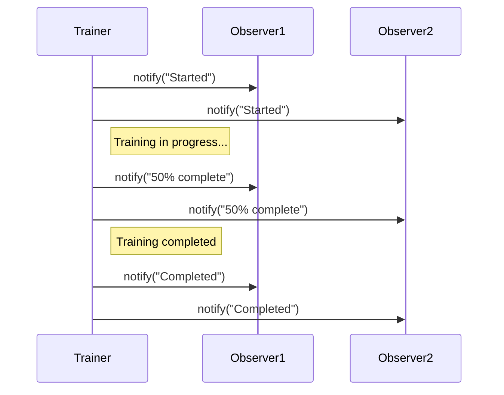

## 10.5 Design Patterns in Machine Learning Applications

Machine learning (ML) applications present unique challenges that can be effectively addressed using design patterns. In this section, we will explore how traditional software design patterns can be adapted to the ML domain, particularly in TypeScript-based environments. We'll discuss the benefits of using these patterns to improve code organization, maintainability, and scalability, and provide relevant examples using TypeScript and ML libraries like TensorFlow.js.

### Overview of Design Patterns in ML

Design patterns offer reusable solutions to common software design problems. In the context of ML, these patterns can help manage the complexities associated with handling large datasets, model management, and asynchronous computations. By applying design patterns, developers can create more maintainable and scalable ML applications.

### Unique Challenges in ML Development

Machine learning development involves several unique challenges:

- **Handling Large Datasets**: ML models often require processing vast amounts of data, necessitating efficient data handling and processing strategies.
- **Model Management**: Managing different versions of models, including training, testing, and deployment, can be complex.
- **Asynchronous Computations**: ML tasks, such as training and inference, are often computationally intensive and benefit from asynchronous processing.

### Adapting Traditional Design Patterns for ML

Let's explore how traditional design patterns can be adapted to address these challenges in ML applications.

#### 1. Pipeline Pattern for Data Processing

The Pipeline pattern is particularly useful in ML for organizing data processing tasks. It allows for the sequential execution of data transformations, making it easier to manage complex data workflows.

**Example: Implementing a Data Processing Pipeline in TypeScript**

```typescript
class DataPipeline {
  private steps: Array<(data: any) => any> = [];

  addStep(step: (data: any) => any): DataPipeline {
    this.steps.push(step);
    return this;
  }

  execute(data: any): any {
    return this.steps.reduce((acc, step) => step(acc), data);
  }
}

// Usage
const pipeline = new DataPipeline()
  .addStep(data => data.map((x: number) => x * 2))
  .addStep(data => data.filter((x: number) => x > 10));

const result = pipeline.execute([1, 5, 10, 15, 20]);
console.log(result); // Output: [20, 30, 40]
```

**Benefits**: The Pipeline pattern enhances code readability and reusability by clearly defining the sequence of data transformations.

#### 2. Strategy Pattern in Model Selection

The Strategy pattern can be employed to select different machine learning models or algorithms at runtime. This pattern provides flexibility in choosing the best model for a given task without altering the existing codebase.

**Example: Implementing Strategy Pattern for Model Selection**

```typescript
interface ModelStrategy {
  train(data: any[]): void;
  predict(data: any[]): any[];
}

class LinearRegressionStrategy implements ModelStrategy {
  train(data: any[]): void {
    console.log("Training Linear Regression model...");
  }

  predict(data: any[]): any[] {
    return data.map(() => Math.random());
  }
}

class DecisionTreeStrategy implements ModelStrategy {
  train(data: any[]): void {
    console.log("Training Decision Tree model...");
  }

  predict(data: any[]): any[] {
    return data.map(() => Math.random());
  }
}

class ModelContext {
  private strategy: ModelStrategy;

  constructor(strategy: ModelStrategy) {
    this.strategy = strategy;
  }

  setStrategy(strategy: ModelStrategy): void {
    this.strategy = strategy;
  }

  executeStrategy(data: any[]): any[] {
    this.strategy.train(data);
    return this.strategy.predict(data);
  }
}

// Usage
const data = [/* some training data */];
const modelContext = new ModelContext(new LinearRegressionStrategy());
modelContext.executeStrategy(data);

modelContext.setStrategy(new DecisionTreeStrategy());
modelContext.executeStrategy(data);
```

**Benefits**: The Strategy pattern allows for easy swapping of models, facilitating experimentation and optimization.

#### 3. Observer Pattern for Training Progress

The Observer pattern is ideal for monitoring the progress of model training. It allows different components to be notified of changes in the training status without tight coupling.

**Example: Implementing Observer Pattern for Training Progress**

```typescript
interface Observer {
  update(status: string): void;
}

class TrainingProgress implements Observer {
  update(status: string): void {
    console.log(`Training progress: ${status}`);
  }
}

class ModelTrainer {
  private observers: Observer[] = [];

  addObserver(observer: Observer): void {
    this.observers.push(observer);
  }

  removeObserver(observer: Observer): void {
    this.observers = this.observers.filter(obs => obs !== observer);
  }

  notifyObservers(status: string): void {
    this.observers.forEach(observer => observer.update(status));
  }

  trainModel(): void {
    this.notifyObservers("Started");
    // Simulate training
    setTimeout(() => this.notifyObservers("50% complete"), 1000);
    setTimeout(() => this.notifyObservers("Completed"), 2000);
  }
}

// Usage
const trainer = new ModelTrainer();
const progress = new TrainingProgress();

trainer.addObserver(progress);
trainer.trainModel();
```

**Benefits**: The Observer pattern decouples the training process from the UI or logging components, allowing for flexible updates.

### Leveraging TypeScript and TensorFlow.js

TypeScript's strong typing and modern features make it an excellent choice for developing ML applications. Libraries like TensorFlow.js enable running ML models directly in the browser, leveraging TypeScript's capabilities.

#### Using TensorFlow.js with TypeScript

TensorFlow.js is a powerful library for running ML models in the browser. It provides a comprehensive set of tools for building and deploying models.

**Example: Simple TensorFlow.js Model in TypeScript**

```typescript
import * as tf from '@tensorflow/tfjs';

// Define a simple sequential model
const model = tf.sequential();
model.add(tf.layers.dense({ units: 1, inputShape: [1] }));

// Compile the model
model.compile({ optimizer: 'sgd', loss: 'meanSquaredError' });

// Generate some synthetic data for training
const xs = tf.tensor2d([1, 2, 3, 4], [4, 1]);
const ys = tf.tensor2d([1, 3, 5, 7], [4, 1]);

// Train the model
model.fit(xs, ys, { epochs: 10 }).then(() => {
  // Use the model to do inference on a data point the model hasn't seen before
  model.predict(tf.tensor2d([5], [1, 1])).print();
});
```

**Benefits**: TensorFlow.js allows for real-time model training and inference in the browser, making it ideal for interactive ML applications.

### Benefits of Using Design Patterns in ML

Applying design patterns in ML projects offers several benefits:

- **Code Reusability**: Patterns provide reusable solutions that can be applied across different projects.
- **Clarity and Maintainability**: Patterns improve code organization, making it easier to understand and maintain.
- **Scalability**: Patterns facilitate the development of scalable ML applications by addressing common architectural challenges.

### Try It Yourself

Experiment with the code examples provided in this section. Try modifying the data processing pipeline to include additional transformations or implement a new model strategy using the Strategy pattern. These exercises will help solidify your understanding of how design patterns can be applied in ML applications.

### Visualizing Design Patterns in ML

Below is a diagram illustrating the interaction between different components in an ML application using the Observer pattern for training progress.



**Description**: This sequence diagram shows how the `ModelTrainer` notifies multiple observers about the training progress. Each observer receives updates independently, demonstrating the decoupling achieved by the Observer pattern.

### Knowledge Check

- What are the benefits of using the Pipeline pattern in ML applications?
- How does the Strategy pattern facilitate model selection in ML?
- Why is the Observer pattern suitable for monitoring training progress?

### Embrace the Journey

Remember, applying design patterns in ML is just the beginning. As you progress, you'll discover more ways to enhance your ML applications using TypeScript and design patterns. Keep experimenting, stay curious, and enjoy the journey!

### References and Links

- [TensorFlow.js](https://www.tensorflow.org/js)
- [MDN Web Docs on TypeScript](https://developer.mozilla.org/en-US/docs/Web/JavaScript/Reference/Global_Objects/TypeScript)

## Quiz Time!



### What is the primary benefit of using the Pipeline pattern in ML applications?

- [x] Organizing data processing tasks sequentially
- [ ] Reducing code complexity
- [ ] Enhancing model accuracy
- [ ] Simplifying user interfaces

> **Explanation:** The Pipeline pattern organizes data processing tasks sequentially, making it easier to manage complex data workflows.

### How does the Strategy pattern help in model selection?

- [x] By allowing different models to be selected at runtime
- [ ] By improving model accuracy
- [ ] By reducing training time
- [ ] By simplifying data preprocessing

> **Explanation:** The Strategy pattern allows for the selection of different models at runtime, providing flexibility in choosing the best model for a given task.

### Which pattern is ideal for monitoring training progress?

- [x] Observer pattern
- [ ] Singleton pattern
- [ ] Factory pattern
- [ ] Adapter pattern

> **Explanation:** The Observer pattern is ideal for monitoring training progress as it allows different components to be notified of changes in the training status without tight coupling.

### What is a key advantage of using TensorFlow.js in TypeScript?

- [x] Real-time model training and inference in the browser
- [ ] Improved model accuracy
- [ ] Simplified data preprocessing
- [ ] Reduced code complexity

> **Explanation:** TensorFlow.js allows for real-time model training and inference in the browser, making it ideal for interactive ML applications.

### What is the role of TypeScript in ML development?

- [x] Providing strong typing and modern features
- [ ] Enhancing model accuracy
- [ ] Reducing training time
- [ ] Simplifying data preprocessing

> **Explanation:** TypeScript provides strong typing and modern features, making it an excellent choice for developing ML applications.

### How does the Observer pattern decouple components in an ML application?

- [x] By allowing components to be notified of changes without tight coupling
- [ ] By reducing code complexity
- [ ] By improving model accuracy
- [ ] By simplifying data preprocessing

> **Explanation:** The Observer pattern allows components to be notified of changes without tight coupling, enhancing flexibility and maintainability.

### What is a benefit of using design patterns in ML projects?

- [x] Improved code organization and maintainability
- [ ] Enhanced model accuracy
- [ ] Reduced training time
- [ ] Simplified data preprocessing

> **Explanation:** Design patterns improve code organization and maintainability, making it easier to understand and manage ML projects.

### How can the Strategy pattern be used in ML?

- [x] By allowing different models or algorithms to be selected at runtime
- [ ] By improving model accuracy
- [ ] By reducing training time
- [ ] By simplifying data preprocessing

> **Explanation:** The Strategy pattern allows for the selection of different models or algorithms at runtime, providing flexibility in ML applications.

### What is a challenge in ML development that design patterns can address?

- [x] Handling large datasets
- [ ] Improving model accuracy
- [ ] Reducing training time
- [ ] Simplifying data preprocessing

> **Explanation:** Design patterns can address challenges such as handling large datasets, model management, and asynchronous computations in ML development.

### True or False: TensorFlow.js can only be used for model inference, not training.

- [ ] True
- [x] False

> **Explanation:** TensorFlow.js can be used for both model training and inference, allowing for real-time ML applications in the browser.


