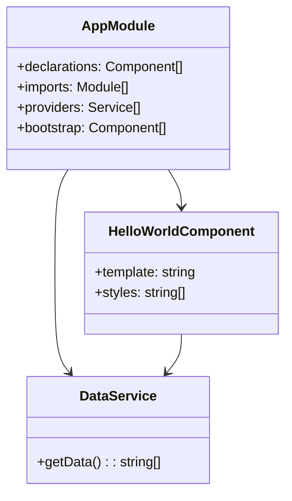

## 10.6.1 Angular's Architecture

Angular is a powerful framework for building dynamic web applications, and its architecture is a testament to the thoughtful integration of design patterns that enhance scalability, maintainability, and performance. In this section, we'll explore Angular's core concepts—components, services, modules, directives, and pipes—and how they embody various design patterns. We'll delve into the Dependency Injection pattern for managing services and components, the Singleton pattern in Angular services, the Observer pattern through RxJS for reactive programming, and the Decorator pattern for enhancing classes with metadata via TypeScript decorators. We'll also provide code examples and discuss best practices for organizing Angular projects.

### Core Concepts of Angular

Angular's architecture is built around several core concepts that work together to create a cohesive framework for web development. Let's explore these concepts:

#### Components

Components are the building blocks of Angular applications. They encapsulate the logic, template, and styles for a part of the user interface. Each component is a class decorated with `@Component`, which provides metadata about the component.

```typescript
import { Component } from '@angular/core';

@Component({
  selector: 'app-hello-world',
  template: `<h1>Hello, World!</h1>`,
  styles: [`h1 { font-family: Lato; }`]
})
export class HelloWorldComponent {}
```

In this example, `HelloWorldComponent` is a simple Angular component with a template that displays "Hello, World!".

#### Services

Services in Angular are used to encapsulate business logic and data access. They are typically singleton objects that can be injected into components or other services using Angular's Dependency Injection system.

```typescript
import { Injectable } from '@angular/core';

@Injectable({
  providedIn: 'root',
})
export class DataService {
  getData() {
    return ['Data 1', 'Data 2', 'Data 3'];
  }
}
```

The `DataService` is a simple service that provides data. The `@Injectable` decorator marks it as a service that can be injected.

#### Modules

Modules are containers for a cohesive block of code dedicated to an application domain, a workflow, or a closely related set of capabilities. Every Angular application has at least one module, the root module, which is conventionally named `AppModule`.

```typescript
import { NgModule } from '@angular/core';
import { BrowserModule } from '@angular/platform-browser';
import { AppComponent } from './app.component';
import { HelloWorldComponent } from './hello-world.component';

@NgModule({
  declarations: [AppComponent, HelloWorldComponent],
  imports: [BrowserModule],
  providers: [],
  bootstrap: [AppComponent]
})
export class AppModule {}
```

The `AppModule` declares the components and imports necessary for the application to run.

#### Directives

Directives are classes that add additional behavior to elements in your Angular applications. There are three types of directives: components, structural directives, and attribute directives.

```typescript
import { Directive, ElementRef, Renderer2 } from '@angular/core';

@Directive({
  selector: '[appHighlight]'
})
export class HighlightDirective {
  constructor(el: ElementRef, renderer: Renderer2) {
    renderer.setStyle(el.nativeElement, 'backgroundColor', 'yellow');
  }
}
```

The `HighlightDirective` is an attribute directive that changes the background color of the host element to yellow.

#### Pipes

Pipes are a way to transform data in your templates. Angular comes with several built-in pipes, but you can also create custom pipes.

```typescript
import { Pipe, PipeTransform } from '@angular/core';

@Pipe({name: 'exponentialStrength'})
export class ExponentialStrengthPipe implements PipeTransform {
  transform(value: number, exponent: string): number {
    let exp = parseFloat(exponent);
    return Math.pow(value, isNaN(exp) ? 1 : exp);
  }
}
```

The `ExponentialStrengthPipe` transforms a number to its exponential form.

### Design Patterns in Angular

Angular leverages several design patterns to enhance its architecture. Let's explore how Angular uses these patterns.

#### Dependency Injection Pattern

Dependency Injection (DI) is a design pattern used to implement IoC (Inversion of Control), allowing the creation of dependent objects outside of a class and providing those objects to a class in different ways. Angular's DI system is a core feature that allows you to inject dependencies into components, services, and other constructs.

**Example: Injecting a Service into a Component**

```typescript
import { Component, OnInit } from '@angular/core';
import { DataService } from './data.service';

@Component({
  selector: 'app-data-list',
  template: `<ul><li *ngFor="let item of data">{{ item }}</li></ul>`
})
export class DataListComponent implements OnInit {
  data: string[];

  constructor(private dataService: DataService) {}

  ngOnInit() {
    this.data = this.dataService.getData();
  }
}
```

In this example, `DataService` is injected into `DataListComponent` using the constructor. This allows `DataListComponent` to access the data provided by `DataService`.

#### Singleton Pattern

The Singleton pattern ensures a class has only one instance and provides a global point of access to it. In Angular, services provided at the root level are singletons.

**Example: Singleton Service**

```typescript
@Injectable({
  providedIn: 'root',
})
export class SingletonService {
  private count = 0;

  increment() {
    this.count++;
  }

  getCount() {
    return this.count;
  }
}
```

The `SingletonService` is a singleton because it is provided at the root level. This means that the same instance of `SingletonService` is shared across the application.

#### Observer Pattern

The Observer pattern is a software design pattern in which an object, called the subject, maintains a list of its dependents, called observers, and notifies them automatically of any state changes. Angular uses the Observer pattern through RxJS for reactive programming.

**Example: Using RxJS Observables**

```typescript
import { Component, OnInit } from '@angular/core';
import { Observable, of } from 'rxjs';

@Component({
  selector: 'app-observable-example',
  template: `<div *ngFor="let item of items">{{ item }}</div>`
})
export class ObservableExampleComponent implements OnInit {
  items: string[];

  ngOnInit() {
    const data$: Observable<string[]> = of(['Item 1', 'Item 2', 'Item 3']);
    data$.subscribe(data => this.items = data);
  }
}
```

In this example, an `Observable` is created using `of` from RxJS, and the component subscribes to it to receive data.

#### Decorator Pattern

The Decorator pattern is a structural pattern that allows behavior to be added to individual objects, either statically or dynamically, without affecting the behavior of other objects from the same class. Angular uses TypeScript decorators to add metadata to classes.

**Example: Using Decorators in Angular**

```typescript
import { Component } from '@angular/core';

@Component({
  selector: 'app-decorator-example',
  template: `<h2>Decorator Example</h2>`
})
export class DecoratorExampleComponent {}
```

The `@Component` decorator adds metadata to the `DecoratorExampleComponent` class, describing how the component should be processed, instantiated, and used at runtime.

### Best Practices for Organizing Angular Projects

To improve scalability and maintainability in Angular projects, consider the following best practices:

1. **Modular Architecture**: Organize your application into modules that encapsulate related components, services, and other constructs. This improves maintainability and enables lazy loading.

2. **Use Services for Business Logic**: Encapsulate business logic in services rather than components. This promotes reusability and testability.

3. **Leverage Angular CLI**: Use Angular CLI for generating components, services, and other constructs. This ensures consistency and adherence to Angular's best practices.

4. **Follow Naming Conventions**: Use consistent naming conventions for files and classes to improve readability and maintainability.

5. **Implement Lazy Loading**: Use lazy loading to load modules only when needed, improving the initial load time of your application.

6. **Utilize RxJS for Reactive Programming**: Use RxJS to handle asynchronous data streams and events, making your application more responsive and efficient.

7. **Optimize Change Detection**: Use `OnPush` change detection strategy where applicable to improve performance by reducing unnecessary checks.

8. **Use TypeScript Features**: Leverage TypeScript's static typing, interfaces, and other features to improve code quality and maintainability.

9. **Write Unit Tests**: Write unit tests for components, services, and other constructs to ensure correctness and facilitate refactoring.

10. **Document Your Code**: Use comments and documentation to explain complex logic and design decisions, making it easier for others to understand and maintain your code.

### Try It Yourself

To solidify your understanding of Angular's architecture and design patterns, try modifying the code examples provided. For instance, create a new service that fetches data from an API and inject it into a component. Experiment with creating custom directives and pipes to enhance your application's functionality. By actively engaging with the code, you'll gain a deeper understanding of how Angular's architecture and design patterns work together to create robust web applications.

### Visualizing Angular's Architecture

To better understand Angular's architecture, let's visualize the relationships between components, services, and modules using a class diagram.



**Diagram Description**: This class diagram illustrates the relationships between the `AppModule`, `HelloWorldComponent`, and `DataService`. The `AppModule` declares the `HelloWorldComponent` and provides the `DataService`. The `HelloWorldComponent` depends on the `DataService` to fetch data.

### References and Links

For further reading on Angular's architecture and design patterns, consider the following resources:

- [Angular Documentation](https://angular.io/docs)
- [RxJS Documentation](https://rxjs.dev/guide/overview)
- [TypeScript Handbook](https://www.typescriptlang.org/docs/handbook/intro.html)

### Knowledge Check

To reinforce your understanding, consider the following questions:

- How does Angular's Dependency Injection system enhance modularity and testability?
- In what scenarios would you use the Singleton pattern in Angular services?
- How does the Observer pattern facilitate reactive programming in Angular applications?
- What role do decorators play in Angular's architecture?

### Embrace the Journey

Remember, mastering Angular's architecture and design patterns is a journey. As you continue to build applications, you'll discover new ways to leverage these patterns to create scalable and maintainable code. Keep experimenting, stay curious, and enjoy the process!

## Quiz Time!



### What is the primary purpose of Angular components?

- [x] To encapsulate the logic, template, and styles for a part of the user interface.
- [ ] To manage application-wide data and business logic.
- [ ] To provide a global point of access to services.
- [ ] To transform data in templates.

> **Explanation:** Angular components encapsulate the logic, template, and styles for a part of the user interface, making them the building blocks of Angular applications.

### How does Angular's Dependency Injection system enhance modularity?

- [x] By allowing the creation of dependent objects outside of a class.
- [ ] By ensuring a class has only one instance.
- [ ] By notifying dependents of state changes.
- [ ] By adding metadata to classes.

> **Explanation:** Angular's Dependency Injection system enhances modularity by allowing the creation of dependent objects outside of a class, promoting loose coupling and testability.

### What pattern does Angular use for managing services provided at the root level?

- [x] Singleton Pattern
- [ ] Observer Pattern
- [ ] Decorator Pattern
- [ ] Factory Pattern

> **Explanation:** Angular uses the Singleton pattern for managing services provided at the root level, ensuring a single instance is shared across the application.

### How does Angular utilize the Observer pattern?

- [x] Through RxJS for reactive programming.
- [ ] By encapsulating business logic in services.
- [ ] By adding metadata to classes.
- [ ] By ensuring a class has only one instance.

> **Explanation:** Angular utilizes the Observer pattern through RxJS for reactive programming, allowing components to react to data changes.

### What is the role of decorators in Angular?

- [x] To add metadata to classes.
- [ ] To encapsulate business logic.
- [ ] To manage application-wide data.
- [ ] To transform data in templates.

> **Explanation:** Decorators in Angular add metadata to classes, describing how they should be processed and instantiated.

### Which of the following is a best practice for organizing Angular projects?

- [x] Use services for business logic.
- [ ] Use components for business logic.
- [ ] Avoid using RxJS for reactive programming.
- [ ] Use global variables for data management.

> **Explanation:** A best practice for organizing Angular projects is to use services for business logic, promoting reusability and testability.

### What is a benefit of using RxJS in Angular applications?

- [x] Handling asynchronous data streams and events.
- [ ] Ensuring a class has only one instance.
- [ ] Adding metadata to classes.
- [ ] Encapsulating business logic.

> **Explanation:** RxJS is beneficial in Angular applications for handling asynchronous data streams and events, making applications more responsive and efficient.

### What is the purpose of lazy loading in Angular?

- [x] To load modules only when needed, improving initial load time.
- [ ] To ensure a class has only one instance.
- [ ] To transform data in templates.
- [ ] To encapsulate business logic.

> **Explanation:** Lazy loading in Angular is used to load modules only when needed, improving the initial load time of the application.

### How can you optimize change detection in Angular?

- [x] Use `OnPush` change detection strategy.
- [ ] Use `Default` change detection strategy.
- [ ] Avoid using RxJS.
- [ ] Use global variables for data management.

> **Explanation:** Optimizing change detection in Angular can be achieved by using the `OnPush` change detection strategy, which reduces unnecessary checks.

### True or False: Angular services provided at the root level are singletons.

- [x] True
- [ ] False

> **Explanation:** True. Angular services provided at the root level are singletons, meaning the same instance is shared across the application.


