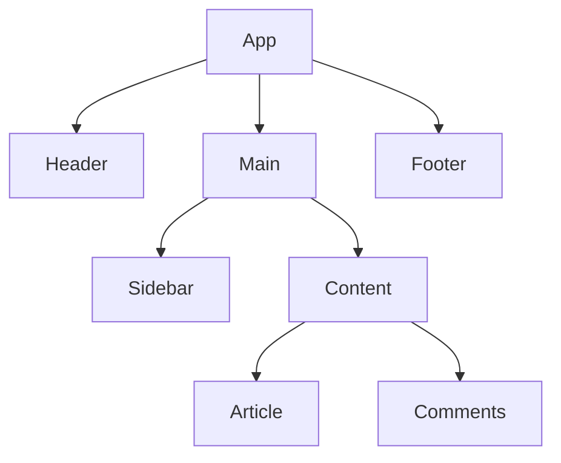

## 10.6.2 React with TypeScript

In the rapidly evolving landscape of web development, React has emerged as a powerful library for building user interfaces. When combined with TypeScript, React becomes even more robust, offering a type-safe environment that enhances code quality and maintainability. In this section, we will explore how to implement design patterns in React components using TypeScript, focusing on creating scalable and maintainable user interfaces.

### Understanding React's Component Model and TypeScript's Role

React's component-based architecture allows developers to build encapsulated components that manage their own state and logic. This modular approach aligns well with TypeScript's static typing, which provides compile-time checks and improved developer tooling. By using TypeScript, we can define clear contracts for our components, ensuring that props and state are used correctly.

#### Benefits of TypeScript in React

- **Type Safety**: TypeScript helps catch errors early by enforcing type checks, reducing runtime errors.
- **Improved Developer Experience**: With TypeScript, IDEs can offer better autocompletion, refactoring tools, and documentation.
- **Enhanced Readability and Maintainability**: Type annotations serve as documentation, making it easier for developers to understand and maintain code.

### Implementing Design Patterns in React with TypeScript

React's flexibility allows us to implement various design patterns that enhance the scalability and maintainability of our applications. Let's explore some common patterns and how they can be applied in React using TypeScript.

#### Higher-Order Components (HOCs) and the Decorator Pattern

Higher-Order Components (HOCs) are functions that take a component and return a new component, adding additional functionality. This pattern is akin to the Decorator pattern, which allows behavior to be added to individual objects, without affecting the behavior of other objects from the same class.

**Example: Logging HOC**

```typescript
import React from 'react';

// Define a type for the wrapped component's props
interface WithLoggingProps {
  logMessage: string;
}

// Higher-Order Component
function withLogging<P>(WrappedComponent: React.ComponentType<P>) {
  return class extends React.Component<P & WithLoggingProps> {
    componentDidMount() {
      console.log(this.props.logMessage);
    }

    render() {
      return <WrappedComponent {...this.props as P} />;
    }
  };
}

// Usage
interface MyComponentProps {
  name: string;
}

const MyComponent: React.FC<MyComponentProps> = ({ name }) => (
  <div>Hello, {name}!</div>
);

const MyComponentWithLogging = withLogging(MyComponent);

// Render
<MyComponentWithLogging name="Alice" logMessage="Component Mounted" />;
```

In this example, `withLogging` is a HOC that logs a message when the component mounts. By using TypeScript, we ensure that the `logMessage` prop is correctly typed, enhancing the component's reliability.

#### Render Props and the Strategy Pattern

Render Props is a pattern where a component's child is a function that returns a React element. This pattern embodies the Strategy pattern by allowing different algorithms to be passed and executed.

**Example: Mouse Tracker with Render Props**

```typescript
import React from 'react';

interface MouseProps {
  render: (state: { x: number; y: number }) => React.ReactNode;
}

class MouseTracker extends React.Component<MouseProps, { x: number; y: number }> {
  state = { x: 0, y: 0 };

  handleMouseMove = (event: React.MouseEvent) => {
    this.setState({
      x: event.clientX,
      y: event.clientY,
    });
  };

  render() {
    return (
      <div style={{ height: '100vh' }} onMouseMove={this.handleMouseMove}>
        {this.props.render(this.state)}
      </div>
    );
  }
}

// Usage
const App = () => (
  <MouseTracker render={({ x, y }) => <h1>The mouse position is ({x}, {y})</h1>} />
);
```

Here, `MouseTracker` uses the Render Props pattern to allow different rendering strategies based on the mouse position. TypeScript ensures that the `render` function receives the correct state shape.

#### Composition Pattern: The Core of React

React's design philosophy is heavily based on composition, where components are combined to build complex UIs. This pattern promotes reusability and separation of concerns.

**Example: Composing Components**

```typescript
import React from 'react';

interface ButtonProps {
  onClick: () => void;
  children: React.ReactNode;
}

const Button: React.FC<ButtonProps> = ({ onClick, children }) => (
  <button onClick={onClick}>{children}</button>
);

interface DialogProps {
  title: string;
  content: string;
  onConfirm: () => void;
}

const Dialog: React.FC<DialogProps> = ({ title, content, onConfirm }) => (
  <div>
    <h1>{title}</h1>
    <p>{content}</p>
    <Button onClick={onConfirm}>Confirm</Button>
  </div>
);

// Usage
const App = () => (
  <Dialog
    title="Confirmation"
    content="Are you sure you want to proceed?"
    onConfirm={() => alert('Confirmed!')}
  />
);
```

In this example, `Dialog` composes the `Button` component, demonstrating how composition allows us to build complex UIs from simple, reusable components.

### State Management and the Observer Pattern

State management is a crucial aspect of React applications, and libraries like Redux and MobX implement the Observer pattern to manage state changes efficiently.

#### Using Redux with TypeScript

Redux is a predictable state container that uses actions and reducers to manage state changes. TypeScript enhances Redux by providing type safety for actions, reducers, and state.

**Example: Redux Setup with TypeScript**

```typescript
import { createStore, combineReducers } from 'redux';

// Define action types
const INCREMENT = 'INCREMENT';
const DECREMENT = 'DECREMENT';

// Define action interfaces
interface IncrementAction {
  type: typeof INCREMENT;
}

interface DecrementAction {
  type: typeof DECREMENT;
}

type CounterActionTypes = IncrementAction | DecrementAction;

// Define state interface
interface CounterState {
  count: number;
}

// Define initial state
const initialState: CounterState = {
  count: 0,
};

// Reducer
function counterReducer(
  state = initialState,
  action: CounterActionTypes
): CounterState {
  switch (action.type) {
    case INCREMENT:
      return { count: state.count + 1 };
    case DECREMENT:
      return { count: state.count - 1 };
    default:
      return state;
  }
}

// Combine reducers
const rootReducer = combineReducers({
  counter: counterReducer,
});

// Create store
const store = createStore(rootReducer);

// Dispatch actions
store.dispatch({ type: INCREMENT });
store.dispatch({ type: DECREMENT });
```

In this example, TypeScript ensures that actions and state are correctly typed, preventing errors and improving the maintainability of the Redux setup.

### Enhancing React Components with TypeScript

TypeScript provides several features that enhance the development of React components, such as interfaces and types for props and state.

#### Prop Validation and Component Contracts

By defining interfaces for props, we can ensure that components receive the correct data types, reducing runtime errors and improving code readability.

**Example: Prop Types with TypeScript**

```typescript
import React from 'react';

interface UserProfileProps {
  name: string;
  age: number;
  isActive: boolean;
}

const UserProfile: React.FC<UserProfileProps> = ({ name, age, isActive }) => (
  <div>
    <h2>{name}</h2>
    <p>Age: {age}</p>
    <p>Status: {isActive ? 'Active' : 'Inactive'}</p>
  </div>
);

// Usage
<UserProfile name="John Doe" age={30} isActive={true} />;
```

In this example, the `UserProfile` component uses an interface to define the expected props, ensuring type safety and improving the developer experience.

### Best Practices for Structuring React Projects

When working with React and TypeScript, following best practices can help maintain a clean and scalable codebase.

#### Organizing Files and Folders

- **Feature-Based Structure**: Organize files by feature, grouping related components, styles, and tests together.
- **Component Naming**: Use meaningful names for components and files, making it easier to navigate the project.

#### Managing State Effectively

- **Use Context API for Global State**: For simple global state management, consider using React's Context API.
- **Leverage Redux for Complex State**: For complex state management, use Redux or MobX, ensuring type safety with TypeScript.

#### Code Consistency and Quality

- **Linting and Formatting**: Use tools like ESLint and Prettier to enforce consistent code style.
- **Testing**: Write unit and integration tests to ensure code reliability and prevent regressions.

### Visualizing React Component Hierarchies

To better understand the structure of React applications, visualizing component hierarchies can be helpful. Below is a simple diagram illustrating a typical component hierarchy in a React application.



**Diagram Description**: This diagram represents a basic React component hierarchy, where the `App` component is the root, containing `Header`, `Main`, and `Footer` components. The `Main` component further contains `Sidebar` and `Content`, with `Content` containing `Article` and `Comments`.

### Try It Yourself

To solidify your understanding, try modifying the examples provided:

- **HOC Example**: Add another HOC that tracks the number of times a component is rendered.
- **Render Props Example**: Modify the `MouseTracker` to display a custom message when the mouse reaches a specific position.
- **Redux Example**: Extend the Redux setup to handle asynchronous actions using `redux-thunk` or `redux-saga`.

### Knowledge Check

- How does TypeScript enhance the development of React components?
- What are the benefits of using HOCs and Render Props in React?
- How does the Composition pattern align with React's design philosophy?
- How can TypeScript interfaces improve prop validation in React components?

### Conclusion

By leveraging TypeScript in React, we can implement design patterns that enhance the scalability and maintainability of our applications. From Higher-Order Components and Render Props to state management with Redux, TypeScript provides the tools needed to build robust and reliable user interfaces. Remember, this is just the beginning. As you continue to explore and experiment, you'll discover new ways to apply these patterns and techniques in your projects.

## Quiz Time!



### How does TypeScript enhance React development?

- [x] By providing type safety and reducing runtime errors.
- [ ] By increasing the size of the bundle.
- [ ] By making JavaScript slower.
- [ ] By removing the need for testing.

> **Explanation:** TypeScript enhances React development by providing type safety, which helps catch errors at compile time, reducing runtime errors and improving code quality.

### What pattern do Higher-Order Components (HOCs) in React resemble?

- [x] Decorator Pattern
- [ ] Singleton Pattern
- [ ] Factory Pattern
- [ ] Observer Pattern

> **Explanation:** Higher-Order Components (HOCs) in React resemble the Decorator Pattern as they wrap components to add additional functionality.

### Which pattern does the Render Props pattern in React embody?

- [x] Strategy Pattern
- [ ] Observer Pattern
- [ ] Singleton Pattern
- [ ] Factory Pattern

> **Explanation:** The Render Props pattern in React embodies the Strategy Pattern by allowing different rendering strategies to be passed and executed.

### What is the core design philosophy of React?

- [x] Composition Pattern
- [ ] Inheritance Pattern
- [ ] Singleton Pattern
- [ ] Command Pattern

> **Explanation:** The core design philosophy of React is the Composition Pattern, which promotes building complex UIs from simple, reusable components.

### How does Redux implement the Observer Pattern?

- [x] By using actions and reducers to manage state changes.
- [ ] By using inheritance to manage state.
- [ ] By using singletons to manage state.
- [ ] By using factories to create state.

> **Explanation:** Redux implements the Observer Pattern by using actions and reducers to manage state changes, allowing components to subscribe to state updates.

### What is a benefit of using TypeScript interfaces in React components?

- [x] Improved prop validation and component contracts.
- [ ] Increased bundle size.
- [ ] Slower performance.
- [ ] Reduced code readability.

> **Explanation:** TypeScript interfaces improve prop validation and component contracts, ensuring that components receive the correct data types and enhancing code readability.

### What is a best practice for organizing React projects?

- [x] Organizing files by feature.
- [ ] Organizing files by file type.
- [ ] Placing all files in a single folder.
- [ ] Avoiding folder structures.

> **Explanation:** A best practice for organizing React projects is to organize files by feature, grouping related components, styles, and tests together for better maintainability.

### How can the Context API be used in React?

- [x] For simple global state management.
- [ ] For complex state management.
- [ ] For reducing bundle size.
- [ ] For increasing performance.

> **Explanation:** The Context API can be used in React for simple global state management, providing a way to pass data through the component tree without using props.

### What tool can be used to enforce consistent code style in React projects?

- [x] ESLint
- [ ] Redux
- [ ] MobX
- [ ] Babel

> **Explanation:** ESLint is a tool that can be used to enforce consistent code style in React projects, helping maintain code quality and readability.

### True or False: TypeScript can help catch errors at runtime in React applications.

- [x] True
- [ ] False

> **Explanation:** True. TypeScript helps catch errors at compile time, which reduces the likelihood of runtime errors in React applications.


