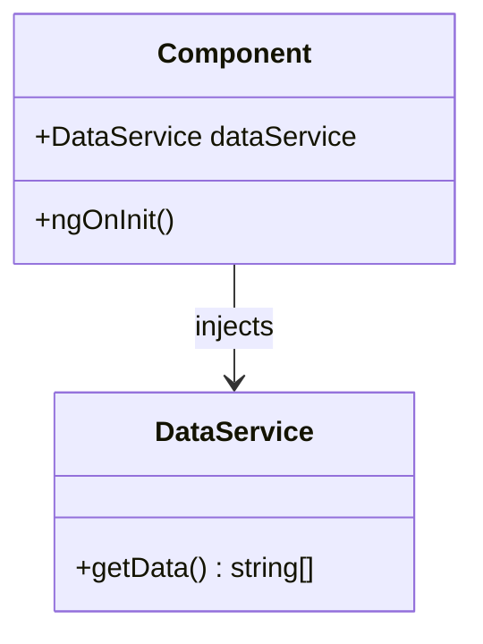
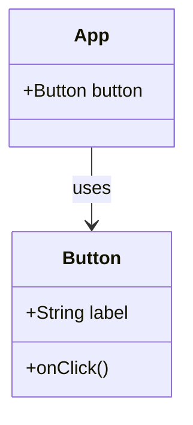

## 10.6 Design Patterns in Web Development Frameworks

In the rapidly evolving landscape of web development, design patterns play a crucial role in creating scalable, maintainable, and robust applications. Web development frameworks like Angular and React have embraced these patterns to address common challenges, streamline development processes, and enhance code quality. By leveraging TypeScript, developers can further harness the power of these patterns, benefiting from type safety and improved productivity.

### The Significance of Design Patterns in Web Frameworks

Design patterns provide a blueprint for solving recurring problems in software design. They offer a shared language for developers to communicate solutions effectively and consistently. In the context of web development frameworks, design patterns help manage complexity, promote code reuse, and ensure that applications are built on solid architectural foundations.

Frameworks like Angular and React incorporate various design patterns to address specific challenges in web development. These patterns are not just theoretical constructs but are embedded in the core of these frameworks, guiding developers in writing efficient and maintainable code.

### Angular and React: Incorporating Design Patterns

Angular and React, two of the most popular web development frameworks, have distinct approaches to incorporating design patterns. Let's explore how each framework leverages these patterns to solve common development problems.

#### Angular: A Comprehensive Framework

Angular is a comprehensive framework that provides a structured approach to building web applications. It incorporates several design patterns, including:

- **Model-View-Controller (MVC)**: Angular's architecture is inspired by the MVC pattern, where the Model represents the application's data, the View displays the data, and the Controller handles the input. Angular's components and services align with this pattern, promoting separation of concerns.

- **Dependency Injection (DI)**: Angular's DI system is a core feature that allows developers to inject dependencies into components and services. This pattern enhances testability and modularity by decoupling the creation of dependencies from their usage.

- **Observer Pattern**: Angular's reactive programming model, powered by RxJS, utilizes the Observer pattern to manage asynchronous data streams. This pattern is essential for handling events and data changes efficiently.

#### React: A Library for Building User Interfaces

React, on the other hand, is a library focused on building user interfaces. It embraces different design patterns, such as:

- **Component-Based Architecture**: React's component-based architecture is a manifestation of the Composite pattern. Components are reusable building blocks that can be composed to create complex UIs.

- **Flux/Redux Architecture**: React applications often use the Flux or Redux pattern for state management. This pattern enforces a unidirectional data flow, making state changes predictable and easier to debug.

- **Higher-Order Components (HOCs)**: React's HOCs are an example of the Decorator pattern. They allow developers to enhance components with additional functionality without modifying the original component.

### Synergy Between TypeScript and Web Frameworks

TypeScript enhances the implementation of design patterns in web frameworks by providing static typing, interfaces, and advanced language features. This synergy results in several benefits:

- **Type Safety**: TypeScript's static typing ensures that design patterns are implemented correctly, reducing runtime errors and improving code reliability.

- **Improved Developer Productivity**: With features like autocompletion and type inference, TypeScript makes it easier for developers to work with complex patterns and large codebases.

- **Enhanced Code Readability and Maintainability**: TypeScript's interfaces and type annotations make code more readable and self-documenting, facilitating collaboration and long-term maintenance.

### Implementing Design Patterns in Angular

Let's delve deeper into how specific design patterns are implemented in Angular, using TypeScript to illustrate these concepts.

#### Dependency Injection in Angular

Angular's DI system is a cornerstone of its architecture. It allows developers to inject services and other dependencies into components, promoting loose coupling and enhancing testability.

```typescript
// service.ts
import { Injectable } from '@angular/core';

@Injectable({
  providedIn: 'root',
})
export class DataService {
  getData() {
    return ['Data 1', 'Data 2', 'Data 3'];
  }
}

// component.ts
import { Component, OnInit } from '@angular/core';
import { DataService } from './service';

@Component({
  selector: 'app-data',
  template: `<ul><li *ngFor="let item of data">{{ item }}</li></ul>`,
})
export class DataComponent implements OnInit {
  data: string[];

  constructor(private dataService: DataService) {}

  ngOnInit() {
    this.data = this.dataService.getData();
  }
}
```

In this example, the `DataService` is injected into the `DataComponent`, demonstrating how Angular's DI system decouples the component from the service, making it easier to test and maintain.

#### Observer Pattern with RxJS

Angular leverages RxJS to implement the Observer pattern, enabling developers to work with asynchronous data streams efficiently.

```typescript
// data.service.ts
import { Injectable } from '@angular/core';
import { Observable, of } from 'rxjs';

@Injectable({
  providedIn: 'root',
})
export class DataService {
  getData(): Observable<string[]> {
    return of(['Data 1', 'Data 2', 'Data 3']);
  }
}

// data.component.ts
import { Component, OnInit } from '@angular/core';
import { DataService } from './data.service';

@Component({
  selector: 'app-data',
  template: `<ul><li *ngFor="let item of data">{{ item }}</li></ul>`,
})
export class DataComponent implements OnInit {
  data: string[];

  constructor(private dataService: DataService) {}

  ngOnInit() {
    this.dataService.getData().subscribe((data) => (this.data = data));
  }
}
```

Here, the `DataService` returns an `Observable`, and the `DataComponent` subscribes to it, updating its data when new data is emitted. This pattern is crucial for handling asynchronous operations in Angular applications.

### Implementing Design Patterns in React

React's approach to design patterns focuses on building reusable components and managing state effectively. Let's explore some patterns commonly used in React applications.

#### Component-Based Architecture

React's component-based architecture is a practical application of the Composite pattern. Components are the building blocks of a React application, and they can be composed to create complex UIs.

```jsx
// Button.js
import React from 'react';

function Button({ label, onClick }) {
  return <button onClick={onClick}>{label}</button>;
}

export default Button;

// App.js
import React from 'react';
import Button from './Button';

function App() {
  const handleClick = () => {
    alert('Button clicked!');
  };

  return (
    <div>
      <h1>Welcome to My App</h1>
      <Button label="Click Me" onClick={handleClick} />
    </div>
  );
}

export default App;
```

In this example, the `Button` component is a reusable piece of UI that can be used in different parts of the application. This modular approach aligns with the Composite pattern, promoting code reuse and maintainability.

#### Flux/Redux Architecture

The Flux and Redux patterns provide a structured approach to state management in React applications. They enforce a unidirectional data flow, making state changes predictable and easier to debug.

```javascript
// actions.js
export const increment = () => ({
  type: 'INCREMENT',
});

// reducer.js
const initialState = { count: 0 };

function counterReducer(state = initialState, action) {
  switch (action.type) {
    case 'INCREMENT':
      return { count: state.count + 1 };
    default:
      return state;
  }
}

export default counterReducer;

// store.js
import { createStore } from 'redux';
import counterReducer from './reducer';

const store = createStore(counterReducer);

export default store;

// App.js
import React from 'react';
import { Provider, useDispatch, useSelector } from 'react-redux';
import store from './store';
import { increment } from './actions';

function Counter() {
  const count = useSelector((state) => state.count);
  const dispatch = useDispatch();

  return (
    <div>
      <p>Count: {count}</p>
      <button onClick={() => dispatch(increment())}>Increment</button>
    </div>
  );
}

function App() {
  return (
    <Provider store={store}>
      <Counter />
    </Provider>
  );
}

export default App;
```

In this example, Redux is used to manage the application's state. The `Counter` component interacts with the Redux store, dispatching actions and selecting state as needed. This architecture promotes a clear separation of concerns and makes state management more predictable.

### Best Practices for Integrating Design Patterns

When integrating design patterns into web development frameworks, consider the following best practices:

- **Understand the Framework's Philosophy**: Each framework has its philosophy and design principles. Understanding these principles will help you choose the right patterns and implement them effectively.

- **Leverage TypeScript's Features**: Use TypeScript's static typing, interfaces, and advanced language features to enhance the implementation of design patterns. This will improve code reliability and maintainability.

- **Promote Reusability and Modularity**: Design patterns should promote code reuse and modularity. Ensure that components and services are reusable and can be easily integrated into different parts of the application.

- **Focus on Testability**: Design patterns should enhance the testability of your code. Use patterns like Dependency Injection to decouple components and make them easier to test.

- **Keep Performance in Mind**: Some design patterns can introduce performance overhead. Be mindful of the performance implications of the patterns you choose and optimize as needed.

### Visualizing Design Patterns in Web Frameworks

To better understand how design patterns are utilized within web frameworks, let's visualize some of these concepts using Mermaid.js diagrams.

#### Angular Dependency Injection



**Description**: This diagram illustrates how Angular's Dependency Injection system works. The `Component` class depends on the `DataService`, which is injected into it, promoting loose coupling and enhancing testability.

#### React Component-Based Architecture



**Description**: This diagram represents React's component-based architecture. The `App` component uses the `Button` component, demonstrating how components are composed to build complex UIs.

### Try It Yourself

To deepen your understanding of these concepts, try modifying the code examples provided:

- **Angular**: Experiment with adding new services and injecting them into different components. Observe how Angular's DI system manages dependencies.

- **React**: Create additional components and integrate them into the `App` component. Try implementing a simple Redux store to manage state across multiple components.

### Knowledge Check

Here are some questions and exercises to reinforce your understanding of design patterns in web development frameworks:

- **Question**: How does Angular's Dependency Injection system enhance testability and modularity?

- **Exercise**: Implement a new service in Angular and inject it into a component. Write a test case to verify the service's functionality.

- **Question**: What are the benefits of using the Flux/Redux pattern in React applications?

- **Exercise**: Create a simple React application with Redux for state management. Implement actions and reducers to manage the application's state.

### Conclusion

Design patterns are integral to the architecture of modern web development frameworks. By understanding how frameworks like Angular and React incorporate these patterns, and leveraging TypeScript to enhance their implementation, developers can build robust, maintainable, and scalable applications. Remember, this is just the beginning. As you progress, you'll discover more patterns and techniques that will further enhance your development skills. Keep experimenting, stay curious, and enjoy the journey!

## Quiz Time!



### How does Angular's Dependency Injection system enhance testability?

- [x] By decoupling components from their dependencies
- [ ] By making components dependent on global variables
- [ ] By forcing components to manage their own dependencies
- [ ] By eliminating the need for services

> **Explanation:** Angular's Dependency Injection system enhances testability by decoupling components from their dependencies, allowing for easier mocking and testing.

### Which design pattern is demonstrated by React's component-based architecture?

- [x] Composite Pattern
- [ ] Singleton Pattern
- [ ] Observer Pattern
- [ ] Factory Pattern

> **Explanation:** React's component-based architecture is an example of the Composite Pattern, where components are composed to create complex UIs.

### What is a key benefit of using TypeScript with design patterns in web frameworks?

- [x] Improved type safety and code reliability
- [ ] Increased runtime errors
- [ ] Reduced code readability
- [ ] Elimination of design patterns

> **Explanation:** TypeScript provides improved type safety and code reliability, making it easier to implement design patterns correctly.

### In the context of React, what is a Higher-Order Component (HOC)?

- [x] A component that enhances another component with additional functionality
- [ ] A component that manages application state
- [ ] A component that handles routing
- [ ] A component that renders UI elements

> **Explanation:** A Higher-Order Component (HOC) in React is a component that enhances another component with additional functionality, similar to the Decorator pattern.

### What pattern does RxJS utilize in Angular for managing asynchronous data streams?

- [x] Observer Pattern
- [ ] Singleton Pattern
- [ ] Factory Pattern
- [ ] Strategy Pattern

> **Explanation:** RxJS utilizes the Observer Pattern in Angular to manage asynchronous data streams, allowing for efficient event handling and data updates.

### Which pattern is commonly used in React applications for state management?

- [x] Flux/Redux Pattern
- [ ] Singleton Pattern
- [ ] Observer Pattern
- [ ] Factory Pattern

> **Explanation:** The Flux/Redux Pattern is commonly used in React applications for state management, enforcing a unidirectional data flow.

### How does TypeScript enhance the implementation of design patterns?

- [x] By providing static typing and interfaces
- [ ] By removing type safety
- [ ] By increasing runtime errors
- [ ] By eliminating the need for patterns

> **Explanation:** TypeScript enhances the implementation of design patterns by providing static typing and interfaces, improving code reliability and maintainability.

### What is the primary benefit of using the Composite Pattern in React?

- [x] Promoting code reuse and modularity
- [ ] Increasing code complexity
- [ ] Reducing code readability
- [ ] Eliminating the need for components

> **Explanation:** The Composite Pattern in React promotes code reuse and modularity by allowing components to be composed to create complex UIs.

### What is a key characteristic of the Flux/Redux pattern?

- [x] Unidirectional data flow
- [ ] Bidirectional data flow
- [ ] Circular data flow
- [ ] Random data flow

> **Explanation:** A key characteristic of the Flux/Redux pattern is its unidirectional data flow, making state changes predictable and easier to debug.

### True or False: TypeScript can help reduce runtime errors when implementing design patterns.

- [x] True
- [ ] False

> **Explanation:** True. TypeScript's static typing and compile-time checks help reduce runtime errors when implementing design patterns.


