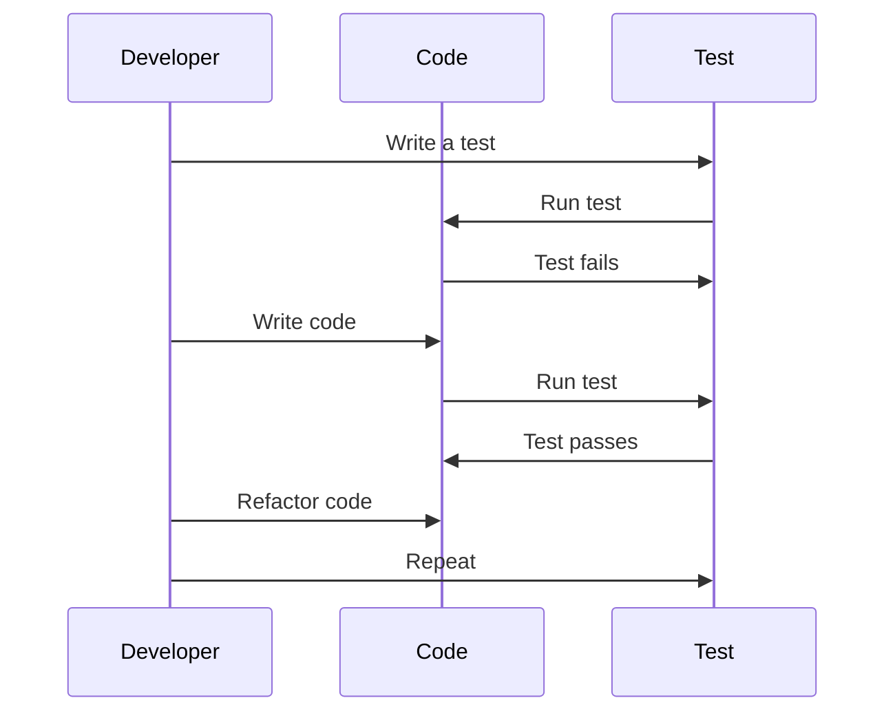

## 11.1 Test-Driven Development (TDD) with Design Patterns

Test-Driven Development (TDD) is a software development process that relies on the repetition of a very short development cycle: first, the developer writes an (initially failing) automated test case that defines a desired improvement or new function, then produces the minimum amount of code to pass that test, and finally refactors the new code to acceptable standards. This approach is particularly powerful when combined with design patterns, as it encourages the creation of robust, maintainable, and well-tested codebases.

### Understanding Test-Driven Development (TDD)

TDD is a practice that emphasizes writing tests before writing the actual code. The main principles of TDD include:

1. **Write a Test**: Start by writing a test for a new function or feature.
2. **Run the Test and See it Fail**: Ensure that the test fails initially, confirming that the feature is not yet implemented.
3. **Write the Minimum Code to Pass the Test**: Implement the simplest solution to make the test pass.
4. **Refactor the Code**: Clean up the code, improving its structure without changing its behavior.
5. **Repeat**: Continue this cycle for each new feature or improvement.

### Relevance of TDD to Design Patterns

Design patterns provide proven solutions to common software design problems. When combined with TDD, they guide the design of software by ensuring that each component is testable and adheres to best practices. TDD encourages developers to think about the design and architecture of their code upfront, promoting the use of patterns that lead to cleaner and more maintainable code.

### Implementing Design Patterns with TDD in TypeScript

Let's explore how TDD can be applied to implement specific design patterns in TypeScript. We will illustrate this with examples of the Singleton and Strategy patterns.

#### Singleton Pattern with TDD

The Singleton pattern ensures that a class has only one instance and provides a global point of access to it. Here's how we can implement it using TDD:

1. **Write a Test for Singleton**

```typescript
import { expect } from 'chai';
import { Singleton } from './Singleton';

describe('Singleton Pattern', () => {
  it('should return the same instance', () => {
    const instance1 = Singleton.getInstance();
    const instance2 = Singleton.getInstance();
    expect(instance1).to.equal(instance2);
  });
});
```

2. **Run the Test and See it Fail**

Run the test using a testing framework like Mocha. It should fail because the `Singleton` class is not yet implemented.

3. **Implement the Singleton Class**

```typescript
export class Singleton {
  private static instance: Singleton;

  private constructor() {}

  public static getInstance(): Singleton {
    if (!Singleton.instance) {
      Singleton.instance = new Singleton();
    }
    return Singleton.instance;
  }
}
```

4. **Refactor the Code**

Ensure that the code adheres to best practices and is clean. In this case, the Singleton implementation is already quite simple, but you might consider adding comments or additional methods if necessary.

#### Strategy Pattern with TDD

The Strategy pattern defines a family of algorithms, encapsulates each one, and makes them interchangeable. Here's how to implement it using TDD:

1. **Write a Test for Strategy Pattern**

```typescript
import { expect } from 'chai';
import { Context, ConcreteStrategyA, ConcreteStrategyB } from './Strategy';

describe('Strategy Pattern', () => {
  it('should execute strategy A', () => {
    const context = new Context(new ConcreteStrategyA());
    expect(context.executeStrategy()).to.equal('Strategy A');
  });

  it('should execute strategy B', () => {
    const context = new Context(new ConcreteStrategyB());
    expect(context.executeStrategy()).to.equal('Strategy B');
  });
});
```

2. **Run the Test and See it Fail**

Run the test suite. The tests should fail because the `Context` and strategy classes are not yet implemented.

3. **Implement the Strategy Pattern**

```typescript
interface Strategy {
  execute(): string;
}

export class ConcreteStrategyA implements Strategy {
  execute(): string {
    return 'Strategy A';
  }
}

export class ConcreteStrategyB implements Strategy {
  execute(): string {
    return 'Strategy B';
  }
}

export class Context {
  private strategy: Strategy;

  constructor(strategy: Strategy) {
    this.strategy = strategy;
  }

  public setStrategy(strategy: Strategy) {
    this.strategy = strategy;
  }

  public executeStrategy(): string {
    return this.strategy.execute();
  }
}
```

4. **Refactor the Code**

Review the implementation to ensure it is clean and follows best practices. Consider adding comments or additional methods as needed.

### The TDD Cycle in Pattern Implementation

The TDD cycle is particularly effective when implementing design patterns. It ensures that each component is testable and adheres to best practices. Here's a visual representation of the TDD cycle:



### Benefits of Using TDD with Design Patterns

1. **Improved Code Quality**: TDD ensures that code is thoroughly tested, leading to fewer bugs and higher quality.
2. **Easier Refactoring**: With a comprehensive suite of tests, developers can refactor code with confidence, knowing that any issues will be caught by the tests.
3. **Better Design**: TDD encourages developers to think about the design and architecture of their code upfront, leading to cleaner and more maintainable code.
4. **Documentation**: Tests serve as documentation, providing a clear understanding of how the code is expected to behave.

### Challenges and Solutions

1. **Complex Patterns**: Some patterns can be complex to implement with TDD. Break down the pattern into smaller components and test each one individually.
2. **Test Maintenance**: As the codebase grows, maintaining tests can become challenging. Regularly review and refactor tests to ensure they remain relevant and efficient.
3. **Initial Learning Curve**: TDD can be challenging to learn initially. Start with simple patterns and gradually work up to more complex ones.

### Try It Yourself

Encourage experimentation by suggesting modifications to the code examples. For instance, try implementing additional strategies for the Strategy pattern or adding new methods to the Singleton class.

### Knowledge Check

Pose questions or small challenges within the text to engage readers. For example, ask readers to implement a new design pattern using TDD or refactor an existing pattern to improve its testability.

### Embrace the Journey

Remember, this is just the beginning. As you progress, you'll build more complex and interactive applications using TDD and design patterns. Keep experimenting, stay curious, and enjoy the journey!

## Quiz Time!



### What is the first step in the TDD cycle?

- [x] Write a test
- [ ] Write the code
- [ ] Refactor the code
- [ ] Run the test

> **Explanation:** The first step in the TDD cycle is to write a test for the new feature or function.

### What is the primary benefit of using TDD with design patterns?

- [x] Improved code quality
- [ ] Faster development
- [ ] Reduced testing time
- [ ] Simplified code

> **Explanation:** TDD ensures that code is thoroughly tested, leading to improved code quality.

### In the TDD cycle, what should happen after writing a test?

- [x] Run the test and see it fail
- [ ] Write the code to pass the test
- [ ] Refactor the code
- [ ] Run the test and see it pass

> **Explanation:** After writing a test, you should run it to ensure it fails, confirming that the feature is not yet implemented.

### How does TDD encourage better design?

- [x] By promoting upfront thinking about design and architecture
- [ ] By reducing the need for documentation
- [ ] By speeding up development
- [ ] By simplifying code

> **Explanation:** TDD encourages developers to think about the design and architecture of their code upfront, leading to cleaner and more maintainable code.

### What is a potential challenge when applying TDD to complex patterns?

- [x] Complexity of implementation
- [ ] Lack of documentation
- [ ] Increased development time
- [ ] Reduced code quality

> **Explanation:** Some patterns can be complex to implement with TDD, requiring a breakdown into smaller components.

### How can tests serve as documentation?

- [x] By providing a clear understanding of expected behavior
- [ ] By reducing the need for comments
- [ ] By simplifying code
- [ ] By speeding up development

> **Explanation:** Tests serve as documentation by providing a clear understanding of how the code is expected to behave.

### What should you do if a test fails in the TDD cycle?

- [x] Write the minimum code to pass the test
- [ ] Refactor the code
- [ ] Write a new test
- [ ] Ignore the failure

> **Explanation:** If a test fails, you should write the minimum code necessary to pass the test.

### What is the role of refactoring in the TDD cycle?

- [x] To improve code structure without changing behavior
- [ ] To add new features
- [ ] To write new tests
- [ ] To speed up development

> **Explanation:** Refactoring is done to improve the code structure without changing its behavior.

### How can TDD make refactoring easier?

- [x] By providing a comprehensive suite of tests
- [ ] By reducing the need for documentation
- [ ] By simplifying code
- [ ] By speeding up development

> **Explanation:** With a comprehensive suite of tests, developers can refactor code with confidence, knowing that any issues will be caught by the tests.

### True or False: TDD eliminates the need for code documentation.

- [ ] True
- [x] False

> **Explanation:** While TDD provides tests that serve as documentation, it does not eliminate the need for code documentation.


