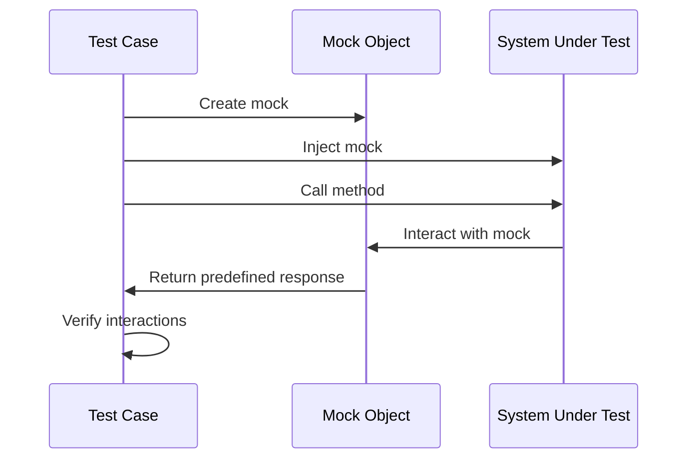

## 11.2 Mocking and Stubs in Pattern Implementation

In the world of software engineering, especially when dealing with complex systems and design patterns, testing becomes a crucial aspect of development. Mocking and stubbing are indispensable techniques that allow developers to isolate tests, ensuring that each unit of code is tested effectively without being affected by external dependencies. In this section, we will delve into the concepts of mocks, stubs, and test doubles, explore their implementation in TypeScript using popular testing frameworks, and discuss best practices for maintaining robust test suites.

### Understanding Mocks, Stubs, and Test Doubles

Before we dive into the implementation details, let's clarify the concepts of mocks, stubs, and test doubles, as they are often used interchangeably but serve distinct purposes in testing.

#### Mocks

Mocks are objects that simulate the behavior of real objects. They are used to verify interactions between objects, ensuring that certain methods are called with specific arguments. Mocks are particularly useful when you want to test the behavior of a system rather than its state.

#### Stubs

Stubs are simplified implementations of an interface or class that return predefined responses to method calls. They are used to isolate the unit of code being tested by providing controlled responses, allowing you to test the code's logic without external dependencies.

#### Test Doubles

Test doubles is a generic term that encompasses both mocks and stubs, as well as other types of test substitutes like fakes and spies. They are used to replace real components in a system for testing purposes.

### The Importance of Isolation in Unit Testing

Isolation is a fundamental principle in unit testing. It ensures that tests are independent and can be executed without relying on external systems or components. This is particularly important when design patterns introduce dependencies, as it allows you to test each component in isolation, ensuring that the tests are reliable and repeatable.

### Implementing Mocking and Stubbing in TypeScript

TypeScript, with its strong typing and modern features, is well-suited for implementing mocking and stubbing. Let's explore how to use popular testing frameworks like Jest, Mocha, and Jasmine to achieve this.

#### Using Jest for Mocking and Stubbing

Jest is a popular testing framework that provides built-in support for mocking and stubbing. It offers a simple API for creating mocks and spies, making it easy to test interactions and isolate dependencies.

```typescript
// Example of using Jest to mock a module
import { fetchData } from './dataService';
import { processData } from './dataProcessor';

// Mock the fetchData function
jest.mock('./dataService', () => ({
  fetchData: jest.fn(() => Promise.resolve({ data: 'mocked data' })),
}));

test('processData should process mocked data', async () => {
  const result = await processData();
  expect(result).toBe('processed mocked data');
  expect(fetchData).toHaveBeenCalled();
});
```

In this example, we mock the `fetchData` function to return a predefined response, allowing us to test the `processData` function in isolation.

#### Using Mocha and Sinon for Mocking and Stubbing

Mocha is a flexible testing framework that can be paired with Sinon, a library for creating spies, mocks, and stubs.

```typescript
// Example of using Mocha and Sinon to stub a function
import { expect } from 'chai';
import sinon from 'sinon';
import { fetchData } from './dataService';
import { processData } from './dataProcessor';

describe('processData', () => {
  it('should process stubbed data', async () => {
    const stub = sinon.stub(fetchData, 'fetchData').resolves({ data: 'stubbed data' });

    const result = await processData();
    expect(result).to.equal('processed stubbed data');
    expect(stub.calledOnce).to.be.true;

    stub.restore();
  });
});
```

Here, we use Sinon to stub the `fetchData` function, allowing us to control its behavior during the test.

#### Using Jasmine for Mocking and Stubbing

Jasmine is another popular testing framework that provides support for spies and mocks.

```typescript
// Example of using Jasmine to spy on a method
import { fetchData } from './dataService';
import { processData } from './dataProcessor';

describe('processData', () => {
  it('should process spied data', async () => {
    spyOn(fetchData, 'fetchData').and.returnValue(Promise.resolve({ data: 'spied data' }));

    const result = await processData();
    expect(result).toBe('processed spied data');
    expect(fetchData.fetchData).toHaveBeenCalled();
  });
});
```

In this example, we use Jasmine's `spyOn` function to create a spy on the `fetchData` method, allowing us to verify that it was called during the test.

### Mocking External Services or Modules in Design Patterns

Design patterns often involve interactions with external services or modules. Let's explore how to mock these interactions in the context of specific design patterns.

#### Mocking in the Repository Pattern

The Repository Pattern is commonly used to abstract data access logic. When testing components that use this pattern, it's essential to mock the repository to isolate the tests.

```typescript
// Example of mocking a repository in the Repository Pattern
class UserRepository {
  getUserById(id: number): Promise<User> {
    // Simulate database access
    return Promise.resolve({ id, name: 'John Doe' });
  }
}

class UserService {
  constructor(private userRepository: UserRepository) {}

  async getUserName(id: number): Promise<string> {
    const user = await this.userRepository.getUserById(id);
    return user.name;
  }
}

// Test
import { UserRepository } from './userRepository';
import { UserService } from './userService';

jest.mock('./userRepository');

test('getUserName should return mocked user name', async () => {
  const mockUserRepository = new UserRepository() as jest.Mocked<UserRepository>;
  mockUserRepository.getUserById.mockResolvedValue({ id: 1, name: 'Mocked User' });

  const userService = new UserService(mockUserRepository);
  const userName = await userService.getUserName(1);

  expect(userName).toBe('Mocked User');
});
```

In this example, we mock the `UserRepository` to return a predefined user, allowing us to test the `UserService` in isolation.

#### Mocking in the Singleton Pattern

The Singleton Pattern ensures a class has only one instance. When testing components that depend on a singleton, it's important to mock the singleton instance to control its behavior.

```typescript
// Example of mocking a singleton in the Singleton Pattern
class Logger {
  private static instance: Logger;

  private constructor() {}

  static getInstance(): Logger {
    if (!Logger.instance) {
      Logger.instance = new Logger();
    }
    return Logger.instance;
  }

  log(message: string): void {
    console.log(message);
  }
}

// Test
import { Logger } from './logger';

jest.mock('./logger');

test('should mock singleton logger', () => {
  const mockLogger = Logger.getInstance() as jest.Mocked<Logger>;
  mockLogger.log.mockImplementation(() => {});

  const logger = Logger.getInstance();
  logger.log('Test message');

  expect(mockLogger.log).toHaveBeenCalledWith('Test message');
});
```

Here, we mock the `Logger` singleton to verify that the `log` method is called with the expected message.

### Using Dependency Injection to Facilitate Mocking

Dependency Injection (DI) is a design pattern that facilitates mocking by allowing dependencies to be injected into a component. This makes it easier to replace real dependencies with mocks or stubs during testing.

```typescript
// Example of using Dependency Injection for mocking
class EmailService {
  sendEmail(to: string, message: string): void {
    // Simulate sending email
  }
}

class NotificationService {
  constructor(private emailService: EmailService) {}

  notifyUser(userId: number, message: string): void {
    // Simulate user notification
    this.emailService.sendEmail(`user${userId}@example.com`, message);
  }
}

// Test
import { EmailService } from './emailService';
import { NotificationService } from './notificationService';

jest.mock('./emailService');

test('should mock email service in notification', () => {
  const mockEmailService = new EmailService() as jest.Mocked<EmailService>;
  mockEmailService.sendEmail.mockImplementation(() => {});

  const notificationService = new NotificationService(mockEmailService);
  notificationService.notifyUser(1, 'Hello User');

  expect(mockEmailService.sendEmail).toHaveBeenCalledWith('user1@example.com', 'Hello User');
});
```

In this example, we use DI to inject a mocked `EmailService` into the `NotificationService`, allowing us to verify that the `sendEmail` method is called with the correct arguments.

### Best Practices for Clear and Maintainable Test Code

When using mocks and stubs, it's important to maintain clear and maintainable test code. Here are some best practices to consider:

1. **Use Descriptive Names**: Use descriptive names for mocks and stubs to clearly indicate their purpose.

2. **Keep Tests Focused**: Ensure each test focuses on a single aspect of the code, avoiding unnecessary complexity.

3. **Avoid Over-Mocking**: Avoid over-reliance on mocks, as this can lead to brittle tests that break with implementation changes.

4. **Document Test Behavior**: Use comments to document the behavior being tested and the purpose of each mock or stub.

5. **Use Setup and Teardown**: Use setup and teardown functions to initialize and clean up mocks, ensuring tests are independent and repeatable.

### Common Pitfalls and How to Avoid Them

While mocking and stubbing are powerful techniques, there are common pitfalls to be aware of:

- **Over-Reliance on Mocks**: Over-reliance on mocks can lead to tests that are tightly coupled to the implementation, making them brittle and difficult to maintain. Focus on testing behavior rather than implementation details.

- **Ignoring Test Coverage**: Ensure that your tests cover all possible scenarios, including edge cases and error handling.

- **Neglecting Integration Tests**: While unit tests are important, don't neglect integration tests that verify the interaction between components.

- **Mocking Too Much**: Mocking too many dependencies can lead to tests that don't reflect real-world scenarios. Use real implementations when possible.

### Try It Yourself

To reinforce your understanding of mocking and stubbing, try modifying the provided code examples. Experiment with different scenarios, such as changing the behavior of mocks, adding new test cases, or using different testing frameworks. This hands-on approach will help solidify your understanding of these essential testing techniques.

### Visualizing Mocking and Stubbing

To better understand the flow of mocking and stubbing in tests, let's visualize the process using a sequence diagram.



This diagram illustrates how a test case creates a mock object, injects it into the system under test, and verifies interactions with the mock.

### References and Links

For further reading on mocking and stubbing, consider the following resources:

- [Jest Documentation](https://jestjs.io/docs/en/mock-functions)
- [Sinon.js Documentation](https://sinonjs.org/releases/latest/)
- [Jasmine Documentation](https://jasmine.github.io/tutorials/your_first_suite)

### Knowledge Check

To ensure you've grasped the concepts covered in this section, consider the following questions:

- What is the difference between a mock and a stub?
- Why is isolation important in unit testing?
- How can dependency injection facilitate mocking in tests?
- What are some best practices for maintaining clear and maintainable test code?

### Embrace the Journey

Remember, mastering mocking and stubbing is a journey. As you progress, you'll become more adept at writing effective tests that ensure the reliability and maintainability of your code. Keep experimenting, stay curious, and enjoy the journey!

## Quiz Time!



### What is the primary purpose of a mock object in testing?

- [x] To verify interactions between objects
- [ ] To replace a real object with a simplified version
- [ ] To simulate a database
- [ ] To generate random data

> **Explanation:** Mocks are used to verify interactions between objects, ensuring that certain methods are called with specific arguments.

### What is a stub used for in testing?

- [ ] To verify interactions between objects
- [x] To return predefined responses to method calls
- [ ] To simulate user input
- [ ] To generate random data

> **Explanation:** Stubs are used to return predefined responses, allowing you to test code logic without external dependencies.

### Which of the following is a common pitfall when using mocks?

- [ ] Using descriptive names for mocks
- [x] Over-reliance on mocks leading to brittle tests
- [ ] Documenting test behavior
- [ ] Using setup and teardown functions

> **Explanation:** Over-reliance on mocks can lead to brittle tests that break with implementation changes.

### How does dependency injection facilitate mocking?

- [x] By allowing dependencies to be injected, making it easier to replace them with mocks
- [ ] By automatically generating mock objects
- [ ] By verifying interactions between objects
- [ ] By simplifying test setup

> **Explanation:** Dependency injection allows dependencies to be injected into a component, making it easier to replace them with mocks during testing.

### Which testing framework provides built-in support for mocking and stubbing?

- [x] Jest
- [ ] Mocha
- [ ] Jasmine
- [ ] Sinon

> **Explanation:** Jest provides built-in support for mocking and stubbing, making it easy to test interactions and isolate dependencies.

### What is the term for a generic substitute used in testing?

- [ ] Mock
- [ ] Stub
- [x] Test Double
- [ ] Spy

> **Explanation:** Test doubles is a generic term that encompasses mocks, stubs, and other types of test substitutes.

### What is a key benefit of using stubs in testing?

- [ ] To verify interactions between objects
- [x] To isolate the unit of code being tested
- [ ] To simulate user input
- [ ] To generate random data

> **Explanation:** Stubs are used to isolate the unit of code being tested by providing controlled responses.

### Which of the following is a best practice for maintaining clear and maintainable test code?

- [x] Use descriptive names for mocks and stubs
- [ ] Mock all dependencies
- [ ] Ignore test coverage
- [ ] Neglect integration tests

> **Explanation:** Using descriptive names for mocks and stubs helps maintain clear and maintainable test code.

### What is the main advantage of using dependency injection in testing?

- [ ] It automatically generates mock objects
- [x] It allows for easy replacement of real dependencies with mocks
- [ ] It simplifies test setup
- [ ] It verifies interactions between objects

> **Explanation:** Dependency injection allows for easy replacement of real dependencies with mocks, facilitating testing.

### True or False: Mocks and stubs are interchangeable terms.

- [ ] True
- [x] False

> **Explanation:** Mocks and stubs serve different purposes in testing. Mocks are used to verify interactions, while stubs return predefined responses.


