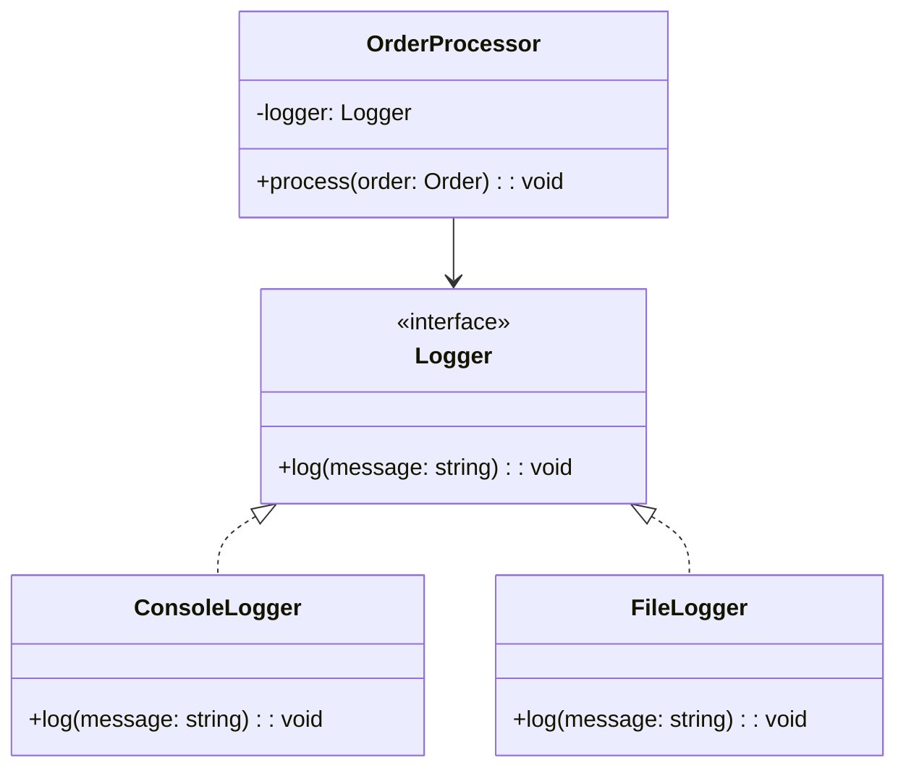

## 11.3 Design for Testability

Designing for testability is a crucial aspect of software development that ensures your code is easy to test and maintain. In TypeScript, leveraging design patterns and principles like SOLID can significantly enhance the testability of your applications. This section explores the concept of testability, its importance, and how to implement it effectively using TypeScript.

### Understanding Testability

**Testability** refers to the degree to which a software artifact (e.g., a system, module, or component) supports testing in a given test context. High testability means that the software is easy to test, which often translates to easier maintenance and higher quality code.

#### Why is Testability Important?

1. **Early Bug Detection**: Testable code allows for more comprehensive testing, which helps in identifying bugs early in the development process.
2. **Facilitates Refactoring**: When code is testable, it can be refactored with confidence, knowing that tests will catch any regressions.
3. **Improves Code Quality**: Testable code often adheres to good design principles, leading to cleaner, more maintainable code.
4. **Enhances Collaboration**: With well-defined tests, team members can understand and modify code more easily, facilitating better collaboration.

### Design Patterns and Testability

Design patterns can either enhance or hinder testability, depending on their implementation. Let's explore how different patterns impact testability and how to apply them effectively in TypeScript.

#### Enhancing Testability with Design Patterns

1. **Factory Method Pattern**: By using factories, you can create objects without specifying the exact class of object that will be created. This decouples the code and makes it easier to test by allowing mock objects to be injected.

   ```typescript
   interface Product {
       operation(): string;
   }

   class ConcreteProductA implements Product {
       operation(): string {
           return 'Result of ConcreteProductA';
       }
   }

   class ConcreteProductB implements Product {
       operation(): string {
           return 'Result of ConcreteProductB';
       }
   }

   abstract class Creator {
       abstract factoryMethod(): Product;

       someOperation(): string {
           const product = this.factoryMethod();
           return `Creator: The same creator's code has just worked with ${product.operation()}`;
       }
   }

   class ConcreteCreatorA extends Creator {
       factoryMethod(): Product {
           return new ConcreteProductA();
       }
   }

   class ConcreteCreatorB extends Creator {
       factoryMethod(): Product {
           return new ConcreteProductB();
       }
   }

   // Testability: You can easily mock the factory method to return a mock product.
   ```

2. **Strategy Pattern**: This pattern defines a family of algorithms, encapsulates each one, and makes them interchangeable. It allows the algorithm to vary independently from clients that use it, which enhances testability by allowing different strategies to be tested in isolation.

   ```typescript
   interface Strategy {
       execute(data: string[]): string;
   }

   class ConcreteStrategyA implements Strategy {
       execute(data: string[]): string {
           return data.sort().join(', ');
       }
   }

   class ConcreteStrategyB implements Strategy {
       execute(data: string[]): string {
           return data.reverse().join(', ');
       }
   }

   class Context {
       private strategy: Strategy;

       constructor(strategy: Strategy) {
           this.strategy = strategy;
       }

       setStrategy(strategy: Strategy) {
           this.strategy = strategy;
       }

       executeStrategy(data: string[]): string {
           return this.strategy.execute(data);
       }
   }

   // Testability: Strategies can be mocked or replaced with test doubles.
   ```

#### Patterns That May Hinder Testability

1. **Singleton Pattern**: While useful, singletons can make testing difficult as they introduce global state, which can lead to tests affecting each other. Consider using dependency injection to manage instances instead.

2. **Static Methods**: Static methods are hard to mock and test because they cannot be overridden. Prefer instance methods and use dependency injection to enhance testability.

### Guidelines for Writing Testable Code

1. **Keep Methods Small and Focused**: Break down complex methods into smaller, focused ones that do one thing well. This makes them easier to test and understand.

2. **Use Interfaces and Abstractions**: Decouple your code using interfaces and abstractions. This allows you to swap out implementations easily, facilitating testing with mocks or stubs.

   ```typescript
   interface Logger {
       log(message: string): void;
   }

   class ConsoleLogger implements Logger {
       log(message: string): void {
           console.log(message);
       }
   }

   class FileLogger implements Logger {
       log(message: string): void {
           // Write to a file
       }
   }

   class Application {
       constructor(private logger: Logger) {}

       run(): void {
           this.logger.log('Application is running');
       }
   }

   // Testability: You can inject a mock logger for testing purposes.
   ```

3. **Avoid Static and Singleton Instances**: Where appropriate, avoid static methods and singletons. Use dependency injection to manage dependencies, which makes it easier to replace them with test doubles.

4. **Write Tests Alongside Code Development**: Adopt a test-driven development (TDD) approach where possible. Writing tests alongside code development helps identify testability issues early.

5. **Leverage TypeScript Features**: Use TypeScript's type inference, interfaces, and other features to write more robust and testable code.

### Refactoring for Testability

Refactoring is a key practice in improving testability. Let's look at an example of refactoring code to enhance its testability.

#### Before Refactoring

```typescript
class OrderProcessor {
    process(order: Order): void {
        // Directly uses a concrete implementation
        const logger = new ConsoleLogger();
        logger.log(`Processing order: ${order.id}`);
        // Process the order...
    }
}
```

#### After Refactoring

```typescript
class OrderProcessor {
    constructor(private logger: Logger) {}

    process(order: Order): void {
        this.logger.log(`Processing order: ${order.id}`);
        // Process the order...
    }
}

// Testability: The logger can now be mocked, allowing for isolated testing of the OrderProcessor.
```

### SOLID Principles and Testability

The SOLID principles are a set of design principles that, when applied, can greatly enhance the testability of your code.

1. **Single Responsibility Principle (SRP)**: Ensure that a class has only one reason to change. This makes it easier to test, as each class has a single focus.

2. **Open/Closed Principle (OCP)**: Design your classes to be open for extension but closed for modification. This allows you to extend functionality without altering existing code, which can be tested independently.

3. **Liskov Substitution Principle (LSP)**: Subtypes must be substitutable for their base types. This ensures that tests written for base types will also work for derived types.

4. **Interface Segregation Principle (ISP)**: Prefer small, client-specific interfaces over large, general-purpose ones. This reduces the impact of changes and makes testing easier.

5. **Dependency Inversion Principle (DIP)**: Depend on abstractions, not on concrete implementations. This allows for easier testing by enabling the use of mock objects.

### Tools and Techniques in TypeScript

TypeScript offers several tools and techniques that aid in designing for testability:

1. **Type Inference**: TypeScript's type inference can help catch errors early, making your code more robust and testable.

2. **Interfaces**: Use interfaces to define contracts for your components. This allows for easy swapping of implementations during testing.

3. **Mocking Frameworks**: Use frameworks like `jest` or `sinon` to create mocks and spies, which can help isolate tests and verify interactions.

4. **Dependency Injection Libraries**: Libraries like `InversifyJS` can help manage dependencies and enhance testability by allowing easy injection of test doubles.

### Encouraging Testability in Development

To ensure your code is testable, consider the following practices:

1. **Adopt Test-Driven Development (TDD)**: Write tests before writing the actual code. This ensures that your code is designed with testability in mind from the start.

2. **Continuous Integration**: Use CI tools to run tests automatically on each commit, ensuring that your code remains testable and free of regressions.

3. **Code Reviews**: Incorporate testability considerations into your code review process. Encourage feedback on how to improve testability.

4. **Refactor Regularly**: Regularly refactor your code to improve its structure and testability. Use tests to ensure that refactoring does not introduce regressions.

### Try It Yourself

Experiment with the code examples provided by modifying them to test different scenarios. For instance, try creating a mock logger that simulates logging to a database and see how it affects the testability of the `OrderProcessor` class.

### Visualizing Testability

Below is a class diagram illustrating how using interfaces and dependency injection can enhance testability by decoupling components.



**Diagram Description**: This diagram shows the `OrderProcessor` class depending on the `Logger` interface, which is implemented by `ConsoleLogger` and `FileLogger`. This setup allows for easy swapping of logger implementations, enhancing testability.

### Knowledge Check

- How does the Factory Method pattern enhance testability?
- Why should static methods be avoided when designing for testability?
- What role do interfaces play in improving testability?
- How can the SOLID principles contribute to more testable code?
- What are some tools and techniques in TypeScript that aid in designing for testability?

### Conclusion

Designing for testability is an essential practice that leads to higher quality, more maintainable code. By applying design patterns thoughtfully, adhering to SOLID principles, and leveraging TypeScript's features, you can create applications that are not only robust and scalable but also easy to test. Remember, testability is a journey, not a destination. Keep refining your skills, experimenting with new techniques, and embracing the challenges that come your way.

## Quiz Time!



### How does the Factory Method pattern enhance testability?

- [x] By allowing mock objects to be injected
- [ ] By enforcing the use of static methods
- [ ] By increasing the complexity of code
- [ ] By making code less flexible

> **Explanation:** The Factory Method pattern enhances testability by allowing mock objects to be injected, which decouples the code and makes it easier to test.

### Why should static methods be avoided when designing for testability?

- [x] They are hard to mock and test
- [ ] They are too flexible
- [ ] They increase code readability
- [ ] They simplify code structure

> **Explanation:** Static methods should be avoided because they are hard to mock and test, as they cannot be overridden.

### What role do interfaces play in improving testability?

- [x] They allow for easy swapping of implementations
- [ ] They enforce the use of singletons
- [ ] They increase code coupling
- [ ] They restrict code flexibility

> **Explanation:** Interfaces improve testability by allowing for easy swapping of implementations, which facilitates testing with mocks or stubs.

### How can the SOLID principles contribute to more testable code?

- [x] By promoting good design practices
- [ ] By enforcing the use of global state
- [ ] By increasing code complexity
- [ ] By reducing code readability

> **Explanation:** The SOLID principles contribute to more testable code by promoting good design practices that lead to cleaner, more maintainable code.

### What are some tools and techniques in TypeScript that aid in designing for testability?

- [x] Type Inference and Interfaces
- [ ] Static Methods and Singletons
- [ ] Global Variables and Magic Numbers
- [ ] Hard-Coded Values and Static Imports

> **Explanation:** Type Inference and Interfaces are tools and techniques in TypeScript that aid in designing for testability by making code more robust and flexible.

### What is a key benefit of using dependency injection?

- [x] It allows for easy injection of test doubles
- [ ] It enforces the use of static methods
- [ ] It increases code coupling
- [ ] It simplifies code structure

> **Explanation:** Dependency injection allows for easy injection of test doubles, which enhances testability by decoupling components.

### How does the Strategy pattern enhance testability?

- [x] By allowing different strategies to be tested in isolation
- [ ] By enforcing the use of global state
- [ ] By increasing code complexity
- [ ] By reducing code flexibility

> **Explanation:** The Strategy pattern enhances testability by allowing different strategies to be tested in isolation, which makes testing more straightforward.

### What is the impact of the Single Responsibility Principle on testability?

- [x] It makes classes easier to test by giving them a single focus
- [ ] It increases the complexity of classes
- [ ] It reduces code readability
- [ ] It enforces the use of static methods

> **Explanation:** The Single Responsibility Principle makes classes easier to test by giving them a single focus, which simplifies testing.

### How does the Dependency Inversion Principle contribute to testability?

- [x] By allowing for dependency injection and mocking
- [ ] By enforcing the use of concrete implementations
- [ ] By increasing code coupling
- [ ] By reducing code flexibility

> **Explanation:** The Dependency Inversion Principle contributes to testability by allowing for dependency injection and mocking, which decouples components and facilitates testing.

### True or False: Writing tests alongside code development helps identify testability issues early.

- [x] True
- [ ] False

> **Explanation:** Writing tests alongside code development helps identify testability issues early, ensuring that code is designed with testability in mind from the start.


