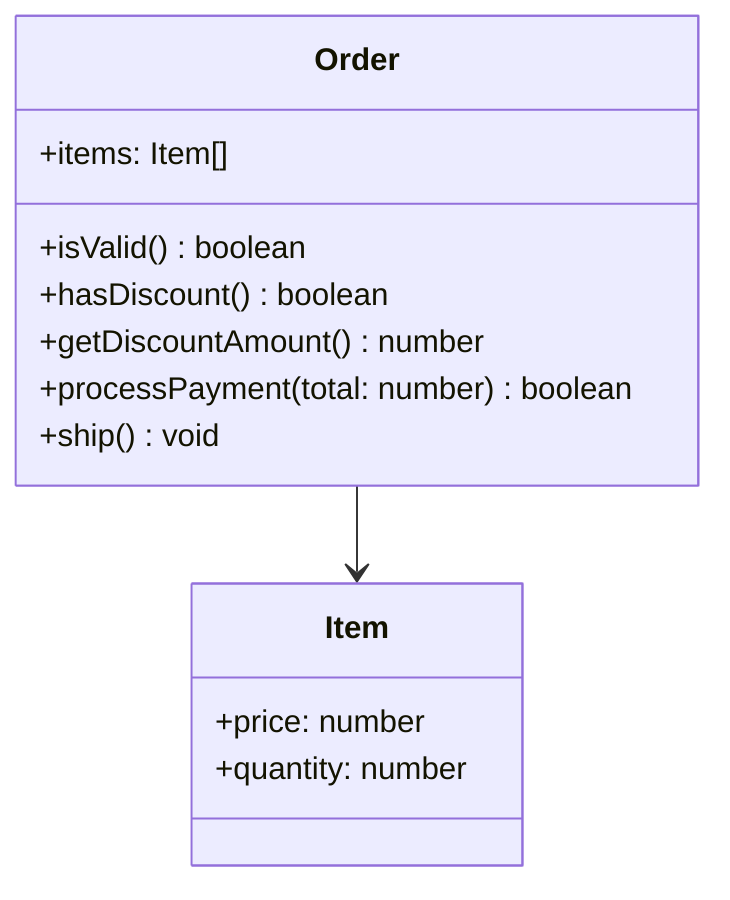

## 11.4.1 Identifying Refactoring Opportunities

Refactoring is a critical practice in software development that involves restructuring existing code without changing its external behavior. The goal is to improve the code's internal structure, making it easier to understand, maintain, and extend. In this section, we'll explore how to identify refactoring opportunities in TypeScript by recognizing code smells and anti-patterns, using tools for analysis, and applying design patterns to enhance code quality.

### Understanding Code Smells and Anti-Patterns

Code smells are indicators of potential problems in the codebase. They are not bugs but rather symptoms of deeper issues that could lead to maintenance challenges. Anti-patterns, on the other hand, are common but ineffective solutions to recurring problems. Let's delve into some common code smells and anti-patterns:

#### Common Code Smells

1. **Duplicated Code**: Repeated code blocks across the codebase can lead to inconsistencies and increased maintenance efforts. If a change is required, it must be applied to all instances, increasing the risk of errors.

2. **Long Methods**: Methods that are excessively long can be difficult to understand and test. They often try to do too much, violating the Single Responsibility Principle.

3. **Large Classes**: Classes that have too many responsibilities become hard to manage and understand. They often indicate a need for decomposition into smaller, more focused classes.

4. **Tight Coupling**: When classes are highly dependent on each other, changes in one class can have a ripple effect, leading to fragile code.

5. **Feature Envy**: A method that seems more interested in the data of another class than its own indicates a misplaced responsibility.

6. **Data Clumps**: Groups of data that are often passed together suggest they should be encapsulated within a class.

7. **Primitive Obsession**: Overuse of primitive data types instead of small objects for simple tasks can lead to code that is hard to understand and extend.

8. **Switch Statements**: Frequent use of switch statements can indicate a need for polymorphism or a strategy pattern.

9. **Speculative Generality**: Code that is overly generalized without a current need can lead to unnecessary complexity.

10. **Temporary Field**: Fields that are only used in certain circumstances can indicate that a class is trying to do too much.

#### Common Anti-Patterns

1. **Spaghetti Code**: Code with a complex and tangled control structure, making it hard to follow and maintain.

2. **Golden Hammer**: Over-reliance on a familiar solution for every problem, regardless of its appropriateness.

3. **Lava Flow**: Retaining outdated or dead code that serves no purpose but clutters the codebase.

4. **God Object**: A class that knows too much or does too much, violating the principle of encapsulation.

5. **Premature Optimization**: Focusing on optimization before it's necessary, often leading to complex and unreadable code.

6. **Copy-Paste Programming**: Duplicating code instead of creating reusable components, leading to maintenance nightmares.

7. **Magic Numbers and Strings**: Using literals without explanation, making the code hard to understand and modify.

8. **Hard Coding**: Embedding configuration data directly in code, reducing flexibility and reusability.

9. **Overusing Any Type**: Losing type safety by overusing the `any` type, which can lead to runtime errors.

10. **Ignoring TypeScript Compiler Errors**: Suppressing errors instead of fixing them, leading to potential bugs.

### Analyzing Code for Refactoring Opportunities

To effectively identify refactoring opportunities, we need to analyze the codebase systematically. Here are some techniques and tools that can assist in this process:

#### Code Review

Engage in regular code reviews to identify areas for improvement. Code reviews provide an opportunity for team members to share insights and suggest refactoring opportunities. Encourage a mindset of continuous improvement and collaboration.

#### Static Code Analysis

Utilize static analysis tools to detect code smells and anti-patterns. Tools like ESLint, TSLint, and SonarQube can automatically analyze your codebase and highlight potential issues.

#### Cyclomatic Complexity

Measure the cyclomatic complexity of your code to identify complex methods that may need refactoring. High complexity indicates that a method has too many decision points, making it hard to test and maintain.

#### Code Metrics

Use code metrics to assess the health of your codebase. Metrics such as lines of code, method length, and class size can help pinpoint areas that may require refactoring.

#### Visualizing Dependencies

Use tools to visualize dependencies between classes and modules. This can help identify tight coupling and areas where design patterns like Dependency Injection could be beneficial.

#### Continuous Integration

Integrate static analysis tools into your CI/CD pipeline to ensure that code quality is continuously monitored and maintained.

### Tools for Detecting Code Smells

Several tools can assist in detecting code smells and suggesting refactoring opportunities. Here are a few popular ones:

- **ESLint**: A widely used linter for JavaScript and TypeScript that helps identify problematic patterns and enforce coding standards.

- **SonarQube**: A platform for continuous inspection of code quality, providing detailed reports on code smells, bugs, and vulnerabilities.

- **TSLint**: Although deprecated in favor of ESLint, TSLint was a popular linter specifically for TypeScript.

- **JSHint**: A static code analysis tool for JavaScript that helps detect errors and potential problems.

- **Code Climate**: A platform that provides automated code review for test coverage, maintainability, and code smells.

### Real-World Examples of Problematic Code

Let's explore some real-world examples of problematic code segments and discuss why they need refactoring.

#### Example 1: Duplicated Code

```typescript
class User {
  constructor(private name: string, private age: number) {}

  getUserInfo(): string {
    return `Name: ${this.name}, Age: ${this.age}`;
  }
}

class Admin {
  constructor(private name: string, private age: number) {}

  getAdminInfo(): string {
    return `Name: ${this.name}, Age: ${this.age}`;
  }
}
```

**Why Refactor?**: The `getUserInfo` and `getAdminInfo` methods are identical, leading to duplicated code. This violates the DRY (Don't Repeat Yourself) principle and can lead to inconsistencies if changes are needed.

**Refactoring Solution**: Extract a common method or use inheritance to eliminate duplication.

```typescript
class Person {
  constructor(protected name: string, protected age: number) {}

  getInfo(): string {
    return `Name: ${this.name}, Age: ${this.age}`;
  }
}

class User extends Person {}

class Admin extends Person {}
```

#### Example 2: Long Method

```typescript
function processOrder(order: Order) {
  // Validate order
  if (!order.isValid()) {
    throw new Error("Invalid order");
  }

  // Calculate total
  let total = 0;
  for (const item of order.items) {
    total += item.price * item.quantity;
  }

  // Apply discounts
  if (order.hasDiscount()) {
    total -= order.getDiscountAmount();
  }

  // Process payment
  if (!order.processPayment(total)) {
    throw new Error("Payment failed");
  }

  // Ship order
  order.ship();
}
```

**Why Refactor?**: The `processOrder` function is doing too much, making it hard to understand and test. It violates the Single Responsibility Principle.

**Refactoring Solution**: Break down the function into smaller, focused functions.

```typescript
function validateOrder(order: Order) {
  if (!order.isValid()) {
    throw new Error("Invalid order");
  }
}

function calculateTotal(order: Order): number {
  let total = 0;
  for (const item of order.items) {
    total += item.price * item.quantity;
  }
  if (order.hasDiscount()) {
    total -= order.getDiscountAmount();
  }
  return total;
}

function processPayment(order: Order, total: number) {
  if (!order.processPayment(total)) {
    throw new Error("Payment failed");
  }
}

function processOrder(order: Order) {
  validateOrder(order);
  const total = calculateTotal(order);
  processPayment(order, total);
  order.ship();
}
```

### Encouraging Continuous Improvement

Refactoring should be an ongoing process, integrated into the development workflow. Encourage a culture of continuous improvement by:

- **Regular Code Reviews**: Foster a collaborative environment where team members can suggest improvements and share knowledge.

- **Automated Testing**: Ensure that refactoring does not introduce bugs by maintaining a robust suite of automated tests.

- **Documentation**: Keep documentation up-to-date to reflect changes made during refactoring.

- **Training and Education**: Invest in training and education to keep the team informed about best practices and new tools.

- **Feedback Loops**: Establish feedback loops to gather insights from users and stakeholders, guiding future refactoring efforts.

### Try It Yourself

Encourage experimentation by suggesting modifications to the code examples provided. For instance, try refactoring the `processOrder` function further by introducing design patterns like the Strategy pattern for handling different discount strategies.

### Visualizing Refactoring Opportunities

To better understand the relationships and dependencies in your code, consider using visual tools. Here's a simple example of how you might visualize class dependencies using Mermaid.js:



**Diagram Description**: This class diagram represents the `Order` class and its relationship with the `Item` class. It highlights the methods and properties involved in processing an order, providing a visual representation of the code structure.

### References and Links

- [Refactoring: Improving the Design of Existing Code](https://martinfowler.com/books/refactoring.html) by Martin Fowler
- [Code Smells](https://refactoring.guru/refactoring/smells) on Refactoring.Guru
- [ESLint](https://eslint.org/) - A tool for identifying and fixing problems in JavaScript and TypeScript code.
- [SonarQube](https://www.sonarqube.org/) - A platform for continuous inspection of code quality.

### Knowledge Check

- What are some common code smells that indicate the need for refactoring?
- How can static analysis tools assist in identifying refactoring opportunities?
- Why is it important to break down long methods into smaller functions?
- How can design patterns be used to address code smells and anti-patterns?
- What role do code reviews play in maintaining code quality?

### Embrace the Journey

Remember, refactoring is a journey, not a destination. As you progress in your development career, you'll encounter new challenges and opportunities for improvement. Keep experimenting, stay curious, and enjoy the journey!

## Quiz Time!



### Which of the following is a common code smell?

- [x] Duplicated Code
- [ ] Singleton Pattern
- [ ] Factory Method
- [ ] Observer Pattern

> **Explanation:** Duplicated code is a common code smell that indicates the need for refactoring to improve maintainability.


### What is the primary goal of refactoring?

- [x] Improve code's internal structure
- [ ] Add new features
- [ ] Increase code complexity
- [ ] Reduce code readability

> **Explanation:** The primary goal of refactoring is to improve the code's internal structure without changing its external behavior.


### Which tool is commonly used for static code analysis in TypeScript?

- [x] ESLint
- [ ] Git
- [ ] Docker
- [ ] Node.js

> **Explanation:** ESLint is a popular tool for static code analysis in JavaScript and TypeScript.


### What does the term "Feature Envy" refer to in code smells?

- [x] A method that uses more data from another class than its own
- [ ] A class that has too many responsibilities
- [ ] Overuse of primitive data types
- [ ] A method that is too long

> **Explanation:** Feature Envy refers to a method that seems more interested in the data of another class than its own, indicating misplaced responsibility.


### Which of the following is an anti-pattern?

- [x] Spaghetti Code
- [ ] Observer Pattern
- [ ] Strategy Pattern
- [ ] Decorator Pattern

> **Explanation:** Spaghetti Code is an anti-pattern characterized by complex and tangled control structures, making it hard to follow and maintain.


### Why should long methods be refactored?

- [x] They are hard to understand and test
- [ ] They improve performance
- [ ] They reduce code duplication
- [ ] They enhance security

> **Explanation:** Long methods are hard to understand and test, making them candidates for refactoring to improve maintainability.


### What is the benefit of using design patterns in refactoring?

- [x] They provide proven solutions to common problems
- [ ] They increase code complexity
- [ ] They reduce code readability
- [ ] They make code less flexible

> **Explanation:** Design patterns provide proven solutions to common problems, helping to improve code structure and maintainability.


### What is the purpose of cyclomatic complexity analysis?

- [x] To measure the complexity of a method
- [ ] To count the number of lines of code
- [ ] To identify duplicated code
- [ ] To enforce coding standards

> **Explanation:** Cyclomatic complexity analysis measures the complexity of a method by counting the number of decision points, helping to identify methods that may need refactoring.


### How can code reviews contribute to identifying refactoring opportunities?

- [x] By fostering collaboration and sharing insights
- [ ] By increasing code complexity
- [ ] By reducing code readability
- [ ] By adding new features

> **Explanation:** Code reviews foster collaboration and sharing insights, helping to identify areas for improvement and refactoring opportunities.


### True or False: Refactoring should change the external behavior of the code.

- [ ] True
- [x] False

> **Explanation:** Refactoring should not change the external behavior of the code; it should only improve the internal structure.


