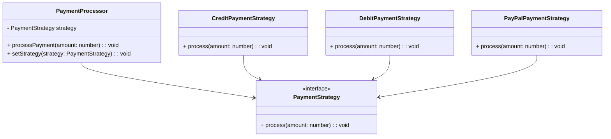
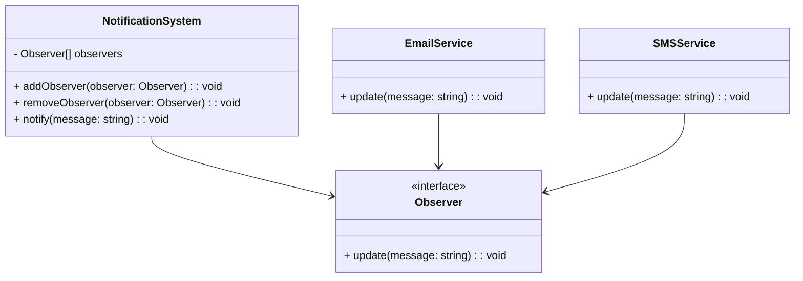

## 11.4.2 Applying Patterns to Improve Design

Refactoring is a critical process in software development, allowing us to improve the design, structure, and readability of code without altering its external behavior. In this section, we will explore how to apply design patterns to enhance code design during refactoring. We'll match specific code smells or design issues with corresponding design patterns, provide detailed refactoring examples, and discuss the impact of these changes on the existing codebase. Let's dive in!

### Identifying Code Smells and Design Issues

Before we can apply design patterns, we need to identify common code smells and design issues that indicate the need for refactoring. Here are a few examples:

- **Long Method**: Methods that are excessively long and difficult to understand.
- **Duplicated Code**: Code that is repeated in multiple places.
- **Large Class**: Classes that have too many responsibilities.
- **Conditional Complexity**: Code with complex conditional logic.
- **Tight Coupling**: Classes that are heavily dependent on each other.

### Matching Code Smells with Design Patterns

Design patterns offer proven solutions to common design problems. By matching code smells with appropriate patterns, we can systematically improve our codebase. Here are some examples:

- **Strategy Pattern**: Use to eliminate complex conditional logic.
- **Observer Pattern**: Apply to decouple components and manage event-driven systems.
- **Factory Method Pattern**: Use to manage object creation and reduce dependency on concrete classes.
- **Decorator Pattern**: Apply to add functionality to objects dynamically without altering their structure.
- **Facade Pattern**: Use to simplify interactions with complex subsystems.

### Refactoring Example: Strategy Pattern

Let's start with a refactoring example using the Strategy Pattern to eliminate conditional logic.

#### Problematic Code

Consider a payment processing system with complex conditional logic:

```typescript
class PaymentProcessor {
    processPayment(paymentType: string, amount: number) {
        if (paymentType === 'credit') {
            console.log(`Processing credit payment of $${amount}`);
            // Credit payment logic
        } else if (paymentType === 'debit') {
            console.log(`Processing debit payment of $${amount}`);
            // Debit payment logic
        } else if (paymentType === 'paypal') {
            console.log(`Processing PayPal payment of $${amount}`);
            // PayPal payment logic
        } else {
            throw new Error('Unsupported payment type');
        }
    }
}
```

#### Applying the Strategy Pattern

The Strategy Pattern allows us to define a family of algorithms, encapsulate each one, and make them interchangeable. Here's how we can refactor the code:

1. **Define a Strategy Interface**: Create an interface for payment strategies.

```typescript
interface PaymentStrategy {
    process(amount: number): void;
}
```

2. **Implement Concrete Strategies**: Implement different payment strategies.

```typescript
class CreditPaymentStrategy implements PaymentStrategy {
    process(amount: number): void {
        console.log(`Processing credit payment of $${amount}`);
        // Credit payment logic
    }
}

class DebitPaymentStrategy implements PaymentStrategy {
    process(amount: number): void {
        console.log(`Processing debit payment of $${amount}`);
        // Debit payment logic
    }
}

class PayPalPaymentStrategy implements PaymentStrategy {
    process(amount: number): void {
        console.log(`Processing PayPal payment of $${amount}`);
        // PayPal payment logic
    }
}
```

3. **Refactor the PaymentProcessor**: Use the strategy interface to process payments.

```typescript
class PaymentProcessor {
    private strategy: PaymentStrategy;

    constructor(strategy: PaymentStrategy) {
        this.strategy = strategy;
    }

    processPayment(amount: number): void {
        this.strategy.process(amount);
    }

    setStrategy(strategy: PaymentStrategy): void {
        this.strategy = strategy;
    }
}
```

#### Improvements

- **Eliminated Conditional Logic**: The complex conditional logic is replaced with strategy objects.
- **Increased Flexibility**: New payment methods can be added without modifying existing code.
- **Adherence to SOLID Principles**: The Open/Closed Principle is maintained, allowing the class to be open for extension but closed for modification.

### Refactoring Example: Observer Pattern

Next, let's refactor a system using the Observer Pattern to manage event-driven communication.

#### Problematic Code

Consider a simple notification system where different components need to be notified of changes:

```typescript
class NotificationSystem {
    private emailService: EmailService;
    private smsService: SMSService;

    constructor() {
        this.emailService = new EmailService();
        this.smsService = new SMSService();
    }

    notify(message: string): void {
        this.emailService.sendEmail(message);
        this.smsService.sendSMS(message);
    }
}
```

#### Applying the Observer Pattern

The Observer Pattern defines a one-to-many dependency between objects, allowing multiple observers to listen to events. Here's how we can refactor the code:

1. **Define an Observer Interface**: Create an interface for observers.

```typescript
interface Observer {
    update(message: string): void;
}
```

2. **Implement Concrete Observers**: Implement different notification services as observers.

```typescript
class EmailService implements Observer {
    update(message: string): void {
        console.log(`Sending email: ${message}`);
    }
}

class SMSService implements Observer {
    update(message: string): void {
        console.log(`Sending SMS: ${message}`);
    }
}
```

3. **Refactor the NotificationSystem**: Use the observer pattern to manage notifications.

```typescript
class NotificationSystem {
    private observers: Observer[] = [];

    addObserver(observer: Observer): void {
        this.observers.push(observer);
    }

    removeObserver(observer: Observer): void {
        this.observers = this.observers.filter(obs => obs !== observer);
    }

    notify(message: string): void {
        this.observers.forEach(observer => observer.update(message));
    }
}
```

#### Improvements

- **Decoupled Components**: The notification system is decoupled from specific services.
- **Extensibility**: New notification services can be added without modifying existing code.
- **Adherence to SOLID Principles**: The Single Responsibility Principle is maintained, as each class has a single responsibility.

### Impact of Refactoring

Refactoring with design patterns can significantly improve the design and maintainability of a codebase. However, it may also require adjustments to existing code:

- **Testing**: Ensure that existing tests are updated to reflect the refactored code. Consider writing new tests for the added functionality.
- **Documentation**: Update documentation to reflect changes in the code structure and design.
- **Team Communication**: Communicate changes with the development team to ensure everyone is aware of the new design.

### Potential Pitfalls

While refactoring with design patterns offers many benefits, there are potential pitfalls to watch out for:

- **Overcomplicating Design**: Avoid introducing unnecessary complexity by overusing patterns.
- **Introducing Bugs**: Refactoring can introduce new bugs if not done carefully. Ensure thorough testing.
- **Performance Considerations**: Some patterns may introduce performance overhead. Evaluate the impact on performance.

### Try It Yourself

Experiment with the refactoring examples provided. Try modifying the code to add new payment methods or notification services. Observe how the design patterns facilitate these changes without altering existing code.

### Visualizing Design Patterns

To better understand the refactoring process, let's visualize the structure of the Strategy and Observer patterns using Mermaid.js diagrams.

#### Strategy Pattern Diagram



#### Observer Pattern Diagram



### References and Links

For further reading on design patterns and refactoring, consider the following resources:

- [Refactoring: Improving the Design of Existing Code](https://martinfowler.com/books/refactoring.html) by Martin Fowler
- [Design Patterns: Elements of Reusable Object-Oriented Software](https://www.amazon.com/Design-Patterns-Elements-Reusable-Object-Oriented/dp/0201633612) by Erich Gamma, Richard Helm, Ralph Johnson, John Vlissides
- [MDN Web Docs on JavaScript Design Patterns](https://developer.mozilla.org/en-US/docs/Web/JavaScript/Guide/Design_Patterns)

### Knowledge Check

Let's reinforce what we've learned with a few questions and exercises:

- **Question**: What are some common code smells that indicate the need for refactoring?
- **Exercise**: Refactor a piece of code in your project using the Strategy Pattern. Document the changes and improvements.
- **Challenge**: Identify a code smell in a codebase and propose a design pattern to address it.

### Embrace the Journey

Refactoring with design patterns is a powerful tool for improving code design. Remember, this is just the beginning. As you continue to apply these patterns, you'll build more maintainable and scalable systems. Keep experimenting, stay curious, and enjoy the journey!

## Quiz Time!



### Which pattern is best suited to eliminate complex conditional logic?

- [x] Strategy Pattern
- [ ] Observer Pattern
- [ ] Factory Method Pattern
- [ ] Decorator Pattern

> **Explanation:** The Strategy Pattern allows you to define a family of algorithms, encapsulate each one, and make them interchangeable, which is ideal for eliminating complex conditional logic.


### What is the primary benefit of using the Observer Pattern?

- [x] Decoupling components
- [ ] Simplifying conditional logic
- [ ] Managing object creation
- [ ] Adding functionality dynamically

> **Explanation:** The Observer Pattern defines a one-to-many dependency between objects, allowing multiple observers to listen to events, effectively decoupling components.


### What should you ensure after refactoring code with design patterns?

- [x] Update tests and documentation
- [ ] Remove all comments
- [ ] Increase the number of classes
- [ ] Use more global variables

> **Explanation:** After refactoring, it's essential to update tests and documentation to reflect changes in the code structure and design.


### What is a potential pitfall of refactoring with design patterns?

- [x] Overcomplicating the design
- [ ] Reducing code readability
- [ ] Decreasing code flexibility
- [ ] Increasing code duplication

> **Explanation:** One potential pitfall is overcomplicating the design by overusing patterns, which can lead to unnecessary complexity.


### When refactoring with the Strategy Pattern, what principle are you adhering to?

- [x] Open/Closed Principle
- [ ] Single Responsibility Principle
- [ ] Liskov Substitution Principle
- [ ] Interface Segregation Principle

> **Explanation:** The Strategy Pattern adheres to the Open/Closed Principle by allowing a class to be open for extension but closed for modification.


### What is the key advantage of using the Facade Pattern?

- [x] Simplifying interactions with complex subsystems
- [ ] Eliminating conditional logic
- [ ] Managing object creation
- [ ] Adding functionality dynamically

> **Explanation:** The Facade Pattern provides a simplified interface to a complex subsystem, making interactions easier for the client.


### Which pattern helps in managing event-driven communication?

- [x] Observer Pattern
- [ ] Strategy Pattern
- [ ] Factory Method Pattern
- [ ] Decorator Pattern

> **Explanation:** The Observer Pattern is ideal for managing event-driven communication by defining a one-to-many dependency between objects.


### What is a common code smell that indicates the need for refactoring?

- [x] Duplicated Code
- [ ] Well-structured classes
- [ ] Clear and concise methods
- [ ] Properly documented code

> **Explanation:** Duplicated Code is a common code smell that indicates the need for refactoring to improve maintainability and reduce redundancy.


### True or False: Refactoring with design patterns can introduce new bugs if not done carefully.

- [x] True
- [ ] False

> **Explanation:** True. Refactoring can introduce new bugs if not done carefully, so thorough testing is essential.


### What is the main goal of refactoring with design patterns?

- [x] Improve design and maintainability
- [ ] Increase code complexity
- [ ] Add more features
- [ ] Use more global variables

> **Explanation:** The main goal of refactoring with design patterns is to improve design and maintainability without altering the external behavior of the code.


