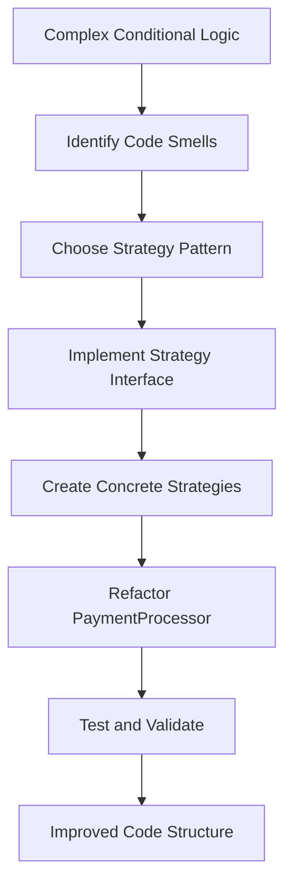

## 11.4 Refactoring with Design Patterns

In the ever-evolving landscape of software development, maintaining a clean and efficient codebase is crucial. Refactoring, the process of restructuring existing code without changing its external behavior, plays a pivotal role in achieving this goal. When combined with design patterns, refactoring can transform a tangled mess of code into a well-organized, maintainable masterpiece. In this section, we will explore how to leverage design patterns during refactoring to enhance code structure, readability, and maintainability.

### Understanding Refactoring

Refactoring is an essential practice in the software development lifecycle. It involves making changes to the internal structure of the code to improve its design, readability, and maintainability, all while preserving its functionality. The primary objectives of refactoring include:

- **Improving Code Readability**: Making the code easier to understand for current and future developers.
- **Enhancing Maintainability**: Simplifying the process of updating and extending the code.
- **Reducing Complexity**: Breaking down complex code into simpler, more manageable components.
- **Identifying and Eliminating Code Smells**: Addressing patterns in the code that indicate potential issues, such as duplicated code or overly complex methods.

### The Role of Design Patterns in Refactoring

Design patterns provide proven solutions to common software design problems. They offer a structured approach to refactoring by providing a blueprint for organizing code in a way that is both efficient and maintainable. By applying design patterns during refactoring, developers can address specific challenges and improve the overall quality of the codebase.

#### Common Refactoring Challenges Addressed by Design Patterns

1. **Duplicated Code**: The DRY (Don't Repeat Yourself) principle can be enforced by using patterns like the Singleton or Factory Method to centralize object creation and management.

2. **Complex Conditional Logic**: Patterns such as Strategy or State can replace complex conditional logic with polymorphism, making the code easier to extend and maintain.

3. **Tight Coupling**: Patterns like Dependency Injection and Observer can decouple components, promoting flexibility and reusability.

4. **Lack of Abstraction**: The use of patterns like Adapter or Facade can introduce abstraction layers, simplifying interactions between components.

### Systematic Approach to Refactoring with Design Patterns

Refactoring with design patterns requires a systematic approach to ensure that the refactoring process is effective and that the code remains functional. Here is a step-by-step guide to refactoring code using design patterns:

#### Step 1: Identify Code Smells

Begin by identifying areas of the code that exhibit code smells. These are indicators of potential problems in the code, such as duplicated code, long methods, or tightly coupled classes.

#### Step 2: Choose Appropriate Design Patterns

Once code smells have been identified, select the design patterns that best address the specific issues. Consider the trade-offs and benefits of each pattern to ensure that it aligns with the goals of the refactoring process.

#### Step 3: Refactor Incrementally

Refactor the code incrementally, applying one design pattern at a time. This approach minimizes the risk of introducing errors and allows for easier testing and validation.

#### Step 4: Test Thoroughly

After each refactoring step, test the code thoroughly to ensure that its functionality remains unchanged. Automated tests can be particularly useful in verifying that the refactored code behaves as expected.

#### Step 5: Review and Iterate

Review the refactored code to ensure that it meets the desired standards of readability and maintainability. Iterate on the refactoring process as needed to address any remaining issues.

### Maintaining Functionality While Improving Code Structure

One of the key challenges of refactoring is maintaining the existing functionality of the code while improving its structure. This requires careful planning and execution to ensure that changes do not introduce new bugs or regressions. Here are some strategies to achieve this:

- **Use Automated Tests**: Automated tests provide a safety net that ensures the refactored code behaves as expected. They can quickly identify any regressions introduced during the refactoring process.

- **Refactor in Small Steps**: By making small, incremental changes, developers can more easily identify and fix any issues that arise. This approach also makes it easier to roll back changes if necessary.

- **Keep the Refactoring Process Transparent**: Document the refactoring process and communicate changes to the team. This transparency helps ensure that everyone is aware of the changes and can provide feedback or assistance as needed.

### Examples of Refactoring Scenarios

Let's explore some common refactoring scenarios where applying a design pattern resolved underlying issues. We'll provide code comparisons before and after refactoring to illustrate the improvements.

#### Scenario 1: Replacing Complex Conditional Logic with the Strategy Pattern

**Before Refactoring**:

```typescript
class PaymentProcessor {
  processPayment(type: string, amount: number) {
    if (type === 'creditCard') {
      // Process credit card payment
    } else if (type === 'paypal') {
      // Process PayPal payment
    } else if (type === 'bankTransfer') {
      // Process bank transfer payment
    } else {
      throw new Error('Unsupported payment type');
    }
  }
}
```

**After Refactoring**:

```typescript
interface PaymentStrategy {
  process(amount: number): void;
}

class CreditCardPayment implements PaymentStrategy {
  process(amount: number): void {
    // Process credit card payment
  }
}

class PayPalPayment implements PaymentStrategy {
  process(amount: number): void {
    // Process PayPal payment
  }
}

class BankTransferPayment implements PaymentStrategy {
  process(amount: number): void {
    // Process bank transfer payment
  }
}

class PaymentProcessor {
  private strategy: PaymentStrategy;

  constructor(strategy: PaymentStrategy) {
    this.strategy = strategy;
  }

  processPayment(amount: number): void {
    this.strategy.process(amount);
  }
}

// Usage
const paymentProcessor = new PaymentProcessor(new CreditCardPayment());
paymentProcessor.processPayment(100);
```

**Improvements**:
- The Strategy pattern replaces complex conditional logic with polymorphism, making the code easier to extend and maintain.
- New payment methods can be added without modifying existing code, adhering to the Open/Closed Principle.

#### Scenario 2: Decoupling Components with the Observer Pattern

**Before Refactoring**:

```typescript
class NewsAgency {
  private news: string;

  setNews(news: string) {
    this.news = news;
    this.notifySubscribers();
  }

  notifySubscribers() {
    // Notify all subscribers
  }
}

class NewsSubscriber {
  update(news: string) {
    console.log(`News update: ${news}`);
  }
}
```

**After Refactoring**:

```typescript
interface Subscriber {
  update(news: string): void;
}

class NewsAgency {
  private news: string;
  private subscribers: Subscriber[] = [];

  addSubscriber(subscriber: Subscriber): void {
    this.subscribers.push(subscriber);
  }

  removeSubscriber(subscriber: Subscriber): void {
    this.subscribers = this.subscribers.filter(sub => sub !== subscriber);
  }

  setNews(news: string): void {
    this.news = news;
    this.notifySubscribers();
  }

  private notifySubscribers(): void {
    for (const subscriber of this.subscribers) {
      subscriber.update(this.news);
    }
  }
}

class NewsSubscriber implements Subscriber {
  update(news: string): void {
    console.log(`News update: ${news}`);
  }
}

// Usage
const agency = new NewsAgency();
const subscriber = new NewsSubscriber();
agency.addSubscriber(subscriber);
agency.setNews('Breaking News!');
```

**Improvements**:
- The Observer pattern decouples the NewsAgency from its subscribers, promoting flexibility and reusability.
- Subscribers can be added or removed dynamically, and the NewsAgency no longer needs to manage them directly.

### Considerations and Trade-offs

When choosing to implement design patterns during refactoring, it's important to consider the following:

- **Complexity vs. Simplicity**: While design patterns can improve code structure, they can also introduce additional complexity. It's important to balance the benefits of using a pattern with the potential increase in complexity.

- **Performance Implications**: Some design patterns may have performance implications. For example, the Observer pattern may introduce overhead due to the need to manage subscribers. Consider the performance impact of a pattern before implementing it.

- **Team Familiarity**: Ensure that the team is familiar with the design patterns being used. This familiarity will help ensure that the patterns are applied correctly and that the team can maintain the refactored code.

- **Alignment with Project Goals**: Ensure that the chosen design patterns align with the overall goals of the project. Patterns should be used to solve specific problems and improve the codebase, not just for the sake of using them.

### Try It Yourself

To reinforce your understanding of refactoring with design patterns, try modifying the code examples provided in this section. Experiment with adding new payment methods in the Strategy pattern example or implementing additional subscriber types in the Observer pattern example. By doing so, you'll gain hands-on experience with applying design patterns during refactoring.

### Visualizing the Refactoring Process

To better understand the refactoring process, let's visualize the transformation of a codebase using design patterns. The following Mermaid.js diagram illustrates the flow of refactoring a complex conditional logic into a Strategy pattern.



**Diagram Description**: This flowchart represents the refactoring process of transforming complex conditional logic into a Strategy pattern. It highlights the steps involved, from identifying code smells to testing and validating the refactored code.

### Knowledge Check

To ensure you've grasped the key concepts covered in this section, consider the following questions:

- What are the primary objectives of refactoring?
- How can design patterns address common refactoring challenges?
- What are the benefits of using the Strategy pattern to replace complex conditional logic?
- How does the Observer pattern promote decoupling in a codebase?
- What are some considerations to keep in mind when implementing design patterns during refactoring?

### Embrace the Journey

Remember, refactoring with design patterns is an ongoing journey. As you continue to refine your codebase, you'll discover new opportunities to apply design patterns and improve your code. Keep experimenting, stay curious, and enjoy the process of transforming your code into a well-structured, maintainable masterpiece.

## Quiz Time!



### What is the primary goal of refactoring?

- [x] To improve the internal structure of code without changing its external behavior.
- [ ] To add new features to the codebase.
- [ ] To rewrite the entire codebase from scratch.
- [ ] To optimize code for performance.

> **Explanation:** Refactoring aims to enhance the internal structure of the code while maintaining its existing functionality.

### Which design pattern can replace complex conditional logic?

- [x] Strategy Pattern
- [ ] Singleton Pattern
- [ ] Observer Pattern
- [ ] Factory Pattern

> **Explanation:** The Strategy pattern replaces complex conditional logic with polymorphism, allowing different strategies to be implemented for different conditions.

### What is a key benefit of the Observer pattern?

- [x] It decouples components, promoting flexibility and reusability.
- [ ] It centralizes object creation.
- [ ] It simplifies complex algorithms.
- [ ] It improves performance by reducing overhead.

> **Explanation:** The Observer pattern decouples the subject from its observers, allowing for dynamic addition and removal of observers.

### What should be considered when implementing design patterns during refactoring?

- [x] Complexity vs. Simplicity
- [x] Performance Implications
- [x] Team Familiarity
- [ ] Ignoring Code Smells

> **Explanation:** When implementing design patterns, consider the trade-offs between complexity and simplicity, performance implications, and team familiarity with the patterns.

### How can automated tests aid in the refactoring process?

- [x] By providing a safety net to ensure refactored code behaves as expected.
- [ ] By automatically refactoring the code.
- [ ] By generating new features.
- [ ] By replacing the need for manual testing.

> **Explanation:** Automated tests help verify that refactored code maintains its expected behavior, reducing the risk of introducing errors.

### What is a common refactoring challenge that design patterns can address?

- [x] Duplicated Code
- [ ] Adding new features
- [ ] Improving performance
- [ ] Reducing file size

> **Explanation:** Design patterns can help address duplicated code by providing a structured approach to organizing and managing code.

### Why is it important to refactor in small steps?

- [x] To minimize the risk of introducing errors and make it easier to test and validate changes.
- [ ] To quickly complete the refactoring process.
- [ ] To avoid using design patterns.
- [ ] To reduce the number of lines of code.

> **Explanation:** Refactoring in small steps allows for easier identification and correction of errors, ensuring that changes do not disrupt functionality.

### What is a potential trade-off of using design patterns?

- [x] Increased complexity
- [ ] Reduced code readability
- [ ] Decreased maintainability
- [ ] Limited extensibility

> **Explanation:** While design patterns can improve code structure, they can also introduce additional complexity, which should be carefully considered.

### What is the benefit of using the Strategy pattern in the PaymentProcessor example?

- [x] It allows for easy addition of new payment methods without modifying existing code.
- [ ] It improves performance by reducing processing time.
- [ ] It centralizes payment processing logic.
- [ ] It simplifies the user interface.

> **Explanation:** The Strategy pattern enables the addition of new payment methods by implementing new strategies, adhering to the Open/Closed Principle.

### True or False: Refactoring with design patterns always improves performance.

- [ ] True
- [x] False

> **Explanation:** While refactoring with design patterns can improve code structure and maintainability, it does not necessarily improve performance and may introduce additional complexity.


