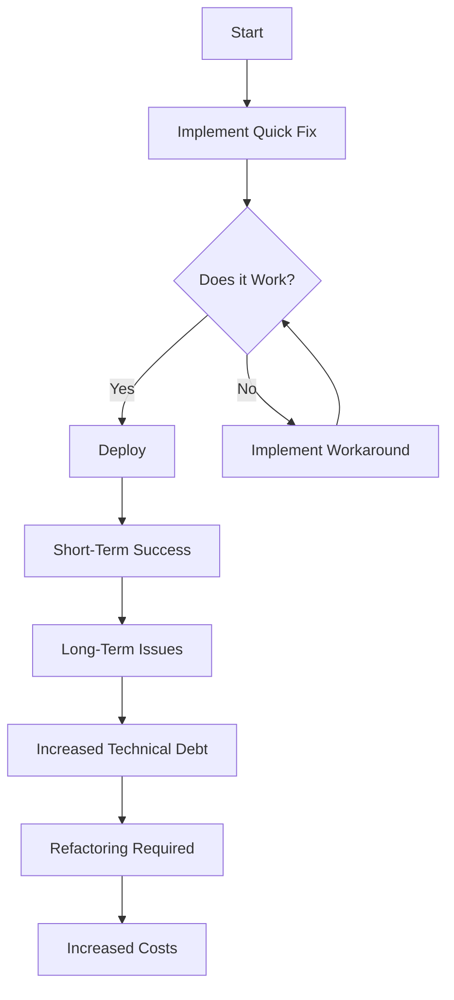

## 12.1 Definition and Impact of Anti-Patterns

In the realm of software engineering, design patterns are celebrated as reusable solutions to common problems, providing a framework for building robust, scalable, and maintainable systems. However, lurking in the shadows are anti-patterns—common but flawed solutions that can lead to negative consequences in code quality and project success. In this section, we will delve into the concept of anti-patterns, their impact on software development, and their particular relevance in TypeScript projects. We will also explore real-world examples and encourage best practices to avoid these pitfalls.

### Defining Anti-Patterns

Anti-patterns, in contrast to design patterns, are solutions that may seem appealing at first glance but ultimately lead to poor outcomes. They are often the result of expedient decisions made under pressure, lack of awareness, or misunderstanding of best practices. While design patterns provide a roadmap to success, anti-patterns are cautionary tales of what to avoid.

#### Key Characteristics of Anti-Patterns

1. **Superficial Appeal**: Anti-patterns often appear to solve a problem quickly, making them tempting choices for developers under tight deadlines.
2. **Long-Term Consequences**: While they may provide short-term relief, anti-patterns typically result in increased complexity, maintenance challenges, and technical debt.
3. **Common Missteps**: They are frequently encountered in the wild, as they stem from common misunderstandings or misapplications of technology.

### Impact on Software Development

The adoption of anti-patterns can have far-reaching negative effects on software projects, impacting maintainability, readability, scalability, and overall project health. Let's explore these impacts in more detail.

#### Code Maintainability

Anti-patterns often lead to code that is difficult to maintain. This can result from:

- **Increased Complexity**: Anti-patterns can introduce unnecessary complexity, making it harder for developers to understand and modify the code.
- **Poor Modularity**: Code that follows anti-patterns is often tightly coupled, making it challenging to isolate and fix issues.
- **Lack of Documentation**: Anti-patterns are rarely documented, leaving developers without guidance on how to navigate the codebase.

#### Readability and Scalability

Code readability and scalability are crucial for the long-term success of any project. Anti-patterns can undermine these qualities by:

- **Obfuscating Logic**: Anti-patterns can obscure the logic of the code, making it difficult for new developers to onboard and contribute effectively.
- **Hindering Scalability**: Poorly structured code can become a bottleneck as the project grows, leading to performance issues and increased costs.

#### Technical Debt and Bugs

Anti-patterns are a significant source of technical debt and can lead to an increase in bugs:

- **Accumulating Debt**: As anti-patterns proliferate, they create a debt that must be repaid through refactoring and rework.
- **Bug Introduction**: The complexity and lack of clarity associated with anti-patterns can lead to bugs that are difficult to diagnose and fix.

#### Increased Development Costs

Ultimately, the presence of anti-patterns can lead to increased development costs:

- **Time-Consuming Fixes**: Addressing the issues caused by anti-patterns often requires significant time and effort.
- **Resource Drain**: The need for constant firefighting can divert resources away from new feature development and innovation.

### Recognizing Anti-Patterns

Recognizing anti-patterns is the first step toward avoiding them. This requires critical thinking, continual learning, and a willingness to question established practices.

#### Key Indicators of Anti-Patterns

1. **Frequent Workarounds**: If you find yourself frequently implementing workarounds, it may be a sign of an underlying anti-pattern.
2. **Recurrent Bugs**: Persistent bugs that seem to reappear despite fixes can indicate the presence of an anti-pattern.
3. **Code Smells**: Unpleasant characteristics in code, such as excessive nesting or duplicated logic, can be red flags.

#### Developing a Critical Eye

To effectively identify anti-patterns, developers should:

- **Stay Informed**: Keep up with industry best practices and emerging trends.
- **Seek Feedback**: Engage in code reviews and solicit feedback from peers to gain new perspectives.
- **Reflect on Experience**: Learn from past projects and identify patterns that led to success or failure.

### Importance in TypeScript Development

Understanding anti-patterns is particularly relevant for TypeScript developers, given the language's features and widespread use in large-scale applications.

#### TypeScript's Role

TypeScript offers several features that can help mitigate anti-patterns:

- **Static Typing**: By enforcing type safety, TypeScript can prevent many common anti-patterns related to dynamic typing.
- **Interfaces and Generics**: These features promote code reusability and clarity, reducing the likelihood of anti-patterns.
- **Tooling and Ecosystem**: TypeScript's robust tooling and community support provide resources for identifying and addressing anti-patterns.

#### Challenges in TypeScript

Despite its advantages, TypeScript is not immune to anti-patterns:

- **Overuse of `any` Type**: Relying too heavily on the `any` type can negate the benefits of TypeScript's type system.
- **Complex Generics**: Misuse of generics can lead to convoluted code that is difficult to understand and maintain.

### Real-World Examples

To illustrate the impact of anti-patterns, let's explore some real-world examples where they adversely affected projects.

#### Case Study: The Spaghetti Code Debacle

In a large-scale web application, a team faced significant challenges due to spaghetti code—an anti-pattern characterized by tangled control structures and lack of modularity. As the project grew, the codebase became increasingly difficult to navigate, leading to frequent bugs and slow development cycles. The team eventually had to undertake a costly refactoring effort to untangle the code and restore order.

#### Case Study: The Golden Hammer Trap

Another project fell victim to the golden hammer anti-pattern, where a familiar solution was overused without consideration of its appropriateness. The team relied heavily on a specific library for all data processing tasks, even when it was not the best fit. This led to performance issues and limited the team's ability to explore more suitable alternatives.

### Visual Aids

To better understand the concept of anti-patterns, let's visualize the impact of a common anti-pattern using a flowchart.

**Figure 1: The Cycle of an Anti-Pattern**

This flowchart illustrates the typical cycle of an anti-pattern, where a quick fix leads to short-term success but eventually results in long-term issues and increased costs.

### Encourage Best Practices

To avoid anti-patterns, developers should adopt best practices and continuously refactor code. Here are some strategies to consider:

1. **Embrace Design Patterns**: Familiarize yourself with design patterns and apply them where appropriate to solve common problems.
2. **Prioritize Code Quality**: Focus on writing clean, modular, and well-documented code.
3. **Engage in Code Reviews**: Regular code reviews can help identify potential anti-patterns and encourage knowledge sharing.
4. **Invest in Refactoring**: Allocate time for regular refactoring to address technical debt and improve code quality.

### Try It Yourself

To gain a deeper understanding of anti-patterns, try experimenting with the following exercise:

1. **Identify an Anti-Pattern**: Review a codebase you are familiar with and identify any potential anti-patterns.
2. **Refactor the Code**: Implement a refactoring strategy to address the anti-pattern and improve the code.
3. **Reflect on the Impact**: Consider how the refactoring improved the code's maintainability, readability, and scalability.

### Conclusion

Understanding and avoiding anti-patterns is crucial for building successful software projects. By recognizing the signs of anti-patterns and adopting best practices, developers can enhance code quality and ensure the long-term success of their projects. Remember, this is just the beginning. As you progress, you'll build more complex and interactive applications. Keep experimenting, stay curious, and enjoy the journey!

## Quiz Time!



### What is an anti-pattern?

- [x] A common but flawed solution that leads to negative outcomes
- [ ] A proven solution to a common problem
- [ ] A type of design pattern
- [ ] A method for optimizing code

> **Explanation:** An anti-pattern is a common but flawed solution that may seem appealing but ultimately leads to poor outcomes.

### How can anti-patterns affect code maintainability?

- [x] By increasing complexity and making code difficult to understand
- [ ] By improving code readability
- [ ] By reducing technical debt
- [ ] By making code more modular

> **Explanation:** Anti-patterns often increase complexity, making code difficult to maintain and understand.

### What is a key characteristic of anti-patterns?

- [x] They provide superficial appeal but have long-term consequences
- [ ] They are always well-documented
- [ ] They are rarely encountered in software development
- [ ] They are always beneficial in the short term

> **Explanation:** Anti-patterns often provide a quick fix but lead to long-term negative consequences.

### Why is recognizing anti-patterns important?

- [x] To avoid common pitfalls and improve code quality
- [ ] To increase technical debt
- [ ] To make code more complex
- [ ] To reduce code readability

> **Explanation:** Recognizing anti-patterns helps developers avoid common pitfalls and improve code quality.

### How can TypeScript help mitigate anti-patterns?

- [x] By enforcing type safety and promoting code clarity
- [ ] By allowing the overuse of the `any` type
- [ ] By encouraging complex generics
- [ ] By increasing code complexity

> **Explanation:** TypeScript's type system and features promote code clarity and help prevent common anti-patterns.

### What is a common anti-pattern in TypeScript?

- [x] Overuse of the `any` type
- [ ] Using interfaces and generics
- [ ] Writing modular code
- [ ] Conducting regular code reviews

> **Explanation:** Overuse of the `any` type can negate the benefits of TypeScript's type system.

### What is the impact of anti-patterns on development costs?

- [x] They increase development costs due to time-consuming fixes
- [ ] They reduce development costs by providing quick solutions
- [ ] They have no impact on development costs
- [ ] They decrease the need for refactoring

> **Explanation:** Anti-patterns can lead to increased development costs due to the need for time-consuming fixes.

### What is a sign of an anti-pattern in code?

- [x] Frequent workarounds and recurrent bugs
- [ ] Clear documentation
- [ ] Modular and well-structured code
- [ ] High code readability

> **Explanation:** Frequent workarounds and recurrent bugs can indicate the presence of an anti-pattern.

### How can developers avoid anti-patterns?

- [x] By embracing design patterns and prioritizing code quality
- [ ] By avoiding code reviews
- [ ] By ignoring technical debt
- [ ] By writing complex and undocumented code

> **Explanation:** Embracing design patterns and prioritizing code quality can help developers avoid anti-patterns.

### True or False: Anti-patterns always lead to positive outcomes.

- [ ] True
- [x] False

> **Explanation:** Anti-patterns often lead to negative outcomes, such as increased complexity and technical debt.


