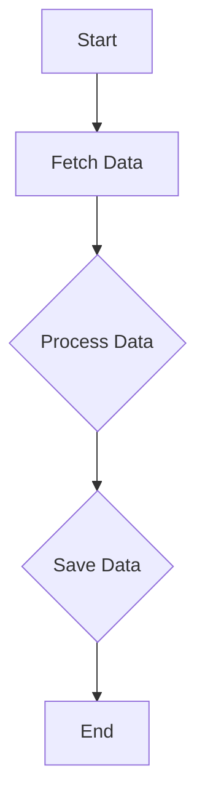

## 12.2.1 Spaghetti Code

In the realm of software development, "spaghetti code" is a term that evokes images of tangled, disorganized, and difficult-to-maintain codebases. This section delves into the intricacies of spaghetti code, particularly in the context of TypeScript, and provides strategies to avoid and refactor such code.

### Defining Spaghetti Code

Spaghetti code refers to a codebase that lacks a clear and logical structure, resulting in complex and tangled control flows. This often arises from excessive and unstructured use of branching and looping constructs. The term "spaghetti" is used metaphorically to describe the chaotic and intertwined nature of the code, reminiscent of a plate of spaghetti.

#### Characteristics of Spaghetti Code

- **Lack of Modularity**: Functions and modules are not well-defined, leading to a monolithic codebase.
- **Excessive Nesting**: Deeply nested loops and conditionals that make the code hard to follow.
- **Unclear Flow**: The control flow is not intuitive, making it difficult to trace the execution path.
- **High Coupling**: Components are tightly interwoven, making changes risky and error-prone.

### Causes of Spaghetti Code

Understanding the root causes of spaghetti code is crucial for preventing it. Here are some common reasons why spaghetti code arises:

#### Lack of Planning or Design

Without a clear design or architecture, developers may write code in an ad-hoc manner, leading to a disorganized structure. Proper planning helps in defining clear boundaries and responsibilities for different parts of the code.

#### Overuse of Global Variables

Global variables can lead to unpredictable behavior and make it difficult to track changes in the code. They increase coupling between components, making the codebase fragile.

#### Inadequate Understanding of the Problem Domain

When developers do not fully understand the problem they are solving, they may implement solutions that are inefficient or overly complex, resulting in spaghetti code.

#### Hasty Coding Under Time Pressure

Time constraints can lead developers to prioritize quick fixes over well-structured solutions. This often results in code that is difficult to maintain in the long run.

#### Asynchronous Programming Challenges

In TypeScript, managing asynchronous operations with callbacks can lead to deeply nested structures, often referred to as "callback hell." This is a common source of spaghetti code in modern JavaScript and TypeScript applications.

### Problems Associated with Spaghetti Code

Spaghetti code presents several challenges that can hinder the development process:

#### Difficulty in Reading and Understanding

The tangled nature of spaghetti code makes it hard for developers to understand the logic, especially for those who are new to the codebase. This increases the time required for onboarding and collaboration.

#### Increased Likelihood of Bugs

The lack of structure and clarity in spaghetti code increases the chances of introducing bugs. It becomes difficult to predict the impact of changes, leading to unintended side effects.

#### Hindered Scalability

As the codebase grows, spaghetti code becomes increasingly difficult to manage. Adding new features or making changes can be risky and time-consuming, limiting the scalability of the application.

### Examples of Spaghetti Code in TypeScript

Let's explore an example of spaghetti code in TypeScript, focusing on asynchronous operations:

```typescript
// Example of spaghetti code with deeply nested callbacks
function fetchData(url: string, callback: (data: any) => void) {
    setTimeout(() => {
        console.log('Fetching data from:', url);
        callback({ data: 'Sample Data' });
    }, 1000);
}

function processData(data: any, callback: (result: any) => void) {
    setTimeout(() => {
        console.log('Processing data:', data);
        callback({ result: 'Processed Data' });
    }, 1000);
}

function saveData(result: any, callback: (status: string) => void) {
    setTimeout(() => {
        console.log('Saving data:', result);
        callback('Success');
    }, 1000);
}

// Spaghetti code with nested callbacks
fetchData('https://api.example.com/data', (data) => {
    processData(data, (result) => {
        saveData(result, (status) => {
            console.log('Operation status:', status);
        });
    });
});
```

In this example, the code is difficult to follow due to the nested callbacks. Each function call depends on the previous one, creating a complex and intertwined flow.

### Strategies to Avoid Spaghetti Code

To prevent spaghetti code, consider the following strategies:

#### Modularization

Break down the code into smaller, reusable functions or modules. This makes the codebase easier to manage and understand. Each module should have a single responsibility, adhering to the Single Responsibility Principle (SRP).

#### Use of Control Structures

Use loops, conditional statements, and error handling appropriately. Avoid deep nesting by refactoring complex logic into separate functions.

#### Asynchronous Patterns

Leverage `async/await` to manage asynchronous operations more cleanly. This helps in avoiding nested callbacks and makes the code more readable.

```typescript
// Refactored code using async/await
async function fetchDataAsync(url: string): Promise<any> {
    return new Promise((resolve) => {
        setTimeout(() => {
            console.log('Fetching data from:', url);
            resolve({ data: 'Sample Data' });
        }, 1000);
    });
}

async function processDataAsync(data: any): Promise<any> {
    return new Promise((resolve) => {
        setTimeout(() => {
            console.log('Processing data:', data);
            resolve({ result: 'Processed Data' });
        }, 1000);
    });
}

async function saveDataAsync(result: any): Promise<string> {
    return new Promise((resolve) => {
        setTimeout(() => {
            console.log('Saving data:', result);
            resolve('Success');
        }, 1000);
    });
}

async function executeAsyncOperations() {
    const data = await fetchDataAsync('https://api.example.com/data');
    const result = await processDataAsync(data);
    const status = await saveDataAsync(result);
    console.log('Operation status:', status);
}

executeAsyncOperations();
```

#### Design Patterns

Implement design patterns such as the Module Pattern or Observer Pattern to impose structure and improve maintainability.

#### Code Organization

Adopt consistent coding styles and make proper use of TypeScript features like interfaces and types to enhance code clarity and maintainability.

### Refactoring Techniques

Refactoring spaghetti code involves restructuring the code to improve its readability and maintainability. Here are some steps to refactor spaghetti code:

#### Identify Problematic Areas

Start by identifying parts of the code that are difficult to understand or maintain. Look for deeply nested structures, excessive use of global variables, and unclear logic.

#### Break Down Complex Functions

Refactor large functions into smaller, more manageable ones. Each function should perform a single task and have a clear purpose.

#### Introduce Asynchronous Patterns

Replace nested callbacks with `async/await` to simplify asynchronous code. This reduces complexity and improves readability.

#### Apply Design Patterns

Use design patterns to impose structure and improve the organization of the code. For example, the Observer Pattern can help manage complex interactions between components.

#### Before-and-After Comparison

Let's look at a before-and-after comparison of refactoring spaghetti code:

**Before Refactoring:**

```typescript
// Spaghetti code with nested callbacks
fetchData('https://api.example.com/data', (data) => {
    processData(data, (result) => {
        saveData(result, (status) => {
            console.log('Operation status:', status);
        });
    });
});
```

**After Refactoring:**

```typescript
// Refactored code using async/await
async function executeAsyncOperations() {
    const data = await fetchDataAsync('https://api.example.com/data');
    const result = await processDataAsync(data);
    const status = await saveDataAsync(result);
    console.log('Operation status:', status);
}

executeAsyncOperations();
```

### Best Practices

To prevent spaghetti code, consider the following best practices:

#### Code Reviews and Pair Programming

Engage in regular code reviews and pair programming sessions to catch and prevent spaghetti code. These practices encourage collaboration and knowledge sharing, helping to maintain code quality.

#### Write Clear, Maintainable Code

Prioritize writing clear and maintainable code, even under tight deadlines. This involves adhering to coding standards, using meaningful variable names, and documenting complex logic.

#### Continuous Learning and Improvement

Stay updated with the latest best practices and tools in software development. Continuous learning helps in adopting better coding practices and avoiding common pitfalls like spaghetti code.

### Visualizing Spaghetti Code

To better understand the concept of spaghetti code, let's visualize the flow of a typical spaghetti code structure using a flowchart:



This flowchart represents a linear flow of operations, but in spaghetti code, these operations can be deeply nested and intertwined, making the flow difficult to follow.

### Try It Yourself

Experiment with the provided code examples by modifying the URLs, data, or adding additional asynchronous operations. Try refactoring the code to use different patterns or techniques to enhance your understanding.

### Knowledge Check

- What are the common causes of spaghetti code?
- How can `async/await` help in managing asynchronous operations?
- What are the benefits of modularization in preventing spaghetti code?
- How can design patterns improve code structure and maintainability?

### Embrace the Journey

Remember, refactoring spaghetti code is a journey towards better code quality and maintainability. As you progress, you'll develop a deeper understanding of design patterns and best practices. Keep experimenting, stay curious, and enjoy the journey!

## Quiz Time!



### What is spaghetti code?

- [x] Code with a disorganized flow and complex control structures
- [ ] Code that is well-structured and easy to maintain
- [ ] Code that uses design patterns extensively
- [ ] Code that is written in a single programming language

> **Explanation:** Spaghetti code is characterized by a lack of clear structure, resulting in tangled and complex control flows.

### Which of the following is a common cause of spaghetti code?

- [x] Lack of planning or design
- [ ] Use of design patterns
- [ ] Modularization
- [ ] Code reviews

> **Explanation:** Spaghetti code often arises from a lack of planning or design, leading to disorganized and tangled code.

### How can `async/await` help in managing asynchronous operations?

- [x] By simplifying the code and avoiding nested callbacks
- [ ] By increasing the complexity of the code
- [ ] By making the code run synchronously
- [ ] By removing the need for promises

> **Explanation:** `async/await` simplifies asynchronous code by avoiding nested callbacks, making it more readable and maintainable.

### What is a benefit of modularization in preventing spaghetti code?

- [x] It breaks down code into smaller, reusable functions
- [ ] It increases the complexity of the codebase
- [ ] It makes the code harder to understand
- [ ] It encourages the use of global variables

> **Explanation:** Modularization involves breaking down code into smaller, reusable functions, making it easier to manage and understand.

### Which design pattern can help impose structure on a codebase?

- [x] Module Pattern
- [ ] Spaghetti Pattern
- [ ] Callback Pattern
- [ ] Global Variable Pattern

> **Explanation:** The Module Pattern helps impose structure by organizing code into separate modules with clear responsibilities.

### What is a common problem associated with spaghetti code?

- [x] Difficulty in reading and understanding the code
- [ ] Increased modularity
- [ ] Enhanced scalability
- [ ] Reduced likelihood of bugs

> **Explanation:** Spaghetti code is difficult to read and understand, making it prone to errors and hard to maintain.

### How can code reviews help prevent spaghetti code?

- [x] By encouraging collaboration and catching issues early
- [ ] By increasing the complexity of the code
- [ ] By discouraging the use of design patterns
- [ ] By promoting the use of global variables

> **Explanation:** Code reviews encourage collaboration and help catch issues early, preventing spaghetti code from being introduced.

### What is a key characteristic of spaghetti code?

- [x] Excessive nesting and unclear flow
- [ ] Clear and logical structure
- [ ] Use of modern design patterns
- [ ] High modularity

> **Explanation:** Spaghetti code is characterized by excessive nesting and an unclear flow, making it difficult to follow.

### Why is it important to refactor spaghetti code?

- [x] To improve readability and maintainability
- [ ] To increase the complexity of the code
- [ ] To make the code harder to understand
- [ ] To introduce more global variables

> **Explanation:** Refactoring spaghetti code improves readability and maintainability, making it easier to work with.

### True or False: Spaghetti code is a desirable coding practice.

- [ ] True
- [x] False

> **Explanation:** Spaghetti code is not desirable as it leads to disorganized and difficult-to-maintain codebases.


