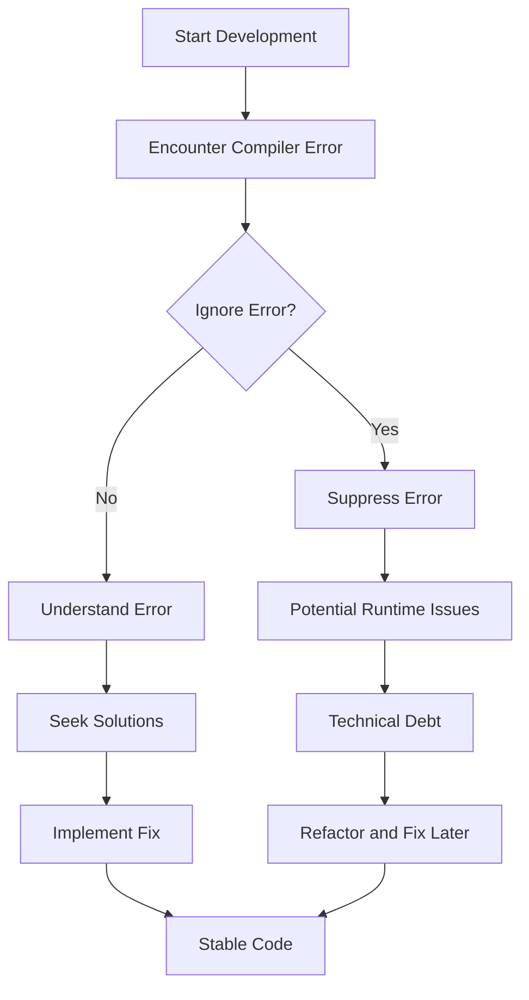

## 12.2.10 Ignoring TypeScript Compiler Errors

In the world of TypeScript, compiler errors are a developer's first line of defense against potential bugs and issues. However, there is a common anti-pattern where developers choose to ignore these errors, often leading to unstable and error-prone code. In this section, we'll delve into the implications of ignoring TypeScript compiler errors, explore the reasons why developers might do so, and provide strategies for addressing these errors effectively.

### Understanding Compiler Errors

The TypeScript compiler is a powerful tool that checks your code for errors before it even runs. It ensures that your code adheres to the type constraints you've set, helping to catch potential issues early in the development process. Compiler errors are not just nuisances; they are indicators of potential problems that could lead to runtime errors or unexpected behavior.

#### The Role of the TypeScript Compiler

The TypeScript compiler (tsc) performs several crucial functions:

- **Type Checking**: Ensures that variables and functions are used consistently with their declared types.
- **Syntax Validation**: Checks for syntax errors that could prevent the code from running.
- **Transpilation**: Converts TypeScript code into JavaScript, which can be executed in a browser or Node.js environment.

By catching errors at compile time, TypeScript helps developers write more robust and maintainable code.

### Implications of Ignoring Errors

Ignoring TypeScript compiler errors can have serious consequences. Developers might use compiler flags like `--skipLibCheck` or inline comments such as `// @ts-ignore` to bypass these errors, but doing so can mask underlying problems.

#### Risks of Ignoring Compiler Errors

1. **Runtime Errors**: Ignored compiler errors can lead to runtime errors, which are often harder to debug and fix.
2. **Unexpected Behavior**: Code that compiles with errors might not behave as expected, leading to bugs in production.
3. **Technical Debt**: Suppressing errors can accumulate technical debt, making the codebase harder to maintain over time.

Let's look at an example where ignoring errors can lead to issues:

```typescript
// Example with @ts-ignore
function addNumbers(a: number, b: number): number {
  // @ts-ignore: Type 'string' is not assignable to type 'number'
  return a + b;
}

console.log(addNumbers(5, "10")); // This will result in a runtime error
```

In the above code, the `@ts-ignore` comment suppresses a type error, leading to a runtime error when the function is called with a string.

### Reasons Developers Ignore Errors

Understanding why developers ignore compiler errors can help in addressing this anti-pattern. Here are some common reasons:

1. **Time Constraints**: Under tight deadlines, developers might prioritize delivering features over fixing errors.
2. **Misunderstanding Error Messages**: TypeScript error messages can sometimes be complex, leading to confusion.
3. **Perception of Trivial Errors**: Developers might perceive some errors as trivial or false positives and choose to ignore them.

### Examples of Ignored Errors and Consequences

Ignoring small errors can snowball into larger issues. Let's explore a few examples:

#### Example 1: Ignoring Type Mismatches

```typescript
// Using @ts-ignore to bypass type checking
function greetUser(user: { name: string }) {
  // @ts-ignore: Property 'name' does not exist on type '{}'
  console.log(`Hello, ${user.name}`);
}

greetUser({}); // This will cause a runtime error
```

In this example, the `@ts-ignore` comment hides a critical error, resulting in a runtime error when the function is called with an empty object.

#### Example 2: Suppressing Errors with Compiler Flags

```typescript
// tsconfig.json
{
  "compilerOptions": {
    "skipLibCheck": true
  }
}
```

Using `skipLibCheck` can hide errors in third-party libraries, leading to integration issues and unexpected behavior.

### Strategies to Properly Address Errors

To avoid the pitfalls of ignoring compiler errors, developers should adopt strategies to address them effectively.

#### Understanding Error Messages

Taking the time to read and understand error messages is crucial. TypeScript provides detailed error messages that can guide you to the source of the problem.

#### Seeking Solutions

When faced with a challenging error, consider:

- **Consulting Documentation**: TypeScript's [official documentation](https://www.typescriptlang.org/docs/) is a valuable resource.
- **Asking for Help**: Forums like [Stack Overflow](https://stackoverflow.com/) can provide insights from other developers.
- **Collaborating with Colleagues**: Pair programming or code reviews can help identify solutions.

#### Incremental Fixes

Addressing errors incrementally can make the process more manageable. Break down errors and tackle them one at a time, rather than trying to fix everything at once.

#### Proper Exception Handling

Instead of suppressing errors, implement proper exception handling to manage unexpected situations gracefully.

```typescript
// Example of proper exception handling
function parseJSON(jsonString: string): any {
  try {
    return JSON.parse(jsonString);
  } catch (error) {
    console.error("Invalid JSON string:", error);
    return null;
  }
}
```

### Best Practices

Promoting a culture where compiler warnings and errors are taken seriously can improve code quality and maintainability.

#### Incorporating Error Resolution into the Workflow

Make error resolution a part of the development workflow. Encourage regular code reviews and pair programming sessions to catch errors early.

#### Using Strict Compiler Settings

Enable strict compiler settings to catch more issues during development. This includes options like `strictNullChecks`, `noImplicitAny`, and `strictFunctionTypes`.

```json
// tsconfig.json with strict settings
{
  "compilerOptions": {
    "strict": true
  }
}
```

### Visualizing the Impact of Ignoring Errors

To better understand the impact of ignoring compiler errors, let's visualize the flow of error handling in a TypeScript project.



### Embrace the Journey

Remember, addressing compiler errors is an integral part of the development process. By taking the time to understand and fix these errors, you'll create more stable and maintainable code. Keep experimenting, stay curious, and enjoy the journey!

### Knowledge Check

Let's reinforce what we've learned with a few questions and challenges:

- What are the potential risks of ignoring TypeScript compiler errors?
- How can strict compiler settings help catch more issues early?
- Try modifying the code examples to fix the ignored errors and observe the changes.

## Quiz Time!



### What is the primary purpose of the TypeScript compiler?

- [x] To catch potential issues in code before runtime
- [ ] To convert JavaScript code into TypeScript
- [ ] To execute TypeScript code directly
- [ ] To provide a runtime environment for TypeScript

> **Explanation:** The TypeScript compiler is designed to catch potential issues in code before it is run, ensuring type safety and adherence to type constraints.

### What is a common reason developers ignore TypeScript compiler errors?

- [x] Time constraints or deadlines
- [ ] Lack of interest in coding
- [ ] Preference for JavaScript over TypeScript
- [ ] Desire to write more code

> **Explanation:** Developers often ignore compiler errors due to time constraints or deadlines, prioritizing feature delivery over error resolution.

### Which of the following is a risk of ignoring compiler errors?

- [x] Runtime errors
- [ ] Faster code execution
- [ ] Improved code readability
- [ ] Increased code maintainability

> **Explanation:** Ignoring compiler errors can lead to runtime errors, which are often harder to debug and fix than compile-time errors.

### What does the `@ts-ignore` comment do in TypeScript?

- [x] Suppresses a specific compiler error
- [ ] Converts TypeScript code to JavaScript
- [ ] Enables strict mode
- [ ] Disables type checking for the entire file

> **Explanation:** The `@ts-ignore` comment suppresses a specific compiler error, allowing the code to compile despite the error.

### How can developers address complex TypeScript errors?

- [x] Break down errors and address them incrementally
- [ ] Ignore them and hope they resolve themselves
- [ ] Convert the code to JavaScript
- [ ] Use `any` type for all variables

> **Explanation:** Developers should break down complex errors and address them incrementally, making the process more manageable.

### What is a benefit of using strict compiler settings in TypeScript?

- [x] Catching more issues during development
- [ ] Reducing code verbosity
- [ ] Allowing more flexible code
- [ ] Enabling faster compilation

> **Explanation:** Strict compiler settings help catch more issues during development, leading to more robust and maintainable code.

### Which of the following is a strategy to properly address TypeScript errors?

- [x] Consult documentation and seek help from colleagues
- [ ] Suppress errors with `@ts-ignore`
- [ ] Use `skipLibCheck` to ignore library errors
- [ ] Convert TypeScript code to JavaScript

> **Explanation:** Consulting documentation and seeking help from colleagues are effective strategies for addressing TypeScript errors.

### What is the impact of technical debt caused by ignoring errors?

- [x] Makes the codebase harder to maintain over time
- [ ] Improves code readability
- [ ] Increases code execution speed
- [ ] Reduces the need for documentation

> **Explanation:** Technical debt caused by ignoring errors makes the codebase harder to maintain over time, leading to more complex and error-prone code.

### What is a potential consequence of using `skipLibCheck` in TypeScript?

- [x] Hiding errors in third-party libraries
- [ ] Improving code readability
- [ ] Increasing code execution speed
- [ ] Enabling strict mode

> **Explanation:** Using `skipLibCheck` can hide errors in third-party libraries, potentially leading to integration issues and unexpected behavior.

### True or False: Ignoring TypeScript compiler errors can lead to unexpected behavior in production.

- [x] True
- [ ] False

> **Explanation:** Ignoring TypeScript compiler errors can indeed lead to unexpected behavior in production, as it may mask underlying issues that manifest as runtime errors.


